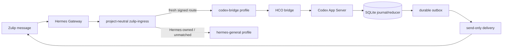

# Hermes / Zulip 对接与故障支持手册

> 本文是历史 Option C/sidecar 支持基线，不是当前目标架构的 PRD。当前目标以 [`HCO_CODEX_SERVICE_BRIDGE_PRD.md`](HCO_CODEX_SERVICE_BRIDGE_PRD.md) 为准；新实现不得继续扩大 HCO 的用户消息 outbox、直接 Zulip delivery、提醒调度或通用多 Agent 控制面。

**状态：** 支持基线（由 2026-07-13 至 2026-07-18 项目记录整理）
**适用范围：** Hermes、Zulip、Hermes Codex Orchestrator（HCO）、Codex App Server、Gateway、Delivery sidecar 以及 macOS launchd 部署
**安全要求：** 本文不包含 bearer、HMAC、Zulip API key、模型 key 或完整环境变量；命令中的 `$TOKEN`、`$HCO_CONFIG` 等均为占位符。

本文不是某一次发布的变更说明，而是未来开展 Hermes、Zulip 及类似入口对接时的支持基线。历史证据主要来自根目录的 [`findings.md`](../findings.md)、[`progress.md`](../progress.md)、`.planning/` 阶段记录，以及 [`docs/reviews/`](reviews/) 和 [`docs/superpowers/`](superpowers/) 下的设计/评审文件。

## 1. 先理解执行平面

本项目存在两条明确分开的执行平面：

| 执行平面 | 组成 | 状态与边界 |
|---|---|---|
| Legacy MVP | `adapter/` -> Runner HTTP -> `.hermes` 任务文件 -> tmux/Codex CLI | 兼容回退和本地 API；按 `taskId`/项目运行，不提供 App Server thread 连续性 |
| Option C | Hermes 独立插件 -> HCO (`hco/`) -> Codex App Server -> SQLite journal/outbox -> send-only Zulip delivery | 生产桥接路径；按数字 stream 路由，按 `objectiveId -> threadId -> turnId` 维护连续性 |

两条平面不能共享一份“当前任务”状态，也不能让同一个 Zulip bot 同时由两条 inbound poller 消费。部署时必须明确当前消息走哪一条平面；Legacy Runner 可保留作人工回退，但不应被当作 Option C 的状态源。详见 [`OPTION_C_IMPLEMENTATION_REVIEW.md`](reviews/OPTION_C_IMPLEMENTATION_REVIEW.md)。



## 2. 不可破坏的系统不变量

新增对接、修复故障或审核部署时，先检查这些不变量，再讨论实现细节。

1. **项目路由唯一权威：** 数字 `stream_id` + 新鲜、完整性校验通过的 HCO route snapshot。stream 名称、topic 文本、cwd、memory、Task Guard、模型输出都不是路由权威。自然语言可以提到任何项目名或路径；插件不得据此改路由或拒绝，HCO 必须继续使用签名 route、ACL 和注册表 canonical cwd。
2. **未映射与路由损坏分开：** snapshot 有效但数字 stream 未映射时，普通对话进入 `hermes-general`，明确的项目执行/进度请求返回固定登记模板；snapshot 缺失、过期、损坏或签名错误时才留在项目中立的 `zulip-ingress` 并返回固定不可用提示。两者都不能继承 ASK 或其他项目上下文。
3. **来源规则分离：** Zulip 使用 `stream -> projectId`；飞书、Hermes 原生会话使用显式 `projectId`、conversation 绑定或明确默认项目，不能套用 Zulip topic 规则。参考 [`HERMES_ZULIP_ADAPTER_INTEGRATION.md`](HERMES_ZULIP_ADAPTER_INTEGRATION.md)。
4. **模型边界固定：** 完整 `/codex` 命令、审批/问答回执和状态通知不调用 Hermes 模型；其他有效自然语言最多调用一个当前配置模型；模型输出只允许严格的已知 union，不能二次“修复”或猜项目。
5. **身份链不混用：** `stream/topic` 是投递地址，`objectiveId` 是业务目标，`threadId` 是 Codex 上下文，`turnId` 是一次执行。不能用 `taskId`、tmux session 名或 topic 名冒充 thread 身份。
6. **状态先落盘：** App Server 事件先进入 durable journal，再由 reducer 形成 turn/objective 状态；完成的 `agentMessage` 原文先保存，再渲染和投递。
7. **单 inbound poller：** 一个 Zulip credential 只允许一个 inbound poller；出站 delivery 是独立、send-only 的 sidecar。
8. **安装原子化：** plugin、profile、dotenv、plist、进程、SQLite 主库及 WAL/SHM、route snapshot 均处于同一安装/回滚证据边界。
9. **消息身份端到端一致：** 原始 Zulip `message.id`、`MessageEvent.message_id`、`SessionSource.message_id` 和 Gateway 的 `HERMES_SESSION_MESSAGE_ID` 必须是同一个规范化正整数。缺失、格式异常或冲突一律失败关闭，不能仅凭相同文本或 session 猜测一次性 capability 属于哪个 turn。
10. **签名 capability 不经过模型：** capability 只存在于插件的有界内存和 HCO wire envelope。模型看到的 `hco_dispatch` 参数只能是一个 `semantic` 属性，不能提供 `capability` 或 `topicModeAction`；插件仍必须按 session、turn、source message、sender、stream、topic、project、request digest、ACL、有效期和 replay 状态逐项校验。
11. **默认收件人不与显式 mention 混合：** 所有 stream/topic 中，零原生 mention 的消息才寻址到配置的 `default_addressee`（默认 `self`/Jarvis）。一旦存在任意用户或用户组 mention，就不隐式追加 Jarvis；只有当前 bot 的显式 mention 或 Zulip wildcard mention 才能进入该 bot。原来的 `free_response_streams` 不能绕过这一全局规则。
12. **非幂等发送不得盲目重试：** Hermes 直接向 Zulip 发送消息时，SDK 不得自动重复 POST。POST 异常、5xx 或响应丢失必须进入明确的 `delivery_uncertain` 分支，禁止重发原文、纯文本 fallback 和失败告警；服务端明确拒绝的格式错误仍可安全降级。HCO outbox/delivery 的持久化投递合同与这条 Hermes 直接发送规则分别管理，不得混用状态。

## 3. 典型事故与经验教训

| 现象 | 已确认根因 | 必须采取的防护 | 记录依据 |
|---|---|---|---|
| Zulip `stream=5` 的请求修改了 ASK | 消息走了 Hermes native tools，未进入 HCO；全局 `TERMINAL_CWD` 回退到 ASK，正确的 adapter 映射因此没有生效 | 在 ingress 入口确定路由；multiplex profile 用会话 `ContextVar` 隔离 cwd 和 `AGENTS.md`；HCO 执行前再次校验签名 project、ACL 和 canonical cwd；未确定时拒绝写入 | [wrong-project evidence brief](../.planning/2026-07-15-zulip-wrong-project-investigation/evidence-brief.md) |
| HCO 路由正确但旧 Gateway 回答了错误项目 | 插件未加载或快照过期，默认 profile 仍可执行 | `zulip-ingress` 项目中立隔离；快照新鲜度/签名校验；安装后必须做 live hook/profile attestation | [`2026-07-17-option-c-routing-containment-remediation-design.md`](superpowers/specs/2026-07-17-option-c-routing-containment-remediation-design.md) |
| 兼容性探针通过，真实 secondary profile 却拿不到 Zulip 凭据 | Hermes 把 profile `.env` 放到 `agent.secret_scope` 并清理 `os.environ`，旧适配器只读 `os.getenv()` | 探针必须复现真实 `_profile_runtime_scope()`；插件兼容层按 profile 读取 `get_secret()`，不写全局环境 | [`findings.md`](../findings.md)「Hermes secondary-profile secret propagation」 |
| 新 ingress 在 live attestation 阶段失败 | `ask-jarvis-pm` 等旧 profile 使用同一 Zulip credential，Hermes 只允许后排序的一个 poller | 安装器精确发现并临时禁用同 credential 的外部 Zulip profile，只改 `enabled`，失败时恢复原字节 | [`findings.md`](../findings.md)「Duplicate Zulip poller activation failure」 |
| HCO 健康但 Zulip 显示 `backend_unavailable` | launchd PATH 没有 `node`；Codex 是 `/usr/bin/env node` wrapper；交互 shell canary 与 launchd 环境不同 | 用目标 LaunchAgent 的绝对 `PATH/HOME` 做 canary；activation gate 必须包含 App Server readiness | [`app-server-availability-remediation-design.md`](superpowers/specs/2026-07-17-app-server-availability-remediation-design.md) |
| 已完成 App Server turn 被标为 reconciliation | 当前 `agentMessage` item 可省略 `status`，旧 reducer 强制要求 `status=completed`，因此丢弃了真实 final message | 以实际安装版本 schema 为准；接受省略 status，仍拒绝显式非 completed；补负向回归 | [`findings.md`](../findings.md)「Live App Server completion incident」 |
| 重启后 attestation 指向历史 release | Hermes 扫描 `plugins/` 下 stable symlink 和历史目录，同一 manifest key 的排序覆盖了 stable | discovery tree 只保留一个 manifest；immutable release 移到 tree 外；迁移 ledger 延迟到最终成功边界 | [`findings.md`](../findings.md)「Gateway attestation mismatch after availability remediation」 |
| HTTP 已 accepted，但新 SQLite reader 看不到 objective | HCO 仍持有已 unlink 的旧 WAL/SHM inode；后来 reader 创建了另一组 sidecar，形成两个 SQLite 世界 | 迁移/回滚前证明所有 PID/descriptor 已 drain；验收比较 DB、WAL、SHM inode，不能只看 200/accepted | [`findings.md`](../findings.md)「SQLite runtime sidecar split after current release activation」 |
| 回滚报告 snapshot mismatch，掩盖原始激活错误 | HCO 在回滚校验期间合法续期带 TTL 的 route snapshot；静态字节比较与运行态 writer 竞争 | 先验证静态恢复，再通过服务 readiness/语义查询验证动态 artifact；保留原始异常 | [`findings.md`](../findings.md)「First live deployment failure」 |
| Zulip 收到内部 JSON 或未知字段 | renderer 对未知 action/status 直接反射 backend 值 | action/status 使用白名单；未知版本、action、status 返回固定兼容提示，不暴露内部错误文本 | [`findings.md`](../findings.md)「Final result-rendering review」 |
| 普通自我介绍可回复，但项目进度请求返回 `Codex bridge request rejected` | Zulip adapter 只把 ID 放在 `MessageEvent.message_id`，创建 `SessionSource` 时未传入；Gateway 从空的 `SessionSource.message_id` 生成空 `HERMES_SESSION_MESSAGE_ID`，严格 turn capability 无法绑定 | 插件只在身份完整且一致、签名快照已确认项目自然语言 turn、source ID 为空时回填已验证 ID；General/命令不改字段，已有冲突值不覆盖，不可写时返回固定 route-unavailable；合同 fixture 必须复刻实际 adapter | [`findings.md`](../findings.md)「exact message binding investigation」 |
| 已映射 ASK 的旧 topic 返回 `Codex bridge request rejected` | 路由和消息身份都正确，但模型从 prompt 复制 515 字符 capability 时改坏了内容；插件在 HCO 之前正确拒绝 | capability 完全留在插件内存；工具 schema 只暴露 `semantic`；安装器同时校验源码 prompt、安装后 SOUL、真实 Gateway prompt 和已注册 schema | [`2026-07-19-hermes-adaptive-topic-dispatch-design.md`](superpowers/specs/2026-07-19-hermes-adaptive-topic-dispatch-design.md) |
| App Server 丢失旧 thread 后自动替换结果不确定，旧话题永久卡住 | HCO 有人工绑定状态迁移，但生产消息入口不可达；重复绑定也没有区分“确定尚未发送”和“可能已经发送” | 提供 maintainer-only 的精确 `/codex thread bind` 命令；用受信 Zulip message ID 幂等；只恢复 durable pre-send `intent`，外部调用前先写 `submission_unknown`，之后重放绝不再次发送 | [ADR 0003](adr/0003-zulip-channel-topic-ownership.md)「Continuity」 |
| Gateway 只有一次 `response ready` 和一次发送日志，Zulip 却在一秒内出现两条相同回复 | Zulip Python SDK 默认对消息 POST 的 5xx/连接错误内部重试；首个请求可能已经被服务端接受，第二次 POST 生成重复消息 | 消息专用 client 使用 `retry_on_errors=False`；POST 异常和 5xx 返回 `delivery_uncertain`；Gateway 公共发送层在该状态立即停止，不发送任何二次 fallback | [2026-07-30 at-most-once verification](superpowers/test-artifacts/2026-07-30-hermes-zulip-send-at-most-once-auto/automated-test-result.md) |

这些事故共同说明：**“配置文本正确”或“HTTP 请求被接受”都不是运行成功的证据；只有真实运行路径、持久化状态和最终 Zulip 回读同时成立，才算完成。**

## 4. 新对接的合同设计

### Hermes 插件

- 只负责事件检查、精确命令、结构化自然语言入口、bridge envelope 和短的确定性错误。
- `pre_gateway_dispatch` 必须是本地、同步、无网络、无持久化、无后台任务的前置检查。
- Zulip 兼容层必须在创建 Hermes session 前执行收件人过滤。零 mention 时只为匹配 `default_addressee` 的当前 bot 合成一次内部 self mention，并在模型看到文本前由上游 adapter 删除；只 mention 其他人时直接忽略，不能让模型判断是否“顺便回复”。原始 event 和消息正文不得被就地修改。
- 自然语言字段不是路由或 containment 权威；不得维护项目名/cwd 正则黑名单。项目增删或改名只更新 HCO 注册表和 route，不修改插件规则或 prompt。
- 私有命令必须带短期、单次、带来源绑定的签名 envelope；拒绝直接调用、过期、重放、篡改和跨 stream/topic 使用。
- 自然语言 capability 必须绑定精确的 `session_key + sourceMessageId + request + Hermes turn`，但只能由插件创建、保存和提交，不能出现在模型 prompt、工具参数、回复或日志中。模型工具调用必须恰好是 `{"semantic": ...}`；多余字段失败关闭。
- 兼容层只能在签名 snapshot 已确认项目自然语言 turn 后，把已经交叉验证的 `MessageEvent.message_id` 补入空的 `SessionSource.message_id`；General、命令和无效路由保持原样，不能覆盖冲突值或从文本/session 推断 ID。
- 有效 snapshot 中未映射的 stream 不能按 topic 或消息文字猜项目。普通对话保留在 `hermes-general`；明确的项目请求必须询问 `projectId`、canonical 绝对 cwd、是否登记当前数字 stream，以及新建或继续 objective（继续时提供 `objectiveId`）。
- 插件不能读取项目源码、拼上下文、直接 shell、直接操作 tmux 或拥有 objective/thread/delivery 状态。
- plugin 兼容性检查必须对实际安装 Hermes 版本执行；不满足公共接口时拒绝注册并失败关闭。

### HCO

- HCO 是项目注册、路由 snapshot、topic mode、objective/thread 绑定、App Server 生命周期、journal/reducer、reconciliation、outbox 和诊断的唯一 owner。
- bridge 只监听 loopback 或 owner-only Unix socket，使用仓库外 bearer 文件；不把 token 放入命令行、plist 或日志。
- 路由命令建议复用现有合同：`/codex route show|set|none|unset`、`/codex topic show|auto|hermes`。项目频道内的显式 `--project` 只能作为 route 一致性断言，不能越权覆盖 route。
- 模型目录由 HCO 的只读 `GET /v1/models` 暴露，底层真源是当前 Codex App Server 的 `model/list`。设置 `projects[].threadOptions.model` 和 `projects[].threadOptions.modelReasoningEffort` 前必须查询运行时清单；`result.stale=true` 或 `sourceStatus=unavailable` 只能用于诊断，不能作为生产配置依据。
- topic mode 至少包含 `AUTO`、`CODEX_BOUND`、`HERMES_ONLY`；进入 `HERMES_ONLY` 不会取消已运行 objective，取消必须显式执行。
- 已映射 stream 的新旧 topic 都按同一懒创建规则处理：无 topic row 等价于 `AUTO`；首次真实执行可创建 objective/thread，只有 durable thread binding 成功后才写为 `CODEX_BOUND`。模型不能决定这一状态迁移。

### Codex App Server

- 通过受管控的 `codex app-server --stdio` 连接；先 initialize，再 `initialized`，校验协议版本和 capability。
- 事件没有可依赖的全局 replay sequence；HCO 必须生成自己的 `eventRecordId`/`ingestionSeq`，并支持 `thread/read(includeTurns=true)` reconciliation。
- initialize 的 response、notification 写入和 stdin drain 共用一个有界 deadline；EOF、超时、malformed line、未知 method 都要关闭并转为稳定错误码。
- 不确定的 thread start/turn start 不能自动重试，也不能静默回退 tmux；必须进入 reconciliation。
- “Codex bridge request rejected”、generic remote error 或无法确认的 App Server 错误都不能证明旧 thread 已丢失；只有 backend 明确证明 thread 不存在且 HCO 重新验证 route/project/topic/ACL 后，才允许创建替代 thread。
- 当前已验证的 `codex-cli 0.142.3` 缺失证据必须同时满足：JSON-RPC `code === -32600`，且 `message === "thread not loaded: <本次请求的 threadId>"`。只匹配错误码、前缀、近似文本、额外空格，或遇到 timeout/断线/malformed response 都不能自动替换。
- 精确缺失时最多创建一个替代 thread；objective 与其全部 `CODEX_BOUND` topic 在同一 SQLite 事务中改绑，原始请求文本和 `clientUserMessageId` 原样复用，并记录 `oldThreadId`、`newThreadId`、`reason=proven_missing_thread`。
- 替代 `thread/start` 结果不确定时保留旧绑定用于审计，持久化 `manual_thread_binding_required`，绝不再次自动创建。运维人员明确绑定已确认的新 thread 后，才提交一次已保存且确认从未提交的 turn；替代 thread 的 turn 再失败也不递归重建。

#### 人工绑定与 legacy topic scope 恢复

`THREAD_BIND` 有两个受控用途：恢复 `manual_thread_binding_required` 的 Codex
thread；或者为升级前创建、尚无不可变 `objective_scopes` 记录的 legacy
objective 建立一次明确的 topic scope。两种情况都必须先通过 Codex/App
Server 确认目标 thread ID，并在该 objective 原属项目、原属 topic 的数字
stream 内发送一条独立消息：

```text
/codex thread bind <objectiveId> <threadId>
```

- 只能由该项目的 maintainer/admin 使用；不能在 General、未映射 stream
  或其他项目 stream 中跨项目绑定。
- 命令是严格单行、两个无空白 token 的语法；不要附加说明文字。
- topic 即使是 `HERMES_ONLY` 也允许执行恢复命令，但不会因此修改 topic
  mode 或 General 路由。
- 对 legacy objective，HCO 必须从历史绑定中得到唯一记录，且 project、数字
  stream 和完整 topic 精确匹配当前消息。缺失、多条记录、跨 topic、近似名称
  或字符串推断全部失败关闭；命令不能移动已经具有不可变 scope 的 objective。
- legacy objective 在完成授权重链前，普通 continuation、status 和 cancel 返回
  `OBJECTIVE_TOPIC_MIGRATION_REQUIRED`；不能为了保持旧行为而自动认领当前 topic。
- 重链需要当前项目的 `backend.recover` 权限（maintainer/admin）和当前 Zulip
  message ID。它同时写入审计 source，普通用户或 Agent 的自然语言不能触发。
- 回复 action 固定为 `objective.thread.bind`，可见状态只允许 `ready`、
  `started`、`submitting`、`running`、`submission_unknown`、
  `reconciliation_needed`。
- 同一 Zulip message ID 是同一次操作。数据库仍证明 turn 从未发送时，
  重放可恢复一次；进入 `submission_unknown` 或 reconciliation 后，重放
  只能返回状态，不能再次调用 `turn/start`。

不要把普通的 `Codex bridge request rejected`、超时、断线、近似的
`thread not loaded` 文本或相似 topic 名称当成人工绑定依据。先确认 objective、
原 topic、原 thread、替代 thread 和 durable submission 状态，再执行命令。

### Zulip Delivery

- Hermes 继续是用户侧 Zulip transport；HCO 持有 durable delivery record，sidecar 只做 send-only REST 发送和 claim/ack/nack。
- 目标 key 使用数字 stream ID + 当前 topic；stream display name 只用于展示。
- 发送成功但 ACK 丢失存在 at-least-once 重复窗口；每个 chunk 保存 `deliveryId`、`chunkIndex`、content hash 和 Zulip message ID。

## 5. 路由排障流程

遇到“回复了错误项目”“没有进入 Codex”“提示路由不可用”时，按以下顺序检查，不要先猜配置键名。

1. **确认来源身份：** 从原始 Zulip event 取得数字 `sender_id`、`stream_id`、`message_id`、topic；不要从复合 chat 字符串反推 stream ID。
2. **追踪消息 ID：** 核对 `MessageEvent.message_id -> SessionSource.message_id -> HERMES_SESSION_MESSAGE_ID`。前两者在 adapter/hook 边界可观察，最后一个必须在真实 Gateway executor/`pre_llm_call` 路径验证；任一为空或不一致都不能调用 `hco_dispatch`。
3. **读取并验证 snapshot：** 检查 integrity、schema、TTL、严格递增的 stream ID、`defaultOwner=HERMES`；无效时应固定返回 route-unavailable，且 HCO/模型调用数为 0。
4. **核对 HCO registry：** 由 route 的 `projectId` 查 canonical cwd；确认目标目录存在、属于预期项目，且与 ASK 等其他 route 不相同。
5. **确认 profile：** 项目流应进入 `codex-bridge`；Hermes-owned/未映射流进入 `hermes-general`；无效快照或 hook 异常留在 `zulip-ingress`，不得继承 root profile。
6. **确认 live attestation：** stable plugin、Gateway 载入 release、hook、`zulip-ingress`、Gateway PID 与 HCO 运行态必须一致。
7. **确认执行边界：** 只要 route 未被 HCO 接受，就不应出现文件工具、terminal、Codex turn、SQLite objective 或 outbox 记录。
8. **确认结果：** 最终以 HCO SQLite 状态和独立 Zulip API 回读为准；不要把 Hermes 的即时“accepted”当作完成。

最小的非敏感检查示例：

```sh
# Runner/MVP 健康（Legacy 平面）
curl -H "Authorization: Bearer $HCO_API_TOKEN" \
  http://127.0.0.1:8731/health

# Option C 的本地 bridge（使用实际 bearer 文件，不要把值回显）
curl --unix-socket "$HCO_SOCKET" \
  -H "Authorization: Bearer $HCO_BRIDGE_TOKEN" \
  http://localhost/v1/compatibility

# macOS 当前用户服务
launchctl print "gui/$(id -u)/com.hermes.codex-bridge-hco"
launchctl print "gui/$(id -u)/com.hermes.codex-bridge-delivery"

# 只查看 release 目标，不打印配置/secret 内容
readlink "$HERMES_HOME/plugins/hermes-codex-bridge"
```

## 6. 配置、凭据与 profile 隔离

1. HCO JSON、bridge bearer、context HMAC key、Zulip 配置和 token 文件必须在仓库外、绝对路径、当前用户拥有、不可 group/other 读取（通常 `0600`）。
2. Hermes `.env` 只保存 `HCO_CONFIG_PATH` 等路径；不要在 plist、命令行或日志中放 bearer/HMAC/Zulip/model secret。
3. `zulip-ingress` 只承载 Zulip adapter 配置和凭据；`projectId`、cwd、model、memory、Task Guard、plugins、skills、MCP 不得从 root 泄漏。
4. YAML explicit 值按“存在性”判断，`false` 不能被 dotenv truthy fallback 覆盖。推荐有效优先级：`root < existing ingress < installer-owned override`。
5. 兼容层必须覆盖 Hermes 实际使用的 `get_secret()`、`PlatformConfig` 和 `extra`，并验证 profile scope 不会改变外围 `os.environ`。
6. 对 canonical provider 做运行时解析验证：不能仅因为 `providers:` 或 `custom_providers:` 中出现同名项，就认定 Hermes 会使用该声明。

## 7. App Server、HCO 与 Delivery 生命周期

### 启动与健康

- 安装器必须使用与 LaunchAgent 相同的绝对 Node/Codex 路径、`PATH`、`HOME` 运行 canary。
- activation 成功条件至少包括：HCO bridge protocol、App Server ready、Gateway 新 PID、live plugin/hook/profile attestation、delivery readiness。
- HCO health 要区分 `bridge reachable` 与 `appServer.available`；前者成功不代表可执行。

### 断线与恢复

- 初始化失败或 transport terminal loss：立即关闭失败 client、禁用 execution gate、单飞 bounded exponential reconnect。
- shutdown 取消 retry timer，不产生新 child；关闭责任必须幂等，避免 shutdown 与 retry 竞争时 double-close。
- 重连成功后原子替换 backend 并重新开放执行；此前 failed objective 仍保留审计状态，不自动重放。

### 完成与输出

- 在 `turn` 已完成的前提下，从 `agentMessage` item 取完整 final text；item `status` 省略可按当前协议兼容，显式非 completed 必须拒绝。
- 先保存原文和 audit，再渲染有限 action/status 白名单；未知版本/action/status 返回固定兼容提示。
- HCO 只向 Hermes/Zulip 暴露稳定错误码、attempt/state 和有限脱敏 detail，不暴露 child stderr、环境变量、prompt 或异常原文。

## 8. SQLite 与安装回滚

### SQLite

- HCO 是 SQLite 唯一 writer；启用 WAL 时，DB、`-wal`、`-shm` 必须由同一运行实例、同一生命周期和同一 ownership boundary 管理。
- 发生“accepted 但读不到”时，先停止新增写入，不要立刻重启 HCO；比较进程 fd（macOS 可用 `lsof`）与路径的 inode，再决定恢复动作。
- 独立 reader、journal、replay nonce、objective、turn submission 和 outbox 都要在验收中可见。

### 安装/升级

1. 先 dry-run：确认目标用户、HOME、路径、现有 Gateway state、profile 和 release 结构；dry-run 不创建锁、不写临时文件、不启动服务。
2. 运行 staged compatibility probes：HCO bridge、Hermes installed loader、Codex App Server canary；探针必须复现真实 profile scope。
3. 生成 immutable release，确认 discovery tree 只有一个 manifest，再原子切 stable symlink。
4. 事务性保存 root/ingress YAML、dotenv、plist、plugin link、服务 loaded/running state、release migration ledger。
5. 启动并依次验证 HCO -> Gateway -> delivery；任何后置 gate 失败都回滚。
6. Hermes 升级后重新读取实际 Zulip adapter 的 `SessionSource`/`MessageEvent` 构造代码，确保测试 fixture 与字段所有权一致；运行真实 Gateway 合同，证明消息 ID 能进入 task-local `HERMES_SESSION_MESSAGE_ID`。不要只用手工构造、预先填好 source ID 的事件替代。
7. 若 `SessionSource.message_id` 变成只读、被改名或由 Gateway 原生填充，插件兼容层必须分别证明：只读时固定失败关闭；原生已有一致值时不覆盖；原生冲突值时拒绝 provenance。删除兼容层前先以新 Hermes 版本跑 RED/GREEN 和完整 live acceptance。
8. Python 合同测试必须在 `conftest.py` 导入阶段、测试模块收集之前同时隔离 `HOME` 与 `HERMES_HOME`。Hermes 插件注册会写 process attestation，函数级 `monkeypatch` 不能覆盖模块导入和全局 `PluginManager` 的副作用；完整测试前后必须比较生产 attestation 哈希不变。
9. 安装器必须验证四个一致边界：生成的 `SOUL.md` 明确只传 `semantic`；真实 staged Gateway prompt 不含 capability；已注册 `hco_dispatch` schema 只有一个 required `semantic` 属性且拒绝额外属性；私有登记命令仍存在。任一项漂移都拒绝升级。
10. Hermes hook API 升级后重新证明 `pre_gateway_dispatch` 可取得可信 Zulip provenance 与 session，`pre_llm_call`/`pre_tool_call` 可取得相同 `session_id + turn_id`，handler 可取得 `session_id`，`pre_tool_call` 先于 handler，`post_llm_call` 能清理未使用授权。不能用放宽签名或把 capability 放回 prompt 的方式兼容。
11. Codex/App Server 升级后，用随机不存在的 thread ID 完成真实 initialize 握手和 `thread/read` 探针，记录 Codex 版本、错误码、精确 message 与 data 形状。若与已验证签名不同，保持自动替换关闭，先更新 exact/near-match、timeout、断线、malformed、one-shot 和人工绑定回归，再重新走完整发布验收。
12. 人工绑定回归必须覆盖同一 source message 的崩溃重放：外部调用前的 durable `intent` 恢复且只发送一次；写入 `submission_unknown` 后的重放发送次数为 0。不要用“命令回复成功”代替调用计数与 SQLite 状态证据。

### 回滚

- 先停止并 drain 本次及替换后的 HCO/delivery/Gateway PID；launchd 显示 unloaded 不能替代 `kill(pid, 0)`/descriptor ownership 证明。
- 迁移和普通 snapshot 恢复要独立尝试，保留原始错误；所有非 socket snapshot 验证通过后才能恢复旧服务。
- 动态 route snapshot 不能做静态字节比较；验证其合法续期、generation、TTL 和语义映射。
- 任何 ownership 不确定或恢复证据不完整时，停止受影响服务，禁止在混合状态上继续运行，转人工恢复。

## 9. 验证门禁与发布验收矩阵

验证必须从低成本的静态检查逐步进入真实运行态；任一门禁失败都保持服务不可用或回滚，不以“后续再观察”替代修复。

| 阶段 | 最低证据 | 失败时的处理 |
|---|---|---|
| 代码与脚本 | `npm run verify`；`node --test test/*.test.js`；`bash -n scripts/install-hermes-codex-bridge.sh`；`git diff --check` | 不发布；先补 RED 回归，再修复并重跑完整门禁 |
| 安装器合同 | `bash test/install-hermes-codex-bridge.test.sh`；dry-run 输出只包含路径/状态，不创建锁、文件或进程 | 停止安装，保留原配置字节和服务状态 |
| Hermes 运行时 | 在源码 checkout 的虚拟环境执行 `PYTHONDONTWRITEBYTECODE=1 /Users/hula/Projects/hermesAgent/venv/bin/python3 -m pytest -q`，或使用仓库规定的 `scripts/run_tests.sh` | 区分解释器/依赖问题与产品失败；不得用另一套 Python 的结果代替 |
| App Server | 在目标 LaunchAgent 的绝对 `PATH`、`HOME`、Node/Codex 路径下完成 initialize、`initialized` drain、可用性和断线重连 canary | HCO 保持 `appServer.available=false`，不接受执行请求 |
| Gateway 与插件 | 重启后 PID 发生变化；live hook attestation 与 stable release、版本、served profiles、`zulip-ingress` 一致；发现树只有一个 manifest | 保持项目中立 profile，恢复旧 release/状态；不得只看磁盘 symlink |
| Delivery | delivery sidecar 独立启动；claim/ack/nack、重试、重复窗口和脱敏错误可观测 | HCO 可继续记录 outbox，但 delivery readiness 为 false |
| 端到端 | 用真实数字 `stream_id` 分别验证 ASK、量化交易、General、已映射旧 topic、未映射普通对话和未映射显式 `/codex run`。执行型 canary 核对 route -> HCO -> App Server -> SQLite -> outbox -> delivery；General/登记路径核对没有跨项目 cwd 和意外 HCO row；最后独立回读 stream/topic/content | 任何一步缺失都判定未完成；`accepted`、HTTP 200 或单次模型输出不能作为通过证据 |

建议把验收结果记录为带时间、release、Gateway PID、HCO/delivery PID、snapshot generation 和 canary message ID 的短表；凭据值、完整环境变量和 prompt 不进入记录。

## 10. 诊断反模式

以下做法在本项目中已经导致过假成功或错误归因，应视为支持禁忌：

- 只读 `os.getenv()` 推断 Hermes profile 凭据。secondary profile 的 secret 可能只在 `get_secret()` scope 中，必须用真实 profile loader 验证。
- 只检查 YAML 中是否出现 provider、plugin 或 Zulip 配置。要验证实际 canonical provider 解析、插件加载顺序和 live Gateway PID。
- 只检查 bridge socket、HTTP 200 或 `objective accepted`。这些只证明入口被接受，不证明 App Server 可执行、SQLite 可见或 Zulip 已送达。
- 用 stream 名称、topic、cwd 或模型输出猜 project。项目身份只能来自数字 `stream_id` 和新鲜签名 route snapshot。
- 看到 `launchctl` 显示 unloaded 就立即恢复或替换数据库。必须先证明 PID 已退出、文件描述符已释放，尤其是 `-wal`/`-shm` inode。
- 通过猜测的 SQLite 列名、猜测的 Zulip client API 或错误的 Python 解释器做结论。先读取实际 schema、安装版本和仓库测试 wrapper。
- 把一次单消息 ID narrow 的空结果直接当成“回复未发送”。先确认 narrow 参数类型，再用精确 stream/topic 时间窗交叉回读；本次 `id=385` 查询为空，但同一 API 的 `general` topic 回读能找到该消息。
- 把未知 action/status/版本原样反射给用户，或把 child stderr、异常原文和 prompt 复制到 Zulip。错误输出必须经过白名单和脱敏边界。
- 先写实现再补回归。对于路由、profile scope、reconnect、rollback 等边界，先写会失败的测试，才能证明问题被复现和修复。
- 在真实 `HOME`/`HERMES_HOME` 下直接运行会导入 Gateway 的插件合同，并把“测试全绿”当作无副作用证明。插件加载本身可能写 attestation；必须先做进程级临时 home 隔离，再校验生产文件前后未变。

## 11. 推荐的新接入顺序

未来接入 Hermes、Zulip 或其他消息入口时，按以下顺序推进；每一步都应有可独立回滚的证据。

1. **定义边界和不变量：** 明确入口、项目身份权威、状态 owner、凭据 scope、错误码和 at-least-once 语义；先决定 Legacy 还是 Option C。
2. **冻结消息合同：** 为 ingress、bridge、App Server、journal/reducer、outbox 和 delivery 定义版本化 schema、超时、幂等键和未知字段行为。
3. **实现项目中立入口：** 先做数字 stream/显式 projectId 路由、快照完整性/TTL 校验和 fail-closed；路由失败不得触碰项目工具或模型。
4. **接通单一执行后端：** 先完成 App Server initialize、thread/turn 连续性、durable journal 和 reconciliation，再接自然语言分类与渲染。
5. **隔离 profile 与凭据：** 建立 `zulip-ingress`、`codex-bridge`、`hermes-general` 的最小权限；证明同一 credential 没有第二个 inbound poller。
6. **建立独立 delivery：** HCO 写 outbox，send-only sidecar 负责投递；先验证 claim/ack/nack、重试和重复监控，再开放生产流量。
7. **构建安装事务：** dry-run、compatibility probes、immutable release、stable symlink、launchd canary、live attestation、迁移 ledger 和 rollback 必须作为一个门禁。
8. **做真实端到端验收：** 使用无副作用 canary，检查 route、App Server、SQLite（含 WAL/SHM）、outbox 和独立 Zulip 回读；保存脱敏证据。
9. **再扩展能力：** 通过 RED/GREEN 回归逐步加入自然语言、topic mode、resume、模型路由和其他平台；不要在执行链未稳定时增加“智能”默认行为。

## 12. 参考资料索引

### 仓库内操作与合同

- [`docs/SETUP.md`](SETUP.md)：本地安装、验证命令和 bridge 安装入口。
- [`docs/OPERATIONS.md`](OPERATIONS.md)：launchd/systemd、健康检查、日志和长期运行边界。
- [`docs/HERMES_ZULIP_ADAPTER_INTEGRATION.md`](HERMES_ZULIP_ADAPTER_INTEGRATION.md)：Legacy adapter 的配置、路由和兼容约定。
- [`docs/JARVIS_HERMES_QUICKSTART.md`](JARVIS_HERMES_QUICKSTART.md)：Jarvis/Hermes 运行态快速检查。
- [`docs/adr/0001-zulip-trusted-execution-scope.md`](adr/0001-zulip-trusted-execution-scope.md)：Zulip 执行信任边界。
- [`docs/adr/0002-hermes-codex-context-handoff.md`](adr/0002-hermes-codex-context-handoff.md)：Hermes 到 Codex 上下文交接。
- [`docs/adr/0003-zulip-channel-topic-ownership.md`](adr/0003-zulip-channel-topic-ownership.md)：stream/topic 所有权状态机。

### Option C 与修复记录

- [`docs/reviews/OPTION_C_IMPLEMENTATION_REVIEW.md`](reviews/OPTION_C_IMPLEMENTATION_REVIEW.md)：Option C 的实现边界和审查结论。
- [`docs/superpowers/specs/2026-07-16-hermes-codex-option-c-design.md`](superpowers/specs/2026-07-16-hermes-codex-option-c-design.md)：HCO、App Server、journal/outbox 设计。
- [`docs/superpowers/specs/2026-07-17-option-c-routing-containment-remediation-design.md`](superpowers/specs/2026-07-17-option-c-routing-containment-remediation-design.md)：路由隔离、Gateway attestation、profile 和回滚设计。
- [`docs/superpowers/specs/2026-07-17-app-server-availability-remediation-design.md`](superpowers/specs/2026-07-17-app-server-availability-remediation-design.md)：launchd PATH、App Server readiness 和恢复策略。
- [`../findings.md`](../findings.md) 与 [`../progress.md`](../progress.md)：按日期记录的事故证据、测试结果和未决风险。

当实现、Hermes 版本或 App Server schema 发生变化时，应先更新相应合同/ADR 和本手册，再更新安装器与测试；历史事故记录只追加，不覆盖原始证据。
