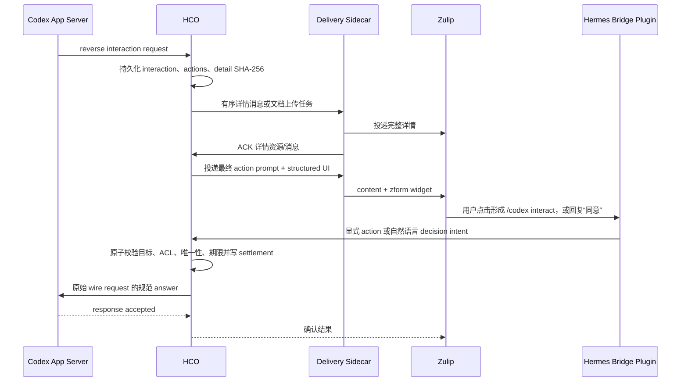

# HCO 统一交互、审批与长内容中转设计

日期：2026-07-26

状态：Claude 复审通过；核心交互链路已于 2026-07-26 实现并完成回归

范围：Hermes bridge plugin、HCO、delivery sidecar、Zulip 与 Codex App Server reverse interaction

审查记录：

- `docs/superpowers/test-artifacts/2026-07-26-hco-unified-interaction-review/claude-review.md`
- `docs/superpowers/test-artifacts/2026-07-26-hco-unified-interaction-review/claude-rereview.md`

实现说明：

- 已实现 immutable action、action 级风险分类、`/codex interact`、旧命令 fallback、精确自然语言别名、Zulip zform、UTF-8 分片、SHA-256 文档上传、详情 ACK 门控和 settlement audit。
- 选项询问可使用 zform；自由文本和多题仍使用 `/codex answer` 与 durable partial answers。
- secret 输入保持 fail closed：Zulip 不显示问题正文或回答入口，继续使用 Codex App Server UI。设计中的 owner-local 一次性安全输入页尚未开放。
- interaction document 当前由 owner-only SQLite durable outbox 保存并由 sidecar 校验后上传；独立 spool、远端删除和审计期 GC 属于后续生命周期增强，不影响本次审批可见性与执行门控。

## 1. 目标

把 Codex App Server 发出的审批和询问可靠地传到原 Zulip 话题，并把用户的选择可靠地传回 Codex。新机制必须做到：

1. 长命令完整可见；长度只决定传输方式，不决定是否允许审批。
2. Zulip 原生显示可点击按钮，点击后走与文本命令相同的鉴权、审计和结算路径。
3. 在无歧义时，用户可直接回复“同意”“可以”“OK”等词完成一次性审批。
4. 简单批准、拒绝、复杂 decision、用户询问、自由文本、敏感输入和详情文档使用同一套 interaction envelope 与状态模型。
5. 复用现有 artifact 的安全路径、大小、SHA-256 和普通文件校验能力，但不破坏 `artifact_manifest` schema v1。
6. 回答先持久化，再交付 App Server；重放、并发回答、过期回答和错话题回答不能造成二次执行或串单。
7. 旧插件和旧 sidecar 在滚动升级期间仍可使用 `/codex approve`、`/codex answer` 完成兼容交互。

## 2. 当前问题和根因

本次实际审批同时给出了：

- 一次性 `accept`；
- 带 `proposedExecpolicyAmendment` 的策略变更 decision；
- `cancel`。

当前实现有三个错误耦合：

1. `hco/turn-controller.js` 只要发现请求中存在扩展权限字段、对象型 decision，或命令超过 400 个 JavaScript 字符，就把整个请求标成受限，并隐藏普通 `accept`。
2. `hco/service.js` 即使收到明确的 `accept`，仍会因为原请求含扩展权限字段而拒绝。它判断的是“请求中还提供了什么”，不是“用户实际选择了什么”。
3. `plugin/hermes-codex-bridge/plugin.py` 只确定性识别 `/codex ...`。自然语言“同意”会进入普通模型路径，不能作为可靠的协议输入。

此外，delivery sidecar 只取 outbox 的 `payload.content` 并调用 `send_message`，没有把结构化 action 转成 Zulip `widget_content`。Hermes Gateway 已有可复用的 zform 实现，但 HCO 链路没有接通。

因此，“此审批请求包含扩展权限，无法通过命令行安全完整呈现”不是 Codex App Server 的限制，而是 HCO 当前 renderer 和 service 的保守降级造成的。

## 3. 产品规则

### 3.1 按实际 action 判断风险

每个可选 action 独立分类，不能把整条 interaction 粗略标成“可批”或“不可批”。

| action 类型 | 示例 | Zulip 按钮 | 精确命令 | “同意/OK”别名 |
|---|---|---:|---:|---:|
| `one_time_allow` | `accept` | 是 | 是 | 是 |
| `deny` | `decline`、`cancel` | 是 | 是 | 可支持明确拒绝词 |
| `policy_change` | `acceptWithExecpolicyAmendment` | 是，标签必须写明范围 | 是，使用 opaque action ID | 否 |
| `network_policy_change` | 网络策略 amendment | 是，标签必须写明范围 | 是，使用 opaque action ID | 否 |
| `file_change_allow` | 本次应用 file change | 是 | 是 | 是 |
| `secret_submit` | 密钥、口令 | 否 | 否 | 否，仅安全输入页 |

“请求里存在策略变更选项”不能阻止同一请求里的 `one_time_allow`。策略变更也不必退回 App Server UI：只要详情已完整交付，Zulip 可以提供一个明确标注的按钮；但它永远不能由含糊的“OK”触发。

### 3.2 长度不是权限信号

移除 400 字符截断和 `cmdTruncated => restricted` 规则。命令长度、权限范围和 decision 类型是三个独立维度：

- 长命令可以是低风险命令；
- 短命令也可以改变永久策略；
- 是否展示 action 取决于 action 分类与详情是否完整交付，不取决于命令长短。

所有限制按 UTF-8 bytes 计算，不能使用 JavaScript `string.length` 作为传输边界。

### 3.3 按钮是命令的 UI，不是旁路

Zulip zform 点击后会发送一条由该用户发出的普通可见消息。按钮 reply 使用：

```text
/codex interact <interactionId> <actionId>
```

该消息进入已有的 Gateway 授权、bridge envelope、HCO ACL、目标话题校验和 durable settlement。按钮本身不获得额外权限，也不能绕过 sender ID 校验。

### 3.4 任何可执行 action 前必须完整交付详情

只有 `detail_state = delivered` 后才能投递带 action 的最终提示。若详情上传或分片投递失败，HCO 不得先展示可点击的批准按钮。

## 4. 总体架构



职责分工：

- Codex App Server 是 request 和 `availableDecisions` 的来源。
- HCO 是 interaction、action 映射、详情文档、settlement 和审计的唯一真相源。
- delivery sidecar 只验证结构化出站载荷并适配 Zulip；它不决定 action 权限。
- Hermes bridge plugin 只做确定性语法识别、原始 Zulip 身份绑定和 HCO 调用；审批词不经过模型。
- Zulip zform 只是展示层，真实授权仍由 HCO 完成。

## 5. 协议能力和版本

在 bridge protocol 主版本 1 下新增可协商能力：

```text
interaction_exchange_v2
zulip_zform_v1
interaction_documents_v1
natural_interaction_reply_v1
```

当前 sidecar 会把 `/v1/compatibility` 的 `compatibility` 对象与本地期望做精确比较。为保证滚动升级，新 HCO 不能直接把新能力塞进旧对象。兼容响应改为：

```json
{
  "compatibility": {
    "protocolVersion": 1,
    "peerPluginVersion": "1.0.0",
    "capabilities": []
  },
  "serverCapabilities": ["interaction_exchange_v2", "zulip_zform_v1"],
  "hco": { "version": "..." }
}
```

- `compatibility` 继续按调用方声明能力返回旧格式，保证未升级客户端的精确比较仍通过；
- `serverCapabilities` 是可选的顶层增量字段，旧客户端会忽略；
- 新客户端另行声明 `requiredCapabilities` 和 `supportedCapabilities`，对端必须覆盖 required 集合，optional 能力取交集启用；
- plugin 初始化时读取并缓存 `serverCapabilities`，只有服务端声明支持才启用 `/codex interact` 和自然语言别名；
- 未协商 `zulip_zform_v1` 时仍发送完整文本和 slash-command fallback；
- 未协商 `interaction_documents_v1` 时使用 inline/chunk，超过可表示上限则发送不可执行的明确错误，不静默截断。

旧 `artifact_manifest` 保持 schema v1 和现有 dispatch 语义，不向其中静默增加 interaction 字段。

## 6. Interaction Envelope v2

HCO 内部和 outbox 使用结构化 envelope。示例：

```json
{
  "schemaVersion": 2,
  "kind": "interaction_request",
  "interaction": {
    "interactionId": "interaction-...",
    "interactionType": "command_approval",
    "objectiveId": "objective-...",
    "expiresAt": 1785084540000,
    "title": "命令执行审批",
    "summary": "安装 SpecCompass v0.11.29",
    "detail": {
      "mode": "inline",
      "content": "...完整命令...",
      "mimeType": "text/markdown",
      "bytes": 1824,
      "sha256": "<64-hex>",
      "state": "delivered"
    },
    "actions": [
      {
        "actionId": "act-...",
        "label": "仅本次允许",
        "style": "primary",
        "class": "one_time_allow",
        "naturalAliasEligible": true
      },
      {
        "actionId": "act-...",
        "label": "允许并更新命令策略",
        "style": "warning",
        "class": "policy_change",
        "naturalAliasEligible": false
      },
      {
        "actionId": "act-...",
        "label": "取消",
        "style": "danger",
        "class": "deny",
        "naturalAliasEligible": false
      }
    ]
  },
  "content": "可供旧客户端操作的完整文本 fallback",
  "ui": {
    "type": "choices",
    "heading": "请选择本次操作",
    "actionIds": ["act-...", "act-...", "act-..."]
  }
}
```

规则：

1. outbox 不接受 renderer 直接传入任意 `widget_content`。HCO 只存受 schema 约束的 `ui`，sidecar 根据持久化 actions 生成 zform，防止正文和按钮 reply 不一致。
2. `actionId` 是 HCO 生成的短 opaque ID，只允许安全 token 字符；客户端不能提供。
3. `interaction_actions` 中保存 action 对应的原始 canonical decision JSON。outbox 和 Zulip reply 不携带复杂 decision JSON。
4. label、class、是否允许自然语言别名由 HCO 根据原始 decision 确定并持久化；sidecar 不能重新分类。
5. `allowedResponderIds` 保留在 HCO durable state，不需要暴露在公开正文或 widget 中。
6. `content` 始终包含 interaction ID、过期时间、明确的 fallback 命令和详情哈希；无 widget 的客户端仍可完成操作。

### 6.1 入站 action 命令

zform 的可见 reply 使用严格语法：

```text
/codex interact <interactionId> <actionId>
```

实现必须同时补齐四层，缺一层都不能宣称支持按钮：

1. `plugin.py::_parse_command` 解析为 `{"type":"INTERACT","replyToken":"...","actionId":"..."}`；
2. bridge command schema 只接受两个 safe token，不接受附加文本、换行或客户端 decision JSON；
3. `service.js::validateCommand/handleCommand` 路由到统一 settlement primitive；
4. settlement 用 `(interactionId, actionId)` 查 immutable action row，再取得 canonical answer。

### 6.2 Interaction 类型

第一阶段支持：

| `interactionType` | Codex method | 表现 |
|---|---|---|
| `command_approval` | `item/commandExecution/requestApproval` | 完整命令 + actions |
| `file_change_approval` | `item/fileChange/requestApproval` | 文件变更摘要/文档 + actions |
| `choice_input` | `item/tool/requestUserInput` 且有 options | 每题 choices widget 或显式 answer 命令 |
| `text_input` | `item/tool/requestUserInput` 自由文本 | 明确回答命令；支持分题提交 |
| `secret_input` | 任一 `isSecret=true` | 仅一次性安全输入页，不进 Zulip 正文和持久化 answer JSON |

未知 method 使用 `unsupported`，只发送不可执行通知并记录诊断，不猜测 answer schema。

## 7. Action 建模与 decision 映射

### 7.1 创建 action

HCO 接收 reverse request 时遍历 `availableDecisions`：

1. 字符串 decision 以字符串本身作为源 key。
2. 单键对象 decision 以唯一 key 作为源 key，完整对象 canonical JSON 存入 `interaction_actions.answer_json`。
3. 无法解析、重复 key、未知结构不生成可执行 action，并记录协议诊断。
4. 未提供 `availableDecisions` 时，仅使用 Codex 协议明确规定的默认 `accept` 和 `cancel`；不自行发明策略变更选项。

推荐映射：

| 源 key/结构 | action class | 显示文案 |
|---|---|---|
| `accept` | `one_time_allow` | 仅本次允许 |
| `decline` | `deny` | 拒绝 |
| `cancel` | `deny` | 取消 |
| 含 `ExecpolicyAmendment` | `policy_change` | 允许并更新命令策略 |
| 含 `NetworkPolicyAmendment` | `network_policy_change` | 允许并更新网络策略 |

分类依据是“被选中的 decision 对象”，而不是 request 顶层是否同时带有 amendment 建议。不能再使用 `hasExtendedPermissions(request) || objectDecision` 一刀切。

实现时必须删除 `service.js` APPROVE 路径中基于 `hasExtendedPermissions(interaction.request)` 的拒绝条件。旧 `/codex approve <id> accept` 先解析为该 interaction 的 immutable action，再按该 action 的 `class` 校验；同一 request 中存在 `policy_change` action 不影响 `one_time_allow`。

### 7.2 复杂 decision 的安全传递

用户点击 `act-123` 时，HCO 必须在 settlement 事务中用双键查询：

```sql
SELECT answer_json, class
FROM interaction_actions
WHERE interaction_id = ? AND action_id = ?;
```

只按 `action_id` 查询是协议错误，即使 action ID 全局随机也不能省略 interaction 绑定。查询成功后读取 canonical `answer_json`，例如：

```json
{
  "decision": {
    "acceptWithExecpolicyAmendment": {
      "execpolicyAmendment": ["uv", "tool", "install"]
    }
  }
}
```

客户端只选择 action ID，不能提交或修改 amendment 内容。这样既能在聊天中直接执行明确选择，又避免把任意 JSON 塞入 slash command 后重新解析，也不会把另一个 interaction 的 action 错配到当前请求。

### 7.3 策略变更的附加要求

`policy_change` 和 `network_policy_change` 必须同时满足：

- 按钮标签明确出现“更新策略”及作用范围摘要；
- 详情中完整展示由 Codex 提议的 amendment；
- 只能通过显式 action ID 选择；
- 禁止自然语言别名；
- settlement 审计记录 action class、详情 SHA-256 和原始 source message ID。

## 8. 长命令和文档中转

### 8.1 三级展示策略

renderer 先生成一个规范化的完整详情文档，再决定传输方式。三种模式共享同一个 SHA-256：

1. `inline`：完整详情在一个 Zulip 消息预算内，作为一条 detail-only 消息原样展示。
2. `chunks`：详情按 UTF-8、Markdown fence 和 Unicode scalar 安全边界切成有序消息。最后一条详情 ACK 后才投递 action prompt。
3. `document`：详情超过合理消息数量、是大 patch，或平台支持文档上传时，物化为只读 Markdown/JSON 文档，验证后上传或提供受控下载入口。

三种模式都把 action prompt 作为独立的最后一条消息。这样 inline 模式也不存在“用户已经看到按钮，但 HCO 尚未收到同一消息 ACK”的竞态。

建议默认预算：

- 单条正文最多 48 KiB，给 widget、标记和平台编码留余量；
- 最多 16 个详情 chunk；
- 超过 chunk 预算改用 document；
- 单个 interaction detail 硬上限 8 MiB，超限拒绝请求并记录 `INTERACTION_DETAIL_TOO_LARGE`，不截断后继续审批。

这些值是可配置的传输上限，不是权限策略。

### 8.2 分片规则

- 每片带稳定标记：`[interaction <shortId> detail i/N sha256:<prefix>]`。
- 优先在空行、换行、Unicode scalar 边界切分。
- 跨片 Markdown code fence 必须关闭并用同一 fence/language 重开。
- semantic key 为 `interaction:<id>:detail:<index>:<hash-prefix>`。
- 同一 objective 使用现有 `objective_sequence` 保序；action prompt 的 sequence 必须排在所有详情之后。
- retry 复用相同 semantic key 和内容哈希，不重新渲染。

每个 detail outbox row 通过新增 `interaction_delivery_links` 关联到 `(interaction_id, role='detail', chunk_index)`。sidecar 继续使用现有 `/v1/outbox/:deliveryId/ack`，不新增第二套消息 ACK：

1. `ackOutbox` 在同一个 SQLite immediate transaction 中把当前 outbox row 标为 delivered；
2. 若 row 是 interaction detail，事务查询该 interaction 的全部 detail links；
3. 只有全部 detail rows 都已 delivered，才把 `interaction_details.detail_state` 改为 `delivered`；
4. 同一事务分配下一个 `objective_sequence`，创建唯一 action prompt outbox row，并把其 delivery ID 写入 `interaction_details.action_prompt_delivery_id`；
5. 唯一约束保证 ACK 重放不会创建第二条 action prompt。

若最后一片 ACK 时 interaction 已过期或 orphaned，事务只完成 detail delivery 记账，不创建 action prompt，并排队一条不可执行的过期/失效通知。

因此 `detail_pending -> delivered -> action_prompt_pending` 的推进由 HCO 的既有 outbox ACK 驱动，sidecar 不维护 interaction 状态。

### 8.3 Interaction Document 协议

现有 `artifact_manifest` 面向“项目文件与 Codex turn 的输入/输出契约”。新的 interaction document 面向“HCO 与用户之间的只读详情中转”。两者复用底层 `VerifiedDocumentRef`，但使用不同 capability 和生命周期，避免破坏 schema v1。

`VerifiedDocumentRef` 字段：

```json
{
  "schemaVersion": 1,
  "documentId": "idoc-...",
  "kind": "interaction_detail",
  "mimeType": "text/markdown",
  "bytes": 123456,
  "sha256": "<64-hex>",
  "displayName": "interaction-...-approval.md"
}
```

存储与安全规则：

1. 文档写入 HCO owner-only spool，而不是污染项目 Git 工作树。目录 `0700`、文件 `0600`，临时文件 `fsync + rename` 后才变为 `verified`。
2. 复用 `hco/artifacts.js` 的普通文件、size、SHA-256、`O_NOFOLLOW`、inode/device 二次校验代码，抽取公共 verifier；不能复制一套弱化实现。
3. spool 路径由 HCO 根据 `documentId` 生成，调用方不能指定绝对路径或相对路径。
4. 文档内容包含 reason、cwd、完整 command/patch、各 action 的含义和过期时间；不包含 secret question 的答案。
5. 文档引用绑定 interaction ID、detail hash 和 target snapshot。上传 URI 不能被另一个 interaction 复用。
6. interaction 结束后保留一段可配置审计期，再由 HCO 定时 GC 删除；数据库保留 SHA-256、bytes、删除时间和 settlement，不保留已删除正文。
7. GC 只 claim `gc_eligible` 且没有 active upload/download lease 的文档。删除前再次按 document ID 打开并校验 inode；删除和 `deleted_at_ms` 记录在同一 owner 进程内顺序执行。访问已进入的文档使用短 lease，GC 必须等 lease 到期。

### 8.4 文档上传与消息投递

文档上传不能与普通 message ACK 混为一个不透明动作。新增 durable resource 状态：

```text
materialized -> upload_pending -> uploaded -> referenced -> gc_eligible
                         |-> upload_failed
```

sidecar 先 claim `document_upload`，调用 Zulip 文件上传 API，再把返回的 URI ACK 给 HCO。HCO 校验 lease 和 document identity，持久化 URI 后先创建一条引用该 URI、包含 bytes/SHA-256 的 detail-only outbox 消息；该详情消息 ACK 后，再由上一节的 outbox ACK 事务创建 action prompt。这样 sidecar 在“上传成功、进程崩溃、尚未 ACK”时最多产生孤立重复文件，不会让 action prompt 引用未知或尚不可见的资源。

远端文档的访问控制和保留规则必须明确展示在运维文档中：

- Zulip URI 只能由同 realm 的已授权用户访问，正文只发到 immutable target stream/topic；
- 上传文档与普通 Zulip 消息一样受服务端 retention 管理，HCO 本地 GC 不等于删除 Zulip 远端副本；
- 若 Zulip 部署提供可靠 delete-upload API，可在审计保留期后以独立、可重试 GC 删除；不提供时必须把远端保留视为残余风险；
- 标记为 secret 或项目策略禁止留存的详情不得上传为 Zulip 文档，只能使用 owner-local 安全 UI；系统不能依赖启发式脱敏后再上传。

若上传永久失败：

- 能在 chunk 上限内表达时，HCO 确定性降级为 chunks；
- 仍无法完整表达时，发送不含 action 的失败通知和 interaction ID，保持 interaction 不可回答，并给出本地安全 UI 入口；
- 禁止发送截断详情配可执行按钮。

## 9. Zulip zform 适配

sidecar 根据 `ui.actionIds` 查验 actions 后生成：

```json
{
  "widget_type": "zform",
  "extra_data": {
    "type": "choices",
    "heading": "请选择本次操作",
    "choices": [
      {
        "type": "multiple_choice",
        "short_name": "仅本次允许",
        "long_name": "仅执行本次命令，不修改策略",
        "reply": "/codex interact interaction-... act-..."
      }
    ]
  }
}
```

要求：

- `DeliverySidecar._validated_claim` 除 `payload.content` 外解析可选 `payload.ui` 和 `payload.interaction.actions`，并验证 action ID、label、class、数量及 interaction ID 一致；不认识 schema v2 的旧 sidecar只发送 `content` fallback。
- `ZulipSender.send` 接受受限的 `widget_content` 参数，并与 `content` 同一次 `send_message` 发送。
- sidecar 对 heading、label、reply、choice 数量和 UTF-8 bytes 做严格上限校验。
- reply 只能由 sidecar 根据 interaction/action ID 构造，不能直接信任 outbox 字符串。
- widget 失败若是 Zulip 明确不支持，则降级发送同一正文的命令列表；网络不确定错误沿用 outbox retry，不能假装已投递。
- zform 点击生成的可见 slash command 是审计事实，不是敏感数据；复杂 amendment 内容不放进 reply。

## 10. 自然语言审批

### 10.1 确定性别名

第一版只接受整条消息精确匹配。规范化仅包括：去除首尾空白、Unicode NFKC、ASCII case-fold；不做语义推断，不调用模型，不从长句中抽取意图。

一次性批准白名单：

```text
同意
可以
批准
确认执行
ok
okay
yes
```

明确拒绝白名单可包括：

```text
不同意
拒绝
取消
no
cancel
```

不接受“应该可以”“看起来 OK”“都行”等含糊文本。白名单是配置版本的一部分，变更需要测试和审计。

### 10.2 原子消歧

plugin 不先查询 interaction 再自行选择。它把以下 intent 交给 HCO：

```json
{
  "type": "NATURAL_INTERACTION_REPLY",
  "normalizedAlias": "ok",
  "binding": {
    "streamId": 123,
    "topic": "task",
    "senderId": 8,
    "sourceMessageId": 456
  }
}
```

HCO 在一个 SQLite immediate transaction 中：

1. 先按 `source_type='zulip-interaction-reply'` 和 numeric source message ID 查询现有 append-only `event_journal`；已存在时返回其中保存的原 outcome，不重新消歧；
2. 只查询同一 stream/topic、仍 pending、未过期、sender 在 allowed responders 的 interactions；
3. 对批准词，只保留恰好有一个 `naturalAliasEligible=true` 的 `one_time_allow` action 的 interaction；
4. 恰好一个候选时写 immutable settlement，并把 `settled + interactionId + actionId` outcome 写入 event payload；
5. 零个候选时把 `not_applicable` outcome 写入 event payload；
6. 多个候选时把 `ambiguous + candidate short IDs` outcome 写入 event payload，要求点击按钮或使用显式 token；绝不选“最新一条”；
7. event journal 插入和可选 settlement 在同一事务提交，依赖 `(source_type, source_id)` 唯一约束关闭并发重放窗口。

自然语言批准永远不能映射到 `policy_change`、`network_policy_change` 或 `secret_submit`。

### 10.3 与普通对话的边界

只有 `CODEX_BOUND` 话题中的精确审批别名由 bridge 确定性处理。没有可用 interaction 时回复“当前话题没有可用的一次性审批”，不把同一条消息再次送给模型，以免一条用户消息同时成为审批尝试和普通 prompt。这意味着在 Codex-bound 话题里，单独的“OK”被保留为控制词；用户若要把它作为普通 prompt，需要写成非白名单完整句。`AUTO`、`HERMES_ONLY` 和 Hermes-owned 话题不截获别名，维持现有模型路由。

plugin 只能在 compatibility 的 `serverCapabilities` 包含 `natural_interaction_reply_v1` 时注册这条确定性入口。是否有候选 interaction 仍由 HCO 在事务中判断，不能由 plugin 的缓存或 route snapshot 代替。

## 11. 询问、回答和敏感输入

### 11.1 选项题

单题 options 直接生成 zform action，每个 option 绑定 server-side canonical answer。多题不把所有组合展开为按钮：逐题投递，HCO 持久化 partial answers，全部完成后一次性结算给 App Server。

### 11.2 自由文本

自由文本继续使用：

```text
/codex answer <interactionId> [questionId] <answer>
```

这是为了避免把普通聊天误当回答。后续若 Zulip 提供可验证的结构化 reply-to message ID，可新增 `answer <promptMessageId>` 快捷路径，但不能仅凭“同话题只有一个问题”吞掉任意自然语言。

长回答可使用 interaction document：用户或 Hermes 声明一个经过 artifact verifier 校验的输入文档，answer 中只传 server-side document reference；HCO 按 Codex question schema决定是读取为 text 还是拒绝不支持的文件输入，不能擅自改变 App Server wire schema。

### 11.3 敏感输入

`isSecret=true` 的问题不进入 Zulip正文、zform reply、outbox payload、SQLite `answer_json` 或 interaction document。Zulip 只显示“需要敏感输入”和一次性本地安全页面入口。

安全输入页要求：

- 短期、单次、绑定 interaction + sender + target 的随机 token；
- token 只承担 correlation/CSRF，不单独代表 Zulip 用户授权；安全页还必须要求 owner-local authenticated session，并把该 session 映射到 `allowedResponderIds`，无法可靠映射时不开放提交；
- HTTPS 或 owner-local desktop origin；
- `Cache-Control: no-store`，禁止访问日志记录 body；
- answer 只在内存中存在到 App Server 明确接收；
- 不能把 secret 降级写入普通 `interaction_answer_settlements`；
- durable audit 只记录谁在何时提交、交付结果和字段 ID，不记录值或值哈希。

若安全输入页不可用，明确告知用户继续在 Codex App Server UI 完成；不能退化到 Zulip 私信或 slash command。

secret 不调用现有“先 `commitInteractionAnswer`，再 `respondToInteraction`”路径。新增 `respondSecretInteraction`：

1. 在事务中校验 token、ACL、target、expiry，并创建不含值的 durable attempt lease，状态为 `secret_submitting`；
2. 事务结束后在内存中组装 answer 并调用 App Server；任何日志和异常包装不得包含 answer；
3. App Server 明确接受后，只持久化 `secret_delivered`、responder ID、字段 ID、时间和 response correlation；
4. 明确拒绝且可证明 request 仍 pending 时，释放 attempt 并允许重新输入；
5. response 不确定或 HCO 在调用期间崩溃时标记/恢复为 `secret_uncertain`，锁住该 interaction，禁止自动重放，也禁止用户立即对同一 wire request 再提交；
6. reconciliation 只查询 App Server 的 request/turn 状态，不需要 secret 值。只有能证明原 request 仍 pending 才重新开放安全输入；若已消费则标 delivered，若无法证明则 orphan 并等待 App Server 重新发出 interaction 或由用户在 App Server UI 处理。

这条路径使用独立的 `secret_interaction_attempts` 和 `secret_interaction_outcomes`，不要求把 secret interaction 伪装成带 `answer_json` 的普通 answered row。数据库迁移必须确保普通 settlement 的既有 immutable 约束不被放宽。

## 12. Durable State 与状态机

### 12.1 新增表

建议新增：

```text
interaction_actions
  interaction_id, action_id, source_key, class, label,
  answer_json, natural_alias_eligible, created_at_ms
  PRIMARY KEY (interaction_id, action_id)

interaction_details
  interaction_id, mode, content_sha256, content_bytes,
  chunk_count, document_id, detail_state, delivered_at_ms,
  action_prompt_delivery_id

interaction_delivery_links
  delivery_id, interaction_id, role, chunk_index
  UNIQUE (interaction_id, role, chunk_index)

interaction_documents
  document_id, interaction_id, spool_path, mime_type, bytes, sha256,
  materialization_state, upload_state, remote_uri, lease fields, gc_after_ms

secret_interaction_attempts / secret_interaction_outcomes
  只保存 attempt lease、字段 ID、提交者和交付状态，不保存 answer
```

`interaction_answer_settlements` 扩展审计列时应新建 append-only companion table，避免修改既有 immutable row：

```text
interaction_settlement_audit
  interaction_id, action_id, resolution_source, source_type,
  source_message_id, detail_sha256, responder_id, settled_at_ms
```

自然语言入口在 settlement audit 中记录 source identity，但幂等真相仍是 append-only `event_journal` 的 `(source_type, source_id)` 唯一约束。`interaction_delivery_links` 避免在 detail 表和 outbox 之间复制 delivery count/state；action prompt 状态直接读取其 outbox row。

自然语言别名的候选消歧、immutable answer settlement、settlement audit 和 source
event journal 必须在同一个 SQLite `IMMEDIATE` 事务完成。这样显式按钮与自然语言
回复并发时，journal outcome 不会指向一个最终未结算或结算为其他 action 的结果。

`event_journal` 是现有 schema，不是本方案新增表；`source_type` 当前是受长度约束的 TEXT，不需要增加 enum migration。本方案只新增 `zulip-interaction-reply` 的 event-name/payload 契约和对应测试。

### 12.2 状态分离

不要把“用户是否回答”和“提示是否投递”挤在一个 state 字段中：

```text
resolution_state: pending -> settled | expired | orphaned
detail_state: preparing -> detail_pending -> delivered | delivery_failed
response_state: not_answered -> pending -> retryable | uncertain | delivered
secret_state: pending -> secret_submitting -> secret_delivered | secret_uncertain | orphaned
```

关键不变量：

1. `action_prompt_delivery_id IS NOT NULL` 必须意味着 `detail_state=delivered` 且 hash 固定；该约束由最后一片 detail ACK 的同一事务建立。
2. 每个 interaction 最多一个 settlement；相同答案重放幂等，不同答案冲突。
3. 普通 interaction 的 settlement 写入发生在 App Server response 之前；secret 使用上一节的无值 attempt/outcome 状态。
4. `response_state=uncertain` 时不允许用户改选另一个 action；只能 reconciliation。
5. 过期时间在首次持久化时固定，不因消息重试、上传或重连延长。

App Server response 发送复用 `resource_leases`，固定使用
`resource_type='interaction_response'` 和 interaction ID 作为资源键。发送方必须先在
SQLite `IMMEDIATE` 事务中领取单持有者 lease；持有中的并发调用只观察
`in_progress`，不得再次发送。lease 固定两分钟，过期后 response state 转为
`uncertain` 并删除 lease，不自动重放。发送结果只有携带当前 lease token 才能写入
`retryable`、`uncertain` 或 `delivered`，写入结果和释放 lease 在同一事务完成。
若原持有者在 lease 过期或 interaction orphan 后才返回，controller 必须重新读取
durable interaction：已送达收敛为 `answered`，orphaned/uncertain 收敛为
`response_uncertain`，不得让 stale lease 状态异常逃逸，也不得把不确定结果提升为已送达。
`orphanInteractions` 和 connection-loss 事务在写入 `orphaned` 后，同事务删除该连接下的
`interaction_response` lease，避免留下无法再合法完成的持有权。

`interaction_delivery_links` 另以 partial unique index 约束每个 interaction 最多一条
`role='action_prompt'`。该约束作为 v9 migration 增量加入，避免修改已部署的 v8 schema。

## 13. 鉴权、审计和防重放

所有非 secret 的显式按钮、slash command 和自然语言别名最终都调用同一个 HCO settlement primitive，并校验：

- interaction 存在、pending、未过期；
- action 未被禁用，并在同一事务中通过 `(interaction_id, action_id)` 双键确认属于该 interaction；
- numeric Zulip sender ID 在 `allowedResponderIds`；
- stream ID 和 topic 与 immutable target snapshot 完全相同；
- source message ID 未被其他语义消费；
- interaction 的 objective、turn、wire request correlation 未改变；
- 对需要详情的 action，`detail_state=delivered` 且 action prompt 已创建；
- 提交的 action class 允许当前入口，例如 natural alias 只能 one-time allow/deny。

审计至少记录 interaction ID、objective ID、action ID/class、responder ID、source message ID、目标、detail SHA-256、resolution source（button、slash、natural、secure-ui）、settlement 时间和 App Server 交付状态。日志不得记录 bearer token、secret answer 或安全表单 token。

## 14. 失败处理

| 失败 | 行为 |
|---|---|
| 详情 chunk 部分发送成功 | 保留相同 semantic key 重试未 ACK 部分；不发送 action prompt |
| 文档上传永久失败 | 可完整分片则降级；否则发送不可执行通知 |
| widget 不受客户端/服务端支持 | 正文 slash-command fallback 仍可用 |
| 按钮消息重复 | 两条按钮都指向同一 interaction/action；settlement 幂等 |
| 用户并发点击不同 action | 第一个事务成功，后续返回 conflict，不再次响应 App Server |
| App Server response 明确失败且可重试 | settlement 保持不变，按同一 answer 重试 |
| App Server response 不确定 | 标 `uncertain`，reconciliation 前禁止新 answer |
| secret response 不确定 | 标 `secret_uncertain`，不重放、不允许盲目重提；先核对 request 状态 |
| interaction 过期后点击 | 确定性回复已过期，不恢复或新建 interaction |
| HCO 重启 | 从 durable detail/action/delivery-link state 继续，不重新分类 decision |

Zulip POST 成功但 sidecar 在 ACK 前崩溃仍存在可见消息重复窗口，这是现有 at-least-once 边界。重复消息共享稳定 interaction/action ID，不会造成重复执行。

## 15. 迁移与发布顺序

1. 增加 SQLite migration、新表、不变量和只读诊断；旧行为保持关闭状态。
2. 抽取 `VerifiedDocumentRef` 公共 verifier，确保 `artifact_manifest` v1 测试完全不变。
3. HCO compatibility 先增加旧客户端可忽略的 `serverCapabilities`，同时保持旧 `compatibility` 对象完全不变；验证旧 sidecar 仍可启动。
4. HCO 支持 envelope v2、action 分类、完整 inline/chunk renderer，同时保留 v1 文本 fallback。
5. sidecar 支持结构化 `ui`、zform 和 document upload，并声明 optional capabilities。
6. plugin 从 compatibility 缓存 server capabilities，再增加 `/codex interact` 和精确自然语言别名入口；普通 action 入口复用同一个 HCO settlement API，secret 使用独立内存路径。
7. 在测试 stream 开启功能，完成真实 Zulip 客户端验收。
8. 分项目逐步启用；保留 `HCO_INTERACTION_V2=0` 回退开关。回退只关闭新展示入口，不删除已创建 settlement 或 documents。

升级期间：

- 新 HCO + 旧 sidecar：只发 `content` fallback，不发 widget。
- 新 sidecar + 旧 HCO：没有 `ui` 时按旧路径发送。
- 新 plugin + 旧 HCO：capability 协商失败后不注册自然语言别名入口。
- 已经以 v2 创建的 interaction 必须由 v2 HCO 完成或明确 orphan，不能回退后重新生成另一个 interaction。

## 16. 实现位置

主要改动边界：

| 文件/模块 | 职责 |
|---|---|
| `hco/turn-controller.js` | v2 renderer、UTF-8 分片、action prompt 保序；删除 400 字符权限耦合 |
| `hco/service.js` | 统一 settlement API、按 selected action 分类、自然语言原子消歧 |
| `hco/state/migrations.js` | action/detail/delivery-link/document/secret/audit 表和不变量 |
| `hco/state/store.js` | interaction 创建、资源状态、immutable action/settlement 事务 |
| `hco/artifacts.js` | 抽取公共 verified file/document primitive，保持 manifest v1 |
| `hco/bridge/server.js` | v2 interaction reply、document claim/ack API |
| `plugin/hermes-codex-bridge/plugin.py` | `/codex interact`、精确 alias、无模型路径 |
| `plugin/hermes-codex-bridge/delivery_sidecar.py` | 校验 structured UI、文档资源 claim 和投递 |
| `plugin/hermes-codex-bridge/zulip_sender.py` | `widget_content` 和文件上传适配 |

不修改 Hermes core。可复用 `hermesAgent/gateway/platforms/zulip.py` 已有 zform schema 和发送方式，但 HCO 插件内保留独立、受版本控制的最小适配实现。

## 17. 测试矩阵

### 17.1 单元与契约测试

- 401、4000、60000 字符命令均不因长度隐藏 `accept`；UTF-8 bytes 和 Unicode 边界正确。
- 命令含反引号、代码 fence、换行、中文和 shell 特殊字符时完整渲染且 hash 一致。
- 同一 request 同时含 `accept`、policy amendment、`cancel` 时，三个 action 都存在；只有 `accept` 可由“OK”触发。
- object decision 只从 immutable action row 还原，客户端不能篡改 JSON。
- zform `reply` 与 action ID 一致，未知 action、超长 label 和原始 widget JSON 被拒绝。
- chunk semantic key 稳定、严格保序、action prompt 最后投递。
- document materialize、hash、symlink、TOCTOU、size、upload lease 和 GC 测试。
- secret question 值不出现在 DB、outbox、日志、文档和错误信息。
- 旧 sidecar 对新 HCO compatibility 响应仍通过精确比较并进入投递循环；新客户端正确协商 server capabilities。

### 17.2 并发和失败注入

- 两个授权用户同时点击不同 action，只有一个 settlement。
- 同一用户重复点击、Zulip 重投同一 source message，结果幂等。
- 同一自然语言 source message 重投时只产生一条 event journal 和 settlement audit。
- 同话题存在两个 pending approval 时，“同意”返回 ambiguous，零执行。
- 同话题只有一个 policy-change action 时，“OK”返回 not applicable，零执行。
- 详情最后一片 ACK 前不产生 action prompt。
- 上传成功/ACK 前崩溃、message POST 成功/ACK 前崩溃、App Server response uncertain 均可 reconciliation。
- HCO 在 action 创建、detail ACK、settlement、response delivery 各点重启后不丢失、不双执行。
- secret 安全页 token 重放被拒绝；`secret_uncertain` 不自动重放值，也不接受同一 wire request 的盲目重提。
- GC 与 upload/download ACK 并发时不删除 active lease 文档；本地删除不被误报成 Zulip 远端删除。

### 17.3 真实 Zulip 验收

在测试 stream/topic 验证桌面和 Web 客户端：

1. 900+ 字符真实安装命令完整可见，无“命令已截断”。
2. zform 显示“仅本次允许”“允许并更新策略”“取消”。
3. 点击“仅本次允许”后产生可见 `/codex interact ...`，Codex 立即继续。
4. 直接回复“可以”和“OK”均只选择唯一一次性 action。
5. 两个 pending interaction 时回复“OK”不会猜测，提示点击对应按钮。
6. policy amendment 只能由明确按钮/token 选择。
7. document 模式可打开文件，文件 SHA-256 与提示一致，按钮只在文档可用后出现。
8. 无 widget 客户端仍能用正文命令完成。

## 18. 验收标准

实现可发布必须同时满足：

1. 不再出现“因为同一请求含扩展权限，所以一次性 accept 不能在 Zulip 执行”的行为。
2. 400 字符以上命令不截断；超过单消息上限时，用户仍能通过 chunks 或 document 取得完整内容。
3. action prompt 有可点击 zform，点击和文本命令经过同一授权和 durable settlement。
4. 唯一、未过期、授权的一次性审批可由精确“同意/可以/OK”完成；歧义和策略变更不会被自然语言误批。
5. 所有复杂 decision 由 server-side action ID 还原，不由聊天文本重建。
6. 任何可执行按钮出现前，完整详情已经投递并有稳定 SHA-256。
7. secret answer 不进入 Zulip和 durable 明文存储。
8. 旧 slash command fallback、artifact manifest v1、现有 objective/outbox 顺序和 at-least-once 语义无回归。

## 19. 明确不做

- 不让 Hermes 模型判断“这句话是不是批准”。
- 不把“选择了哪一个复杂 decision”编码为可由用户编辑的 JSON。
- 不因命令太长自动批准、自动拒绝或只展示摘要后允许执行。
- 不把 secret 降级发送到 Zulip 私信。
- 不修改 Codex App Server 的 decision schema。
- 不在本方案中执行当前等待中的 SpecCompass 安装审批；本方案只修复以后如何可靠处理这类请求。
