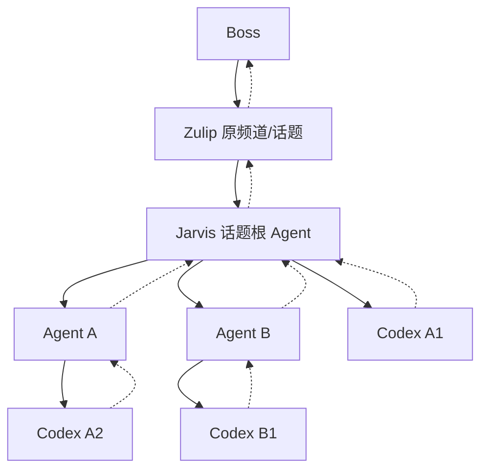
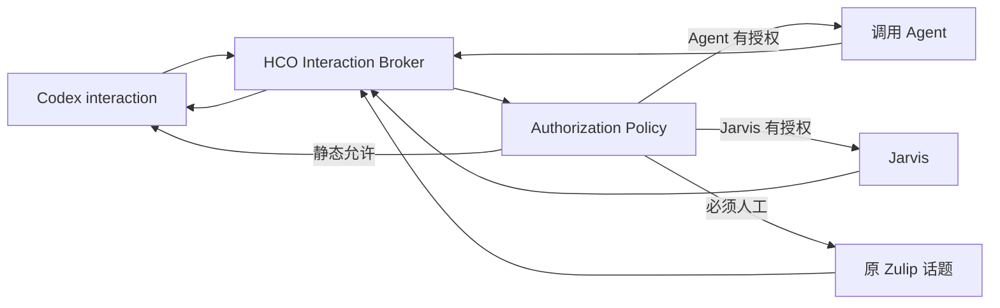

# 话题级 Hermes Agent 与 Codex 协作、汇报及授权设计

**状态**：V2 规划基线；已完成本轮机制复核，尚未实现或故障注入，未批准上线

**日期**：2026-07-28；V2 修订：2026-07-31；实施合同补充：2026-08-03

**适用范围**：Zulip、Hermes/Jarvis、Hermes 子 Agent、HCO、Codex App Server

**目标**：在不允许话题覆盖项目或工作目录的前提下，实现话题上下文隔离、多 Agent 与多 Codex 对话协作、准确逐级汇报、人工交互闭环和可审计的授权代理。

## 1. 产品决策

以下规则是本方案的固定前提：

1. Zulip 频道是项目和 canonical working directory 的唯一来源。
2. 话题不能设置、覆盖或推断项目和工作目录。
3. 每个话题拥有独立的 Hermes/Jarvis 上下文和一个逻辑 Codex 上下文会话，类似 Codex 中的一段独立对话。
4. 每个话题的 Codex 主对话在首次可执行请求时惰性创建；objective 和 Agent 只能在该话题会话内继续主对话或创建数量受限的附加 Codex 分支，不能跨话题复用。
5. HCO 可以共用一个 Codex App Server OS 进程；隔离单位是 Codex thread，不要求每个话题启动一个 OS 进程。
6. Boss 的一次要求、Agent 的一次执行、Codex 的一次对话和一次 turn 是不同身份，不能用一个“当前任务”字段替代。
7. Jarvis 可以自己调用 Codex、委派多个 Agent、检查 Agent 结果、补充要求、重新激活同一 Agent，或改派其他 Agent。
8. Agent 可以在继承的项目与话题范围内调用一个或多个 Codex 对话，但不能改变项目、工作目录或话题上下文。
9. Codex 的结果和交互请求按调用来源路由；不是所有结果都直接发送 Zulip，也不是所有结果都必须经过 Jarvis。
10. 模型只提出执行或授权决定；身份、路径、权限、路由、状态迁移和交付由 Hermes/HCO 可信代码强制执行。

## 2. 人工使用目标

### 2.1 Boss 下达要求后应看到什么

Jarvis 必须尽快给出一条明确回执，至少说明：

- Jarvis 对目标的简短理解；
- 是否已经开始执行；
- 是否调用 Codex、委派 Agent，或两者同时进行；
- 当前可公开的工作编号；
- 下一次反馈是结果、阶段性进度，还是需要 Boss 决策。

Jarvis 不应把内部 `objective_id`、thread 数量或 Agent 调度细节全部倾倒给 Boss。默认回复应服务于决策，例如“已安排两路检查；代码修复和验证并行进行，完成后汇总”。详细状态通过显式状态查询提供。

Jarvis 的本轮聊天回复结束，不代表后台工作结束。后台状态必须持久化，结果到达后能够唤醒正确的 Jarvis/Agent 会话并继续处理。

### 2.2 Boss 最终应得到什么

最终答复由 Jarvis 汇总，至少包含：

- 完成了什么；
- 哪些关键结果已经验证；
- 重要文件或产物；
- 未完成、失败或需要后续决定的事项；
- 必要时说明哪些结论来自 Agent/Codex，避免把未验证建议表述为事实。

Boss 不需要阅读多份重复的 Agent/Codex 原始输出。原始输出和完整证据保存在审计记录或 artifact 中，Jarvis 提供高信号综合答复。

### 2.3 反馈节奏与并发任务识别

反馈采用“重要事件立即通知 + 静默 SLA + 合并去重”，而不是每个内部状态变化都发送消息：

- 首次接受必须立即回执；
- 进入等待人工、失败、状态无法验证、Agent 重新激活、工作范围变化、资源冲突或预计完成时间明显变化时立即通知；
- 长任务超过 `progress_silence_threshold` 仍无可见变化时发送一次简短状态，默认 10 分钟；持续无变化时按更长间隔发送，默认 30 分钟；
- 一个合并窗口内的多个内部事件只发送一条摘要，默认合并窗口 60 秒；
- 重启后仅恢复订阅或重建内存状态不发送消息；只有实际状态变化、超过静默 SLA 或需要人工动作时才通知；
- Jarvis 重新激活 Agent 且会推迟最终结果时，向 Boss 说明“初步结果不足、已补充要求继续验证”和下一反馈点；
- 每个回执、阶段性更新、审批和最终答复都 reply 到该 `work_request_id` 的原始 Boss 消息，并显示短工作引用；同一话题有多个 active work request 时，回执显示当前并行数量，避免结果归属混淆。

Boss 可以使用自然语言询问进度，也可以使用确定性的只读状态命令。命令解析必须识别已知前缀和 ID，同时保留后续自然语言作为查询说明，不能因为存在尾随文本而返回 `Invalid command`。状态响应按 work request 折叠为一行，默认只显示 short ref、等待对象、最近有效进展、Agent 完成/活动计数、实际/已验证状态和下一动作；显式展开后才显示 Agent 树，避免高并发状态淹没话题。

## 3. 身份与隔离模型

```text
stream_id
  -> project_id
  -> canonical cwd

stream_id + topic identity
  -> topic_context_id
  -> Jarvis topic session

accepted objective/work
  -> topic-owned Codex context session
  -> lazily created TOPIC_PRIMARY or managed objective branch

Boss message
  -> work_request_id
  -> 0..N agent sessions/activations
  -> 0..N Codex conversations/calls
```

### 3.1 话题上下文

`topic_context_id` 是话题的稳定上下文身份。它不包含项目可覆盖字段。当前 topic 名称只是地址；话题改名必须通过已验证的 Zulip rename/move 事件或显式 relink 迁移 alias，不能通过字符串相似度猜测。在途 work request 继续绑定原 `topic_context_id`，后续消息通过当前 active alias 交付；rename/relink 尚未验证时暂停新交付并显示 `TOPIC_ADDRESS_UNVERIFIED`，不能发送到旧地址或猜测新地址。

话题上下文面向整个话题共享，不以发送者 user ID 再拆分。用户 ID 仍用于 ACL、审计和交互回复授权。这样同一话题中的 Boss 后续消息能看到该话题的 Jarvis 工作历史，而不同话题不会互相继承。

### 3.2 工作、Agent 和激活

`work_request_id` 表示 Boss 的一次独立要求。同一话题允许同时存在多个未完成 work request。每个 work request 不可变保存 `requester_user_id` 和 `original_zulip_message_id`；即使话题上下文由参与者共享，回执、状态、审批和最终答复仍 reply 到各自原始消息，私有/受限信息还要重新检查当前用户 ACL，不能因为共享话题上下文而扩大可见权限。

Agent 使用两个身份：

```text
agent_session_id      Agent 的持久身份和上下文
agent_activation_id   Agent 每次被 Jarvis 唤醒执行的周期
```

Agent 完成一次汇报后保留 session。Jarvis 对结果不满意、需要补充验证或任务条件变化时，通过 `agent.reactivate` 创建新的 activation，继续同一 Agent 上下文。每次重新激活都记录触发者、原因、预算，并强制携带 `correction_instruction`、`review_findings`、`expected_delta` 和上次报告/失败 artifact 引用。达到重新激活上限后不得原样循环，Agent 进入明确失败状态并由 Jarvis 向 Boss 说明最后结果和可选下一步。

### 3.3 Codex 对话

话题专用 Codex 上下文会话内的 Codex 对话分为：

- `TOPIC_PRIMARY`：该话题唯一拥有的主对话，首次可执行请求时惰性创建，由 Jarvis 管理；
- `OBJECTIVE_PRIMARY`：需要把某个 objective 与话题主对话隔离时创建的受管分支；
- `JARVIS_WORKER`：Jarvis 为复核、比较或并行工作创建；
- `AGENT_WORKER`：Agent 为自己的工作创建；
- `FORK`：需要继承选定历史但隔离后续工作时创建。

`TOPIC_PRIMARY` 是每个 topic context 的唯一主 thread role；它不能被其他 topic 使用。`OBJECTIVE_PRIMARY`、`JARVIS_WORKER` 和 `AGENT_WORKER` 都必须带有所属 `topic_context_id`，并在没有明确 relation、隔离理由和 lease 时不得从主 thread 隐式分叉。子 Agent 不得跨 topic 使用任何 thread；同一 Codex thread 任何时刻最多一个 active turn，并行调用必须使用不同 thread。

## 4. 调用来源与结果路由

每个 Codex call 在创建时固定 `invocation_origin`，后续不得修改：

| 调用来源 | 判定条件 | 最终结果目标 | 中途交互目标 |
| --- | --- | --- | --- |
| `DIRECT_ZULIP` | 显式 `/codex` 命令或确定性的直接执行入口 | 原 Zulip 频道/话题 | 原话题中的授权用户 |
| `JARVIS` | Jarvis 在处理自然语言或工作流时调用 | Jarvis mailbox | 授权策略、Jarvis 或人工 |
| `AGENT` | 某个 Agent 调用 | 该 Agent mailbox | 授权策略、Agent、Jarvis 或人工 |

自然语言经 Jarvis 判断后调用 Codex，必须标记为 `JARVIS`，不能因为消息来自 Zulip 就标记为 `DIRECT_ZULIP`。

### 4.1 Direct Zulip 调用

Hermes Gateway/HCO delivery sidecar 可以把 Codex 的最终技术输出确定性地发送回原话题，不需要 Jarvis 模型重新总结。结果 reply 到原始 direct command。进度默认节流，避免刷屏；最终结果必须有稳定 delivery ID，重试不能重复发送。超长结果使用确定性 Markdown-aware 分块；仍不适合消息展示的内容写入 artifact，并发送短索引和引用。

Codex 的审批或信息请求直接进入原话题。人工答复通过 interaction token 精确返回原 Codex thread/turn/item。

### 4.2 Jarvis 调用

Codex 接收、进度、结果和异常先进入 Jarvis mailbox。Jarvis 可以立即向 Boss 发送已接受回执，不等待 Codex 完成。结果到达后 Jarvis被唤醒，可以继续调用 Codex、委派 Agent、请求人工信息或形成综合答复。

### 4.3 Agent 调用

Codex 结果必须返回调用它的 `agent_session_id`，不能绕过 Agent 直接发给 Jarvis 或 Zulip。Agent 收到结果后可以：

- 继续同一 Codex 对话；
- 新建附加 Codex 对话；
- 调用其他工具；
- 向父 Agent/Jarvis 报告阶段性或最终结论；
- 将需要人工处理的交互升级到 Zulip。

## 5. 分层协作与汇报



### 5.1 Agent 报告合同

Agent 向父 Agent/Jarvis 的报告采用结构化 `AgentReport`：

```text
report_id
work_request_id
agent_session_id
agent_activation_id
status: progress | needs_input | completed | failed
summary
claims[]
verification[]
artifacts[]
unresolved[]
recommended_next_actions[]
related_codex_call_ids[]
```

父 Agent/Jarvis 可以读取完整报告和证据，再决定接受、追加要求、重新激活、交叉验证或改派。不得只凭“Agent 已完成”状态生成最终答复。

### 5.2 完成条件

Jarvis 可随时发送阶段性反馈。execution work 只有在以下条件全部满足后才能进入 `TERMINAL_VERIFIED` 或 `TERMINAL_UNVERIFIED`；消息是否送达由独立 delivery 状态记录：

1. 所有 required Agent 已报告或被明确取消/替换；
2. 所有 required Codex call 已达到真实终态；
3. 所有 required interaction 已回答、拒绝、超时处理或明确取消；
4. HCO completion reducer 已按sealed completion contract检查required结果、effect/join状态和验证证据，并确定非空`execution_outcome`；
5. HCO 已在同一事务写入 execution fact、tombstone 和当前 terminal epoch；最终 Zulip delivery 可仍处于 `QUEUED/DELIVERY_UNCERTAIN/DEAD`，不阻塞 execution terminal。

这里的“完成验证”和“面向Boss的综合”是两件事。只有completion contract在执行前明确封存了Integrator/Evaluator角色时，该角色才属于第4项，并且必须有reduction deadline及确定性partial/fail出口；普通Jarvis FinalReport review发生在execution terminal之后，只负责选择和组织交付内容，不能成为所有work终态的隐含前置。否则Jarvis失联会同时卡死execution和降级通知。

## 6. Agent 生命周期与异步恢复

```text
CREATED
  -> RUNNING
  -> WAITING_CODEX
  -> RUNNING
  -> WAITING_CHILDREN
  -> RUNNING
  -> REPORTED

REPORTED / FAILED / FAILED_ORPHANED
  -> agent.reactivate transaction
  -> a new CREATED activation for the same agent session

任意非终态 -> CANCELLED | FAILED | FAILED_ORPHANED
```

Agent 持有 required Codex call 时不能直接进入 `REPORTED`，只能进入 `WAITING_CODEX`。这不要求保留 Agent OS 进程；Hermes 持久化 session 和 mailbox，事件到达时重新加载 Agent。

如果 Agent 断线或崩溃，runtime 先把业务 activation 保持在可恢复的 `DISCONNECTED/UNKNOWN` reconciliation 状态，不直接标成 `FAILED_ORPHANED`，也不把缺少局部上下文的原始 Codex 内容直接交给父 Agent解释。只有确认旧执行不可接管、lease 已失效且结果无法恢复后，HCO 才将持久 agent activation CAS 为 `FAILED_ORPHANED`，保存原始结果 artifact，并使用 compare-and-set 将监督权转移给父 Agent。父 Agent只收到 `OrphanRecoveryNotice`，其中包含失败原因、原 owner、状态、artifact 引用和“重新激活同一 Agent/创建新 Agent/取消”的恢复选项。父 Agent不可用时逐级转移到 Jarvis。每次转移产生审计事件。

如果监督权转移也失败，work request 进入 `DEGRADED_PENDING_OPERATOR`：首先通知对应 Jarvis session；Jarvis不可达时通知部署必须配置的 operator target；Boss 的状态查询必须可见该降级状态。不得广播、猜测接收者、静默丢弃，或让 work request 继续显示普通 `RUNNING`。

## 7. Codex 交互中转

Codex 的审批、选择和信息请求必须经过统一 Interaction Broker，不能由 Agent 手工复制问题后自行匹配回答。



### 7.1 Interaction 身份

每个 interaction 必须绑定：

```text
interaction_id
work_request_id
topic_context_id
project_id
invocation_origin
caller_principal_id
agent_session_id (可空)
codex_conversation_id
codex_call_id
thread_id
turn_id
item_id/request_id
allowed_responder_ids / approver_set_id
authorization_context_id
expires_at
state_owner_kind / state_owner_id
state_deadline_ms
recovery_deadline_ms (进入ORPHANED_REQUIRES_RECOVERY时必填)
single_use_reply_token
```

### 7.2 状态机

```text
RECEIVED
  -> POLICY_EVALUATION
  -> AUTO_ANSWERED
  -> WAITING_AGENT
  -> WAITING_JARVIS
  -> QUESTION_DELIVERING
  -> QUESTION_DELIVERY_UNCERTAIN
  -> WAITING_HUMAN
  -> WAITING_APPROVER_CONFIGURATION
  -> ANSWER_DELIVERING
  -> ANSWERED
  -> RESUMED

任意等待/投递状态 -> EXPIRED | CANCELLED | ORPHANED_REQUIRES_RECOVERY
ORPHANED_REQUIRES_RECOVERY -> RESUMED | EXPIRED | CANCELLED
```

`RECEIVED/POLICY_EVALUATION`只允许由HCO policy reducer在一个有短deadline的本地流程中推进，不能等待模型或外部I/O；`AUTO_ANSWERED`必须在同一结算事务进入`RESUMED/ANSWERED`，不得常驻。`WAITING_AGENT/WAITING_JARVIS`必须绑定current activation/attempt和绝对state deadline；`WAITING_APPROVER_CONFIGURATION`必须绑定配置scope/revision、configuration reducer和绝对截止，配置就绪后进入`QUESTION_DELIVERING`，截止后进入`EXPIRED/CANCELLED`并告警。`ORPHANED_REQUIRES_RECOVERY`是有recovery deadline的非终态，只有reconciliation能进入`RESUMED`；到期必须`EXPIRED/CANCELLED`并结算owners/barrier，不能成为无限人工队列或阻塞归档。

同一 interaction 只能结算一次。Zulip 按钮成功后必须编辑原消息，删除按钮或显示不可重复操作的已处理状态。重复点击返回同一个已结算结果，不得再次调用 Codex。

如果回答已写入 HCO 但 App Server 确认丢失，状态进入 `ANSWER_DELIVERING` 或 reconciliation，不能重新开放按钮或猜测已成功。

interaction、reply token、回答 intent 和 App Server correlation 全部持久化。Hermes/HCO/App Server 重启期间的有效点击先原子记录，再进入 `ANSWER_DELIVERING`；恢复后 HCO 自动 reconciliation，并保证同一回答最多对 Codex 生效一次。重启本身不延长 interaction 的绝对过期时间。

### 7.3 Agent 向人工请示

Agent 通过 `interaction.escalate` 请求中转，HCO 保留原始 interaction 和选项。Agent 可以附加业务背景、建议和影响说明，但不能改写 interaction ID、可选动作或安全分类。

### 7.4 人工审批消息渲染合同

任何进入 Zulip 的审批/信息请求都必须 reply 到原始 Boss 消息，并以人类可读形式包含：

```text
短工作引用和任务摘要
请求来源：Direct Codex / Jarvis / Agent 角色
当前步骤和 Agent 的 escalate_reason
拟执行的准确动作和资源范围
为什么需要审批
执行影响、主要风险和是否尚未执行
可选动作及每个动作的后果
过期时间（Asia/Shanghai，带绝对日期时间）
允许审批的角色或人员
```

原生按钮是主要输入方式。文字回复只有在 reply-to message ID 或显式一次性 token 能唯一定位一个 pending interaction、回答者被授权且内容满足 schema 时才接受；存在多个候选或语义不唯一时必须要求重新选择，不能猜测。

审批消息成功结算后立即编辑原消息，移除按钮并显示决定、决定者和时间。非授权用户点击时显示“你不是此请求的审批者”，但不得泄露敏感 scope；重复点击返回已结算结果。

### 7.5 正确审批者解析

审批者由可信 `ApprovalResolver` 根据操作类别、项目角色、原始 requester、authority envelope 和系统硬策略解析，模型不能提供 `approver_set_id`。没有符合条件的审批者时进入 `WAITING_APPROVER_CONFIGURATION`，通知 Jarvis、Boss 和 operator target，不得发给话题中的任意参与者代批。

人工答复必须同时通过：

- Zulip 消息来自原 topic context；
- 用户属于 `allowed_responder_ids` 或 `approver_set_id`；
- token、Codex call、turn 和 request 完全匹配；
- interaction 未过期、未取消、未回答；
- 回答内容属于允许的动作或满足输入 schema。

涉及 secret 的请求禁止通过 Zulip 收集。此类请求确定性路由到 owner-only 本地安全入口；没有安全入口时保持阻塞并明确提示，不允许 Jarvis 或 Agent猜测凭据。

## 8. 授权与代人工决策

授权是逐层收窄的 capability：

```text
系统硬策略
  -> 项目/频道策略
  -> Boss 授予 Jarvis 的 authority envelope
  -> Jarvis 授予 Agent 的子 capability
  -> 单次 Codex interaction
```

下级权限必须是上级权限的严格子集。Agent 默认不能代替 Boss 审批；只有 Jarvis 明确转授且系统策略允许时才可处理。

### 8.1 Authority envelope

```text
authorization_context_id
grantor_principal_id
grantee_principal_id
topic_context_id
project_id
operation_classes[]
resource_patterns[]
path_scope[]
network_scope[]
risk_ceiling
can_delegate
max_delegation_depth
max_uses
valid_from / expires_at
policy_revision
```

模型不能创建或扩大 envelope。Boss 通过管理配置或明确交互授予；HCO 持久化并验证。

### 8.2 确定性授权结果

Policy Engine 必须返回以下之一：

```text
AUTO_ALLOW
AGENT_DECIDE
JARVIS_DECIDE
HUMAN_REQUIRED
DENY
```

Jarvis 只能在 `JARVIS_DECIDE` 范围内代人工决定。Jarvis 生成的决定仍由 HCO 检查 request、scope、风险、次数、时效和策略版本，不能因为“Jarvis 说已批准”就执行。

如果某动作本来允许人工批准，但 Jarvis/Agent envelope 已过期、次数耗尽或 policy revision 已变化，Policy Engine 确定性降级为 `HUMAN_REQUIRED`，同时把原因发送给原调用者；如果命中系统硬拒绝、跨项目/话题、不可解析 scope 或超过人工也不能覆盖的策略，则返回 `DENY`。`DENY` 必须带结构化安全原因并通知调用者，不能静默卡住 interaction。

Jarvis/Agent 代人工完成的决定写入审计，并在最终报告中以简短方式列出重要代理决定；不为每个低风险自动批准单独打扰 Boss。

默认需要人工或拒绝的高风险类别包括：

- 广泛或不可恢复的删除、覆盖、重置；
- 凭据、密钥和隐私数据访问；
- 生产环境、权限、账号或基础设施变更；
- 对外发布、发送消息、创建 PR/合并、支付或其他外部副作用；
- 超出 canonical cwd、项目或网络 allowlist；
- scope 无法完整解析或策略版本不一致。

`resource_patterns`、`path_scope` 和 `network_scope` 是 HCO 强校验 allowlist，不接受模型生成的宽泛通配符。`DelegationPacket` 必须携带当前委派深度；HCO 验证 `max_delegation_depth`，不能依赖 Agent 自报。

## 9. 信息与文档中转

对话和 Agent 之间不传递无界全文。使用分层合同：

| 文档 | 发送方 -> 接收方 | 主要内容 |
| --- | --- | --- |
| `WorkBrief` | Boss/Jarvis -> 工作图 | 原始要求、目标、硬约束、验收条件 |
| `DelegationPacket` | Jarvis/父 Agent -> 子 Agent | 子目标、可用上下文、权限、报告要求 |
| `CodexInvocation` | Jarvis/Agent -> HCO/Codex | 精确指令、上下文引用、artifact manifest |
| `CodexReceipt` | HCO/Codex -> 调用者 | 结果、测试、产物、未决项、真实状态 |
| `AgentReport` | Agent -> 父 Agent/Jarvis | 综合结论和验证证据 |
| `InteractionRequest` | Codex/Agent -> 审批链 | 精确选项、风险、影响、授权要求 |

小信息以内联结构化数据传输；大信息使用 `docs/ARTIFACT_PROTOCOL.md` 定义的 manifest、路径、哈希和大小合同。所有文档都必须携带 `topic_context_id`、`project_id`、`work_request_id`、source ID 和 `context_revision`。

`context_revision` 在每次 delegation、Codex call 和恢复时校验：

- project/topic/authority scope revision 变化属于安全边界变化，旧 capability 立即失效并 fail closed；
- WorkBrief 或业务上下文 revision 变化时，在下次 activation/turn 注入结构化 delta；
- 已运行 Codex call 保留启动时 revision，完成结果标记 `CONTEXT_STALE_REVIEW_REQUIRED`，由 Jarvis 比较 delta 后决定接受、补充调用或重新执行，不能把旧结果静默当作当前事实；
- artifact hash 或 repository evidence 变化按 artifact/freshness 合同重新验证。

HCO 拒绝跨 `topic_context_id` 的隐式上下文继承。跨话题共享必须由 Boss/Jarvis 显式创建新的引用或复制 artifact，并记录来源。

## 10. 持久状态要求

现有 `topic_modes -> current objective` 不足以表达本方案。最低需要以下持久实体：

```text
topic_contexts
work_requests
agent_sessions
agent_activations
agent_parent_edges
codex_conversations
codex_calls
codex_call_ownership
agent_mailbox
agent_reports
authority_envelopes
approval_sets
interaction_escalations
notification_ledger
```

`work_requests.state` 至少区分：

```text
ACCEPTED | RUNNING | WAITING_AGENT | WAITING_CODEX | WAITING_HUMAN
RESOURCE_WAIT | STATUS_UNVERIFIED | DEGRADED_PENDING_OPERATOR
COMPLETED | PARTIAL | FAILED | CANCELLED
```

状态由已持久化的 Agent、Codex call、interaction、resource lease 和 delivery 事实归约得到，不能由 Jarvis 自由生成或用一条“当前状态”覆盖。

每个 Codex call 至少保存：

```text
invocation_origin
caller_principal_id
agent_session_id
agent_activation_id
topic_context_id
project_id
work_request_id
report_target
interaction_target
authorization_context_id
parent_codex_call_id
```

`objective_id -> project_id + topic_context_id` 必须不可变。继续、查询、取消、交互回答和恢复都要验证完整 scope，不能只验证 project ID。

## 11. 并发、文件安全和资源限制

不同话题、Agent 和 Codex thread 的上下文隔离不等于文件隔离。它们仍使用频道绑定的同一 canonical cwd。

默认策略：

- 只读工作可以并行；
- 同一 Codex thread 只允许一个 active turn；
- 写工作先获取项目级或路径级 fenced write lease；lease 绑定 owner activation、fencing token、续租期限和绝对等待上限；
- 多路径写入按 canonical path 全序一次性获取，获取失败时释放本次已取得的 lease，禁止持锁等待其他 lease；
- lease 过期不等于立即允许新 writer；只有确认旧 owner 已停止写入或被 fencing token 拒绝后才能转让；
- 无法证明写集合不冲突时串行执行；
- 将来需要并行写入时，可使用 HCO 管理的临时 worktree，但它只是执行隔离，不是话题项目映射。首个版本默认不自动创建 worktree；只有项目运维显式启用且定义合并/清理策略后，Jarvis 才能提供该选项，否则只提供继续等待或取消。

资源等待超过上限返回 `RESOURCE_WAIT_TIMEOUT`；检测到不符合全序规则的历史循环依赖时返回 `RESOURCE_DEADLOCK`。HCO 不猜测哪个修改应覆盖另一个修改，也不在旧 writer 仍可能存活时仅凭时间自动放锁。Jarvis 收到等待资源、当前 owner、再次评估时间和“继续等待/取消/改用隔离 worktree”的安全选项，并按反馈 SLA 通知 Boss。

必须配置：每话题 active work request 数、每话题/Agent Codex 对话数、Agent 并发数、委派深度、重新激活次数、授权使用次数、总执行时间和资源预算。超限返回明确状态并通知 Jarvis，不得无限递归或无限创建对话。

## 12. 失败、重启和兜底

所有路径都有确定结果：

- App Server 可验证：报告真实状态；
- App Server 不可达：报告 `status_unverified`，不机械复述缓存 `running`；
- completion 已收到但 Agent 不在线：写 durable mailbox 并唤醒/恢复 Agent；
- Agent 恢复失败：经过 lease/runtime reconciliation 后才标记 `FAILED_ORPHANED`，保存原始结果 artifact，并用 CAS 转移监督权；
- 父 Agent不可用：逐级转移监督权给 Jarvis；转移失败则进入 `DEGRADED_PENDING_OPERATOR`；
- Zulip 交付失败：保留 outbox 并重试，不能把任务标记为已通知；
- interaction 超时：按策略取消、暂停或请求人工恢复，不能自动选择高风险答案；同时通知 Boss 哪个步骤超时、当前状态和下一动作；
- 重复消息、事件或点击：按 source ID、call ID、interaction ID 和 semantic key 幂等处理；
- route、topic、project 或 policy revision 不一致：fail closed，向原调用者和 operator target 给出脱敏的状态、诊断引用和 runbook 步骤；不得在 Zulip 发布 SQL、密钥、敏感路径或可直接造成状态变更的命令；
- 重启恢复：先进入静默 reconciliation，恢复订阅和内部状态不发 Zulip；只有实际状态变化、超过静默 SLA 或需要人工动作才通知；
- `ANSWER_DELIVERING`：HCO 启动时自动 reconciliation，确认回答是否已生效后再推进状态，不能重新开放 interaction。

## 13. 对当前实现的影响

当前实现存在以下不匹配：

1. Bridge 提示和 capability 限制每个 Hermes turn 只能调用一次 `hco_dispatch`，不支持 Jarvis/Agent 循环或并行调用。
2. `hco_dispatch` 授权绑定顶层 Zulip message 对应的 Hermes `session_id + turn_id`；子 Agent 的独立 session 没有合法调用身份。
3. Bridge binding 只有 Zulip sender/stream/topic/message，没有 caller Agent、parent Agent、work request 或 report target。
4. HCO 只持久化话题的一个 current objective/thread，无法表示主对话、附加对话和 Agent 所有权。
5. objective continuation/status/cancel 主要验证项目，不足以阻止同项目跨话题引用。
6. completion/outbox 以 Zulip target snapshot 为中心，不能将结果优先投递到 Agent mailbox。
7. Hermes 已提供子 Agent session、parent session、`subagent_start/subagent_stop` 钩子和 background completion 回流，可作为低风险扩展点；不应优先修改 Hermes `run.py`。

## 14. 实施分期

### Phase 0：冻结协议和人工体验

- 固定三个 `invocation_origin` 的判定和路由矩阵；
- 固定 Boss 回执、反馈静默 SLA、事件合并、状态查询、人工请示和最终答复的 UI/文案合同；
- 固定 Zulip 审批卡片、按钮结算、文字回复唯一匹配和并发 interaction 区分规则；
- 固定授权矩阵和 always-human/always-deny 类别；
- 用真实 Zulip 交互走通纸面场景。

### Phase 1：身份、scope 与任务图

- 新增 topic/work/agent/codex ownership 数据模型；
- 将 `objective_projects` 扩展为不可变完整 scope；
- 分离 `report_target` 与 `interaction_target`；
- 保留兼容读取，新增写入走新 schema。

### Phase 2：Agent capability 与多次调用

- Bridge 增加 durable `AgentScopeRegistry`；
- 使用 `subagent_start/subagent_stop` 记录父子关系；
- 子 Agent capability 只能从父 scope 派生；
- 每次调用使用独立 nonce/call ID 和配额，不再使用“整个 turn 只能调用一次”的合同。

### Phase 3：mailbox、唤醒与重新激活

- 实现 Agent mailbox 和 HCO completion -> Agent resume；
- 实现 Jarvis inspect/reactivate/cancel/replace；
- 支持一个话题多个同时存在的 work request；
- 实现自然语言/显式状态查询、reply-to 原消息和通知合并；
- 结果沿调用链逐级上报。

### Phase 4：Interaction Broker 与授权代理

- 统一 Direct Zulip、Jarvis、Agent 三种 interaction；
- 接入原生按钮、一次性结算和消息更新；
- 实现 ApprovalResolver、authority envelope、Policy Engine 和 Jarvis 代人工决定；
- 增加 secret 请求的本地安全入口。

### Phase 5：恢复、并发和灰度

- 加入重启恢复、状态 reconciliation、mailbox/outbox 重放；
- 加入 fenced write lease、全序获取、资源配额和循环上限；
- 增加只读 Operator 查询、operator target 和降级恢复 runbook；
- 先只读/最终消息灰度，再启用写入、Agent 交互和代理授权；
- 任一跨话题投递、错误审批者、丢失最终结果或越权执行均为 P0 回滚条件。

## 15. 人工验收场景

1. Boss 提交普通工作，Jarvis 立即回执，后台完成后给出综合结果。
2. Boss 明确 `/codex` 调用，Codex 原始最终结果直接回原话题。
3. Direct Codex 请求三选一，按钮只可结算一次，回答返回原 turn。
4. Jarvis 同时委派两个 Agent并自己调用 Codex，结果各归其调用者，最终只由 Jarvis 汇总一次。
5. Agent A 同时调用两个 Codex 对话，乱序完成后仍全部回到 Agent A，不进入 Agent B。
6. Agent 遇到审批，Jarvis 在授权范围内代为批准，HCO 留下完整授权审计。
7. 超出 Jarvis 权限的审批发送给正确人工审批者，其他用户点击被拒绝。
8. Agent 请求人工信息，问题发到原话题，回答精确返回对应 Codex request。
9. Jarvis 检查 Agent 报告后重新激活同一 Agent，Agent 保留上下文并产生新 activation。
10. 同一话题任务一未完成时 Boss 提交任务二，两者状态和结果不串线。
11. 同一项目不同话题尝试继续对方 objective/thread，被 HCO 拒绝。
12. HCO/Hermes/App Server 在等待 interaction、等待 Agent 和等待 completion 时分别重启，恢复后不丢失、不重复。
13. 两个话题同时请求修改同一文件，写 lease 阻止覆盖并给 Jarvis 明确状态。
14. App Server 无法确认状态时，Boss 看到“未验证及原因”，而不是长期机械显示 `running`。
15. 同一话题两个 Agent 同时请求不同审批，审批者能从摘要、来源、资源和影响准确区分。
16. 非授权用户点击审批按钮被拒绝；授权用户结算后再次点击不产生第二次执行。
17. interaction token、按钮和文字回复分别重放，只允许原回答对 Codex 生效一次。
18. Jarvis authority envelope 过期或次数耗尽，可人工批准的请求降级给正确审批者；硬拒绝请求不能升级绕过。
19. Agent 等待 Codex 时崩溃，原结果进入 artifact，父 Agent只收到结构化恢复通知并能重新激活或改派。
20. `ANSWER_DELIVERING` 时 HCO/App Server 重启，恢复后回答恰好生效一次且旧按钮不重新开放。
21. 两个写任务争用多条路径，不发生持锁等待；超时后 Boss 看到 owner、等待原因和安全选项。
22. Direct Zulip 超长结果按稳定顺序分块或转 artifact，不刷屏、不丢段、不重复。
23. 同一 Agent被重新激活时能看到原始 delegation、上次薄弱点、失败证据和纠正要求；达到上限后停止循环。
24. 长任务超过静默 SLA 时产生合并进度；重启只恢复订阅时不产生消息风暴。

## 16. 验收指标

- 错误话题投递：0；
- 错误 Agent/父 Agent 汇报：0；
- 未授权审批接受：0；
- interaction 重复执行：0；
- 已确认 completion 丢失：0；
- Boss 首次回执可理解率和最终结果可操作率达到人工验收标准；
- Agent 重新激活、重启恢复和多任务并发均能通过确定性测试；
- 所有未完成状态都能说明等待对象、下一动作和负责主体。
- 并发工作、审批和最终答复均能从 Zulip reply 关系与短工作引用准确找到原始要求；
- 未发生无变化通知风暴，且任何 active work request 不超过配置的静默 SLA。

## 17. 审核要求

本方案已由 Claude 和 Gemini 分别从人工使用视角审核，重点检查 Boss 反馈体验、正确审批者选择、人工回答回传、Agent 协作、重新激活、授权代理、失败恢复和避免信息噪音：

- `docs/reviews/CLAUDE_TOPIC_AGENT_CODEX_HUMAN_WORKFLOW_REVIEW.md`
- `docs/reviews/GEMINI_TOPIC_AGENT_CODEX_HUMAN_WORKFLOW_REVIEW.md`
- `docs/reviews/TOPIC_AGENT_CODEX_HUMAN_WORKFLOW_REVIEW_SYNTHESIS.md`

## 18. 实施状态（2026-07-28）

第 13 节记录的是开发前的差距，不再代表当前代码状态。用户授权开发后，当前版本已经实现：

- topic/work/Agent/Codex durable identities、不可变 objective topic scope、按topic惰性创建的`TOPIC_PRIMARY`、按需 objective branch和 worker conversation；
- Jarvis/Agent/Direct Zulip 的独立 report target 与 interaction target，以及 Codex -> Agent -> Jarvis -> Boss 的逐级汇报；
- Agent parent scope、activation、mailbox claim/renew/ack/nack、重启恢复、孤儿监督转移和 operator 降级；
- owner-only Agent report spool 的原子落盘、幂等冲突检测和重启重放；
- 原生 `action_prompt` 按钮、一次性回答结算、prompt 删除、重复回答抑制，以及交付不确定时的 `STATUS_UNVERIFIED` 通知；
- legacy objective 的 fail-closed topic 迁移：普通操作返回 `OBJECTIVE_TOPIC_MIGRATION_REQUIRED`，只有授权 `THREAD_BIND` 能在唯一精确匹配的旧 topic 建立 scope；
- bridge 的参数/错误映射和相关确定性回归测试。

本轮没有修改 Hermes 上游 `gateway/run.py`。实现级 Claude/Gemini 复核的裁决、已修缺陷和未采纳建议见 `docs/reviews/TOPIC_AGENT_CODEX_HUMAN_WORKFLOW_REVIEW_SYNTHESIS.md` 第 7 节。

自动化验收结果：Node `337 passed`、Python `449 passed`、installer `42/42`，`npm run check` 和 `git diff --check` 通过。真实 Zulip PC/Android 客户端上的按钮呈现、点击后删除和交互回传仍需在部署后按既有人工测试方案验证。

## 19. V2 强制修订：可靠续报与多任务关系

本节由 Codex、Claude 和 Gemini 针对真实运行证据重新审查后形成。它覆盖本方案中与主动续报、同话题多任务判断、异常兜底和验收相关的旧描述。现有实现出现过以下已确认事实：Codex call 和 App Server submission 已 `COMPLETED`，work 仍为 `RUNNING/caller_review`，`pendingMailbox=1`，但 Boss 没有收到最终消息。因此，mailbox 已持久化不等于主动续报已经完成，`caller_review` 也不能无限期作为正常运行状态。

### 19.1 修订原则

1. Hermes/Jarvis 模型会话负责理解、复核和综合，不负责证明消息已经投递。
2. HCO 的 SQLite 状态、mailbox、outbox、lease 和 delivery receipt 是交付事实的唯一权威来源。
3. Codex 完成、Jarvis 已复核、Zulip 已投递是三个不同事实，不得压缩成一个 `completed`。
4. 主动续报必须同时有事件驱动主路径和周期性对账兜底；任何单次回调、daemon thread 或模型 session 都不能成为唯一触发器。
5. 每条 Boss 消息默认创建独立 work。只有存在显式、已确认的 work relation 时，才能合并完成条件、取消旧 work 或复用其 objective。
6. 模型可以提出任务关系建议，但不能自行完成高影响合并、替代、取消、跨 work 续接或写资源共享。
7. 所有不能自动恢复的失败必须对 Boss 或 operator 可见，禁止长期停留在普通 `RUNNING`。
8. HCO 是唯一可靠状态机和调度权威；Jarvis/Agent 只是受控 activation 的处理者，模型输出不能直接推进 trigger、work、interaction 或 delivery 的权威状态。
9. 内部处理采用 at-least-once 调度和幂等提交；外部 Zulip 交付只承诺 effectively-once。发送结果无法核验时必须进入 `DELIVERY_UNCERTAIN`，不得猜测已送达或未送达。

### 19.2 主动续报采用双通道

#### 通道 A：Jarvis 综合答复

适用于需要比较多个结果、补充验证、处理冲突或说明风险的工作：

```text
Codex terminal completion
  -> 事务内记录 call terminal fact 和 result artifact
  -> 创建 JARVIS_REVIEW mailbox item
  -> 尝试唤醒绑定的 Jarvis session
  -> Jarvis 读取结构化结果并生成 FinalReport
  -> FinalReport 写入 durable outbox
  -> delivery sidecar 发送到原 Zulip 消息
  -> Zulip 返回 message_id 后 ACK delivery effect
  -> execution terminal/outcome 已由HCO completion reducer写入；work 展示状态再综合 execution 与 delivery
```

唤醒 Jarvis 成功只表示“复核已启动”，不表示“Boss 已收到”。`dispatch_async_delegation` 的返回值和 Hermes processing callback 不能直接 ACK 最终交付。

#### 通道 B：确定性降级答复

如果 Jarvis 在 `review_sla` 内没有生成 FinalReport，HCO 不继续静默等待。HCO 根据已验证事实创建不经过模型的降级消息：

```text
任务执行已经结束，但自动汇总未完成。
执行证据：verified/status_unverified
执行结果：succeeded/partial/failed/cancelled
工作编号：...
结果摘要或 artifact：...
下一动作：等待自动恢复、人工查看或重新汇总
```

只读检查、版本查询、文件存在性检查和其他结果已经结构化且无需业务判断的任务，可以直接使用确定性答复作为主路径。复杂任务仍优先由 Jarvis 综合，但不得因为 Jarvis 不可用而丢失完成通知。

两个通道先竞争同一个持久 `final_delivery_claim`，只有 claim owner 可以创建公开终态 outbox。WORK claim必须绑定生成报告时的execution state/outcome/revision；创建effect前若revision已变，旧claim必须失败并重新归约，不能发送陈旧结果。`notification_semantic_key` 用于本地幂等，不能被描述为 Zulip 的 exactly-once 保证。发送成功但 receipt 未落库时进入 `DELIVERY_UNCERTAIN` 并执行投递对账；在不确定性解除前，迟到的 Jarvis FinalReport 只能保存为候选 artifact，不能再次发送。已确认降级答复送达后，迟到的 Jarvis FinalReport 只能作为明确标注的补充报告，不能重复宣告任务完成。

这个claim只仲裁“同一份HCO权威执行事实采用Jarvis文案还是确定性文案公开”，不仲裁work relation、execution outcome、权限、graph或effect路线。确定性handler只能读取已经由对应reducer提交的state/outcome/revision生成保守文案，不能抢先写`INDEPENDENT/CONFLICTS/SUCCEEDED`等业务决定。若权威execution revision后来变化，走唯一更正supplement；不能用“Jarvis迟到覆盖claim”改写业务状态，也不能让HCO降级文案成为关系模型的替代品。

### 19.3 交付状态与超时

新增或明确区分以下状态：

```text
execution_state:
  PENDING | RUNNING | WAITING_INPUT | TERMINAL_VERIFIED | TERMINAL_UNVERIFIED

execution_outcome:
  非终态为 null；终态为 SUCCEEDED | PARTIAL | FAILED | CANCELLED

review_state:
  NOT_REQUIRED | PENDING | IN_PROGRESS | COMPLETED | FAILED | TIMED_OUT

delivery_state:
  NOT_READY | QUEUED | LEASED | DELIVERY_UNCERTAIN | DELIVERED |
  RETRY_WAIT | DEAD | GROUP_OWNED | SATISFIED_BY_GROUP
```

`execution_state`回答“是否终止、终态证据是否验证”，`execution_outcome`回答“该执行世代的业务结果是什么”。两者不能互相推导，特别是`TERMINAL_VERIFIED`只表示终态证据已验证，不表示成功。权威事实至少按以下合同持久化：

```text
work_execution_facts
  work_request_id
  terminal_epoch
  execution_state           PENDING | RUNNING | WAITING_INPUT |
                            TERMINAL_VERIFIED | TERMINAL_UNVERIFIED
  execution_outcome         nullable；SUCCEEDED | PARTIAL | FAILED | CANCELLED
  outcome_reason_code       nullable
  completion_contract_revision
  evidence_digest           nullable
  execution_revision
  terminal_at_ms            nullable
  PRIMARY KEY(work_request_id, terminal_epoch)
```

数据库约束必须保证：非终态时`execution_outcome/terminal_at_ms`均为null；终态时两者均非null。只有HCO work completion reducer可以按sealed completion contract接受Agent/Codex/effect/join candidate，并在同一事务写execution state、outcome、evidence digest、revision、tombstone及有界反向依赖唤醒。模型报告、delivery receipt和展示状态都只是输入或投影，不能直接写outcome。`TERMINAL_UNVERIFIED`后收到新证据时，只能由同一reducer按当前execution/evidence revision CAS升级为`TERMINAL_VERIFIED`或修正尚未验证的outcome；该事务还必须写唯一`EXECUTION_FACT_REVISED(work, terminal_epoch, execution_revision)` trigger。一旦`TERMINAL_VERIFIED`，该epoch的outcome不可改，改变业务目标必须显式reopen到新epoch。required补偿成功只表示补偿义务完成，原work仍按sealed合同归约为`PARTIAL/FAILED`；人工接受未验证事实最多形成`TERMINAL_UNVERIFIED`，不得伪造`SUCCEEDED + TERMINAL_VERIFIED`。

事实修订不能被“终态后禁止新通知”吞掉。若原primary为`AVAILABLE/LEASED`且未创建effect，修订reducer按subject/execution revision废弃旧candidate并生成新primary；effect虽已创建但仍在`BLOCKED/READY/LEASED`、authorization未消费且adapter调用数为0时，修订事务必须CAS撤销authorization、fence attempt、取消effect并把claim置`SUPERSEDED_PRE_DISPATCH`，再生成绑定新execution revision的primary。若旧effect已经`DISPATCHING`、结果不明或terminal，不能撤销猜测；系统创建唯一`delivery_kind=SUPPLEMENT`的更正通知，semantic key固定为`WORK_EXECUTION_CORRECTION + work + terminal_epoch + execution_revision`，并在同subject delivery sequence中等待旧claim先进入`CONFIRMED/DEAD`。旧claim DEAD时更正文案必须自包含“此前可能送达的状态现已更新”；不能再次宣告任务完成，也不能让更正先发、陈旧primary后发。该claim有自己的delivery revision、due/hard deadline并走同一effect/reconciliation；callback丢失由`EXECUTION_FACT_REVISED` due sweep补建。只有被completion reducer接受的新权威证据能创建这种更正，普通迟到candidate仍只进audit。

`work_requests.state` 是上述事实的展示归约，不能作为 execution fencing 或 tombstone 的权威：

- 有 active call：`WAITING_CODEX`；
- 执行已终态、Jarvis 正常复核：execution 已保持 `TERMINAL_VERIFIED/TERMINAL_UNVERIFIED`，展示为 `RUNNING/caller_review`；
- 超过 `review_sla`：不能继续显示普通 `caller_review`，必须排队确定性降级通知；
- 最终通知已送达：按权威execution outcome分别展示为 `COMPLETED`、`PARTIAL`、`FAILED` 或 `CANCELLED`；
- 最终通知无法送达且重试耗尽：`DEGRADED_PENDING_OPERATOR/delivery_dead`；
- 后端状态不可验证：`STATUS_UNVERIFIED`，并按 SLA 通知 Boss。

默认建议值：`review_sla=2m`、首次交付重试 `10s`、指数退避上限 `10m`、最多 8 次、终态工作对账周期 `1m`。部署可配置，但不能设置为无限等待。Zulip delivery 是否成功不改变 execution terminal、terminal epoch 或 tombstone。

### 19.4 周期性对账是必需组件

新增独立 reconciliation tick，复用当前 SQLite，不引入新的消息中间件。每次 tick 必须限量、带游标、幂等执行：

1. 扫描 active call，与 App Server 核验实际状态；
2. 扫描已 terminal 但没有 mailbox/outbox 的 call，补建缺失记录；
3. 扫描超过 `review_sla` 的 `caller_review`，创建确定性降级答复；
4. 扫描到期的 `PENDING/RETRY_WAIT` mailbox 和 outbox，重新领取；
5. 扫描过期 lease，只有在 fencing token 校验后才能重新投递；
6. 扫描 `DEAD` 项，确保 work 已降级且 operator/Boss 至少收到一个可见通知；
7. 记录 tick 的成功时间、扫描数量、修复数量和错误类别。

recovery loop 禁止 `except Exception: pass`。异常必须写入结构化 audit/health state；连续失败达到阈值后发送 operator 告警。单条坏记录不能阻塞同批其他记录。

默认机械预算为：每类扫描每 tick 最多 50 条、单 tick wall-time 5 秒、每条坏记录最多占用 200ms。扫描使用两条可恢复游标：主 lane 在 tick 开始先固定 `high_water=(due_at_ms,id)`，只扫描 `cursor < key <= high_water`；到达 high-water EOF 后把主游标回绕到起点。每个 tick 还执行有界的 overdue low-water sweep（`due_at_ms <= now`，从该 lane 游标继续并在 EOF 回绕），专门捕获游标推进后补建、时钟回拨或 due_at 变早的记录。游标和 high/low-water 标记同一事务保存，不使用 OFFSET；达到时间/条数上限即保存对应 lane 游标并让出写锁。所有被修复状态变化同时写入单调 `reconciliation_scan_seq`，可用作审计与恢复排序，但不能替代 low-water sweep。backlog 连续 3 个 tick 增长或最老记录超过 2 个 tick 周期时告警，但不得唤醒模型处理机械积压。

```text
reconciliation_scan_cursors
  scan_name                   PRIMARY KEY
  scan_epoch
  high_water_due_at_ms
  high_water_id
  main_cursor_due_at_ms
  main_cursor_id
  low_water_cursor_due_at_ms
  low_water_cursor_id
  cursor_revision
  last_eof_at_ms

reconciliation_change_log
  reconciliation_scan_seq    PRIMARY KEY
  entity_kind
  entity_id
  entity_revision
  due_at_snapshot_ms
  reason_code
  created_at_ms
  UNIQUE(entity_kind, entity_id, entity_revision)
```

high-water、两个 cursor、epoch递增/回绕和本 tick统计必须使用 `cursor_revision` CAS；崩溃时最多重复一段幂等扫描，不能越过未完成区间。change log由 `hco_sequences('reconciliation_scan')` 在业务状态变化事务分配；它帮助定位漏项，但所有 repairable表仍必须接受 overdue low-water sweep。

### 19.5 Work relation 是正式业务实体

新增 `work_request_relations`：

```text
relation_id              PRIMARY KEY
topic_context_id
from_work_request_id
to_work_request_id
from_terminal_epoch
to_terminal_epoch
from_work_revision         仅审计创建时快照
to_work_revision           仅审计创建时快照
from_relation_projection_revision
to_relation_projection_revision
topic_context_revision
safety_scope_digest
pair_key                 规范化的有向 work pair
relation_type
pair_role                PENDING_REPLACEMENT | CURRENT | HISTORICAL | DERIVED
supersedes_relation_id   nullable；替换现行关系时必填
expected_superseded_relation_revision nullable
decision_state           PROPOSED | QUESTION_PENDING | WAITING_CONFIRMATION | CONFIRMED |
                         REJECTED | SUPERSEDED | CANCELLED | DERIVED
relation_revision
decision_request_id       nullable
decision_result_set_id    nullable
decision_result_sequence  nullable
operation_id
payload_digest
interaction_proposal_id nullable
interaction_revision    nullable
confirmation_deadline_ms nullable
hard_deadline_ms         nullable
decision_policy_revision
merge_group_id           nullable; MERGE_MEMBER 派生关系必填
membership_operation_id  nullable; MERGE_MEMBER 派生关系必填
proposed_by
decided_by
reason_code
evidence_json
created_at_ms
decided_at_ms
superseded_at_ms         nullable
  UNIQUE(operation_id)
  CHECK(
    (pair_role = 'CURRENT' AND decision_state = 'CONFIRMED') OR
    (pair_role = 'PENDING_REPLACEMENT' AND decision_state IN
      ('PROPOSED', 'QUESTION_PENDING', 'WAITING_CONFIRMATION')) OR
    (pair_role = 'HISTORICAL' AND decision_state IN
      ('REJECTED', 'SUPERSEDED', 'CANCELLED')) OR
    (pair_role = 'DERIVED' AND decision_state = 'DERIVED')
  )
```

每个 relation 动作都有独立的 durable operation receipt，不能复用 proposal 行上的 `operation_id`：

```text
relation_operation_receipts
  operation_id              PRIMARY KEY
  action_kind               PROPOSE | CONFIRM | REJECT | SUPERSEDE | CANCEL
  relation_id
  expected_relation_revision
  expected_current_relation_id nullable
  expected_current_relation_revision nullable
  payload_digest
  state                     COMMITTED | REJECTED
  result_relation_revision
  result_current_relation_id nullable
  result_code
  receipt_ref
  result_json
  created_at_ms

work_relation_decision_requests
  decision_request_id        PRIMARY KEY
  topic_context_id
  source_message_id
  candidate_work_request_id
  candidate_work_terminal_epoch
  candidate_target_set_digest
  signal_class               SEMANTIC_AMBIGUITY | EXPLICIT_REFERENCE |
                             ACCEPTANCE_CHANGE | SHARED_MUTATING_RESOURCE |
                             SIDE_EFFECT_SCOPE_CHANGE
  risk_class                 LOW | HIGH
  state                      PENDING | MODEL_RUNNING | PROPOSAL_READY |
                             WAITING_HUMAN | SETTLED_INDEPENDENT |
                             SETTLED_RELATION | FAILED | CANCELLED
  relation_activation_id     nullable
  relation_activation_revision nullable
  proposal_owner_id          nullable
  interaction_revision       nullable
  decision_due_at_ms
  hard_deadline_ms
  failure_default            INDEPENDENT | ASK_HUMAN_THEN_FAIL | FAIL
  decision_revision
  result_set_id              nullable
  reason_code
  created_at_ms
  settled_at_ms              nullable
  UNIQUE(topic_context_id, source_message_id, candidate_work_request_id)

work_relation_decision_result_sets
  result_set_id              PRIMARY KEY
  decision_request_id        UNIQUE
  operation_id               UNIQUE
  payload_digest
  result_kind                INDEPENDENT | RELATION_SET | MERGE_GROUP_PROPOSAL
  expected_target_set_digest
  committed_target_set_digest
  current_pair_snapshot_digest
  member_count
  reserved_settlement_rows
  state                      PREPARED | QUESTION_PENDING | WAITING_CONFIRMATION |
                             CONFIRMED | SETTLED_INDEPENDENT | REJECTED |
                             SUPERSEDED | CANCELLED
  result_set_revision
  merge_group_proposal_id    nullable
  proposal_owner_id          nullable
  interaction_revision       nullable
  prepare_deadline_ms        nullable；PREPARED时必填
  confirmation_deadline_ms   nullable
  hard_deadline_ms
  receipt_ref
  created_at_ms
  committed_at_ms            nullable

work_relation_decision_result_members
  result_set_id
  result_sequence
  result_kind                RELATION | DEPENDENCY_WAIT | MERGE_GROUP_PROPOSAL
  target_work_request_id     nullable
  target_terminal_epoch      nullable
  relation_id                nullable
  replaces_relation_id       nullable
  expected_replaced_relation_revision nullable
  wait_id                    nullable
  merge_group_proposal_id    nullable
  member_operation_id
  member_payload_digest
  PRIMARY KEY(result_set_id, result_sequence)
  UNIQUE(member_operation_id)

relation_set_operation_receipts
  operation_id               PRIMARY KEY
  action_kind                CONFIRM_SET | REJECT_SET | SUPERSEDE_SET | CANCEL_SET
  result_set_id
  expected_result_set_revision
  expected_target_set_digest
  expected_current_pair_snapshot_digest
  payload_digest
  state                      COMMITTED | REJECTED
  result_set_revision
  result_code
  result_json
  created_at_ms

work_execution_waits
  wait_id                   PRIMARY KEY
  work_request_id
  terminal_epoch
  wait_kind                 RELATION_CONFIRMATION | DEPENDENCY | INTERACTION
  source_id
  source_revision
  target_work_request_id    nullable；DEPENDENCY必填
  target_terminal_epoch     nullable；DEPENDENCY必填且创建后不可变
  target_condition          nullable；EXECUTION_SUCCEEDED | EXECUTION_TERMINAL |
                            DELIVERY_CONFIRMED
  target_execution_revision_snapshot nullable
  target_delivery_revision_snapshot nullable
  failure_policy            RESUME_INDEPENDENT | FAIL | CANCEL | ASK_HUMAN
  proposal_owner_id         nullable
  interaction_revision      nullable
  reducer_due_at_ms
  reducer_lease_owner       nullable
  reducer_lease_token       nullable
  reducer_lease_expires_at_ms nullable
  effective_deadline_ms
  state                     ACTIVE | SATISFIED | REJECTED | EXPIRED | CANCELLED
  wait_revision
  reason_code
  created_at_ms
  settled_at_ms             nullable
  UNIQUE(work_request_id, terminal_epoch, wait_kind, source_id, source_revision)
```

```sql
CREATE UNIQUE INDEX ux_work_execution_one_active_wait_source
ON work_execution_waits(work_request_id, terminal_epoch, wait_kind, source_id)
WHERE state = 'ACTIVE';

CREATE UNIQUE INDEX ux_work_execution_one_active_dependency_target
ON work_execution_waits(work_request_id, terminal_epoch,
                        target_work_request_id, target_terminal_epoch)
WHERE wait_kind = 'DEPENDENCY' AND state = 'ACTIVE';
```

proposal/confirm/reject 的 relation CAS、receipt 写入和审计必须在同一事务完成。重放相同 operation/digest 返回原 `result_json`；相同 operation 携带不同 digest 或 action 直接拒绝。HTTP/Zulip 响应丢失不会要求客户端再次猜测关系状态，也不会覆盖 proposal 的创建身份。

```sql
CREATE UNIQUE INDEX ux_work_relations_current_pair
ON work_request_relations(pair_key)
WHERE pair_role = 'CURRENT' AND decision_state = 'CONFIRMED';

CREATE UNIQUE INDEX ux_work_relations_pending_replacement_pair
ON work_request_relations(pair_key)
WHERE pair_role = 'PENDING_REPLACEMENT'
  AND decision_state IN ('PROPOSED', 'QUESTION_PENDING', 'WAITING_CONFIRMATION');
```

`work_request_relations` 行本身是pair角色的唯一事实源，不再用一个“active pair”槽混合已生效关系和待确认proposal。同一`pair_key`最多一条`CURRENT + CONFIRMED`，并可同时存在最多一条`PENDING_REPLACEMENT + PROPOSED/QUESTION_PENDING/WAITING_CONFIRMATION`。初次低风险自动确认可以直接创建CURRENT；需要确认的新关系一律先是PENDING_REPLACEMENT，`supersedes_relation_id`可以为空。替换已有关系时必须固定旧current ID/revision，创建pending不能改写旧current。拒绝、发布失败、取消或超时必须在同一UPDATE把pending改为`HISTORICAL + REJECTED/CANCELLED/SUPERSEDED`，旧current继续有效；不能只改decision state绕过partial index。`supersedes_relation_id`非空时必须外键指向同pair的关系，并由确认事务证明它仍是请求固定的current revision。

确认事务必须先进入HCO有界writer queue并开启短`BEGIN IMMEDIATE`写事务，之后才重验pending relation revision、旧current ID/revision、双方epoch/relation projection/context/safety snapshot和interaction answer revision；不得在DEFERRED读事务或事务外先查后写。全部匹配时，使用带完整ID/revision/role/state条件的UPDATE把旧current改为`SUPERSEDED/HISTORICAL`、把旧relation来源的ACTIVE wait结算为`CANCELLED(reason=RELATION_REPLACED)`、把pending改为`CONFIRMED/CURRENT`，再创建新wait/业务动作并递增受影响work projection。每个预期旧current/pending/wait的写入必须断言`changes()==expected_count`，新行必须命中唯一键预期；任何0行、多行、`SQLITE_BUSY_SNAPSHOT`、CAS/唯一约束或业务写失败都整笔回滚并从新权威snapshot重读，不能忽略affected rows继续提交。SQLite事务对外原子，因此不会暴露“旧关系已撤销、新关系未生效”或新旧wait同时有效。没有旧current时必须携带`expected_current_relation_id=NULL`，并由同一事务内的current查询及`ux_work_relations_current_pair`证明期间没有其他current；并发插入会命中唯一约束并使整笔确认回滚。`CONFLICTS_WITH` 和 `MERGE_MEMBER` 使用两个 work ID 的规范排序生成对称 pair key；其他关系按 from/to 方向生成 pair key。`MERGE_MEMBER` 关系不能由普通 relation API 独立创建，只能由 merge membership 事务同写，`pair_role=DERIVED/decision_state=DERIVED`，并绑定 `merge_group_id` 和 `membership_operation_id`。

需要人工确认的 relation 不能只停在一个状态名上。创建 relation 的同一事务必须固定双方terminal epoch、双方relation projection revision、topic context/safety scope digest、当前pair snapshot、非空 `hard_deadline_ms/decision_policy_revision`，并创建或复用一个 `interaction_proposals` 及 `owner_kind=WORK_RELATION` 的 owner row；pending relation 从 `PROPOSED -> QUESTION_PENDING`，在问题确认送达前不能展示为“等待 Boss”。proposal publish事务、Boss回答confirm事务以及实际执行AMENDS/SUPERSEDES/DEPENDENCY/merge membership前都必须重读双方epoch/relation projection/context/safety digest。任一失配都以relation revision CAS结算当前pending proposal/owner为`SUPERSEDED(reason=INPUT_STALE)`，禁用已送达按钮并按剩余hard deadline创建新的decision request或安全拒绝；不能把对epoch 1/旧scope的回答应用到reopen后的epoch 2。只有snapshot仍匹配且delivery receipt已确认才 CAS 为 `WAITING_CONFIRMATION`并计算 `confirmation_deadline_ms=min(answer_expires_at_ms, hard_deadline_ms)`；Boss回答通过relation operation receipt执行上面的原子current切换、结算owner/interaction并唤醒两个work。proposal 发布失败、interaction取消/失联、confirmation/hard deadline到期则按预注册安全策略置为 `REJECTED` 或 `CANCELLED`，默认不合并、不替代、不扩大写范围；只释放pending槽，仍有效的current不变。任何一条出口都必须写审计和可见通知，不能继续占用 `QUESTION_PENDING/WAITING_CONFIRMATION`。

`CONFIRMED/CURRENT`也不是永久占槽。任一from/to work reopen、固定epoch失效，或relation-relevant scope/acceptance/context/safety projection revision变化的同一事务，必须按反向current-relation索引upsert唯一`WORK_RELATION_VALIDITY_REDUCE(relation_id, observed_projection_revision)` trigger。普通node进度、delivery、notification和审计revision不递增relation projection，也不得触发关系失效。Validity reducer用旧snapshot和pair/relation revision CAS：若关系已不再可合法应用，同一事务把current置`SUPERSEDED/HISTORICAL`、结算旧epoch wait、递增相关work projection并重评pending replacement；若仍有效则只更新检查receipt。callback丢失由due/overdue sweep补扫。Validity reducer与replacement confirm竞争时只能一方CAS成功，失败者重读；不能让epoch 1 relation永久挡住epoch 2 proposal，也不能把epoch 1语义迁移到epoch 2。

Relation reducer 是上述非终态的唯一推进者。proposal/answer callback只写事实并 upsert 唯一 `WORK_RELATION_REDUCE(relation_id, relation_revision)` trigger；lease过期和overdue low-water sweep使用相同 reducer。work 的权威 execution 枚举不新增 `WAITING_RELATION_CONFIRMATION` 或 `WAITING_DEPENDENCY`：两者都写入独立`work_execution_waits`行并归一为 `execution_state=WAITING_INPUT`，分别保存wait kind、relation/dependency revision、active owner/interaction revision和effective deadline；展示层可以显示原来的易读文案。work reducer只在至少一条ACTIVE wait存在时投影WAITING_INPUT，relation/依赖满足、拒绝或deadline到期的同一事务结算对应wait；只有全部active waits退出后才能恢复READY/RUNNING，历史已终态interaction不得继续阻塞。

关系模型运行前必须已经存在`work_relation_decision_requests` owner，不能等模型输出后才创建第一条持久业务事实。轻量admission命中关系信号的同一事务创建/复用request，固定候选work epoch集合、risk、failure default和deadline；HIGH risk同时禁止candidate work越过mutating T2，LOW risk只阻止依赖该关系的分支。模型activation、provider重试和request是不同状态：activation失败/DEAD只写事实并唤醒relation-decision reducer，不能让request无人负责。LOW risk语义歧义在模型耗尽时按固定default结算`SETTLED_INDEPENDENT`；共享写资源、验收或副作用范围变化等HIGH risk使用不依赖模型文案的确定性选项模板创建有owner/deadline的人工问题，问题发布/回答仍失败或hard deadline到期则进入可见`FAILED(reason=RELATION_UNRESOLVED)`并保持mutating gate关闭。不得把HIGH risk默认为独立后继续写，也不得让candidate work继续伪装RUNNING。

确认`DEPENDS_ON/EXTENDS`的同一事务必须创建或读取一条DEPENDENCY wait，固定目标work/terminal epoch、封闭condition、对应execution/delivery revision snapshot、failure policy和非空due/effective deadline。同一dependent epoch对同一target epoch最多一条ACTIVE dependency wait，改变condition必须先以revision结算旧wait再创建新wait，不能并存两个互相矛盾的条件。Admission必须在同一事务重读目标epoch的当前execution/delivery事实：条件已满足就直接写`SATISFIED`并归约dependent，已确定不可能就直接按failure policy写`REJECTED`，仍可能满足才保存`ACTIVE`并upsert当前target revision的唯一即时reducer trigger；不能等待目标再变化或等未来due。`EXECUTION_SUCCEEDED`只匹配目标epoch的`execution_state=TERMINAL_VERIFIED AND execution_outcome=SUCCEEDED`；`TERMINAL_VERIFIED + PARTIAL/FAILED/CANCELLED`已证明该condition不可能满足，必须立即执行failure policy。`EXECUTION_TERMINAL`匹配该epoch任一execution terminal及其非空outcome，`DELIVERY_CONFIRMED`只匹配权威delivery receipt；展示状态、旧epoch、“消息已排队”或单独的`TERMINAL_VERIFIED`都不算成功。目标work的execution/delivery/reopen revision变化事务必须查询反向dependency索引，并为每条受影响active wait upsert唯一`WORK_EXECUTION_WAIT_REDUCE(wait_id, condition-relevant-target-revision)` trigger；callback丢失时due索引和overdue low-water sweep使用同一reducer。

relation和dependency不能跨`topic_context_id`隐式建立；跨话题只能复制带来源的artifact，不能形成执行等待边。每话题active work admission上限默认32，并且部署配置不得超过按256行终态事务预算反推的`max_dependency_fanout + 当前终态固定写入`容量；每个dependent/target epoch的ACTIVE唯一约束使一个target的反向wait数不超过同话题其他active work数。达到上限时新work/relation在创建任何wait前返回可见capacity/backpressure，不得先接受再让terminal事务无限fan-out。这样completion事务可以原子写fact、tombstone和全部受影响trigger；若将来需要超过该上限，必须先把fan-out改为有持久cursor/high-water的分批reducer，不能只调大配置。

Work-wait reducer以短lease重读目标epoch和condition：匹配则CAS`ACTIVE -> SATISFIED`；目标已terminal且condition永远不可能匹配时按固定failure policy进入`REJECTED`并归约dependent work；relation撤销、目标reopen使固定epoch失效或dependent work取消时进入`CANCELLED/REJECTED`；effective deadline到期进入`EXPIRED`并执行同一failure policy。`ASK_HUMAN`只能通过有owner/deadline的下一interaction proposal，不能把原wait重新写回ACTIVE。每个出口都在同一事务结算wait、递增dependent projection并upsert work reducer；全部active waits消失后work才能退出WAITING_INPUT。

`relation_type` 固定为：

| 类型 | 含义 | 默认执行行为 |
| --- | --- | --- |
| `INDEPENDENT` | 两项工作无完成依赖 | 分开执行、分开答复 |
| `AMENDS` | 新要求修改旧要求的范围或验收条件 | 暂停受影响的新执行，确认后更新 context revision |
| `EXTENDS` | 新要求在旧结果基础上追加工作 | 建立依赖，旧结果作为显式输入 |
| `DEPENDS_ON` | 新工作必须等待旧工作达到指定状态 | 新工作进入 `WAITING_INPUT(reason=DEPENDENCY)` |
| `SUPERSEDES` | 新工作取代旧工作 | 确认后取消旧工作尚未开始的部分；已发生副作用不能回滚猜测 |
| `CONFLICTS_WITH` | 两项要求不能同时满足或写资源冲突 | 暂停相关分支，请求 Boss 决定 |
| `MERGE_MEMBER` | 多个 work 进入一个明确的汇总组 | 各自保留身份，由 merge group 统一汇总 |

关系图必须限定在同一 `topic_context_id` 和项目内，除非存在显式跨话题引用授权。新增边前检查 DAG；`DEPENDS_ON`、`EXTENDS` 和 merge 依赖不得形成环。

### 19.6 禁止隐式 objective 续接

V2 协议删除 `objective=null -> 当前话题 objective` 的隐式行为。每次 dispatch 必须明确：

```text
objective.mode = NEW
```

或：

```text
objective.mode = CONTINUE
objective.objectiveId = ...
objective.workRequestId = ...
relationId = ...
```

`CONTINUE` 必须同时满足：objective scope 匹配、目标 work 匹配、relation 已确认、目标 work 允许继续、当前无冲突 active turn。缺一项就拒绝，不回退到 topic current objective。

`TOPIC_PRIMARY` 只属于一个明确 topic context；`OBJECTIVE_PRIMARY` 只属于该 topic 内的明确 objective。复用 thread 必须同时完成 topic/objective/work scope 校验；合并 work 是另一个独立决定。跨 topic 的消息不能自动复用或合并 Codex thread。

### 19.7 任务关系判定协议

收到任务 2 时，HCO 先创建上述decision request并列出同话题 active work 的最小摘要。单条请求时也使用同一数组合同；relation lane合并多条请求时，Jarvis必须返回逐request结果：

```json
{
  "decisions": [
    {
      "decisionRequestId": "...",
      "sourceMessageId": "...",
      "decisionKind": "INDEPENDENT|RELATION_SET|MERGE_GROUP_PROPOSAL",
      "relations": [
        {
          "relationType": "AMENDS|EXTENDS|DEPENDS_ON|SUPERSEDES|CONFLICTS_WITH",
          "targetWorkRequestId": "...",
          "targetTerminalEpoch": 1,
          "dependencyCondition": "EXECUTION_SUCCEEDED|EXECUTION_TERMINAL|DELIVERY_CONFIRMED|null"
        }
      ],
      "mergeGroupProposal": {
        "memberWorkRequestIds": ["..."],
        "completionPolicy": "ALL_TERMINAL|ALL_SUCCESS",
        "deliveryPolicy": "ONE_SUMMARY|SUMMARY_AND_INDIVIDUAL"
      },
      "decisionTargetSetDigest": "...",
      "confidence": 0.0,
      "reason": "...",
      "requestedExecutionMode": "SEPARATE|WAIT|MERGE_REPORT"
    }
  ]
}
```

`RELATION_DECISION` activation的sealed cutoff内每个ACTIVE member必须对应恰好一个decision item，ID、source message和candidate work epoch必须命中该member的不可变snapshot。`INDEPENDENT`要求relations为空且无merge proposal；`RELATION_SET`允许最多8条不同target edge且无merge proposal；`MERGE_GROUP_PROPOSAL`只表达一个成员集合，`MERGE_MEMBER`仍只能由后续membership事务派生，不能伪装成普通relation edge。全部target work/epoch必须属于request固定的candidate set，`decisionTargetSetDigest`必须覆盖排序后的完整选中集合。缺项、重复项、越界target、同一target矛盾条件或多余item使整个candidate拒绝，不能提交一半后把其余occurrence标成CONSUMED。

T2以单个decision request为原子业务单元：先重验完整target-set digest、每个pair的current relation ID/revision和所有work/relation revisions，再创建唯一result-set header和按稳定sequence排序的member rows，同时一次性创建全部低风险confirmed current relation/wait，或创建完整的高风险pending replacement/merge proposal。每条relation反向绑定decision request/result set/sequence；每个替换成员还固定`replaces_relation_id/expected revision`，整个set保存排序后的`current_pair_snapshot_digest`；wait和merge proposal identity保存在对应member row。任一edge CAS、DAG、capacity或policy校验失败时该request的header/成员/业务行全部回滚或整体写`REJECTED`，并进入带owner/deadline的冲突重评/人工分支，不能留下“只等A、漏等B”。全部目标和成员提交后才seal `committed_target_set_digest/member_count`。LOW risk自动路径可原子切换全部current并写set `CONFIRMED/SETTLED_INDEPENDENT`和request `SETTLED_*`；需要Boss确认的set只进入`QUESTION_PENDING/WAITING_CONFIRMATION`并绑定一个集合级proposal owner，request保持`WAITING_HUMAN`，此时旧current保持有效，不得创建可放行新路线的dependency wait、取消或scope变更。

高影响RELATION_SET只允许`CONFIRM_SET/REJECT_SET`集合操作，禁止逐relation confirm。集合确认事务用一个operation receipt重验result-set revision、完整target-set digest、`current_pair_snapshot_digest`、每个旧current/pending relation revision、每个from/to epoch/relation projection/context/safety revision、DAG/capacity及interaction answer revision：全部匹配才一次性把全部旧current置`SUPERSEDED/HISTORICAL`、结算其ACTIVE wait、把全部pending置`CONFIRMED/CURRENT`、创建全部新dependency wait或merge membership proposal并把set/request结算；任一成员STALE或失败则零边切换，旧current及其wait全部保持原样，把整组pending relation/set置`SUPERSEDED/REJECTED`，结算owner并重新提问或安全失败。实际应用前仍重验同一set digest和current pair snapshot。回执或进程丢失后的相同operation/digest重放必须返回完整有序result set；不同digest拒绝，不能读取单个relation猜测。

每个pair最多有一条由current relation产生的ACTIVE wait；同一target的其他dependent是其他pair，不会被一次replacement事务整体改写。创建set/pending proposal时必须在问题公开前按“旧current历史化 + 旧wait结算 + 新current + 新wait/merge proposal + owner/interaction结算”的最坏写放大计算并固定`reserved_settlement_rows`。activation request cap、每request edge cap和实际set cap均取`floor((256 - fixed_rows) / worst_case_rows_per_pair)`与配置上限的较小值，默认不超过8；容量不足时整set在admission返回`RELATION_SET_CAPACITY_EXCEEDED`，不创建可回答的问题。后续policy若使预留不足，只能把set整体SUPERSEDED并重新admit，不能在confirm时拆成分批非原子切换，也不能用异步批处理制造新旧关系同时部分生效。超出的activation事件保持SLOT_WAIT。这样合并减少模型调用，但不合并业务决定身份或突破事务上限。

以下情况可由确定性规则直接决定：

- Boss 显式写明 work ID 和“取消/替代/继续/补充”；
- 消息是对某个 work 专属 interaction 的合法回复；
- `/codex status|cancel|continue <id>` 等显式命令；
- 没有 active work 时创建 `INDEPENDENT/NEW`；
- 明确 reply-to 某工作原消息且只是回答该工作提出的问题。
- 没有显式引用、interaction 回复、共享 mutating resource、验收条件变化或轻量 admission 检出的高相关信号时，默认创建 `INDEPENDENT/NEW`，不调用关系模型，也不创建无意义的 relation 行。

轻量 admission 只允许使用确定性信号：稳定 work/objective ID、reply-to/interaction identity、已登记资源、验收字段差异，以及versioned、有界的指代/续接词表和结构规则，例如“继续、再、也、上述、这个、前一个、刚才、然后、顺便、任务1/任务2”。这些规则只决定是否创建relation decision request，不能直接决定关系类型或复用objective；当同一指代可命中多个active work时必须标记`SEMANTIC_AMBIGUITY`。仅在命中信号时才调用 Jarvis提议关系。命中信号后最终仍判断为独立时，写入显式 `INDEPENDENT` relation，并记录 `proposed_by/decided_by/reason_code`；完全没有信号时不写 relation 行，两种情况都写审计事件。词表版本、命中率、人工改判率和漏判样本进入离线评估，但不能在热路径增加固定模型调用。

以下情况模型只能建议，必须向 Boss确认：

- 同时存在多个可能目标 work；
- 新要求改变已有验收条件、写范围或外部副作用；
- `SUPERSEDES`、`CONFLICTS_WITH` 或跨 work 合并；
- 模型置信度不足，或规则和模型结果不一致；
- 旧任务已经产生副作用；
- 合并会改变原任务的交付时间、成本或可见范围。

确认提示必须说人话，例如：“这条要求看起来是在补充工作 A，而不是新任务。要合并到 A，还是作为独立工作 B？”在确认前可以保存新 work，但不得启动有副作用的执行。

### 19.8 Merge group 与完成条件

“合并答复”不等于删除两个 work。新增 `work_merge_groups` 和 `work_merge_members`：

```text
work_merge_groups
  merge_group_id           PRIMARY KEY
  topic_context_id
  coordinator_work_request_id
  completion_policy         ALL_TERMINAL | ALL_SUCCESS
  member_failure_policy     PARTIAL | FAIL | ASK_HUMAN
  unverified_member_policy  WAIT_UNTIL_DEADLINE_THEN_PARTIAL |
                            WAIT_UNTIL_DEADLINE_THEN_FAIL |
                            ASK_HUMAN_AT_DEADLINE
  delivery_policy           ONE_SUMMARY | SUMMARY_AND_INDIVIDUAL
  state                     OPEN | SEALING | SEALED | COLLECTING |
                            READY_TO_REDUCE | WAITING_DECISION |
                            REDUCED | PARTIAL | FAILED |
                            CANCEL_REQUESTED | CANCELLED | EXPIRED
  group_revision
  terminal_epoch
  member_count
  member_sequence_cursor
  max_members               创建时固定；受全局和事务行预算约束
  membership_digest
  creation_operation_id
  payload_digest
  reducer_due_at_ms
  reducer_lease_owner       nullable
  reducer_lease_token       nullable
  reducer_lease_expires_at_ms nullable
  coordinator_claim_id      nullable；稳定group delivery claim
  coordinator_lease_token   nullable
  coordinator_lease_expires_at_ms nullable
  interaction_proposal_id   nullable
  interaction_revision      nullable
  seal_deadline_ms
  reduce_deadline_ms
  hard_deadline_ms
  created_at_ms
  sealed_at_ms              nullable
  terminal_at_ms            nullable
  UNIQUE(creation_operation_id)

work_merge_members
  merge_group_id
  work_request_id
  member_terminal_epoch
  required
  membership_state          RESERVED | MEMBER | REMOVED | TERMINAL |
                            GROUP_OWNED | SATISFIED_BY_GROUP
  member_revision
  work_membership_sequence
  member_execution_state_snapshot nullable
  member_execution_outcome_snapshot nullable
  member_execution_revision_snapshot nullable
  member_sequence
  membership_operation_id
  member_delivery_revision
  group_receipt_ref         nullable
  joined_at_ms
  removed_at_ms              nullable
  PRIMARY KEY(merge_group_id, work_request_id, member_terminal_epoch)
  UNIQUE(membership_operation_id)
  UNIQUE(merge_group_id, member_sequence)
  UNIQUE(work_request_id, member_terminal_epoch, work_membership_sequence)

work_merge_membership_counters
  work_request_id
  terminal_epoch
  accepted_membership_count
  max_memberships            创建epoch时固定；默认16且按终态事务预算降低
  next_membership_sequence
  counter_revision
  PRIMARY KEY(work_request_id, terminal_epoch)

work_merge_member_ownership
  ownership_id
  work_request_id
  terminal_epoch
  merge_group_id
  ownership_state            RESERVED | GROUP_OWNED | SATISFIED_BY_GROUP | RELEASED
  group_revision
  ownership_revision
  PRIMARY KEY(ownership_id)
  UNIQUE(work_request_id, terminal_epoch, merge_group_id)
```

```sql
CREATE UNIQUE INDEX ux_merge_one_active_owner
ON work_merge_member_ownership(work_request_id, terminal_epoch)
WHERE ownership_state IN ('RESERVED', 'GROUP_OWNED', 'SATISFIED_BY_GROUP');
```

`creation_operation_id` 和 `membership_operation_id` 必须幂等；同一 work/terminal epoch 在 `ONE_SUMMARY` 下最多存在一条 active ownership。两个 group 并发争用时，只有一个事务能从空 ownership CAS 到 `RESERVED`，另一个返回 `MERGE_OWNERSHIP_CONFLICT`，不能先把成员标成 `GROUP_OWNED` 再等待后续 claim 竞争。`RELEASED` 历史行保留审计但不阻止另一个 group之后重新 reservation；`SATISFIED_BY_GROUP` 是该 terminal epoch 的永久占用终态。

创建group时按 `min(writer_policy.max_merge_group_members, floor((max_rows_per_transaction - fixed_merge_rows) / worst_case_rows_per_merge_member))` 固定 `max_members`；默认单group上限为32。每个work/terminal epoch还在创建时固定生命周期`max_memberships`，默认16，并按“work completion/tombstone + 每membership group trigger/correction trigger”的256行最坏预算继续降低。成员admission必须在同一事务CAS该work counter分配不回收的`work_membership_sequence`，再用`group_revision + member_sequence_cursor + member_count`分配group局部sequence并重算最坏封口/receipt结算行数。OPEN取消或membership移除也不减生命周期计数，避免反复入组绕过以后事实修订的fan-out边界。达到任一group、work membership或行预算时拒绝 `MERGE_GROUP_CAPACITY_EXCEEDED`，不留下counter增量、reservation或派生relation；调用方只能改为分别交付或使用不重复吸收该epoch的新结果，不能等到终态事务才发现无法提交。

`OPEN` group 只允许原子加入成员，不能归约或创建 group primary。`ONE_SUMMARY` reservation必须与成员个人delivery claim的创建使用同一个`delivery_subjects.subject_revision/primary_claim_id`线性化边界。`AVAILABLE/LEASED` claim只允许生成/选择文案和准备内部effect intent；claimant runtime不持有Zulip/外部adapter凭据，claim本身没有dispatch authorization，任何网络I/O都必须等claim与delivery effect在同一事务进入`EFFECT_CREATED`，再由effect worker经过`READY/LEASED/DISPATCHING`和Gateway authorization执行。取得reservation时，在writer queue内的同一条件写事务逐成员验证ownership、subject和claim：没有primary可直接预留；个人claim处于`AVAILABLE/LEASED`且`effect_id/adapter_request_id IS NULL`、adapter调用数为0时，事务必须用claim/subject revision CAS把它置为`ABANDONED`、清理lease并递增subject revision，再写`RESERVED`和`group_owner_id`；任何预期行的affected count不符全部回滚。

个人claim的`LEASED -> EFFECT_CREATED`也必须是一个不可拆分的条件写事务，而不是“先重验、后INSERT”：同一事务以`claim_id/state/lease_token/claim revision + delivery_subject.primary_claim_id/subject_revision + group_owner_id IS NULL + NOT EXISTS active ownership + adapter_call_count=0`为谓词，插入唯一delivery effect、回填`effect_id`并把claim置为`EFFECT_CREATED`；预期UPDATE不是精确1、effect唯一插入失败或snapshot升级失败时整笔回滚。个人claim已经`EFFECT_CREATED/DELIVERY_UNCERTAIN/CONFIRMED/DEAD`时只能拒绝`ONE_SUMMARY`或改用`SUMMARY_AND_INDIVIDUAL`。若个人claim的条件写先提交，reservation CAS失败；若reservation先提交，个人claim条件写影响0行，新的个人claim lease/effect-create谓词也因ownership/subject revision失败。两条路径都不能把一次检查和后续写分成两个事务。绕过Gateway从AVAILABLE/LEASED直接发送属于P0安全违规，不是允许的恢复路径。

`ONE_SUMMARY` 加入时先写 `RESERVED`，成员不得抢占自己的 primary；group 从 `SEALING` 到 `SEALED` 时，在同一事务将所有成员 reservation 转为 `GROUP_OWNED`，固定 completion/delivery policy 和 membership digest，并创建或读取稳定group delivery subject/final claim。数据库不变量要求`state IN (SEALED,COLLECTING,READY_TO_REDUCE,WAITING_DECISION,REDUCED,PARTIAL,FAILED,CANCEL_REQUESTED,CANCELLED)`且`delivery_policy=ONE_SUMMARY`时`coordinator_claim_id`非空并引用同一group/terminal epoch。只有 group 仍为 `OPEN/SEALING` 且尚未创建 group delivery effect 时，封口失败、超时或取消才能在同一事务将 reservation 转为 `RELEASED`、清除`group_owner_id`、递增subject revision、成员状态转为 `REMOVED`，成员随后可以创建新的 primary delivery；被ABANDONED的旧claim不得复活。SEALED 后不得释放给成员各自发送，只能由原 group claim/确定性接管者继续结算或对账。只有 group receipt 成功后，成员才转为 `SATISFIED_BY_GROUP`。`SUMMARY_AND_INDIVIDUAL` 不占用 ownership，group 和成员各自使用独立 delivery subject。

每个成员 work 仍拥有自己的 requester、原始消息、状态、artifact 和审计记录。group 只负责等待条件和统一汇总。成员失败时，根据 `member_failure_policy` 进入 `PARTIAL/FAILED/WAITING_DECISION`，不能悄悄忽略。Seal时固定`unverified_member_policy`；它不能由coordinator在看到结果后临时选择。

唯一的 HCO merge-group reducer 按以下状态机推进，Hermes/Jarvis/coordinator只提交候选artifact或事实，不能拥有group状态：

```text
OPEN --seal request/member cap/seal deadline--> SEALING
SEALING --CAS membership+ownership digest--> SEALED -> COLLECTING
COLLECTING --completion predicate satisfied--> READY_TO_REDUCE
READY_TO_REDUCE --mechanical aggregate/accepted candidate--> REDUCED|PARTIAL|FAILED
READY_TO_REDUCE --member_failure_policy=ASK_HUMAN--> WAITING_DECISION
任一可取消非终态 --cancel operation--> CANCEL_REQUESTED -> CANCELLED|PARTIAL
OPEN|SEALING --hard deadline/invalid seal--> EXPIRED|CANCELLED（原子释放reservation）
SEALED及以后 --hard deadline policy+group claim--> PARTIAL|FAILED|CANCELLED
```

创建group时必须固定seal/reduce/hard deadline、failure policy和unverified policy。member execution state/outcome/revision、member delivery ownership、seal/cancel operation、interaction结算和group claim receipt变化都只负责写事实，并在上述work-membership cap内为每个相关group upsert按`merge_group_id + group_revision`唯一的`MERGE_GROUP_REDUCE` trigger；reducer以短lease CAS领取，callback丢失时由due索引和overdue sweep接管。`COLLECTING`不把Zulip delivery当执行完成，并按以下固定规则读取同epoch的权威execution组合：`ALL_SUCCESS`只有`TERMINAL_VERIFIED + SUCCEEDED`算成功，只有`TERMINAL_VERIFIED + PARTIAL/FAILED/CANCELLED`能提前触发member failure policy；`TERMINAL_UNVERIFIED`无论当前outcome是什么都继续等待验证，不得提前REDUCED或FAILED。`ALL_TERMINAL`可以把unverified识别为execution terminal，但只要required member仍unverified，`WAIT_UNTIL_*`策略就保持COLLECTING到reduce deadline，不能公开成功。到reduce deadline仍unverified时按sealed `WAIT_UNTIL_DEADLINE_THEN_PARTIAL/FAIL`或`ASK_HUMAN_AT_DEADLINE`进入PARTIAL/FAILED/有owner人工分支；人工分支剩余时间不足或到hard deadline按预注册partial/fail退出，不能无限COLLECTING。进入READY_TO_REDUCE时必须把每个member的execution state/outcome/revision与artifact digest封入不可变snapshot。需要综合模型时再基于该snapshot创建一个有hard deadline的activation；超时使用确定性降级，不能一直等Jarvis。

若group已因required unverified member按deadline进入PARTIAL/FAILED，之后该member被权威证据修订，member completion事务upsert唯一`MERGE_GROUP_FACT_REVISED(group, group_terminal_epoch, member_work, member_execution_revision)` trigger。Group业务终态不重开：原group claim尚未创建effect时，reducer按group subject revision替换旧candidate；原claim已创建effect、发送不确定或终态时，HCO按最新成员revision生成一个明确标注的group correction `SUPPLEMENT`，使用同一group delivery subject，semantic key包含group/member/execution revision，并由due sweep兜底。`ONE_SUMMARY`下不得绕开group给成员另发primary；普通迟到candidate仍只进audit。

`ASK_HUMAN` 不是裸 `MANUAL` completion policy。它只能在 `READY_TO_REDUCE` 的已知失败/冲突分支创建有界 proposal和 `owner_kind=WORK_MERGE_GROUP` owner，进入`WAITING_DECISION`；delivery/answer失败或group hard deadline按预注册`PARTIAL/FAIL`出口结算。没有启用这一通用人工路径的release不得向API或模型暴露`ASK_HUMAN`，并直接使用固定`PARTIAL/FAIL`策略。

进入`READY_TO_REDUCE`后，reducer读取seal事务已创建的稳定group delivery subject/final claim。Jarvis coordinator可以在lease内提交summary candidate，但claim、outbox和终态仍由HCO CAS；coordinator崩溃、callback丢失或reduce deadline到期时，确定性handler接管同一claim并用固定member snapshot生成降级汇总。SEALED/COLLECTING期间成员尚未全部终态就到hard deadline时，reducer必须先固定当前member状态/cutoff和partial/failure reason，再用同一claim创建降级结果并进入`PARTIAL/FAILED/CANCELLED`；禁止写没有claim/outbox责任人的裸`EXPIRED`。`ONE_SUMMARY`成员个人primary保持抑制，直到group receipt确认后同一事务转`SATISFIED_BY_GROUP`；因此不会再次出现“成员已完成或超时，但没有任何人负责送达”。

取消在外部投递边界前后分开处理：`OPEN/SEALING`且没有group delivery effect时可原子释放reservation并恢复成员primary；`SEALED`后由group claim继续拥有结算权，尚未发送时创建明确的取消/partial group结果，已`DELIVERY_UNCERTAIN/CONFIRMED`时只对账或发送带新revision的补充/失效说明，不能释放成员再各发一次。所有非终态都有reducer due和hard deadline；`WAITING_DECISION`还必须绑定active proposal owner/interaction revision/effective deadline。

### 19.9 API 修订

至少新增：

```text
POST /v1/work-relations/propose
POST /v1/work-relations/{relationId}/confirm
POST /v1/work-relations/{relationId}/reject
GET  /v1/works/{workRequestId}/relations
POST /v1/work-merge-groups
POST /v1/works/{workRequestId}/finalize
GET  /v1/coordination/reconciliation-health
POST /v1/coordination/reconcile/{workRequestId}
```

所有写 API 使用 source identity、expected revision 和幂等 key。confirm/reject 必须校验 Boss/授权主体、topic scope 和 relation 当前状态。`finalize` 只提交 FinalReport；公开投递仍由 outbox sidecar 完成。

### 19.10 异常兜底矩阵

| 异常 | 系统行为 | Boss 可见结果 |
| --- | --- | --- |
| Jarvis session 不存在 | 跳过模型唤醒，走确定性降级答复 | “执行已结束，自动汇总不可用” |
| `dispatch_async_delegation` 拒绝 | 保存错误并按退避重试，不 ACK mailbox | SLA 到期后收到降级答复 |
| Hermes completion callback 丢失 | reconciliation 重新检查 mailbox/review | 不长期停在 `caller_review` |
| HCO 重启 | 从 SQLite 恢复 call、mailbox、outbox 和 relation decision | 不重复执行，不丢结果 |
| delivery sidecar 重启 | 过期 lease 后重新领取同一 effect intent；发送结果不明时进入 `DELIVERY_UNCERTAIN` | 已确认 receipt 不重复；不确定交付明确对账或降级 |
| Zulip 暂时失败 | outbox 指数退避 | status 显示 `delivery_retry` |
| Zulip 永久失败 | outbox `DEAD`，work 降级 | operator 告警；状态查询可见 |
| App Server 不可达 | `STATUS_UNVERIFIED`，继续对账 | 明确“状态未核验” |
| 关系判断不清 | `WAITING_INPUT(reason=RELATION_CONFIRMATION)` | Boss 选择合并、独立或替代 |
| 关系形成环 | 拒绝写入关系 | 明确指出依赖冲突 |
| 两个 work 争用写资源 | fenced lease 串行或等待 | 显示当前 owner 和下一检查点 |
| FinalReport 与降级答复竞态 | semantic key CAS 选出唯一终态通知 | 不重复宣布完成 |

### 19.11 分阶段迁移

1. **止血**：为 `caller_review` 增加 SLA；失败时走确定性 outbox；恢复循环不再吞异常；增加 reconciliation health。
2. **去除歧义**：禁止新请求使用隐式 objective；所有继续操作显式携带 work/objective；旧客户端只读兼容，隐式写请求返回迁移错误。
3. **关系模型**：上线 relation 表、确认 API、规范化`WAITING_INPUT` wait row和 DAG 校验，先支持 `INDEPENDENT/EXTENDS/DEPENDS_ON`。
4. **合并与替代**：上线 merge group、`AMENDS/SUPERSEDES/CONFLICTS_WITH`，默认需要 Boss确认。
5. **SLA 与容量**：实现每话题 active work 上限、10/30 分钟反馈、60 秒通知合并和 operator dashboard。
6. **灰度门槛**：真实 Zulip 连续通过主动续报、重启、并发和故障注入后，才能宣称主动续报为生产能力。

### 19.12 V2 必须通过的验收

1. Codex completion callback 正常时，Boss 无需再发消息即可收到最终答复。
2. 丢弃 completion wake event，对账器仍能在 SLA 内投递结果。
3. Jarvis session 被删除，简单只读结果仍能确定性送达。
4. Jarvis 汇总超时，Boss 收到降级答复，work 不停在普通 `caller_review`。
5. Jarvis FinalReport 与降级答复并发，只公开一个终态通知。
6. HCO 在 call completed 后、mailbox 创建前崩溃，重启后补建 mailbox/outbox。
7. Hermes 在 mailbox leased 后崩溃，lease 到期后安全重试。
8. delivery sidecar 发送成功但 ACK 前崩溃，通过 semantic key 和 Zulip receipt 防止重复终态消息。
9. 恢复循环连续异常时产生 health failure 和 operator 告警，不静默吞掉。
10. 同话题任务 1 未完成时提交无关任务 2，两者使用独立 work/objective 并分别答复。
11. 任务 2 明确“补充任务 1”时建立 `EXTENDS`，并等待所需的任务 1 结果。
12. 任务 2 表述含糊且存在两个 active work 时，系统请求确认，不自动继续 current objective。
13. `SUPERSEDES` 在 Boss确认前不取消任务 1；确认后只取消尚未发生的执行。
14. 尝试建立循环依赖时被确定性拒绝。
15. merge group 的一个成员失败时，按 policy 生成 `PARTIAL`，不假装全部成功。
16. 两个独立 work 复用同一 topic 时，status、interaction、artifact 和最终消息均不串线。
17. 两个 work 同时写同一文件时，fenced lease 阻止并发覆盖。
18. App Server 不可达时显示 `STATUS_UNVERIFIED`，恢复后自动纠正状态。
19. Zulip 暂时不可用时重试；永久失败时进入 `DEGRADED_PENDING_OPERATOR`。
20. 10/30 分钟静默 SLA 和 60 秒合并窗口在真实时钟与重启场景下均不刷屏、不漏报。

以上 20 项必须包含真实 App Server、Hermes Gateway、delivery sidecar 和 Zulip 的端到端测试。仅有 store 单元测试或手动 `/codex status` 查询不能证明主动续报能力。

### 19.13 统一主动触发器：续报、提醒和主动提问使用同一机制

主动续报不是一个孤立功能。提醒、定时复查、Codex 返回结果、等待超时、备忘录到期、模型发现必须人工确认，本质上都是“某个条件成立后，系统主动恢复一个 work 或会话”。V2 使用同一个 durable trigger scheduler 处理这些情况，禁止每种功能各自创建内存定时器或后台线程。

#### 触发来源

```text
TIME_DUE             指定时间或周期到达
CODEX_EVENT          Codex completion、interaction、failure 或 progress
WORK_STATE           work 进入特定状态或状态保持超过 SLA
REMINDER_DUE         Boss/Jarvis 创建的备忘录到期
MODEL_CHECKPOINT     模型预先申请的下一次检查点
HUMAN_REQUIRED       执行发现必须由人工确认的信息、风险或歧义
DEPENDENCY_CHANGED   上游 work、Agent、资源 lease 或 relation 状态变化
EXTERNAL_EVENT       经授权接入的 webhook、日历或业务事件
OPERATOR_RECOVERY    对账器发现遗漏、死信或状态不一致
```

所有来源先归一为 `proactive_triggers`，再由 scheduler claim。触发器本身不直接给 Boss 发消息，也不直接让模型执行副作用；它只创建一次有身份、有范围、可审计的 activation。

#### 持久数据

```text
topic_contexts
  topic_context_id          PRIMARY KEY
  relation_lane_generation  从1开始；仅由受审计rollover/reset/archive CAS递增
  relation_root_trigger_id  当前generation唯一root trigger
  relation_budget_lineage_id 当前generation唯一预算lineage
  relation_rollover_id      nullable；同一topic最多一个active rollover
  relation_rollover_revision
  relation_revision

budget_scope_accounts
  budget_account_kind      NOT NULL；WORK | TOPIC_RELATION | JOIN_ROLE | PROVIDER | GLOBAL
  budget_account_id        NOT NULL；logical scope ID
  policy_revision          NOT NULL
  account_window_id        NOT NULL；固定预算窗口；非窗口预算使用稳定常量
  account_shard_id         NOT NULL；稳定分片；WORK/TOPIC/JOIN可使用0
  window_started_at_ms
  window_expires_at_ms
  state                     ACTIVE | FROZEN | DEAD
  max_budget_json
  generations_created
  wakeups_granted_total
  provider_calls_granted_total
  model_tokens_granted_total
  wakeups_returned_total
  provider_calls_returned_total
  model_tokens_returned_total
  wakeups_used_total
  provider_calls_used_total
  model_tokens_used_total
  rollovers_used_in_window
  rollover_window_started_at_ms
  last_rollover_at_ms       nullable
  frozen_reason             nullable
  freeze_deadline_ms        nullable
  account_revision
  PRIMARY KEY(budget_account_kind, budget_account_id,
              account_window_id, account_shard_id)
  UNIQUE(budget_account_kind, budget_account_id,
         policy_revision, account_window_id, account_shard_id)
  CHECK(state <> 'FROZEN' OR
        (frozen_reason IS NOT NULL AND freeze_deadline_ms IS NOT NULL))

relation_lineage_rollovers
  rollover_operation_id     PRIMARY KEY
  topic_context_id
  from_generation
  from_root_trigger_id
  from_lineage_id
  expected_topic_revision
  expected_parent_account_revisions_json
  reason                    BUDGET_EXHAUSTED | POLICY_ROTATION | OPERATOR_RESET | ARCHIVE
  requested_budget_json
  payload_digest
  state                     PENDING | COMMITTED | REJECTED | DEAD
  not_before_ms
  hard_deadline_ms
  attempt_count
  lease_owner               nullable
  lease_token               nullable
  lease_expires_at_ms       nullable
  leader_term
  next_request_sequence
  waiting_request_count
  waiting_request_bytes
  max_waiting_requests
  max_waiting_request_bytes
  release_cursor_sequence
  new_generation            nullable
  new_root_trigger_id       nullable
  new_lineage_id            nullable
  receipt_ref               nullable
  last_error                nullable
  created_at_ms
  terminal_at_ms            nullable
  UNIQUE(topic_context_id, from_generation, rollover_operation_id)

relation_lineage_rollover_requests
  rollover_operation_id
  request_sequence
  decision_request_id
  expected_request_revision
  risk                      LOW | HIGH
  accounted_request_bytes
  state                     WAITING | RELEASED | SETTLED | DEAD
  request_hard_deadline_ms
  release_batch_operation_id nullable
  created_at_ms
  terminal_at_ms            nullable
  PRIMARY KEY(rollover_operation_id, request_sequence)
  UNIQUE(decision_request_id)

relation_lineage_rollover_release_batches
  release_batch_operation_id PRIMARY KEY
  rollover_operation_id
  batch_sequence
  cursor_start_exclusive
  cursor_end_inclusive
  processed_count
  state                     COMMITTED | DEAD
  created_at_ms
  UNIQUE(rollover_operation_id, batch_sequence)

external_event_receipts
  source_principal_id
  source_event_id
  source_kind
  source_auth_digest
  payload_digest
  received_at_ms
  last_seen_at_ms
  duplicate_count
  trigger_id               nullable
  disposition              ACCEPTED | DUPLICATE | REJECTED_AUTH |
                           REJECTED_CONFLICT | EXPIRED
  PRIMARY KEY(source_principal_id, source_event_id)

proactive_triggers
  trigger_id
  trigger_type
  creation_kind           ORIGINAL | REEVALUATE
  topic_context_id
  work_request_id
  lineage_id              不可为空；root trigger 创建时同时创建 ledger
  root_trigger_id         不可为空；root 时等于 trigger_id
  parent_trigger_id       nullable；checkpoint/恢复链使用
  lineage_revision
  semantic_scope_key     规范化的 topic/work/target scope，不得为空
  semantic_key
  payload_digest
  source_kind             CODEX | HERMES | SCHEDULER | WEBHOOK | OPERATOR
  source_principal_id     nullable；EXTERNAL_EVENT 必填
  source_event_id         nullable
  source_auth_digest      nullable
  target_kind            JARVIS | AGENT | DETERMINISTIC_HANDLER
  target_id
  durability_profile    IMMEDIATE | DURABLE_TRIGGER_ONLY
  condition_json
  payload_ref
  due_at_ms
  not_before_ms
  expires_at_ms
  priority
  recurrence_kind        ONCE | FIXED_TIME | CALENDAR
  schedule_expression    nullable
  iana_timezone          nullable
  dst_gap_policy         nullable
  dst_fold_policy        nullable
  missed_policy          nullable
  max_catch_up           nullable
  next_occurrence
  state                  ACTIVE | PAUSED | COMPLETED | CANCELLED | DEAD
  trigger_revision
  created_by
  reason_code
  last_error
  supersedes_trigger_id   nullable；REEVALUATE必填
  supersedes_occurrence   nullable；REEVALUATE必填
  source_activation_id    nullable；REEVALUATE必填
  source_activation_member_id nullable；REEVALUATE必填
  source_condition_fingerprint nullable；REEVALUATE必填
  source_projection_digest nullable；REEVALUATE必填
  reevaluate_reason_class nullable；REEVALUATE必填
  created_at_ms
  fired_at_ms
  PRIMARY KEY(trigger_id)
  UNIQUE(semantic_scope_key, semantic_key)

trigger_reevaluation_receipts
  reevaluation_operation_id PRIMARY KEY
  source_activation_id
  source_activation_member_id
  source_trigger_id
  source_occurrence
  source_condition_fingerprint
  source_projection_digest
  reevaluate_reason_class
  payload_digest
  new_trigger_id           nullable
  disposition              APPLIED | CONDITION_NO_LONGER_TRUE |
                           BUDGET_EXHAUSTED | REJECTED_POLICY
  created_at_ms
  UNIQUE(source_activation_id, source_activation_member_id)

trigger_occurrences
  trigger_id
  occurrence
  scheduled_for_ms
  condition_fingerprint
  state                  SCHEDULED | READY | LEASED | ACTIVATION_PENDING |
                         COALESCED | SLOT_WAIT | RETRY_WAIT |
                         CONSUMED | CONSUMED_STALE |
                         CANCELLED | DEAD
  activation_id          nullable
  attempt_count
  max_attempts
  lease_owner            nullable
  lease_token            nullable
  lease_expires_at_ms    nullable
  next_retry_at_ms       nullable
  retry_policy_revision  nullable
  blocked_on_activation_id nullable
  slot_wait_deadline_ms  nullable
  slot_wait_sequence     nullable；由lane state局部分配
  observed_lane_release_revision nullable
  leader_term
  last_error
  created_at_ms
  terminal_at_ms         nullable
  PRIMARY KEY(trigger_id, occurrence)
  CHECK(state <> 'RETRY_WAIT' OR next_retry_at_ms IS NOT NULL)
  CHECK(state <> 'SLOT_WAIT' OR
        (blocked_on_activation_id IS NOT NULL AND
         slot_wait_deadline_ms IS NOT NULL AND next_retry_at_ms IS NULL))

pending_activations
  activation_id           PRIMARY KEY
  trigger_id
  trigger_occurrence
  target_kind
  target_id
  input_ref
  input_digest
  activation_kind
  coalescing_key          稳定 active lane；禁止包含 input projection/revision/digest
  budget_lineage_id       创建时固定；普通member必须完全相同
  budget_reservation_revision
  input_projection_digest 本次 activation 实际读取的不可变投影摘要
  capability_revision
  input_membership_state OPEN | SEALED
  input_cutoff_sequence  nullable
  input_snapshot_digest  nullable
  state                  PENDING | RUNNING | OUTCOME_PENDING | COMMITTED |
                         RETRY_WAIT | STALE | CANCELLED | DEAD
  outcome_state          NONE | GENERATED | UNVERIFIED | ACCEPTED |
                         REJECTED_STALE | REJECTED_POLICY
  attempt_count
  current_attempt_id     nullable
  membership_revision
  current_primary_trigger_id nullable
  current_primary_occurrence nullable
  next_member_sequence
  current_retry_schedule_revision nullable
  committed_outcome_revision nullable
  lease_owner
  lease_token
  lease_expires_at_ms
  hard_deadline_ms
  leader_term
  last_error
  created_at_ms
  committed_at_ms
  UNIQUE(trigger_id, trigger_occurrence)

activation_trigger_members
  activation_member_id     PRIMARY KEY；不可变membership事实
  activation_id
  trigger_id
  trigger_occurrence
  lineage_id               必须等于activation.budget_lineage_id
  member_sequence          activation内局部单调序号
  membership_kind         PRIMARY | COALESCED
  member_state            ACTIVE | CANCELLED | CONSUMED | CONSUMED_STALE
  event_identity_digest
  input_digest
  member_revision
  joined_at_ms
  cancelled_at_ms          nullable
  consumed_at_ms           nullable
  replacement_trigger_id   nullable；SEALED失效后指向REEVALUATE trigger
  settlement_reason        nullable
  UNIQUE(trigger_id, trigger_occurrence)
  UNIQUE(activation_id, trigger_id, trigger_occurrence)
  UNIQUE(activation_id, member_sequence)

activation_budget_reservations
  activation_id            PRIMARY KEY
  budget_lineage_id
  expected_budget_revision
  reservation_revision
  state                     RESERVED | SETTLED | RELEASED | EXHAUSTED
  wakeups_reserved
  provider_calls_reserved
  model_tokens_reserved
  provider_calls_used
  model_tokens_used
  created_at_ms
  settled_at_ms             nullable
  UNIQUE(activation_id, budget_lineage_id)

activation_lane_states
  coalescing_key            PRIMARY KEY
  current_activation_id     nullable
  lane_revision
  release_revision
  next_wait_sequence
  waiter_count
  waiter_bytes
  max_waiters
  max_waiter_bytes
  overflow_policy           COALESCE_EQUIVALENT | DETERMINISTIC_DEGRADE | REJECT
  release_state             IDLE | RELEASED | DRAINING
  release_cursor_sequence
  next_release_batch_sequence
  fairness_round_cursor
  last_released_activation_id nullable
  release_trigger_id        nullable
  hard_deadline_ms           nullable

activation_lane_waiters
  coalescing_key
  wait_sequence
  trigger_id
  trigger_occurrence
  budget_lineage_id
  accounted_waiter_bytes
  state                      WAITING | CONSUMED | DEAD | CANCELLED
  blocked_on_activation_id   nullable；DRAINING时可指向last released activation
  observed_release_revision
  last_release_batch_operation_id nullable
  slot_wait_deadline_ms
  enqueued_at_ms
  terminal_at_ms             nullable
  PRIMARY KEY(coalescing_key, wait_sequence)
  UNIQUE(trigger_id, trigger_occurrence)

activation_lane_lineage_fairness
  coalescing_key
  budget_lineage_id
  weight
  deficit
  last_served_round
  queued_count
  queued_bytes
  fairness_revision
  PRIMARY KEY(coalescing_key, budget_lineage_id)

activation_lane_overflow_receipts
  overflow_operation_id      PRIMARY KEY
  coalescing_key
  trigger_id
  trigger_occurrence
  policy_revision
  disposition                COALESCED | DETERMINISTIC_DEGRADE | REJECTED_DEAD
  coalesced_into_trigger_id   nullable
  coalesced_into_occurrence   nullable
  result_ref                  nullable
  created_at_ms
  UNIQUE(trigger_id, trigger_occurrence)

activation_lane_release_batches
  release_batch_operation_id PRIMARY KEY
  coalescing_key
  release_revision
  batch_sequence             lane本次release内的局部序号
  cursor_start_exclusive
  cursor_end_inclusive
  policy_revision
  state                      COMMITTED | DEAD
  processed_count
  consumed_count
  rebound_waiter_count       保持WAITING、只换blocker的数量
  created_activation_id      nullable；一批最多一个
  last_error                 nullable
  created_at_ms
  terminal_at_ms
  UNIQUE(coalescing_key, release_revision, batch_sequence)

activation_retry_schedules
  activation_id            PRIMARY KEY
  schedule_revision
  attempt_number
  state                     SCHEDULED | SATISFIED | CANCELLED | DEAD
  next_retry_at_ms
  retry_policy_revision
  hard_deadline_ms
  leader_term
  last_error                nullable
  created_at_ms
  terminal_at_ms            nullable
  CHECK(state <> 'SCHEDULED' OR next_retry_at_ms IS NOT NULL)

activation_attempts
  attempt_id             PRIMARY KEY
  activation_id
  attempt_number
  input_digest
  worker_kind            MODEL | DETERMINISTIC_HANDLER
  provider_call_id       nullable
  provider_kind          nullable
  provider_correlation   nullable
  provider_call_state    NOT_STARTED | STARTED | COMPLETED | UNKNOWN
  usage_state            RESERVED | REPORTED | ESTIMATED | SETTLED
  provider_calls_reserved
  model_tokens_reserved
  input_tokens_used      nullable
  output_tokens_used     nullable
  model_tokens_used      nullable
  usage_receipt_ref      nullable
  usage_revision
  usage_deadline_ms
  usage_policy_revision
  usage_flush_interval_ms       默认250
  usage_flush_token_threshold   默认4096
  usage_flush_bytes_threshold   默认64 KiB
  usage_buffer_max_bytes        默认1 MiB
  usage_max_unsettled_tokens    默认16384
  usage_flush_retry_limit       默认3
  state                  STARTING | RUNNING | OUTCOME_PENDING |
                         COMPLETED | FAILED | FENCED | TIMED_OUT | CANCELLED
  lease_owner
  lease_token
  lease_expires_at_ms
  hard_deadline_ms
  leader_term
  started_at_ms
  finished_at_ms         nullable
  fenced_at_ms           nullable
  last_error
  UNIQUE(activation_id, attempt_number)

proactive_policies
  policy_id
  trigger_type
  allowed_target_kind
  max_frequency
  max_wakeups_per_work
  quiet_hours_json
  escalation_policy
  revision

lineage_budget_ledger
  lineage_id              PRIMARY KEY
  root_trigger_id
  work_request_id
  budget_generation
  reservation_state       ACTIVE | SEALED | EXHAUSTED
  hard_deadline_ms
  wakeups_used
  wakeups_reserved
  model_tokens_used
  model_tokens_reserved
  wall_duration_ms
  questions_used
  no_progress_wakeups
  provider_calls_reserved
  provider_calls_used
  budget_revision
  updated_at_ms
  UNIQUE(root_trigger_id, work_request_id)

lineage_budget_grants
  lineage_id
  budget_account_kind     WORK | TOPIC_RELATION | JOIN_ROLE | PROVIDER | GLOBAL
  budget_account_id
  grant_operation_id
  account_revision_at_grant
  account_policy_revision_at_grant
  account_window_id
  account_shard_id
  grant_expires_at_ms
  granted_budget_json
  returned_budget_json
  state                   ACTIVE | SETTLED | RELEASED
  grant_revision
  created_at_ms
  settled_at_ms           nullable
  PRIMARY KEY(lineage_id, budget_account_kind, budget_account_id,
              account_window_id, account_shard_id)
  UNIQUE(grant_operation_id, budget_account_kind, budget_account_id,
         account_window_id, account_shard_id)
  FOREIGN KEY(budget_account_kind, budget_account_id,
              account_window_id, account_shard_id)
    REFERENCES budget_scope_accounts(
      budget_account_kind, budget_account_id,
      account_window_id, account_shard_id)
  FOREIGN KEY(grant_operation_id)
    REFERENCES budget_grant_operation_receipts(grant_operation_id)

budget_grant_operation_receipts
  grant_operation_id         PRIMARY KEY
  payload_digest             NOT NULL
  lineage_id
  account_identity_digest    四元组账户身份摘要
  requested_budget_digest
  expected_policy_revision
  state                      COMMITTED | REJECTED_STALE |
                             REJECTED_POLICY | REJECTED_CAPACITY
  result_grant_revision      nullable
  result_digest              nullable
  terminal_reason            nullable
  created_at_ms
  terminal_at_ms

迁移顺序必须先创建`budget_grant_operation_receipts`及其唯一约束，再创建带`grant_operation_id`外键的grant表；启用foreign_keys后，grant只能引用同一事务内最终为`COMMITTED`的receipt，不能先落孤儿grant再补回执。

provider_capacity_slots
  provider_kind
  account_shard_id
  slot_id
  state                    AVAILABLE | LEASED | RECONCILING | HELD_UNCERTAIN
  attempt_id               nullable
  lease_token              nullable
  lease_expires_at_ms      nullable
  reconcile_deadline_ms    nullable
  adjudication_id          nullable
  leader_term              nullable
  slot_revision
  PRIMARY KEY(provider_kind, account_shard_id, slot_id)
  UNIQUE(attempt_id)
  CHECK((state = 'AVAILABLE' AND attempt_id IS NULL AND
         lease_token IS NULL AND lease_expires_at_ms IS NULL AND
         reconcile_deadline_ms IS NULL AND adjudication_id IS NULL) OR
        (state = 'LEASED' AND attempt_id IS NOT NULL AND
         lease_token IS NOT NULL AND lease_expires_at_ms IS NOT NULL AND
         reconcile_deadline_ms IS NOT NULL AND adjudication_id IS NULL) OR
        (state = 'RECONCILING' AND attempt_id IS NOT NULL AND
         reconcile_deadline_ms IS NOT NULL) OR
        (state = 'HELD_UNCERTAIN' AND attempt_id IS NOT NULL AND
         reconcile_deadline_ms IS NOT NULL AND adjudication_id IS NOT NULL))

provider_capacity_adjudications
  adjudication_id          PRIMARY KEY
  operation_id             UNIQUE
  payload_digest           NOT NULL
  provider_kind
  account_shard_id
  slot_id
  expected_slot_revision
  attempt_id
  provider_correlation      nullable
  state                    PENDING | RETAIN_HOLD | DISABLE_SHARD |
                           CONFIRMED_TERMINAL | REJECTED
  decision_owner_kind       OPERATOR | PROVIDER_RECONCILIATION
  decision_owner_id
  decision_deadline_ms
  hard_deadline_ms
  next_recovery_due_ms      nullable
  evidence_digest           nullable
  operator_receipt_ref      nullable
  decision_revision
  created_at_ms
  terminal_at_ms            nullable
  CHECK(state NOT IN ('PENDING', 'RETAIN_HOLD') OR
        hard_deadline_ms IS NOT NULL)

provider_shard_fences
  provider_kind
  account_shard_id
  state                    ACTIVE | DISABLED | RECOVERY_PENDING
  reason
  fence_revision
  disabled_at_ms           nullable
  recovery_operation_id    nullable
  recovery_owner           nullable
  recovery_lease_token     nullable
  recovery_lease_expires_at_ms nullable
  recovery_revision
  recovery_cursor_slot_id  nullable
  next_recovery_batch_sequence
  recovery_deadline_ms     nullable
  last_adjudication_id     nullable
  PRIMARY KEY(provider_kind, account_shard_id)

provider_shard_fence_operations
  operation_id             PRIMARY KEY
  payload_digest           NOT NULL
  provider_kind
  account_shard_id
  expected_fence_revision
  action                   DISABLE | BEGIN_RECOVERY | REENABLE
  evidence_digest           nullable
  state                    COMMITTED | REJECTED_STALE | REJECTED_EVIDENCE
  result_fence_revision
  created_at_ms

provider_shard_recovery_batches
  operation_id
  batch_sequence
  provider_kind
  account_shard_id
  expected_fence_revision
  expected_recovery_revision
  recovery_lease_token
  cursor_start_exclusive
  cursor_end_inclusive
  checked_slot_count
  releasable_slot_count
  held_slot_count
  evidence_manifest_digest
  result_recovery_revision
  state                    COMMITTED | REJECTED_STALE |
                           REJECTED_EVIDENCE
  created_at_ms
  PRIMARY KEY(operation_id, batch_sequence)
```

`provider_capacity_slots` 的 `account_shard_id` 必须与父provider/global grant的canonical shard一致。`LEASED -> RECONCILING` 只保留原attempt身份；进入`HELD_UNCERTAIN`时，slot、attempt revision和一个新的`provider_capacity_adjudications`必须同一事务写入，partial unique index保证同一slot最多一条`PENDING/RETAIN_HOLD` adjudication。adjudication operation用`operation_id + payload_digest`防重放冲突。`CONFIRMED_TERMINAL`只有在provider receipt、确认取消或provider侧permit/fence回收证据存在且slot revision匹配时，才能把slot置为AVAILABLE；`RETAIN_HOLD`继续占slot并保存非空`next_recovery_due_ms`；`DISABLE_SHARD`保持该slot占用并把`provider_shard_fences`置为DISABLED，所有新admission fail closed。adjudication到`hard_deadline_ms`仍无证据时，reducer只能确定性进入`DISABLE_SHARD`并告警，不能因本地时间自动释放slot。

分片恢复不是一次无界“扫描全部slot”的事务。Provider callback、健康revision、adjudication due或可验证permit回收证据可由scheduler自动创建/复用`BEGIN_RECOVERY`，operator只是缺少自动证据时的降容授权入口。`BEGIN_RECOVERY`必须用`provider_shard_fence_operations`稳定operation和fence CAS，把owner、短lease、hard deadline、cursor和batch sequence写入shard fence；worker崩溃后只允许新owner用同operation和更高fencing token接管。每个`provider_shard_recovery_batches`最多检查配置上限内的slot，对每个held slot保存provider侧终态/取消/permit回收证据和expected slot revision；batch事务必须同时比较当前`recovery_lease_token + expected_recovery_revision + expected_fence_revision`，释放有证据slot、推进cursor并递增recovery revision，旧owner迟到批次零行失败。无证据的slot保持HELD。完成全游标后，`REENABLE`只能在无未裁决slot，或policy明确允许“held slot继续占容量、仅开放剩余AVAILABLE slot”的降容模式下，用完整batch manifest、最终recovery revision和fence revision CAS恢复admission。operator授权可以决定是否进入降容模式，但不能替代provider侧证据释放held slot。相同operation/digest重放返回原结果，不同digest拒绝；超过recovery deadline只能回到DISABLED并告警，不得自动ACTIVE。没有provider证据时保持DISABLED是安全终态，不是由时间自动猜测恢复；证据一旦出现，自动recovery不得要求模型或人工再次发起。该流程不唤醒模型。

budget account identity不是调用方可自由填写的字符串。规范化规则为：`account_kind + logical_scope_id + account_window_id + account_shard_id`；其中非窗口生命周期预算固定使用`account_window_id=LIFETIME`、`account_shard_id=0`，provider/global窗口预算使用policy分配的窗口和分片。该四元组同时决定`budget_scope_accounts`主键和grant外键；新窗口/分片只能由新的policy revision创建，不能通过换`budget_account_id`绕过总hard cap。所有父账户policy发布时必须验证同一kind/window的shard allocation sum不超过该scope hard cap。`lineage_budget_grants`必须用这四列做复合外键，不能只保存一个可自由填写的account ID；`account_revision_at_grant`只用于授信事务的CAS和审计，持续消费校验比较不可变的`account_policy_revision_at_grant`与当前policy fence，不得把会随结算变化的动态`account_revision`误当成grant有效期条件。policy撤销、窗口结束或父账户冻结会立即使不匹配的旧grant停止admission。每次授信、续期、返还或rebalance还必须先插入/读取`budget_grant_operation_receipts`：相同`grant_operation_id + payload_digest`只返回原结果，同一ID携带不同账户、金额、policy或payload时返回冲突；grant行、父账户额度CAS和COMMITTED receipt在同一事务提交，崩溃不能留下“额度已扣但调用方以为失败”的无回执授信。

SQLite partial uniqueness 必须使用独立 index，不能写成 table 内的 `UNIQUE(...) WHERE`：

```sql
CREATE UNIQUE INDEX ux_trigger_one_active_occurrence
ON trigger_occurrences(trigger_id)
WHERE state IN ('SCHEDULED', 'READY', 'LEASED', 'ACTIVATION_PENDING',
                'COALESCED', 'SLOT_WAIT', 'RETRY_WAIT');

CREATE UNIQUE INDEX ux_activation_active_slot
ON pending_activations(coalescing_key)
WHERE state IN ('PENDING', 'RUNNING', 'OUTCOME_PENDING', 'RETRY_WAIT');

CREATE UNIQUE INDEX ux_activation_one_primary_member
ON activation_trigger_members(activation_id)
WHERE membership_kind = 'PRIMARY' AND member_state = 'ACTIVE';

CREATE UNIQUE INDEX ux_lane_current_activation
ON activation_lane_states(current_activation_id)
WHERE current_activation_id IS NOT NULL;

CREATE INDEX ix_activation_retry_due
ON activation_retry_schedules(next_retry_at_ms, activation_id)
WHERE state = 'SCHEDULED';

CREATE UNIQUE INDEX ux_attempt_provider_correlation
ON activation_attempts(provider_kind, provider_correlation)
WHERE provider_correlation IS NOT NULL;

CREATE UNIQUE INDEX ux_topic_one_active_relation_rollover
ON relation_lineage_rollovers(topic_context_id)
WHERE state = 'PENDING';

CREATE UNIQUE INDEX ux_reevaluate_trigger_source
ON proactive_triggers(source_activation_id, source_activation_member_id)
WHERE creation_kind = 'REEVALUATE';

CREATE UNIQUE INDEX ux_provider_slot_active_adjudication
ON provider_capacity_adjudications(provider_kind, account_shard_id, slot_id)
WHERE state IN ('PENDING', 'RETAIN_HOLD');

CREATE UNIQUE INDEX ux_qualification_one_active_run
ON capability_qualification_runs(
  capability_id, qualification_profile_id, profile_digest,
  capability_contract_digest,
  binary_digest, schema_digest, policy_digest, workload_digest
)
WHERE run_state IN ('QUEUED', 'RUNNING');

CREATE UNIQUE INDEX ux_qualification_current_head
ON capability_qualification_runs(run_key_digest)
WHERE is_current_head = 1;

CREATE INDEX ix_capability_revalidation_mailbox_due
ON capability_revalidation_mailboxes(due_at_ms, capability_id)
WHERE state IN ('PENDING', 'RUNNING_DIRTY');

CREATE INDEX ix_capability_revalidation_mailbox_lease
ON capability_revalidation_mailboxes(lease_expires_at_ms, capability_id)
WHERE state IN ('RUNNING', 'RUNNING_DIRTY');
```

`provider_correlation` 非空时 `provider_kind` 必须非空；同一 provider kind/correlation 只能对应一个 attempt。handler 没有 provider correlation 时保持两列为空，不能用 NULL 绕过外部回调去重。

同一业务条件的原始 trigger使用不含 occurrence 的稳定 `semantic_key`，例如 `work:<id>:codex:<callId>:completed` 或 `reminder:<id>:due`。`semantic_scope_key` 由 topic、work、target kind 和稳定 target identity 规范化生成；数据库唯一约束保证 callback、scheduler 和 reconciliation 对同一原始条件只能得到同一个 `trigger_id`。相同 scope/key 且 payload digest 相同的 upsert 返回原 trigger；digest 不同返回 `TRIGGER_KEY_CONFLICT`，不能静默覆盖条件或目标。

`REEVALUATE`不是对原trigger的重放或重新开机。原trigger或occurrence一旦`COMPLETED/DEAD/CONSUMED_STALE`就保持终态，不得新增occurrence、改回ACTIVE或把旧membership换绑。所有导致SEALED activation失效的路径，包括成员取消、T2 projection CAS失败、权限/依赖/resource fence变化和reconciliation判定stale，都调用同一个`create_reevaluation`事务合同。其versioned semantic identity固定为：

```text
REEVALUATE:v1:SHA-256(canonical_json_v1({
  source_activation_id,
  source_activation_member_id,
  source_trigger_id,
  source_occurrence,
  latest_condition_fingerprint,
  latest_input_projection_digest,
  reevaluate_reason_class
}))
```

同一SQLite事务先结算旧candidate/attempt/activation/member/occurrence和未用预算，再逐个判断旧cutoff内条件是否仍成立。仍成立时插入或读取`trigger_reevaluation_receipts`，创建`creation_kind=REEVALUATE`的新ONCE trigger及其occurrence 1，并把旧member的`replacement_trigger_id`指向它；新trigger继承旧member的lineage、root budget和hard deadline上界，不能因重评获得新预算。同一source activation/member终生只能有一条receipt和至多一个replacement trigger；首次提交固定condition/projection/reason/payload，相同payload重放返回原receipt/new trigger，任何字段或payload冲突整笔拒绝。`creation_kind=ORIGINAL`时所有source/supersedes字段必须为空；`REEVALUATE`时这些字段、`recurrence_kind=ONCE`、occurrence 1和receipt/new-trigger外键必须同时成立。条件已不成立、预算耗尽或policy拒绝时也写terminal receipt，并由原node/work按预注册deterministic/backpressure/human/failure策略收口，不能留下没有occurrence的ACTIVE trigger。下一次activation再次stale时以新的source activation/member形成下一代identity；不得临时拼随机key，也不得复用已经terminal的trigger。

Activation admission计算实际`max_activation_members`时，最坏单member写放大必须包含旧member/occurrence/父trigger结算、reevaluation receipt、新trigger、新occurrence和replacement pointer，而不能只按成功T2估算。若`fixed_stale_rows + member_count * worst_case_reevaluate_rows > max_rows_per_transaction`，activation在OPEN阶段提前seal并把剩余事件送入SLOT_WAIT；已经SEALED后不得靠拆分stale结算破坏原子性。启动期必须校验推导后的`max_activation_members >= 1`；单member最坏写集本身已超事务上限时，该capability必须标记unavailable并给出配置错误，不能运行后才永久fail closed。这样一个activation的统一stale事务始终有界。

`EXTERNAL_EVENT` 必须先完成来源认证、签名/时间窗校验，再以认证得到的稳定 `source_principal_id + source_event_id` 插入 `external_event_receipts`。该主键是事件的全局去重边界，trigger type、topic、work、scope 和路由都不能参与或改变它。首次 accepted receipt 与 trigger upsert 在同一事务完成；相同 key/digest 重放只递增 `duplicate_count/last_seen_at_ms`、追加独立 audit event 并返回原 trigger receipt，不覆盖首次 `ACCEPTED` 事实；相同 key不同 digest/scope映射返回 `EXTERNAL_EVENT_CONFLICT`。未认证、过期或重复事件不能创建第二个 trigger/activation。webhook payload 始终作为 `untrusted_payload_ref`，不能改变 capability、scope 或预算。若外部来源没有稳定主体或事件 ID，不能启用该 trigger type。

父 `proactive_triggers` 只保存规则、生命周期和下一 occurrence 游标，不表示某次执行已经被领取。重复发生由 `(trigger_id, occurrence)` 表达，occurrence 是调度、lease、重试和终态的唯一并发事实。默认同一 trigger 串行归约 occurrence：数据库使用 partial unique index，限制同一 `trigger_id` 最多一个 occurrence 处于 `SCHEDULED/READY/LEASED/ACTIVATION_PENDING/COALESCED/SLOT_WAIT/RETRY_WAIT`。休眠恢复必须先按 missed policy 折叠为一个候选 occurrence，再通过父 trigger 的 `trigger_revision + next_occurrence` CAS 创建；不允许因为 occurrence 1 仍在运行就复制父 trigger，也不允许 occurrence 2 越过 occurrence 1 并发调用模型。

每个 trigger 在创建事务中直接绑定 `lineage_id/root_trigger_id/parent_trigger_id`。root trigger 同时创建唯一 `lineage_budget_ledger`；checkpoint、恢复、关系复核和子 Agent trigger继承预先确定的预算lineage。关系判断先归一到topic专用relation root lineage，Integrator/Evaluator先归一到join-role lineage，不能把多个独立root ledger留到activation创建后再猜由谁付费。scheduler不得在热路径通过多级activation/parent JOIN猜测lineage，也不得在引用缺失时新建ledger。引用缺失或revision不一致必须fail closed并进入reconciliation。

scheduler 使用 SQLite 事务、lease 和 fencing token 保证同一 occurrence 只对应一个逻辑 `activation_id`，并对 `pending_activations(trigger_id, trigger_occurrence)` 建唯一约束。worker 可以 at-least-once 重试该 activation，但每次实际模型或 handler 调用都必须创建新的 `activation_attempts` 记录。`activation_candidates.attempt_id` 必须引用该表；模型或进程重启不能重置 attempt、预算和 hard deadline。

`pending_activations.trigger_id/trigger_occurrence`是不可变的origin identity，只用于证明首次创建幂等；当前PRIMARY由`current_primary_trigger_id/current_primary_occurrence + membership_revision`指向不可变`activation_trigger_members`。每个occurrence只允许一条membership事实和一个logical activation。OPEN阶段提升primary只更新current指针和member kind，不改origin identity；SEALED后禁止提升、解绑、换绑或修改旧membership的activation ID。任何非终态activation必须恰有一个ACTIVE PRIMARY，或正处于同一事务内的STALE/CANCELLED收口；SQLite实现使用统一reducer在提交前重算并拒绝零个或多个ACTIVE PRIMARY，不能假装依赖SQLite不存在的deferred CHECK能力。

模型唤醒还必须按稳定 activation lane 去重。`coalescing_key` 是排他 lane identity，规范化为：

```text
work_request_id + terminal_epoch + activation_kind + target_kind +
stable_target_route_key
```

上式是`scope_kind=WORK`的具体形式。所有入口必须调用同一个versioned lane normalizer，通式为`scope_kind + scope_id + scope_epoch + activation_kind + target_kind + stable_target_route_key`：WORK使用`work_request_id + terminal_epoch`；TOPIC_RELATION使用`topic_context_id + relation_lane_generation`；JOIN_ROLE使用`join_id + join_generation + role`。`topic_contexts.relation_lane_generation`是持久字段，只能由下述受审计rollover或显式reset/archive事务CAS递增；每个generation有唯一relation root trigger/budget lineage。关系输入涉及的work IDs和各自terminal epoch只进入input snapshot，不得被任一入口挑一个拼进topic lane。`stable_target_route_key` 是逻辑 Jarvis/Agent/handler 路由，不是可变化的进程、session 或 provider call ID。`input_projection_digest`、work/node/relation revision、时间窗口和 provider identity 都不得进入 active lane key；它们只属于 activation snapshot或事件的 `semantic_batch_key`。否则旧 activation仍在运行时，新 revision会得到另一个 lane并重复调用模型。数据库 partial unique index必须在normalizer生成的稳定 lane上生效；ingress、scheduler和reconciliation不得各自实现拼接规则。

只有状态为`PENDING`、尚无current attempt、`input_membership_state=OPEN`且`budget_lineage_id`完全相同的activation可以接收新成员。member sequence从activation自己的`membership_revision/next_member_sequence`局部分配，不更新全局hot row。worker领取首次attempt时，在同一事务把成员event/input按局部序号封存为`input_cutoff_sequence/input_snapshot_digest/input_projection_digest`，CAS `OPEN -> SEALED`后才允许调用模型或handler。lane被`RUNNING/OUTCOME_PENDING/RETRY_WAIT`占用，或可接收activation的budget lineage不同，即使新事件projection digest相同，也只能进入该lane的`SLOT_WAIT`，不能创建第二个active activation或借用另一条lineage的预算。

若同一lane已处于`RUNNING/OUTCOME_PENDING/RETRY_WAIT`、input已SEALED、budget lineage不同，或current attempt lease已过期，新的occurrence不得附着并被旧outcome消费。T1在同一事务CAS对应`activation_lane_states`，分配`slot_wait_sequence`、递增waiter count/bytes，并把occurrence置为带`ACTIVE_LANE_SEALED/CROSS_LINEAGE_ACTIVE/ATTEMPT_RECOVERY_REQUIRED` blocker和hard deadline的`SLOT_WAIT`。达到lane条目或字节上限时，只能按versioned overflow policy合并已证明等价的机械事件、发送确定性降级或拒绝；不得继续插入无界waiter。reconciliation先fence过期attempt并恢复原activation。不能把目标或预算lineage不同的事件并入同一个activation，也不能丢掉新occurrence。

activation outcome只消费`input_cutoff_sequence`内的primary/coalesced成员；该cutoff后不存在可被该outcome吞掉的成员。首次创建activation的同一事务必须CAS其`budget_lineage_id`对应ledger并插入唯一`activation_budget_reservations`，为首个attempt预留一次provider call和声明的token ceiling；后续attempt仍使用这条reservation，不能再选ledger，但每次重试必须在越过provider边界前用ledger revision CAS扩充该reservation和ledger的`provider_calls_reserved/model_tokens_reserved`。扩充失败时不创建新attempt并按budget policy终态。OPEN primary提升、SEALED取消、attempt重试、runtime恢复和session重建都不能改变budget lineage、重复预留同一attempt或重置已使用计数；STALE/CANCELLED只释放各attempt尚未使用的余额。

关系判断使用`RELATION_DECISION` activation kind，active lane固定为`TOPIC_RELATION + topic_context_id + relation_lane_generation + RELATION_DECISION + target kind + stable_target_route_key`；进入该lane的事件先成为该generation唯一topic relation root trigger的child并共享relation budget lineage。`active_work_set_digest + normalized_relation_input_digest + 60s window`以及各work terminal epoch只能作为`semantic_batch_key`和输入快照，不能绕过lane或budget唯一约束。incoming message identity作为event list保存，同一消息重试和短窗口内等价关系候选复用原事件身份。checkpoint的active lane固定为`WORK + work + terminal_epoch + CHECKPOINT_INSPECTION + target kind + target route`并继承其root lineage；projection digest只决定旧activation结束后是否需要创建下一次activation。

Relation预算不能靠进程重启、新work或普通activation重置，但也不能让一个长寿命topic在单个lineage耗尽后永久失去关系判断。当前generation预算达到policy阈值且出现仍需语义判断的新decision request时，HCO以稳定`rollover_operation_id + payload_digest + expected topic/parent-account revisions`创建或复用唯一`PENDING` rollover。Rollover reducer只在旧TOPIC_RELATION lane没有active activation/attempt/retry、lane处于`IDLE`且没有待release waiter时提交；旧generation已经公开的relation proposal/interaction可以继续按固定snapshot确定性结算，但不得再唤醒旧lineage模型。旧generation后续出现需要语义重评的事实时，先按旧revision结算原owner，再作为新decision request进入提交后的current generation。

Rollover必须进入HCO writer queue并使用短`BEGIN IMMEDIATE`事务：重验topic/from generation/root/lineage/各父account revision和quiescent lane；将旧root trigger置为`COMPLETED(reason=RELATION_LINEAGE_ROLLED_OVER)`、旧ledger的`reservation_state`置为`SEALED`，若预算已耗尽则置为`EXHAUSTED`；逐行CAS旧lineage的TOPIC_RELATION/PROVIDER/GLOBAL `lineage_budget_grants`，只把已授予但确定未使用/未预留的余额记入对应`budget_scope_accounts.*_returned_total`，随后同时从这三类父account预留一个有上限的新generation tranche并插入三条新grant。任何父account被冻结、revision不符或可用额度不足都整笔回滚。事务再原子创建新root trigger、`reservation_state=ACTIVE`的新lineage ledger，递增`relation_lane_generation/relation_revision`，更新topic current pointers、清除active rollover pointer并写`COMMITTED` receipt。新root的稳定业务身份必须是`semantic_scope_key=TOPIC_RELATION:<topic_context_id>`、`semantic_key=RELATION_ROOT:v1:<topic_context_id>:<new_generation>`；换代release trigger另用`RELATION_ROLLOVER_RELEASE:v1:<rollover_operation_id>`，不能与普通relation request或旧root共享semantic key。父级累计的实际used、净granted和rollover次数永不归零；最小rollover间隔、窗口次数和总额度任一不满足都`REJECTED/DEAD`并在同一事务清除topic active rollover pointer，不能用换代绕过预算。旧activation、receipt、proposal、relation和ledger始终保留原generation引用，不迁移、不重新扣费。

所有lineage的首次grant、tranche续期、到期/终态回收和relation rollover必须同时CAS `lineage_budget_ledger + lineage_budget_grants + 对应budget_scope_accounts`；TOPIC_RELATION至少绑定topic、provider和global三条grant，普通work/join role按policy绑定work/join、provider和global。一个单值parent pointer不能代替多层账本。父account的可用额度按`max - granted + returned`计算；只有能证明provider边界未越过、usage已按固定policy结算的未用grant才可return。单次provider call开始和usage settlement不再逐次更新provider/global父account，而只在已授予tranche内CAS lineage ledger、activation reservation和attempt usage；父account在grant结算/回收时接收汇总后的used/returned，实际used只增不减。进程重启、lineage rollover、REEVALUATE和新activation都不能把used改小、让usage rollup放宽admission或绕过任一父account。

`budget_scope_accounts.FROZEN`只表示带deadline的临时circuit breaker，必须保存reason并由budget-account reducer在`freeze_deadline_ms`重读policy/usage后转回`ACTIVE`或进入`DEAD`；永久禁用使用新policy revision和`DEAD`，不能留下无owner的无限FROZEN。`lineage_budget_ledger/grants.ACTIVE`受lineage hard deadline和root terminal约束；到期或root终态时budget settlement reducer逐层结算usage、只返还可证明未使用的余额并转`SETTLED/RELEASED`，不能让grant永久占用父account。

Relation request admission必须读取并CAS`topic_contexts.relation_revision + relation_lane_generation + relation_rollover_id`，并把选中的generation写入decision request/trigger。它与rollover提交在同一SQLite writer序列上线性化：request先提交且旧lineage仍可reserve时属于旧generation并计入quiescence检查；旧lineage已耗尽或topic已有active rollover时，admission用`rollover revision + next_request_sequence + waiting count/bytes` CAS加入`relation_lineage_rollover_requests`，保持decision request有owner/deadline但不创建模型activation；rollover先提交则request只能读取新generation。任何affected-row为0的admission都必须回滚重读，不能在rollover后插入指向已seal lineage的新activation。创建PENDING rollover时同一事务设置topic `relation_rollover_id/revision`；并发不同operation命中active partial unique或topic CAS后必须读取并加入当前rollover，不能返回成功后私自再建一代。Waiting request达到条目/字节上限时，新request不再加入，而立即按LOW/HIGH risk确定性fallback或有deadline backpressure，不能无限扩大rollover。

旧lane尚未quiescent时rollover保持`PENDING`，写非空`not_before_ms/hard_deadline_ms`并由唯一relation-lineage rollover reducer或旧lane release fact唤醒；并发新relation requests共享该operation而不创建第二条lineage。Rollover进入`COMMITTED/REJECTED/DEAD`的核心事务只写terminal fact、清topic pointer并upsert唯一release trigger，不扫描全部waiting request。Release reducer按固定行数和持久cursor/`release_batch_operation_id`分批CAS成员：COMMITTED时让仍有效request按新generation重新进入relation decision admission；REJECTED/DEAD时LOW-risk按默认独立结算，HIGH-risk改用不依赖模型的固定人工选项或可见失败并保持mutating gate关闭。每个request自己的hard deadline和due sweep可以先行结算并精确减回count/bytes；callback丢失或进程崩溃由batch receipt继续，不能把无界成员塞进rollover终态事务。未来新请求只有在新的policy窗口/前置revision下才能创建新operation；相同operation ID/digest重放只返回原receipt，相同ID不同digest拒绝。

```sql
CREATE INDEX ix_occurrence_retry_due
ON trigger_occurrences(next_retry_at_ms, trigger_id, occurrence)
WHERE state = 'RETRY_WAIT';

CREATE INDEX ix_occurrence_scheduled_due
ON trigger_occurrences(scheduled_for_ms, trigger_id, occurrence)
WHERE state = 'SCHEDULED';

CREATE INDEX ix_occurrence_slot_wait_deadline
ON trigger_occurrences(slot_wait_deadline_ms, trigger_id, occurrence)
WHERE state = 'SLOT_WAIT';

CREATE INDEX ix_lane_waiters_by_lineage
ON activation_lane_waiters(coalescing_key, budget_lineage_id, state, wait_sequence)
WHERE state = 'WAITING';

CREATE INDEX ix_effect_retry_due
ON effect_intents(next_retry_at_ms, effect_id)
WHERE state = 'RETRY_WAIT';

CREATE INDEX ix_workspace_artifact_cleanup_due
ON workspace_storage_artifacts(next_retry_at_ms, cleanup_due_at_ms, artifact_id)
WHERE state IN ('CLEANUP_DUE', 'DELETING');

CREATE INDEX ix_workspace_artifact_cleanup_recovery
ON workspace_storage_artifacts(recovery_retry_at_ms, artifact_id)
WHERE state = 'CLEANUP_FAILED_HOLD';

CREATE INDEX ix_relation_rollover_due
ON relation_lineage_rollovers(not_before_ms, hard_deadline_ms, rollover_operation_id)
WHERE state = 'PENDING';

CREATE INDEX ix_relation_rollover_request_due
ON relation_lineage_rollover_requests(request_hard_deadline_ms, rollover_operation_id, request_sequence)
WHERE state = 'WAITING';
```

activation重试的唯一due事实是 `activation_retry_schedules`，不是primary occurrence、父trigger或`pending_activations`上的复制字段。进入activation `RETRY_WAIT`的同一事务必须upsert该activation唯一schedule revision，写非NULL `next_retry_at_ms/retry_policy_revision/hard_deadline_ms`，并保持所有仍有效member occurrence绑定原activation；调度器只领取到期的schedule row。`trigger_occurrences.RETRY_WAIT`只用于“尚未创建或绑定activation的occurrence级确定性重试”，不能再表示模型activation重试。Effect继续使用自己的实例级due。三个实体的due索引、reducer和状态不得互相代替。

成员取消必须显式处理sealed边界。input仍为OPEN时，取消active primary可在同一事务把它标为`CANCELLED`，按最小`member_sequence`把一个active coalesced成员提升为PRIMARY，并递增`membership_revision`；没有存活成员时取消activation、budget reservation未用余额和retry schedule。input已经SEALED时不得原地换主或从不可变snapshot删除输入：取消事务递增membership revision，把activation置为`STALE`，fence current attempt，取消retry schedule，取消成员结算为`CANCELLED`，其他cutoff内旧成员结算为`CONSUMED_STALE`。对每个仍成立的业务条件，同一事务调用前述统一`create_reevaluation`合同，以source activation/member、旧trigger/occurrence、最新condition fingerprint/input projection和reason class创建或读取唯一receipt、新trigger和occurrence，并把旧member的`replacement_trigger_id`指向它。禁止把旧occurrence恢复为READY/SLOT_WAIT、重新激活terminal父trigger、修改旧membership.activation_id或让一个occurrence进入第二个logical activation。已发出的provider call只做best-effort cancel，迟到结果只能写旧attempt candidate/audit。

`SLOT_WAIT`专门表示“新occurrence正在等稳定lane释放”，不是执行重试。每个等待项必须有规范`activation_lane_waiters`行，保存lineage、局部sequence和`accounted_waiter_bytes`；lane count/bytes与各lineage queued count/bytes是同一事务维护、可从waiter行重算的缓存。取消、消费、deadline或overflow结算必须按该行精确减回，不能重新读取外部payload估算。阻塞activation进入`COMMITTED/STALE/CANCELLED/DEAD`的同一核心事务只清`current_activation_id`、递增`release_revision`并提交activation终态：有waiter时原子设置`release_state=DRAINING`并写唯一release trigger，没有waiter时设置`IDLE`；不得扫描或更新waiter。普通T1只有在`release_state=IDLE + waiter_count=0`时才能直接占空lane；DRAINING期间到达的新occurrence也必须加入waiter，`blocked_on_activation_id`可指向`last_released_activation_id`并记录`LANE_DRAINING`，不能插队。

slot-wait reducer按`release_revision + release_cursor_sequence`确定下一批，每批最多`min(policy_batch_rows, max_rows_per_transaction)`条。公平算法固定为持久weighted deficit round-robin：默认lineage weight为1，policy只能在1..16内调整；每轮quantum为1个waiter service unit，lineage每轮增加`weight * quantum`，实际`CONSUMED`或被选为新activation输入的waiter各扣1，单纯换到新blocker不扣deficit。按`fairness_round_cursor`和`activation_lane_lineage_fairness(weight/deficit/last_served_round)`选择lineage，lineage内按wait sequence，平局按`last_served_round + wait_sequence`；重启后继续原游标，不能回到总队列头。等价事件可机械`CONSUMED`，需要语义处理时CAS lane并最多创建一个下一activation。其余未处理项始终保持waiter `state=WAITING`和occurrence `SLOT_WAIT`，只在同一事务更新`blocked_on_activation_id/observed_release_revision/last_release_batch_operation_id`；本设计没有`REBLOCKED`中间态，因此下一次release索引不会漏掉它们。waiter迁移、精确count/bytes、fairness state、lane cursor、`next_release_batch_sequence`和terminal batch receipt在同一事务提交；`release_batch_operation_id`由lane/release/batch sequence确定，竞争者命中唯一键后返回原receipt。全部waiter结算且未创建activation时转`IDLE`；创建activation后剩余waiter绑定新blocker。

达到lane条目/字节上限时，已经LEASED的occurrence不得回滚到READY或进入无due热循环。同一T1事务必须按versioned overflow policy写唯一`activation_lane_overflow_receipts`并终态结算：已证明等价时`CONSUMED + COALESCED`并指向既有waiter；可安全降级时创建确定性结果/outbox后`CONSUMED`；否则`DEAD + LANE_WAITER_CAPACITY_EXCEEDED`并结算父trigger。事务回滚不会留下半个batch/overflow receipt，reconciliation按release state、waiter缓存校验和slot deadline补扫。这样300个waiter不会扩大activation终态事务，也不会同时变READY形成模型调用风暴。

#### 调度和执行流程

```text
条件成立/时间到达
  -> 事务内 upsert proactive trigger
  -> scheduler 原子创建/推进到期 occurrence：SCHEDULED -> READY
  -> worker 以 occurrence lease/fence claim READY -> LEASED
  -> 再次验证 scope、policy、work 状态和条件是否仍成立
  -> deterministic classifier 先判断目标：
       已有结构化 receipt/只读检查/状态查询 -> DETERMINISTIC_HANDLER
       需要语义综合、关系判断、冲突解释或人工路线 -> JARVIS/AGENT
  -> 同一事务创建/复用 pending_activation，绑定 occurrence.activation_id，
     occurrence LEASED -> ACTIVATION_PENDING；父 trigger 保持 ACTIVE
  -> 每次实际执行前创建唯一 activation_attempt，递增 activation.attempt_count
  -> activation worker at-least-once 执行模型或 deterministic handler
  -> activation 产生以下一种结果：
       NO_ACTION          条件已失效，不通知
       INTERNAL_PROGRESS  更新状态，暂不打扰 Boss
       PUBLIC_UPDATE      写入通知 outbox
       HUMAN_QUESTION     只创建 durable interaction proposal；不得直接公开问题
       RESCHEDULE         创建有上限的下一检查点
       FINAL_REPORT       进入第 19.2 节双通道交付
  -> 同一事务提交 candidate/outcome、必要的 proposal/outbox/next trigger
  -> pending_activation COMMITTED；cutoff 内 occurrence CONSUMED；
     各成员的一次性父 trigger -> COMPLETED；周期父 trigger保持 ACTIVE，
     next_occurrence 只由 T0推进
  -> HUMAN_QUESTION 按第 19.18 节完成分类、暂停/冻结和 publish
  -> 失败则 activation/activation_retry_schedule RETRY_WAIT，耗尽则 activation DEAD 并按成员逐个收口；
     周期 trigger 按 recurrence policy决定继续下一 occurrence或整体 DEAD
```

确定性 classifier 必须在创建模型 activation 之前运行。`CODEX_EVENT` 不等于“必然唤醒 Jarvis”：只读版本查询、状态查询、文件存在性和已有结构化 receipt 默认直接进入 deterministic handler；只有 completion contract 要求比较多个结果、解释冲突、判断路线或生成自然语言综合时，才把同一个 coalescing slot 升级为 Jarvis review。classifier 失败按高风险路径处理并记录原因，不静默把简单结果升级成模型调用。

一次 activation 的 `target_kind` 在 T1 提交后不可变。若后续事件使语义综合成为必要，旧 deterministic activation 只能提交 candidate/audit；HCO 依据新的 input projection 创建新的 Jarvis activation，并继续使用同一 coalescing lineage，不能在一个 activation 内偷偷替换执行者。

触发器被领取后必须重新检查条件。例如 reminder 已取消、Codex 已被其他路径处理、work 已终态、Boss 已回答问题时，返回 `NO_ACTION`，不能发送过期消息。deterministic classifier 自身失败时先按固定上限重试并写 health/audit；若事件已有已验证结构化事实（如 Codex terminal receipt），直接走确定性降级答复；若没有可安全归约的事实，则保持 trigger `RETRY_WAIT` 并进入 operator health，不得静默升级成额外模型调用，也不得把未知事件当成成功。

#### Hermes/Jarvis 的主动能力

Hermes/Jarvis 可以在处理过程中申请两类主动动作：

1. `schedule_checkpoint`：在未来某时刻主动回来检查，例如“10 分钟后确认部署是否完成”；
2. `request_human_input`：当继续执行存在实质歧义、风险或不可逆分支时，立即向正确的人提问。

模型申请 checkpoint 必须提交严格结构：

```json
{
  "workRequestId": "...",
  "reasonCode": "WAIT_EXTERNAL|VERIFY_PROGRESS|RETRY_EVIDENCE|FOLLOW_UP",
  "dueAt": "...",
  "condition": {"kind": "..."},
  "onFire": "INSPECT_ONLY|REPORT_IF_CHANGED|ASK_IF_BLOCKED",
  "maxWakeups": 1,
  "stopConditions": ["WORK_TERMINAL", "HUMAN_ANSWERED", "CONDITION_FALSE"]
}
```

HCO 校验时间范围、topic/work scope、频率、预算和允许的 action。模型不能创建无截止时间的自我循环，也不能用 checkpoint 绕过审批、资源 lease 或授权策略。

#### 什么时候应该主动提问

模型不应遇到任何小问题都询问 Boss。只有以下情况才创建 `HUMAN_REQUIRED`：

- 多个合理路线会产生明显不同的业务结果，而原要求没有给出选择标准；
- 即将执行不可逆操作、外部副作用或超出已有授权的动作；
- 新消息与 active work 的关系无法唯一确定；
- 必需信息无法从项目、已有 artifact、允许的工具或低风险检查中获得；
- 继续猜测很可能造成返工、数据损失、错误发布或错误成本；
- 已到模型/Agent 的安全重试上限，继续自动尝试没有新证据。

以下情况不应询问：可以安全读取获得答案、可以使用保守默认值且不改变目标、只是实现细节偏好、或失败能够无副作用自动恢复。提问必须说明“为什么现在需要问、有哪些选项、每个选项的影响、默认建议、多久后过期”。

#### 提醒与工作通知的合并

提醒和任务进度共享通知合并器。同一 work 在 60 秒窗口内同时出现 reminder、Codex completion 和 SLA progress 时，只发送一条按优先级合并的消息：

```text
HUMAN_REQUIRED > FINAL_REPORT > FAILURE > MATERIAL_PROGRESS > REMINDER > NO_CHANGE
```

提醒不能覆盖完成消息，普通进度不能覆盖人工问题。每个组成事件仍保留独立 audit 和 semantic key。quiet hours 可以延迟普通 reminder 和无变化进度，但不能延迟审批过期、失败、数据风险或明确要求立即通知的事件。

#### 与主动续报双通道的关系

- `CODEX_EVENT` 先经过 deterministic classifier：结构化只读结果走 HCO handler，需要语义综合时才触发 Jarvis；`review_sla` 到期触发 HCO 确定性降级通道；
- 两条通道都由 trigger scheduler 发起，并通过 notification semantic key 竞争唯一终态交付；
- reminder 只是另一种 trigger，不拥有独立发送捷径；
- `/codex status` 是人工 pull 入口，对账和 trigger 是系统 push 入口，两者读取相同权威状态；
- 如果 Hermes 无法主动恢复 session，scheduler 必须切换到 deterministic handler，不能等待下一条用户消息。

#### 新增 API

```text
POST   /v1/proactive-triggers
GET    /v1/proactive-triggers/{triggerId}
DELETE /v1/proactive-triggers/{triggerId}
POST   /v1/works/{workRequestId}/checkpoints
POST   /v1/works/{workRequestId}/human-questions
GET    /v1/works/{workRequestId}/proactive-activity
GET    /v1/proactive-scheduler/health
POST   /v1/proactive-scheduler/reconcile
```

普通用户只能创建自己有权查看的 reminder；Jarvis/Agent 只能在当前 work capability 内创建 checkpoint 或问题；scheduler 内部接口只接受受信服务身份。

#### 新增验收场景

21. 创建时间提醒，用户不再发送消息，到期后系统主动发送一次提醒。
22. reminder 到期前被取消，scheduler claim 后重新校验并保持静默。
23. Codex completion、进度 SLA 和 reminder 在同一合并窗口内到达，只发送一条正确排序的摘要。
24. Jarvis 申请 10 分钟检查点，Hermes 重启后仍按原绝对时间恢复，不重复、不延长。
25. checkpoint 条件提前失效，到期后返回 `NO_ACTION`，不打扰 Boss。
26. 模型请求无限周期自唤醒或超过 work budget，被 HCO 拒绝。
27. 模型在不可逆分支前主动提问，收到回答前不继续执行有副作用的步骤。
28. 模型对可安全读取的信息发起提问，policy/test 判定为不必要并要求先执行只读检查。
29. 同话题有两个 active work 且新要求关系不清，主动问题准确列出候选 work，回答只结算一次。
30. HUMAN_REQUIRED 与普通 reminder 同时发生，只发送人工问题，reminder 内容合并为次要信息。
31. quiet hours 延迟普通提醒，但不延迟即将过期的人工审批和终态失败。
32. trigger worker 在执行后、ACK 前崩溃，lease 恢复后复用同一逻辑 activation；重复 attempt 不能重复提交 outcome，外部消息按 `DELIVERY_UNCERTAIN` 合同处理。
33. scheduler 连续失败达到阈值，operator 收到告警，相关 work 状态显示主动机制降级。
34. Hermes session 不可恢复时，Codex completion trigger 自动切到确定性处理器并通知 Boss。
35. 手动 `/codex status` 与主动通知并发，二者报告同一权威状态，且不会互相创建重复工作。

### 19.14 主动能力必须在每次模型运行时显式注入

仅在设计文档或 SOUL/prompt 中写一次“模型可以主动提醒”不够。模型会话可能被裁剪、恢复、迁移或重新创建，也可能不知道当前部署是否启用了 scheduler。Hermes 必须让每一次相关 Jarvis/Agent activation 都能看到主动能力，但不重复注入大段教程：稳定工具合同由 system/tool schema 提供，activation 只注入小型动态状态。

#### Capability discovery

HCO 提供只读 capability 描述：

```json
{
  "capability": "proactive_coordination_v1",
  "enabled": true,
  "tools": [
    "schedule_checkpoint",
    "request_human_input",
    "list_active_triggers",
    "cancel_trigger"
  ],
  "limits": {
    "maxWakeupsRemaining": 3,
    "maxHorizonSeconds": 86400,
    "minIntervalSeconds": 60,
    "quietHoursPolicy": "NORMAL"
  }
}
```

Hermes 启动、插件重载和每次内部 resume 前读取最新 capability。能力未启用或 health degraded 时，模型必须看到真实状态，不能继续承诺“我会稍后主动回来”。

#### Activation envelope

Capability 分成两部分：

```text
STABLE_CAPABILITY_CORE
  schema/tool name/parameter/使用边界
  仅在 schema revision 变化、session 新建或上下文恢复时完整提供

ACTIVATION_CAPABILITY_DELTA
  activation reason/work/trigger
  当前 health、剩余预算、pending question、active trigger 摘要
  每个 activation 都提供，但严格限长
```

每次模型运行前，由可信代码追加一个不可由用户消息伪造的精简 `HCO_PROACTIVE_CONTEXT`：

```json
{
  "schemaVersion": 1,
  "kind": "HCO_PROACTIVE_CONTEXT",
  "activationReason": "USER_MESSAGE|CODEX_EVENT|TIME_DUE|HUMAN_REQUIRED|RECOVERY",
  "workRequestId": "...",
  "triggerId": "...",
  "capabilitySchemaRevision": 3,
  "capabilityHealth": "HEALTHY",
  "activeTriggers": [],
  "pendingHumanQuestions": [],
  "budgets": {
    "wakeupsRemaining": 3,
    "questionsRemaining": 2
  },
  "requiredDecision": "NONE|REVIEW_RESULT|CHECK_PROGRESS|ASK_OR_PROCEED"
}
```

稳定 instructions 不在每轮 delta 中重复。新 session、上下文压缩后的首次 activation、schema revision 变化时必须重新提供完整 stable core；其他 activation 只提供 revision 和 delta。即使模型没有看到最新 delta，Tool Gateway 和 HCO policy仍执行真实权限校验，提示词不是安全边界。

这段上下文必须来自 HCO 签名或进程内可信对象，不能从 Zulip 文本解析。模型输出中伪造 capability、剩余预算或 trigger ID 一律不作为授权依据。动态 envelope 默认控制在可配置的小型字节上限内，超出时只保留阻塞问题、最高优先级 trigger 和聚合计数，详情由受限只读工具按需读取。

#### 在模型结束本轮前执行主动性检查

Hermes 在 Jarvis/Agent 准备结束一轮时，要求模型完成一个简短的结构化收尾决策：

```json
{
  "proactiveDecision": "NONE|SCHEDULE_CHECKPOINT|REQUEST_HUMAN_INPUT",
  "reasonCode": "...",
  "reason": "...",
  "toolCallRequired": false
}
```

如果模型声明 `SCHEDULE_CHECKPOINT` 或 `REQUEST_HUMAN_INPUT`，却没有成功调用对应工具，本轮不能对外声称“会主动跟进”或“正在等待你的确认”。解析失败或模型未公开承诺主动动作时，默认按 `NONE` 归约；只有模型已经公开承诺主动动作时，Hermes 才要求修正一次。仍失败则返回确定性提示并记录 `PROACTIVE_ACTION_NOT_COMMITTED`。

这项收尾检查不是要求每轮都创建提醒。它只是强制模型考虑：

- 当前是否还有未完成工作；
- 下一步是否依赖未来事件或时间；
- 是否存在会改变路线的必要人工问题；
- 是否已经有等价 trigger，避免重复；
- 如果什么都不需要，明确选择 `NONE`。

#### 工具描述必须包含使用时机

提供给模型的工具不能只描述参数，还必须说明行为边界：

```text
schedule_checkpoint
  Use when the work cannot progress until a future time or observable event.
  Do not use for work that can continue now, vague follow-ups, or unlimited polling.

request_human_input
  Use when missing information or a choice can materially change the result,
  authorization, safety, cost, or irreversible side effect.
  First exhaust safe read-only discovery and existing project evidence.
```

工具返回值必须包括 durable `triggerId` 或 `interactionId`、实际到期时间、剩余预算和取消方式。只有收到成功回执后，模型才能告诉 Boss 已安排提醒或已提出问题。

#### 不同激活原因的提醒重点

| 激活原因 | Hermes 提醒模型重点 |
| --- | --- |
| `USER_MESSAGE` | 判断新要求与 active work 的关系；必要时确认或安排后续检查 |
| `CODEX_EVENT` | 检查结果、决定继续执行、主动提问或形成答复 |
| `TIME_DUE` | 先核验触发条件是否仍成立；没有变化则按策略静默或延后 |
| `HUMAN_REQUIRED` | 生成最小必要问题、选项、影响和推荐，不继续有风险步骤 |
| `RECOVERY` | 先对账持久状态；禁止重复执行、重复提问或重复通知 |

#### 防止提示疲劳和滥用

- stable capability core 保持稳定以利于 prompt cache；动态 delta 保持短小、结构化，不重复灌入工具教程或整份设计文档；
- 同一 session 每个 activation 仍提供最新预算、health 和 trigger 摘要；schema 未变化时不重复完整 stable core；
- HCO policy 是最终裁决者，模型的 proactive decision 只是请求；
- 连续两次无新证据的 checkpoint 默认停止并转为一次用户可见状态，而不是无限轮询；
- 用户可查看、取消和暂停普通提醒；安全、审批过期和 operator recovery 触发器只能按权限处理；
- 模型不应把内部 capability 教程原样发给 Boss，只输出实际安排和下一反馈点。

#### 新增验收场景

36. 新建 Jarvis session 时注入 `proactive_coordination_v1`，模型能正确识别可用工具和限制。
37. 恢复旧 session 时仍注入最新 capability、active trigger 和剩余预算，不依赖旧对话记忆。
38. scheduler health degraded 时模型看到能力不可用，不虚假承诺主动跟进。
39. 模型声称已安排提醒但未调用工具时，Hermes 阻止该表述并记录 `PROACTIVE_ACTION_NOT_COMMITTED`。
40. 工具成功返回 trigger ID 后，模型回复包含真实下一反馈时间，但不暴露内部凭据或无关状态。
41. 同一 work 已有等价 checkpoint 时，模型和 HCO 均避免创建重复 trigger。
42. Codex completion 激活 Jarvis 后，模型收到 `REVIEW_RESULT` 提示并选择答复、继续检查或提问之一。
43. 模型结束一轮时显式选择 `NONE`，系统不创建无意义提醒。
44. 用户文本伪造 `HCO_PROACTIVE_CONTEXT` 或扩大 wakeup budget 时被当作普通不可信文本处理。
45. 连续两个无新证据 checkpoint 后停止自动轮询，并向 Boss 提供当前状态和下一选择。

### 19.15 架构收口与关键运行合同

本节补齐第 19.13 和 19.14 节尚未定义完整的事务、并发、时间、安全和部署边界。以下合同是实施前置条件，不得留给 worker、模型提示词或部署脚本自行解释。

#### HCO 与模型的职责边界

HCO 确定性负责：

- trigger 条件、occurrence、优先级、预算和生命周期；
- activation 创建、重试、取消、超时和结果提交；
- work、relation、interaction、lease、mailbox、outbox 和 delivery 的状态迁移；
- 权限、scope、capability revision、资源冲突和人工等待冻结；
- 通知 claim、合并、投递、对账和降级；
- 休眠恢复、时钟异常、容量限制和 operator 告警。

模型只负责：

- 阅读 HCO 提供的最小可信上下文和不可信业务材料；
- 提出任务关系、下一步、人工问题或 checkpoint 建议；
- 复核 Codex/Agent 结果并生成候选报告；
- 通过工具请求 HCO 执行动作。

模型自然语言、结构化收尾或工具参数都只是 proposal。只有 HCO 校验并返回 durable receipt 后，动作才成立。模型超时、格式错误或没有提交 outcome 时，activation 保持 `OUTCOME_PENDING`，其 `outcome_state=UNVERIFIED`，由确定性 policy 重试、暂停或降级；不得把无法解析默认成成功，也不得让模型直接标记 work 完成。

#### Trigger、activation 与 outcome 的事务合同

每个 trigger occurrence 使用不可变身份：

```text
trigger_id + occurrence
  -> exactly one logical activation_id
  -> 1..N execution_attempts
  -> at most one committed outcome_revision
```

这里的 “one” 只指 SQLite 内的逻辑记录，不代表模型网络调用只发生一次。

事务 T0：创建或恢复 occurrence：

```text
前置：父 trigger ACTIVE，读取 expected_trigger_revision 和 expected_next_occurrence，
      next occurrence 到期，未超过 expiry/lineage budget，且没有其他非终态 occurrence
同一 SQLite 事务：
  INSERT trigger_occurrence(trigger_id, expected_next_occurrence, state=SCHEDULED)
    ON CONFLICT(trigger_id, occurrence) DO NOTHING
  校验 scheduled_for、condition fingerprint 和 payload digest 一致
  CAS 父 trigger：WHERE trigger_revision=expected_trigger_revision
                     AND next_occurrence=expected_next_occurrence
    计算并写入下一个 next_occurrence，递增 trigger_revision；
    这是周期 cursor 的唯一推进线性化点
  CAS occurrence SCHEDULED -> READY
  任一 CAS/唯一约束失败则整个事务回滚并读取既有 occurrence receipt
```

事务 T1：领取 occurrence 并创建 activation：

```text
前置：
  父 trigger ACTIVE
  occurrence READY/RETRY_WAIT
  READY 没有有效 lease，或 occurrence级 RETRY_WAIT 的 `next_retry_at_ms <= now` 且旧 lease 已过期/fenced；
  scheduler leader term有效
  condition、policy、scope、terminal epoch 和 lineage budget 仍有效
同一 SQLite 事务：
  CAS occurrence READY/RETRY_WAIT -> LEASED，写入新 lease owner/token/expiry/leader term
  CAS/读取同一稳定 coalescing_key 的 activation_lane_states
  若不存在current activation，且lane.release_state=IDLE、waiter_count=0：
            INSERT pending_activation，固定budget_lineage_id，
            从activation本地next member sequence分配member_sequence，
            插入activation_budget_reservations和activation_trigger_members(kind=PRIMARY)，
            CAS lane.current_activation_id/revision，
            CAS occurrence LEASED -> ACTIVATION_PENDING
  若已存在且 activation=PENDING、current_attempt_id IS NULL、input_membership_state=OPEN，
     且activation.budget_lineage_id=trigger.lineage_id：
            从activation本地sequence分配member_sequence，
            插入 activation_trigger_members(kind=COALESCED)，
            CAS occurrence LEASED -> COALESCED，绑定既有 activation_id
  若已有 activation 的 input 已 SEALED、状态为 RUNNING/OUTCOME_PENDING/RETRY_WAIT，
     current attempt lease 已过期、budget_lineage_id不同，或lane正处于DRAINING：
     计算规范accounted bytes，CAS lane/lineage count/bytes与next_wait_sequence，
     插入activation_lane_waiters；未超过上限才将occurrence -> SLOT_WAIT，
     写blocked_on_activation_id/slot_wait_deadline_ms/slot_wait_sequence/observed release revision，
     reason=ACTIVE_SLOT_SEALED/ATTEMPT_RECOVERY_REQUIRED/CROSS_LINEAGE_ACTIVE/LANE_DRAINING，
     不绑定为成员；超过上限按overflow receipt终态结算，不回READY
  校验已有activation的target route、terminal epoch、budget lineage和lane可接收性；projection只写入成员快照，不能改变lane身份
提交后才允许调用模型或 handler
```

每次实际调用前，在独立领取事务中插入新的 `activation_attempts`，把该attempt的provider call/token reservation、attempt ID、lease token 和 leader term写入 `pending_activations.current_attempt_id`。首次attempt还必须在该事务以已提交成员的最大`member_sequence`封存 `input_cutoff_sequence/input_snapshot_digest/input_projection_digest`并CAS input `OPEN -> SEALED`；重试复用同一sealed input，不能吸收新事件。同一attempt重放只返回原attempt；重试必须使用递增的attempt number和新fencing token。provider correlation可为空，但一旦取得就不可变，用于把迟到callback归回原attempt。真正调用provider前还要做一次短事务：读取适用父account的state/policy fence和`provider_shard_fences.state/revision`，验证grant仍ACTIVE且未过期、分片未DISABLED，租用一个匹配provider/shard的capacity slot，将attempt `provider_call_state NOT_STARTED -> STARTED`，并把这一次`provider_calls_reserved -> used`同时记入activation reservation和lineage ledger；该事务不更新provider/global累计counter，提交后才可发请求。任一验证或slot租用失败整笔回滚并进入有due的budget/capacity等待。即使worker随后FENCED，这次call也已经计费；completion可以凭终态证据幂等归还slot，timeout/fence只能把slot推进`RECONCILING/HELD_UNCERTAIN`，不能自行释放。attempt创建时必须按provider policy保存非NULL `usage_deadline_ms/usage_policy_revision`，deadline不得晚于lineage结算deadline；provider usage callback或恢复对账按attempt独立结算token。usage暂时未知时保持reservation，超过usage deadline只由usage settlement reducer按该attempt预留上限记`ESTIMATED/SETTLED`并释放token余额，但这不等于provider已停止执行，也不能释放`HELD_UNCERTAIN` capacity slot；迟到usage按同一policy只作审计或向下修正，不能因T2失败漏账，也不能由不同worker自行选择估算时间。

Token usage 的写入粒度必须固定为“attempt 内聚合、批量结算”，不能按每个 token 或每个小 streaming chunk 更新共享主账本。provider callback 默认只更新 attempt-local accumulator；达到版本化的 `usage_flush_interval_ms`、`usage_flush_token_threshold`、`usage_flush_bytes_threshold` 任一阈值，或收到 response terminal callback 时，才创建单调 `usage_batch_sequence` 并在短事务内批量 CAS `attempt_usage`、`activation_budget_reservations` 和 `lineage_budget_ledger`。部署必须声明 accumulator/spool 最大字节、最大未结算 token、flush retry 上限和 `usage_deadline_ms`；参考默认值为 250ms、4096 tokens、64 KiB、1 MiB、16384 未结算 tokens、3 次 flush 重试，部署只能按资源和 provider 合同收紧，不能取消上限；超过内存上限时写入有界、可校验、可重放的 `attempt_usage_spool`，禁止退回逐 token 主账本写入或无界堆内存。

每个 usage batch 的唯一身份为 `(attempt_id, usage_batch_sequence, source_event_id, payload_digest)`，并保存 `usage_policy_revision`、observed/estimated tokens、settlement state 和 receipt 引用。重复 callback、进程重启和 reconciliation 重放只返回原 batch receipt；flush 事务禁止等待 provider、模型、网络、文件或对象存储。flush 前崩溃时优先用 provider correlation/reconciliation 重放权威 usage；无法证明时由唯一 settlement reducer 按封存 attempt ceiling/policy 估算一次并标记 `ESTIMATED`，保留 provider/capacity 不确定性，不能返还未知余额或放宽父账户 admission。迟到 usage 只能按同一 policy 审计或向下修正。provider call 越过边界前的单次 reservation CAS 仍必须保留，不能用批量 token flush 替代。

```text
attempt_usage_batches
  attempt_id                  part of PRIMARY KEY
  usage_batch_sequence        attempt内单调序号
  source_event_id             provider callback/correlation身份
  payload_digest
  usage_policy_revision
  observed_tokens
  estimated_tokens
  settlement_state            PENDING | COMMITTED | ESTIMATED | AUDIT_ONLY | REJECTED
  accumulator_bytes
  created_at_ms
  committed_at_ms             nullable
  settlement_receipt_id       nullable
  PRIMARY KEY(attempt_id, usage_batch_sequence)
  UNIQUE(attempt_id, source_event_id, payload_digest)
```

`attempt_usage_batches` 是 attempt 级事实，不是共享 lineage 热点的替代主账本；batch 提交事务必须校验当前 attempt、usage policy 和 lineage/reservation revision，并在同一事务更新汇总计数。旧 attempt 或不同 provider correlation 的 callback 只能写该 attempt 的 `AUDIT_ONLY` batch，不能改变当前 activation 的可用预算。

重试不是再次执行上面的“查找 active lane并追加成员”分支。事务 T1R 只处理已经绑定的原activation：前置为activation与其`activation_retry_schedules`互相引用、schedule为`SCHEDULED`且`next_retry_at_ms <= now`、至少一个member为`ACTIVE`、input已`SEALED`、旧attempt已`FENCED/TIMED_OUT`。同一事务先按expected ledger/reservation revision为新attempt扩充一次provider call和token ceiling，再CAS schedule `SCHEDULED -> SATISFIED`、activation `RETRY_WAIT -> RUNNING`，插入递增attempt number的新attempt并更新`current_attempt_id/lease/fence/current_retry_schedule_revision`；任一步失败全部回滚，因此预算不足不会留下无资金的新attempt。T1R不新建activation、不插入成员、不改变cutoff。schedule到期但无active member时，同一事务把schedule和activation收口为`CANCELLED`，不等待不存在的primary occurrence。

事务 T2：提交 outcome：

```text
前置：
  activation/current attempt identity 相等
  attempt lease/fencing/leader term仍有效且未 FENCED/TIMED_OUT
  activation至少有一个 ACTIVE member；current primary member仍为ACTIVE，或已在本事务完成合法的OPEN状态primary提升；
  所有参与本次snapshot的成员仍绑定该activation且其member_revision未改变
  capability、input projection、terminal epoch 和 policy revision有效
  attempt.input_digest = activation.input_snapshot_digest，且只处理 input_cutoff_sequence内成员
同一 SQLite 事务：
  永远插入 activation candidate；(activation_id, outcome_revision) 唯一
  CAS candidate GENERATED -> ACCEPTED，且该 activation 尚无 ACCEPTED candidate
  CAS pending_activation -> COMMITTED，记录 committed_outcome_revision
  attempt -> COMPLETED
  结算唯一activation_budget_reservation的剩余额度；每个provider attempt的call/token
  已由attempt usage事务分别记入lineage ledger，T2不得只结算current attempt或重复扣费
  写入 interaction proposal / next trigger / candidate report / outbox intent
  更新 work 的归约事实
  cutoff 内 ACTIVE members -> CONSUMED/CONSUMED_STALE；已取消成员只写其自身CANCELLED结算，不得被结果重新消费
  对每个成员所属父 trigger分别做 revision CAS：
    ONCE 且无其他非终态 occurrence -> COMPLETED
    周期 trigger -> 保持 ACTIVE；不得在 T2推进 next_occurrence
  CAS lane.current_activation_id=本activation -> NULL，递增release_revision，
  waiter_count>0时置release_state=DRAINING并upsert唯一LANE_RELEASE trigger，
  waiter_count=0时置IDLE；不得在T2更新waiter行
```

worker 在 T1后、网络调用前崩溃：attempt lease到期后，reconciliation在同一事务将旧attempt置为`FENCED/TIMED_OUT`、activation置为`RETRY_WAIT`并创建/更新唯一`activation_retry_schedules`，所有ACTIVE members和原budget reservation保持绑定但不得被新输入覆盖；下一次只创建新attempt，不创建第二个activation或第二条reservation。网络调用后、T2前崩溃：允许按policy创建新attempt，但旧attempt的迟到outcome只能保存为自己的candidate；只有仍持有current fencing token且命中唯一accepted-outcome CAS的attempt可以推进业务状态。任何成员在sealed snapshot后被取消，都会使旧activation的membership revision失配并进入`STALE`；旧occurrence全部结算，仍成立条件必须通过统一`create_reevaluation`事务创建带source identity的新trigger/occurrence，禁止换绑旧membership或重新激活terminal父trigger。重试耗尽时activation、retry schedule、budget reservation和所有成员同一事务进入`DEAD/CANCELLED/CONSUMED_STALE`，逐个CAS所属父trigger，并用lane release fact异步排空waiter；周期父trigger按recurrence policy决定下一occurrence，不能把任一coalesced parent永久留在active。无法保证幂等的外部副作用不得直接放在模型activation内，必须转为HCO管理的独立effect intent。

#### 外部 effect 与投递语义

`effect_intents` 的规范 schema 统一定义在第 19.16 节。本节只约束共同的最小语义，禁止实现另一套精简状态机。E1 只暴露 `BLOCKED/READY/LEASED/DISPATCHING/EFFECT_UNCERTAIN/CONFIRMED/ABSENT/FAILED/RETRY_WAIT/CANCELLED/DEAD` 及已声明的单层补偿状态；E2 状态即使出现在 schema 也必须由 feature flag 隔离：

```text
每个 effect 必须绑定 activation/group、semantic key、target snapshot、adapter version、
attempt/fence/lease、write-ahead DISPATCHING、receipt/uncertain 和最终裁决。
第 19.16 节未列出的 effect state 不得由早期实现自行增加。
```

受管sandbox/worktree内的本地文件编辑使用第19.18节`workspace_write_session`、journal和workspace revision；它不为每个文件调用创建独立外部effect。Git push、远端仓库、Zulip发送和其他外部副作用继续使用effect intent及其能力范围内的幂等或fencing手段；无法证明本地恢复边界的文件系统也按外部effect处理。Zulip 不提供基于本地 semantic key 的原子去重，因此：

- 发送前用本地 `final_delivery_claim` 防止两个通道同时发起；
- 发送成功并取得 message ID 后记录 `CONFIRMED`；
- 请求超时或发送成功后进程崩溃造成结果不明时记录 `EFFECT_UNCERTAIN`；
- 不确定状态先使用 Zulip 历史/审计证据对账；无法核验时由 policy 选择人工确认、发送带明确重试标记的消息或停止重试；
- 禁止同时声称“绝不重复”和“绝不丢失”。验收指标分别记录 confirmed delivery、uncertain delivery 和 duplicate observation。

#### 人工问题、超时与后台冻结

每个 `HUMAN_REQUIRED` interaction 必须携带：

```text
interaction_revision
freeze_scope          ALL_EFFECTS | MUTATING_EFFECTS | NAMED_BRANCHES
allowed_observation   NONE | READ_ONLY
timeout_policy        CANCEL | PAUSE | ESCALATE | SAFE_DEFAULT
safe_default          仅 policy 预先允许时存在
expires_at_ms
```

公开 interaction 只能由第 19.18 节的 delivery-confirmed publish 事务创建。问题outbox入库时只能预留interaction并进入`QUESTION_DELIVERING`；发送调用返回unknown时进入`QUESTION_DELIVERY_UNCERTAIN`。只有权威delivery receipt确认用户可见后，才能进入`WAITING_HUMAN`并启动回答期限。该事务按确定性分类执行：`INFORMATIONAL` 原子暂停提问 node/scope，`ROUTE_MUTATING` 原子登记并冻结 closure；不得用本节的通用描述绕过 proposal。人工回答与超时 settlement 对同一 `interaction_revision` 执行 CAS：

```text
WAITING_HUMAN(revision=N) -> ANSWERED
```

或：

```text
WAITING_HUMAN(revision=N) -> EXPIRED
```

只能有一个成功。后台 worker 在真正提交 effect 前必须重新检查 interaction fence。迟到回答保留审计并明确提示已过期，不能静默应用到新路线。`SAFE_DEFAULT` 只能由确定性 policy 配置，模型不能临时声称某个默认值安全。

#### 时间、时区、休眠和 missed occurrence

一次性触发器以 UTC epoch 保存 `due_at_ms`；面向人的周期提醒另外保存：

```text
schedule_expression
iana_timezone
dst_gap_policy       SKIP | NEXT_VALID_TIME
dst_fold_policy      FIRST | SECOND | ONCE
missed_policy        SKIP | FIRE_ONCE | CATCH_UP_LIMITED
max_catch_up
```

禁止仅保存 UTC offset 表示长期本地时间。scheduler 保存 `last_successful_tick_at`，启动或检测到大幅时间跳跃时进入 `STALE_RECOVERY`：

- 不同时启动所有过期 activation；
- 按 missed policy 归并 occurrence；
- 对同一 work 的无变化 checkpoint 默认只执行最新一次；
- 普通提醒发送错过摘要，不能补发消息风暴；
- 使用全局和分区并发上限逐步恢复；
- wall clock 用于持久 due time，进程内 lease 等待使用 monotonic clock；重启后根据 UTC 和持久 lease 重新判定。

#### Lineage 预算、进展和公平调度

每个模型创建的 checkpoint 继承不可变 `root_trigger_id` 和 `lineage_id`。预算在 lineage、work、topic、provider 和全局五层累计，不能在新 activation 时重置：

```text
max_wakeups
max_model_tokens
max_wall_duration
max_questions
max_no_progress_wakeups
max_provider_concurrency
```

这五层不是运行时查询后凭内存判断：lineage使用`lineage_budget_ledger`，每个适用父scope使用一条或一组按窗口/分片划分的`budget_scope_accounts`，二者由`lineage_budget_grants`多对多连接。首次grant、tranche续期、到期/终态回收和lineage seal在同一writer事务中逐行CAS全部适用account revision；任一层不足即不授信，也就不能调用模型。provider/global account只在这些低频控制面操作中被写入；每次provider call reservation或usage batch flush的热路径只CAS lineage ledger、`activation_budget_reservations`、attempt usage和独立capacity lease，streaming callback本身不得逐次写共享账本。父账户的已授信上限仍是 admission 的硬上限，统计/usage rollup 只能补充审计，不能放宽它。

provider/global账户必须按`account_window_id + account_shard_id`分片。发布policy时预先分配每个window/shard的硬上限，并验证所有分片之和不超过provider或global hard cap；lineage按稳定hash绑定一个分片，不能在运行时随意迁移或借用其他分片。这样热点被限制在低频grant和固定分片，而不是所有call共写一行。若需要回收空闲分片额度，只能由带policy revision、lease和receipt的低频rebalance reducer执行，先封存旧grant再迁移剩余额度；rebalance失败不增加可用额度。grant必须带非空`grant_expires_at_ms`，到期由budget settlement reducer按固定上限结算，不能让僵尸grant永久占用父账户。

`grant_expires_at_ms`不得晚于account window和lineage hard deadline。attempt越过provider边界的短事务必须读取但不更新所有适用父account的`state/policy_revision`，并验证grant仍`ACTIVE`、未过期、policy revision未被撤销；任一父account为`FROZEN/DEAD`或revision不匹配时，attempt不调用provider并转budget reconciliation。这样operator/global circuit breaker可立即阻止旧grant继续消费，同时不会把每次call变成父account计数写热点。固定窗口结束后旧grant不能继续花费；新窗口额度只能来自新account/grant，非窗口生命周期预算使用稳定window ID且不会随时间重置。

provider并发不使用provider/global余额行充当信号量。部署时为每个provider/shard预注册有界`provider_capacity_slots`，每次attempt只租用一个带lease/fence/reconcile deadline的slot；slot耗尽进入有due的`RETRY_WAIT/BACKPRESSURE`，不改写父账户。slot lease、attempt usage和lineage reservation在同一短事务中线性化，provider/global grant只约束累计授信，避免把并发控制和累计预算混在一个热点状态中。LEASED slot到期不能直接回到AVAILABLE：先进入`RECONCILING`并重读attempt/provider call状态。只有provider correlation终态证据、确认取消、provider侧可验证permit/fence已回收，或provider合同明确保证的最大执行时限已经届满，slot才可释放。仅有本地worker fence、transport关闭、记账完成或任意本地deadline都不能证明provider不再执行。到reconcile deadline仍无上述证据时进入`HELD_UNCERTAIN`、继续占slot并触发provider-shard circuit breaker/operator alert；不得为恢复吞吐而自动复用。这样进程崩溃不会把同一外部并发名额借给第二个请求。

“有新进展”由确定性 evidence fingerprint 判断，至少可以包含：

```text
codex_state_revision
artifact_hashes
interaction_revision
dependency_revision
repository_revision
external_observation_digest
verified_fact_digest
```

不同任务类型选择适用字段，不能要求只读任务必须产生 Git diff。连续无新 fingerprint 达到阈值时 circuit breaker 暂停 lineage，生成一次状态通知或人工问题。

scheduler 使用分层公平队列：先按优先级，再在 topic/work 之间 round-robin；单个 work 不能占满所有模型并发。`HUMAN_REQUIRED`、终态失败和审批过期优先于普通 checkpoint，但仍受系统安全并发上限约束。

#### 通知事件、合并与穿透规则

通知事件至少包含：

```text
event_id
event_type
event_instance_id
state_revision
severity             INFO | WARNING | ERROR | CRITICAL
occurrence
coalescing_class
semantic_key
created_at_ms
```

semantic key 只去重同一业务 occurrence，不能跨状态 revision 永久去重。以下事件禁止被低优先级事件吞掉，并可穿透合并窗口：

- `CRITICAL`；
- 新的失败 occurrence；
- 权限、数据完整性和不可逆副作用风险；
- 等待人工且即将过期；
- 状态从成功再次转为失败；
- operator recovery 无法自动完成。

合并消息必须保留所有被合并事件 ID，并突出最高 severity；发送后到达的更高 severity 事件必须产生新通知。提醒、进度和终态可以共用合并器，但不能共用一个无 occurrence/revision 的粗粒度去重键。

#### Capability 安全、大小和版本

`HCO_PROACTIVE_CONTEXT` 只包含 HCO 生成的权威字段、当前 activation 所属 work、直接依赖摘要和有限数量的 active trigger。用户消息、Codex 输出、备忘录正文和外部 webhook 内容只能作为明确标记的 `untrusted_payload_ref`，不能混入 capability 或 instructions。

必须配置：

```text
max_envelope_bytes
max_trigger_summaries
max_dependency_summaries
capability_revision
policy_revision
context_generated_at_ms
```

模型调用开始前和每次工具提交时都重新校验 capability/policy revision、预算和 scope。旧 revision 只允许完成无副作用的候选输出；涉及新 trigger、interaction、relation、effect 或 delivery 时返回 `CAPABILITY_STALE` 并恢复最新上下文。XML、Markdown 隔离只能改善模型理解，不是安全边界。

#### 地址、身份和权限生命周期

trigger claim、activation 开始、effect 提交前分别检查：

- topic context 仍 active，alias/revision 可验证；
- requester 和目标接收者仍有权限且未停用；
- project route 和 visibility 没有改变；
- reminder 未取消，work 未终态，interaction 未结算；
- 外部 target snapshot 仍可合法使用。

话题删除、用户离职或权限撤销后，不得猜测一个公共 fallback channel。普通 reminder 进入 `CANCELLED/RECIPIENT_UNAVAILABLE`；工作结果保存为受限 artifact，并按预配置 operator policy 处理。任何替代接收者都必须来自显式、预授权的 escalation target。

#### SQLite 与部署合同

生产支持边界：

- SQLite 必须位于本机受支持文件系统，禁止放在 NFS/EFS/SMB 等共享网络文件系统；
- 同一数据库同一时刻只允许一个 active scheduler leader；
- 可以有多个 effect/activation worker，但都必须使用数据库 lease 和 fencing token；
- 蓝绿发布不得让两个不同协议版本的 scheduler 同时调度；
- schema migration 前停止 scheduler claim，等待或回收现有 lease，备份数据库，再执行迁移；
- worker claim 前校验 schema、capability 和 protocol revision，不兼容则拒绝启动；
- 升级中已经运行的旧 activation 只能提交兼容 outcome，否则进入 reconciliation；
- scheduler leader heartbeat 丢失时，新 leader 必须等待旧 lease fencing 生效，不能仅凭进程不可见立即接管。

#### 新增阻塞性验收

46. trigger 创建 pending activation 前后分别崩溃，重启后不丢逻辑 activation。
47. 模型调用完成但 outcome 提交前崩溃，重试后只有一个 outcome revision 成功提交。
48. Zulip 发送成功但 receipt 落库前崩溃，状态进入 `DELIVERY_UNCERTAIN`，不虚假标记 delivered。
49. Jarvis 与降级通道并发 claim final delivery，只有一个能创建终态 effect intent。
50. 人工回答和 interaction 超时并发，CAS 保证只采用一条路线。
51. 等待人工期间，允许的只读观察继续，受冻结的写 effect 无法提交。
52. 系统休眠 12 小时且积压 100 个 occurrence，恢复并发受限并按 missed policy 合并。
53. 模拟 DST gap/fold 和 wall-clock rollback，周期提醒按显式 policy 只触发预期次数。
54. 模型反复创建 checkpoint，lineage 预算不会因 activation 重建而重置。
55. 只读任务产生新的 external observation digest 时被认定为进展，不要求 Git diff。
56. 单个 work 大量触发时，公平队列仍能调度其他 topic/work。
57. INFO reminder 先进入合并窗口，随后 CRITICAL failure 到达，严重事件穿透并被明确通知。
58. 同一业务状态先失败、后成功、再失败，新的 state revision 不被旧 semantic key 吞掉。
59. capability/policy revision 在模型运行中改变，旧 activation 无法提交新副作用。
60. 注入超大 trigger 历史时 envelope 保持在上限内，模型可按需读取受限详情。
61. 用户伪造 capability 或在 untrusted payload 中注入指令，HCO 权限和预算不改变。
62. topic 删除、用户停用或权限撤销后不向公共频道降级投递。
63. 两个 scheduler 同时尝试成为 leader，只有一个可 claim；旧 leader 迟到写入被 fencing 拒绝。
64. 蓝绿升级中旧 worker 尝试处理新 schema trigger，被协议检查拒绝。
65. SQLite 位于不支持的网络文件系统时，服务启动前 fail closed 并给出 operator 诊断。

第 46-65 项与第 1-45 项共同构成 V2 发布门槛。P0 故障注入未通过前，不得将主动续报、主动提醒或模型主动提问标记为生产可用。

### 19.16 阻塞项收口：版本投影、冻结屏障与 Effect Intent

本节覆盖第 19.15 节中仍可能产生过期提交、冻结穿透和错误完成宣告的部分。Claude、Gemini 和 Codex 的共同结论是：版本投影、冻结屏障和 effect intent 必须使用一致的 identity/fence，不能分别用提示词、重试次数或单个状态字段修补。通用 Effect DAG 不是首期阻塞项，按本节 E1/E2 分期启用。

#### 固定投影输入版本向量

T1 创建 `pending_activation` 时，必须保存不可变 `input_revision_projection`，而不是只保存 capability revision、一个全 topic version 或可回退的状态名称。投影字段由代码按 activation 类型固定选择，模型不能任意扩大或缩小：

```text
work_revision
node_revision                 optional
direct_dependency_revisions[]
join_generation              optional
confirmed_relation_revisions[]
read_context_versions[]
read_artifact_versions[]
declared_resource_fences[]
interaction_revision
policy_revision
capability_revision
condition_revision
condition_fingerprint
terminal_epoch
```

每个 revision 都是数据库生成的单调递增整数；数组项保存稳定对象 ID、版本和规范化 digest，不保存完整历史链。`condition_fingerprint` 是规范化条件输入的 hash。不得用 `updated_at`、壁钟时间或可重复出现的业务状态代替 revision。`terminal_epoch` 在 work 每次被显式、授权地 reopen 时递增，用来阻止关闭前的迟到 attempt 发生 ABA。

没有实际读取或依赖的 topic 消息、独立 work、无关 relation 和纯审计写入不得进入投影。投影 schema 按 activation kind/version预注册并设置最大条目数；超过上限时不得退化为“整个 topic revision”，而应拆分 activation、缩小读取范围或升级为明确的 conflict review。

新增：

```text
activation_input_snapshots
  activation_id              PRIMARY KEY
  work_request_id
  input_revision_projection_json
  input_digest
  captured_at_ms

activation_candidates
  candidate_id               PRIMARY KEY
  activation_id
  attempt_id
  outcome_revision
  base_input_digest
  payload_ref
  payload_digest
  outcome_type
  state                      GENERATED | ACCEPTED | REJECTED_STALE | REJECTED_POLICY | SUPERSEDED
  rejection_reason
  generated_at_ms
  decided_at_ms
  UNIQUE(activation_id, outcome_revision)
```

`activation_candidates.attempt_id` 必须引用 `activation_attempts.attempt_id`。数据库使用 partial unique index 保证每个 `activation_id` 最多一个 `state='ACCEPTED'` 的 candidate；`pending_activations.committed_outcome_revision` 必须引用该行。相同 `(activation_id, outcome_revision)` 和 payload digest 的提交返回原 receipt；digest 不同返回 `OUTCOME_REVISION_CONFLICT`。旧 attempt 即使晚到，也只能写自己的 candidate/audit，不能覆盖当前 attempt 或申请新的 outcome revision 来绕过 accepted 唯一约束。

T2 分两步，但都在同一 SQLite 写事务中完成：

1. 永远保存 candidate artifact，避免模型计算结果丢失；
2. 使用固定 projection 执行 CAS，只有投影内的版本与 T1 相同且 activation 仍可提交时，candidate 才能 `ACCEPTED` 并创建 interaction proposal、next trigger、effect group 或候选报告。

CAS 成功时，candidate、outcome、effect group/interaction proposal/next trigger 和 work 归约事实一起提交。CAS 失败时，不提交任何业务 effect 或状态推进，但在同一事务中将 candidate标记为 `REJECTED_STALE/REJECTED_POLICY`、activation标记为 `STALE`、attempt标记为 `FENCED`，结算该activation的budget reservation，将input cutoff内的primary和全部coalesced occurrence标记为`CONSUMED_STALE`，并逐个CAS其父trigger。父为ONCE且没有后续条件时进入`COMPLETED/DEAD`，周期父保持ACTIVE且不推进cursor。随后按原成员各自lineage预算和最新projection逐项调用统一`create_reevaluation`合同：条件仍成立且预算允许时，在本事务创建/读取唯一reevaluation receipt、带完整source identity的新ONCE trigger及occurrence 1，并在旧membership记录`replacement_trigger_id`；条件不成立、预算耗尽或policy拒绝时写对应terminal receipt并收口owner。旧occurrence和membership不得换绑，terminal父trigger不得re-arm。该事务最后CAS lane释放、递增release revision并写唯一release trigger，不扫描waiter。这样拒绝事实和candidate artifact不会因回滚丢失，也不会留下`ACTIVATION_PENDING/COALESCED`悬挂成员、把旧预算转移给新activation或把新条件错误upsert到终态trigger。

以下变化必然使旧 candidate 失效：work 终态或 reopen、投影内人工问题结算、直接 relation/dependency 改变、声明资源 fencing 改变、权限或 policy 收紧、condition fingerprint 改变。投影外变化和仅增加与当前决策无关的审计记录不能机械使结果失效；由 HCO 的固定 projection schema决定相关性，模型不能决定。

旧 candidate 可以作为 `REJECTED_STALE` artifact 提供给下一 activation 参考，但不能直接重放其工具请求或 effect。重新激活使用新的 activation ID 和新的 input snapshot；旧 attempt 的迟到返回只能写入其原 activation 的 candidate 表，不能命中新 activation 的 CAS。

#### 冻结屏障与在飞工作登记

冻结状态属于 `freeze_barrier`，不是 work 上的一把全局锁。work 级 `quiescence_summary` 只用于展示和运维聚合，不参与 T2 CAS：

```text
BARRIER_ACTIVE
  -> FREEZE_REQUESTED
  -> QUIESCING
  -> FROZEN
  -> RESUMING
  -> RELEASED

任一步失败：FREEZE_SCOPE_UNCERTAIN | FREEZE_UNCERTAIN |
             DEGRADED_PENDING_OPERATOR | SAFE_FAILED

external_uncertainty_state（正交子状态）
  NONE | RECONCILING | FROZEN_WITH_EXTERNAL_UNCERTAINTY |
  MANUAL_ADJUDICATION_REQUIRED | DEGRADED_PENDING_OPERATOR
```

新增：

```text
freeze_barriers
  freeze_id                    PRIMARY KEY
  freeze_operation_id         UNIQUE
  work_request_id
  proposal_id
  interaction_id              nullable
  requested_revision
  freeze_scope
  closure_digest
  allowed_observation
  state                      BARRIER_ACTIVE | FREEZE_REQUESTED | QUIESCING |
                             FROZEN | RESUMING | RELEASED |
                             FREEZE_SCOPE_UNCERTAIN | FREEZE_UNCERTAIN |
                             DEGRADED_PENDING_OPERATOR | SAFE_FAILED
  external_uncertainty_state
  quiesce_deadline_ms
  uncertainty_deadline_ms    nullable
  uncertainty_policy         nullable
  scope_decision_deadline_ms nullable
  resume_revision            nullable
  resume_owner               nullable
  resume_lease_token         nullable
  resume_lease_expires_at_ms nullable
  resume_deadline_ms         nullable
  stash_review_trigger_id    nullable
  stash_review_activation_id nullable
  stash_review_receipt_ref   nullable
  resume_failure_policy      KEEP_GATE_AND_ALERT | DISCARD_STASH_AND_RELEASE
  scope_failure_reason       nullable
  operator_receipt_ref       nullable
  release_reason             nullable
  superseded_by_freeze_id    nullable
  unresolved_count
  barrier_revision
  created_at_ms
  frozen_at_ms
  settled_at_ms              nullable

freeze_scope_gates
  scope_gate_id                PRIMARY KEY
  freeze_id                    UNIQUE
  work_request_id
  run_id                       nullable
  declared_scope_digest
  gate_kind                    PROVISIONAL | MEMBER_FENCES
  state                        ACTIVE | SUPERSEDED | RELEASED |
                               DEGRADED_PENDING_OPERATOR | UNCERTAIN_HOLD
  gate_revision
  hard_deadline_ms

scoped_resource_fence_slots
  scope_namespace             WORK | GRAPH | JOIN | RESOURCE | WORKSPACE
  canonical_scope_key
  fence_revision
  active_owner_kind           FREEZE_GATE | WORKSPACE_SESSION | NONE
  active_owner_id             nullable
  owner_state                 PROVISIONAL | ACTIVE | COMMITTING |
                              ROLLING_BACK | UNCERTAIN_HOLD | NONE
  read_policy                 ALLOW | BASE_SNAPSHOT_ONLY | BLOCK_OR_STASH
  owner_revision              nullable
  updated_at_ms
  PRIMARY KEY(scope_namespace, canonical_scope_key)

freeze_scope_gate_keys
  scope_gate_id
  scope_namespace
  canonical_scope_key
  key_sequence                gate内局部顺序
  PRIMARY KEY(scope_gate_id, scope_namespace, canonical_scope_key)
  UNIQUE(scope_gate_id, key_sequence)

freeze_scope_members
  freeze_id
  member_kind                WORK | NODE | JOIN_GENERATION | RESOURCE
  member_id
  member_revision
  scope_digest
  PRIMARY KEY(freeze_id, member_kind, member_id)

freeze_participants
  freeze_id
  participant_kind           CODEX_CALL | AGENT_ACTIVATION | EFFECT | TRIGGER
  participant_id
  cancellation_mode          CANCELLABLE | NON_CANCELLABLE | OBSERVE_ONLY
  state                      REGISTERED | CANCEL_REQUESTED | QUIESCED | IN_FLIGHT | RESULT_STASHED | TERMINAL | UNRESOLVED
  fence_revision
  last_error
  PRIMARY KEY(freeze_id, participant_kind, participant_id)

stashed_results
  stash_id                     PRIMARY KEY
  freeze_id
  participant_kind
  participant_id
  source_event_id
  payload_ref
  payload_digest
  source_revision
  disposition                PENDING_REVIEW | ACCEPTED_AFTER_RESUME | REJECTED_STALE | AUDIT_ONLY
  UNIQUE(freeze_id, participant_kind, participant_id, source_event_id)

freeze_release_adjudications
  freeze_id
  adjudication_revision
  expected_barrier_revision
  state                      MANUAL_REQUIRED | DECIDED | SUPERSEDED
  decision                   RETRY_REVIEW | DISCARD_STASH_AND_RELEASE |
                             KEEP_UNCERTAIN_HOLD
  evidence_ref
  operator_receipt_ref       nullable
  decided_by                 nullable
  decided_at_ms              nullable
  PRIMARY KEY(freeze_id, adjudication_revision)
```

`freeze_operation_id` 使同一 proposal/revision 的重试只返回原 barrier；`proposal_id`、`interaction_id` 和 `superseded_by_freeze_id` 必须使用外键。`unresolved_count` 只是同一事务维护、可由 participant 状态重算的缓存，不得通过无幂等保护的“每次扫描加一”推进 barrier。重复 participant 或 stash callback 命中主键/唯一键后必须比较 payload digest；digest 不同进入冲突审计，不能覆盖原事实。

所有freeze、workspace和mutating resource声明必须先由同一versioned scope normalizer展开为有限`canonical_scope_key`集合；层级路径在声明粒度上同时产生必要的祖先/意向key，使两个重叠scope至少竞争一个相同slot。无法在上限内证明不重叠时使用worktree/work级保守key。owner事务按规范排序一次性CAS全部`scoped_resource_fence_slots`；任一slot已有其他active owner则整笔不写。不同`freeze_id`、不同proposal或不同组件不能仅靠各自digest绕过该唯一owner边界。释放、转移或缩小scope必须递增每个slot的fence revision，旧T1 projection因revision失配只能stash/audit。

进入 `FREEZE_REQUESTED` 的事务必须：

- 在计算完整 closure 前，先为 proposal 的声明 decision scope 写入 `freeze_scope_gates(gate_kind=PROVISIONAL,state=ACTIVE)`；所有与该 gate 重叠的 mutating permit、T2 和新 participant 都 fail closed；
- 在同一事务把声明scope展开为`freeze_scope_gate_keys`并竞争全部`scoped_resource_fence_slots(owner_state=PROVISIONAL,read_policy=BLOCK_OR_STASH)`；重叠的等价proposal只能复用已有gate，非等价proposal原子进入`QUEUED`，不得各自成功创建PROVISIONAL owner；
- 递增 `resource_fence_revision` 和 `interaction_revision`；
- 阻止相关 scope 领取新的 trigger、activation 和 effect；
- 枚举并登记所有已领取、正在运行和等待回调的 participant；
- 对可取消项发送软取消，对不可取消项撤销其直接提交权；
- 将后续返回结果写入 `stashed_results`，不得直接推进主 work。

闭包校验成功并原子写完全部 `freeze_scope_members`/member fence 后，scope gate 才能从 `PROVISIONAL` 切换为 `MEMBER_FENCES`；闭包不确定时保留 provisional gate，直到使用新 barrier identity重试、明确取消或进入 operator降级。无关且不重叠的只读 scope不受该 gate影响。

只有以下条件全部满足，才能从 `QUIESCING` 进入 `FROZEN`：

- 没有尚未登记的 participant；
- 所有可取消 participant 已确认停止或终态；
- 所有不可取消 participant 已被隔离，不能提交旧 revision 的 outcome/effect；
- 没有处于“网络请求已经发出但结果不明”的 mutating effect；
- 允许继续的只读观察已标记 `OBSERVE_ONLY`，其结果只能 stash。

`ROUTE_MUTATING` 人工问题的公开 outbox 必须与 `FROZEN` 状态在同一事务创建。`INFORMATIONAL` 问题不需要全局冻结，但必须先将提问 node/scope 原子置为 `WAITING_INPUT`，再在同一事务发布 interaction 和 outbox；不能先问 Boss，再暂停后台。

如果 quiesce deadline 到期：

- 只读或可证明无副作用的 participant 可以隔离后进入 `FROZEN`；
- 存在不可逆、已发出且结果不明的 effect 时，进入 `FREEZE_UNCERTAIN`，向 Boss 说明“仍有外部动作状态未确认”，不能谎称已经暂停；
- 不得通过写 tombstone 假装物理外部调用已经停止。

`FREEZE_UNCERTAIN` 只能创建确定性的风险状态通知和 operator escalation，不能创建暗示“系统已安全停住”的普通人工问题。如果此时确实需要 Boss 决策，问题必须显式列出未确认 effect、可能已经发生的影响和每个选项的风险，并使用独立的 uncertainty interaction 类型；该回答不能撤销已发出的 effect。

回答与超时仍对 interaction revision 做 CAS。结算成功后先进入 `RESUMING`：同一事务递增`resume_revision`，固定非空`resume_deadline_ms/resume_failure_policy`，由HCO resume reducer持短lease审查stash、重新计算固定revision projection、取消失效effect/trigger，并按 `freeze_id + resume_revision + stash_projection_digest` upsert 唯一 `STASH_REVIEW` trigger。无 stash 或仅有可机械归约的 observation 时由 deterministic handler 生成同样的accepted review receipt；确需语义重评时才创建一个新的模型 activation。任何 stash 都不能自动并入新路线；合并规则由确定性类型适配器和新的模型 proposal 共同决定，最终仍由 HCO 校验。

只有 `STASH_REVIEW` 产生绑定当前`freeze_id/resume_revision/projection digest`且被HCO验收的成功receipt，所有stash均已明确置为`ACCEPTED_AFTER_RESUME/REJECTED_STALE/AUDIT_ONLY`，并且重新检查scope fence通过时，barrier才能在同一事务`RESUMING -> RELEASED`并释放gate。trigger/activation仅仅进入`FAILED/DEAD/CANCELLED/STALE`不算审查成功。该失败或resume deadline到期时，`KEEP_GATE_AND_ALERT`把barrier结算为`SAFE_FAILED`、scope gate置为`UNCERTAIN_HOLD`、创建唯一`freeze_release_adjudications`和operator告警；工作流已经显式失败，不再伪装RESUMING，但没有证据时也不释放写权限。只有带expected barrier/gate revision的`RETRY_REVIEW`可以创建新resume revision，或operator以权威receipt选择`DISCARD_STASH_AND_RELEASE`后才可标记剩余stash为`AUDIT_ONLY`并释放；`KEEP_UNCERTAIN_HOLD`保留隔离。`DISCARD_STASH_AND_RELEASE`只允许policy预先声明可安全丢弃全部stash且没有外部unknown effect，否则拒绝。若预注册policy明确允许并满足同一安全谓词，`DISCARD_STASH_AND_RELEASE`可由deadline reducer确定性执行。callback、scheduler和reconciliation重放都返回原review/adjudication receipt。

#### Effect group、依赖图和完成条件

每个被接受的 outcome 可以原子创建一个或多个 `effect_group`：

Effect 机制分两期交付，不能把通用 DAG 作为第一阶段上线前置：

```text
Phase E1（首期必需）
  单 effect
  线性有序 effect group
  只复用已CONFIRMED且不可再补偿/撤销的STABLE_FACT
  required_for_success
  receipt / uncertain / bounded retry
  可选的单层预注册 compensation

Phase E2（有真实并行副作用需求后）
  通用 dependency DAG
  完整执行合同一致时复用未完成effect
  CONTINUE_INDEPENDENT
  分支取消传播
  多节点 compensation lineage
```

E1 使用同一数据模型，但 `effect_dependencies` 只允许空依赖或前一个节点的线性依赖。只有 E1 在真实文件、Git、Zulip和网络 adapter故障注入通过，并且出现可量化的并行依赖需求后，才启用 E2。单 effect和线性 group不运行通用 cycle detection，也不创建无意义 dependency行。

E1 中 `failure_policy` 只开放 `FAIL_FAST` 和受限单层 `COMPENSATE`；`CONTINUE_INDEPENDENT`、任意 dependency condition 和多级补偿状态保留为 E2 schema能力但 feature flag关闭。API和模型 capability不得提前暴露未启用枚举。

`execution_profile` 随group/effect seal后不可变。除表内CHECK外，T2还必须拒绝E1中的非线性edge、`CONTINUE_INDEPENDENT`、`ANY_SELECTED_FAILURE`、`compensation_depth > 1`和其他E2-only condition，返回 `EFFECT_PROFILE_CAPABILITY_UNAVAILABLE`。E1普通执行成员的effect edge只允许 `CONFIRMED`，每个普通成员最多一个直接前驱和一个直接后继，整条普通执行路径只能是单节点或一条连续链；不允许fan-out、fan-in、多个独立普通分支或跨group复用未完成effect。

预注册补偿不作为普通执行链的独立分支，也不写入 `effect_dependencies`。它使用sealed `effect_group_compensations` 保持 `DORMANT`，按稳定membership顺序分配 `compensation_sequence`，并整体签入canonical group/execution/sharing合同；group进入 `COMPENSATING` 时，reducer在同一固定origin fact snapshot中将此前已 `CONFIRMED + COMPENSATABLE` 的原effect对应row CAS为 `REQUIRED/ACTIVE`，将已经权威证明`ABSENT`或从未越过dispatch边界而终态失败/取消的origin对应row结算为 `NOT_APPLICABLE/NOT_APPLICABLE`。origin仍是`DISPATCHING/EFFECT_UNCERTAIN/DEAD`且物理事实未知时不得跳过，必须先reconcile/adjudicate。E1每个原effect最多一个补偿branch，补偿必须直接指向同组原effect，`compensation_depth=1`，补偿effect自身不得再声明compensation；E1的`effect_group_compensation_dependencies`必须为空，按原动作逆序串行激活。E2允许同一origin有多个稳定 `compensation_branch_key`，每个sealed补偿row绑定`compensation_lineage_id`，并只使用`effect_group_compensation_dependencies`表示补偿DAG。E2 eligibility按这些边决定串行或并行，不能把`compensation_sequence`误当成总执行顺序。补偿lineage、全部边/condition/required标记与members一起签入canonical digest；seal validator对固定revision快照校验端点、required前驱闭包、无自环和无环。E1 group dependency只允许引用已SEALED/terminal目标，并继续遵守required只能 `SUCCEEDED`、cleanup/mitigation只能非required `TERMINAL/COMPENSATED` 的组合。上述跨行约束由seal事务中的统一profile validator和数据库trigger共同守卫；普通API、模型proposal、恢复、migration和operator写路径都调用同一validator，不能只靠前端/API不展示枚举。

```text
effect_groups
  effect_group_id             PRIMARY KEY
  work_request_id
  activation_id
  terminal_epoch
  creation_operation_id
  canonical_group_key         nullable while OPEN; sealed完整合同身份
  payload_digest
  effect_set_digest
  group_revision
  membership_state           OPEN | SEALED
  membership_revision
  member_sequence_cursor
  compensation_sequence_cursor
  membership_digest
  hard_deadline_ms
  execution_profile           E1 | E2
  completion_policy          ALL_REQUIRED_CONFIRMED | BEST_EFFORT
  failure_policy             FAIL_FAST | CONTINUE_INDEPENDENT | COMPENSATE
  compensation_trigger_policy REQUIRED_FAILURE_ONLY | ANY_SELECTED_FAILURE
  cancellation_state         ACTIVE | CANCEL_REQUESTED | CANCELLED | PARTIAL
  terminal_projection_digest nullable
  terminal_reason            nullable
  state                      PLANNED | RUNNING | UNCERTAIN | SUCCEEDED | PARTIAL |
                             FAILED | CANCELLED | COMPENSATING | COMPENSATION_UNCERTAIN |
                             COMPENSATED | COMPENSATION_ACCEPTED_UNVERIFIED |
                             COMPENSATION_FAILED
  UNIQUE(creation_operation_id)
  UNIQUE(canonical_group_key)
  CHECK(execution_profile <> 'E1' OR
        (failure_policy IN ('FAIL_FAST', 'COMPENSATE') AND
         compensation_trigger_policy = 'REQUIRED_FAILURE_ONLY'))

effect_intents
  effect_id                   PRIMARY KEY
  origin_effect_group_id
  work_request_id
  terminal_epoch
  activation_id
  operation_id
  effect_identity_key         HCO生成的跨group逻辑动作身份
  dispatch_contract_digest    nullable until first seal; 随后不可变
  execution_contract_digest   nullable until first seal; 随后不可变
  sharing_policy_digest       nullable until first seal; 随后不可变
  execution_profile           E1 | E2
  effect_type
  adapter_version
  semantic_key
  payload_digest
  payload_ref
  target_snapshot
  reversibility              REVERSIBLE | COMPENSATABLE | IRREVERSIBLE
  post_confirmation_reuse    STABLE_FACT | CONSUMER_TRACKED
  compensation_effect_id
  compensation_for_effect_id nullable; 补偿effect反向指向原effect
  compensation_depth
  cancellation_mode          BEFORE_DISPATCH_ONLY | ADAPTER_CANCEL | NON_CANCELLABLE
  state                      BLOCKED | READY | LEASED | DISPATCHING |
                             EFFECT_UNCERTAIN | CONFIRMED | ABSENT | FAILED |
                             RETRY_WAIT | CANCEL_REQUESTED | CANCELLED |
                             COMPENSATION_REQUIRED | COMPENSATING |
                             COMPENSATED | COMPENSATION_UNCERTAIN |
                             COMPENSATION_ACCEPTED_UNVERIFIED |
                             COMPENSATION_FAILED | DEAD
  attempt_count
  current_attempt_id          nullable
  lease_owner                 nullable
  lease_token                 nullable
  lease_expires_at_ms         nullable
  hard_deadline_ms
  uncertain_deadline_ms       nullable
  uncertain_policy_revision
  fence_revision
  external_receipt
  external_fact_state         UNKNOWN | CONFIRMED | ABSENT
  external_fact_revision
  receipt_evidence_revision
  pending_receipt_evidence_ref nullable
  last_error
  effect_revision
  eligibility_revision
  leader_term
  next_retry_at_ms       nullable
  retry_policy_revision  nullable
  UNIQUE(operation_id)
  UNIQUE(effect_identity_key)
  UNIQUE(origin_effect_group_id, semantic_key)
  CHECK(execution_profile <> 'E1' OR compensation_depth <= 1)

effect_group_members
  effect_group_id
  effect_id
  member_sequence
  semantic_member_key
  required_for_success
  dispatch_precondition_digest  规范化的effect依赖闭包+全部group调度依赖
  execution_contract_digest     adapter/target/deadline/retry/uncertain完整快照
  sharing_policy_digest         取消/补偿/外部边界复用策略
  membership_state           MEMBER | REMOVED
  member_revision
  added_at_ms
  PRIMARY KEY(effect_group_id, effect_id)
  UNIQUE(effect_group_id, semantic_member_key)
  UNIQUE(effect_group_id, member_sequence)

effect_group_compensations
  effect_group_id
  origin_effect_id
  compensation_effect_id
  compensation_lineage_id    E2必填；E1为空
  compensation_branch_key
  compensation_sequence       稳定membership顺序；E1同时作为逆序执行顺序
  required_for_compensation
  activation_state            DORMANT | REQUIRED | ACTIVE | TERMINAL |
                              NOT_APPLICABLE | CANCELLED
  settlement_kind             nullable；VERIFIED | ACCEPTED_UNVERIFIED |
                              FAILED | NOT_APPLICABLE
  row_revision
  PRIMARY KEY(effect_group_id, origin_effect_id, compensation_effect_id)
  UNIQUE(effect_group_id, compensation_effect_id)
  UNIQUE(effect_group_id, origin_effect_id, compensation_branch_key)
  UNIQUE(effect_group_id, compensation_sequence)

effect_group_compensation_dependencies
  compensation_dependency_id PRIMARY KEY
  effect_group_id
  compensation_lineage_id
  compensation_effect_id
  depends_on_compensation_effect_id
  dependency_condition        CONFIRMED | TERMINAL
  required_for_compensation
  operation_id                UNIQUE
  edge_revision
  UNIQUE(effect_group_id, compensation_effect_id,
         depends_on_compensation_effect_id)

effect_attempts
  effect_attempt_id           PRIMARY KEY
  effect_id
  attempt_number
  adapter_namespace           effect type + adapter major identity
  adapter_request_id          nullable
  dispatch_authorization_id   nullable
  eligibility_snapshot_digest
  eligibility_revision
  attempt_revision
  reconciles_attempt_id       nullable; RECONCILING接管所核验的旧attempt
  cancellation_requested      0 | 1
  cancellation_revision       nullable
  cancellation_reason         nullable
  reconciliation_phase        NONE | QUERY_REQUIRED | QUERY_IN_FLIGHT |
                              CANCEL_REQUIRED | CANCEL_IN_FLIGHT |
                              SETTLEMENT_REQUIRED
  reconciliation_operation_revision
  reconciliation_evidence_ref nullable
  state                       PREPARING | DISPATCHING | RECONCILING |
                              CONFIRMED | ABSENT | EFFECT_UNCERTAIN |
                              FAILED | FENCED | CANCELLED
  lease_owner
  lease_token
  lease_expires_at_ms
  fence_revision
  leader_term
  started_at_ms
  finished_at_ms              nullable
  external_receipt            nullable
  last_error
  UNIQUE(effect_id, attempt_number)

effect_dispatch_authorizations
  dispatch_authorization_id   PRIMARY KEY
  effect_id
  effect_attempt_id
  state                       RESERVED | ACTIVE | CONSUMED | REVOKED | EXPIRED
  scope_digest
  target_snapshot_digest
  eligibility_snapshot_digest
  effect_revision
  eligibility_revision
  terminal_epoch
  fence_revision
  leader_term
  expires_at_ms
  activated_at_ms             nullable
  consumed_at_ms              nullable
  gateway_receipt_ref         nullable
  UNIQUE(effect_id, effect_attempt_id)

effect_adjudications
  effect_id
  adjudication_revision
  expected_effect_revision
  expected_external_fact_revision
  expected_receipt_evidence_revision
  state                      PENDING | MANUAL_REQUIRED | DECIDED |
                             SUPERSEDED_BY_RECEIPT | EXPIRED
  decision_owner_kind       HCO_OPERATOR | BOSS_INTERACTION
  decision_owner_id
  interaction_proposal_id   nullable
  interaction_revision      nullable
  decision_deadline_ms
  hard_deadline_ms
  decision_policy_revision
  evidence_ref
  operator_receipt_ref       nullable
  decided_by                 nullable
  decision                   nullable；TREAT_CONFIRMED | TREAT_ABSENT | STOP_AUTOMATION
  created_at_ms
  decided_at_ms              nullable
  PRIMARY KEY(effect_id, adjudication_revision)

effect_policy_conflicts
  conflict_id                 PRIMARY KEY
  effect_id
  requesting_effect_group_id
  conflict_kind               CANCELLATION | COMPENSATION
  conflict_revision
  policy_revision
  conflict_projection_digest
  state                       OPEN | REEVALUATE_PENDING | QUESTION_RETRY_WAIT |
                              PROPOSAL_QUEUED | QUESTION_PENDING |
                              WAITING_HUMAN |
                              RESOLVED | DEAD
  reevaluate_trigger_id       nullable
  interaction_proposal_id     nullable
  current_question_attempt_number nullable
  question_attempt_sequence_cursor
  interaction_attempt_count
  question_failure_count
  question_stale_count
  max_interaction_attempts
  max_question_stales
  requester_count
  requester_sequence_cursor
  max_requesters             创建时按writer事务行预算固定
  question_stale_deadline_ms
  question_eligible_at_ms     确定性重评无解后允许升级人工的时间点
  hard_deadline_ms            包含提问发布/回答/结算在内的绝对截止
  terminal_reason             nullable
  last_error
  created_at_ms
  resolved_at_ms              nullable

effect_policy_conflict_requesters
  requester_id                PRIMARY KEY
  conflict_id
  requesting_node_id
  requester_sequence
  request_operation_id        UNIQUE
  expected_node_revision
  request_revision
  state                       ACTIVE | SETTLED | STALE
  settlement_reason           nullable
  created_at_ms
  settled_at_ms               nullable
  UNIQUE(conflict_id, requester_sequence)

effect_policy_conflict_question_attempts
  conflict_id
  attempt_number
  question_operation_id
  expected_conflict_revision
  state                       RESERVED | PROPOSAL_CREATED | RETRY_WAIT |
                              FAILED | STALE
  failure_class               nullable; DETERMINISTIC | STORAGE | STALE | WORKER_LOST
  next_retry_at_ms            nullable
  lease_owner                 nullable
  lease_token                 nullable
  lease_expires_at_ms         nullable
  attempt_deadline_ms
  last_error                  nullable
  created_at_ms
  settled_at_ms               nullable
  PRIMARY KEY(conflict_id, attempt_number)
  UNIQUE(question_operation_id)

effect_dependencies
  effect_group_id
  effect_id
  depends_on_effect_id
  dependency_condition       CONFIRMED | TERMINAL | COMPENSATED
  PRIMARY KEY(effect_group_id, effect_id, depends_on_effect_id)

effect_group_dependencies
  effect_group_id
  depends_on_group_id
  dependency_condition       SUCCEEDED | TERMINAL | COMPENSATED
  required_for_success
  PRIMARY KEY(effect_group_id, depends_on_group_id)
```

```sql
CREATE UNIQUE INDEX ux_effect_attempt_adapter_request
ON effect_attempts(adapter_namespace, adapter_request_id)
WHERE adapter_request_id IS NOT NULL;

CREATE UNIQUE INDEX ux_effect_one_active_attempt
ON effect_attempts(effect_id)
WHERE state IN ('PREPARING', 'DISPATCHING', 'RECONCILING');

CREATE UNIQUE INDEX ux_effect_one_active_dispatch_authorization
ON effect_dispatch_authorizations(effect_id)
WHERE state = 'ACTIVE';

CREATE UNIQUE INDEX ux_effect_one_active_adjudication
ON effect_adjudications(effect_id)
WHERE state IN ('PENDING', 'MANUAL_REQUIRED');

CREATE UNIQUE INDEX ux_effect_one_active_policy_conflict
ON effect_policy_conflicts(effect_id, requesting_effect_group_id, conflict_kind)
WHERE state IN ('OPEN', 'REEVALUATE_PENDING', 'QUESTION_RETRY_WAIT',
                'PROPOSAL_QUEUED', 'QUESTION_PENDING', 'WAITING_HUMAN');

CREATE UNIQUE INDEX ux_effect_conflict_one_active_requester_node
ON effect_policy_conflict_requesters(conflict_id, requesting_node_id)
WHERE state = 'ACTIVE';
```

Policy conflict状态不变量由DB trigger和reducer共同校验：每个active conflict至少有一个active `effect_policy_conflict_requesters`，同group多个请求node各占独立row，不能用conflict上的单值node字段覆盖。`QUESTION_RETRY_WAIT` 必须有 `current_question_attempt_number` 指向同conflict、`state=RETRY_WAIT`且非NULL due的attempt，不要求proposal/owner存在；它的唯一推进者是effect policy conflict reducer。`PROPOSAL_QUEUED`必须绑定`state=QUEUED`的后继proposal、active owner、`blocked_by_proposal_id`和仍未到期的conflict hard deadline，其question attempt为`PROPOSAL_CREATED`；它表示“排队复用或接替前代问题”，不能展示为等待人工。`QUESTION_PENDING` 必须同时有proposal ID和active owner row，proposal只能处于`PREPARED/FREEZING/DELIVERING/PUBLISH_UNCERTAIN`，回答期限必须为空。`WAITING_HUMAN` 还必须绑定本generation已`PUBLISHED` proposal、`WAITING_HUMAN` interaction和确认送达的delivery revision。`RESOLVED/DEAD` 不得保留active question attempt、proposal owner或requester。任何状态不满足这些外键/条件都拒绝提交，展示和reconciliation不能把空proposal、排队generation或发送中状态误判成已经公开。

`completion_policy=MANUAL` 不属于任何effect profile，在schema、API和模型capability中均不可用。需要人工处理的物理事实unknown使用有界`effect_adjudications`；共享取消/补偿政策冲突使用有界`effect_policy_conflicts`。不能用一个没有owner和deadline的group completion枚举代替这两条路径。

```sql
CREATE TRIGGER tr_effect_contract_immutable
BEFORE UPDATE OF dispatch_contract_digest, execution_contract_digest,
                 sharing_policy_digest ON effect_intents
WHEN (OLD.dispatch_contract_digest IS NOT NULL AND
      NEW.dispatch_contract_digest IS NOT OLD.dispatch_contract_digest)
  OR (OLD.execution_contract_digest IS NOT NULL AND
      NEW.execution_contract_digest IS NOT OLD.execution_contract_digest)
  OR (OLD.sharing_policy_digest IS NOT NULL AND
      NEW.sharing_policy_digest IS NOT OLD.sharing_policy_digest)
BEGIN
  SELECT RAISE(ABORT, 'EFFECT_CONTRACT_IMMUTABLE');
END;
```

`adapter_request_id` 非空时 `adapter_namespace` 必须非空。namespace由注册的 effect type、adapter identity和不兼容协议主版本规范生成，不能使用模型文本、目标地址或租户数据临时拼接；同一 namespace/request ID只能对应一个物理 attempt，不同 adapter namespace可合法使用相同 request ID。

`effect_dispatch_authorizations` 是Tool Gateway唯一认可的执行资格。`RESERVED` 只预留scope/target，不能执行；它只能在 `READY -> LEASED` 的attempt claim事务为当前attempt短期创建，不能在effect/group seal、DORMANT compensation注册或长期BLOCKED期间提前创建/续期。补偿row激活只产生active demand；补偿effect真正被claim时才取得新reservation。只有 `LEASED -> DISPATCHING` 线性化事务可以把与current attempt对应的未过期reservation激活为 `ACTIVE`，并把当次effect/eligibility/epoch/fence/leader revision快照一起封存。attempt的 `dispatch_authorization_id` 必须外键指向同effect/attempt的authorization。DISPATCHING提交失败时reservation保持不可执行并由reducer `REVOKED/EXPIRED`，旧worker不能只拿opaque token越过Gateway；过期reservation只能在重新通过完整claim资格后创建新attempt/reservation，不能原地延长旧资格。

`creation_operation_id`、group `canonical_group_key`、effect `operation_id`、`effect_identity_key` 和 `(effect_group_id, semantic_member_key)` 都是数据库强制的幂等边界。OPEN group只以 `creation_operation_id` 标识草稿，`canonical_group_key` 保持NULL；seal事务根据完整 `canonical_group_contract_digest` 设置canonical key。该digest必须覆盖work/terminal epoch、规范排序的effect identity/payload/target、普通member sequence和required标记、sealed compensation identity/lineage/branch/sequence/required标记、全部补偿DAG边及condition/required标记、全部effect dependency/condition、全部group dependency及其required标记、完整execution contract、completion/failure/cancellation/compensation trigger/sharing policy及其revision。Seal validator、eligibility reducer、compensation reducer和recovery必须读取同一份已签名补偿snapshot，不能分别按sequence、临时查询或模型输出推断补偿顺序。只有sealed合同digest完全相同才允许复用旧group，动作集合相同但依赖或策略不同不能碰撞成同一个group。`effect_identity_key` 由 HCO 根据 `work + terminal_epoch + accepted action lineage + stable logical action key` 规范生成，不能由模型或 activation ID自行换代。`effect_intents.origin_effect_group_id` 只记录首次创建归属，group普通完成的唯一成员事实源是 `effect_group_members`，补偿集合的唯一事实源是 `effect_group_compensations`，补偿顺序的唯一事实源是`effect_group_compensation_dependencies`；`effect_dependencies` 只表达一个 group 内的普通调度边，不能充当 effect 的全局依赖表。

`execution_contract_digest` 使用版本化canonical JSON，至少覆盖 `execution_profile`、effect type、adapter identity/version、payload digest、target snapshot、reversibility/cancellation mode、`post_confirmation_reuse`、resource/capability scope、hard/uncertain deadline、max attempts、retry policy revision、uncertain/query/safe-retry policy、compensation identity/policy和adapter幂等能力。绝对deadline不同也视为合同不同，不能只比较依赖图。`dispatch_contract_digest` 只保存调度前提，`sharing_policy_digest` 保存共享取消/补偿/terminal-consumer兼容子集；三者都属于sealed execution contract，任何一个不一致都不能复用未完成effect。

新 proposal命中其他 group已有的 effect identity时，按以下规则处理：

- E1中只有已`CONFIRMED`、`post_confirmation_reuse=STABLE_FACT`、没有sealed/active compensation row、没有`compensation_effect_id`且合同保证确认后不再迁移为`CANCELLED/COMPENSATED/*COMPENSATION*`的effect可以直接增加新group membership。新group只消费已经发生且不会被后来撤销的权威事实，不重新dispatch，也不要求复制历史依赖边。`COMPENSATABLE`、任何已有或未来可能激活的补偿义务、adapter撤销路线，或`post_confirmation_reuse=CONSUMER_TRACKED`在E1一律返回`EFFECT_TERMINAL_REUSE_REQUIRES_CONSUMER_TRACKING`，不能先让Group B按X成功，再允许Group A补偿X而不失效B。

- `CONSUMER_TRACKED`需要持久terminal consumer retention claim、claim release revision、补偿前全体consumer policy检查、受影响group/work失效传播和唯一更正通知；这些合同和故障注入属于E2。E2未启用时schema可保留枚举但validator必须fail closed。E2启用后，补偿/撤销X必须先在同一事务固定全部terminal consumer snapshot：policy不允许失效时进入有deadline的conflict而不得补偿；policy允许时先把consumer置为`INVALIDATION_PENDING`并预留更正claim，补偿事实确认后再逐consumer归约，不能仅检查“非终态active demand”。
- E1命中其他group仍未终态的effect identity时，原子拒绝 `EFFECT_NONTERMINAL_REUSE_UNAVAILABLE`；不得复制外部动作，也不得为了省一次动作启用未验证的共享调度。E1只允许复用已`CONFIRMED + STABLE_FACT`且无补偿/撤销义务的事实；其余terminal事实返回`EFFECT_TERMINAL_REUSE_REQUIRES_CONSUMER_TRACKING`。
- E2 feature flag通过混合wait-for DAG、adapter故障注入和共享取消/补偿验收后，仍可能 dispatch 的非终态 effect才允许复用。新 group必须导入相同的传递 effect依赖闭包和相同的全部group调度依赖，并且 member `dispatch_precondition_digest/execution_contract_digest/sharing_policy_digest` 同时等于 effect上首次seal后不可变的三个digest；存在其他 active sealed membership时也必须彼此一致。dispatch摘要按依赖 effect的 `effect_identity_key + dependency_condition` 和每条group dependency的稳定 identity/terminal epoch/condition/required标记规范排序生成。新 group必须把 effect闭包内的 membership、group-scoped dependency rows和相同 group dependency一起导入，不能只挂最终节点。原 group取消或终态不会删除这个比较基准。
- `FAILED/CANCELLED/DEAD/COMPENSATED/COMPENSATION_ACCEPTED_UNVERIFIED` 等非成功终态不能作为新的可执行复用。策略允许再次尝试时，必须由新的 occurrence/business action identity创建新的 effect identity；否则拒绝。
- 依赖闭包或取消、补偿、外部边界策略不一致时，整个 membership事务返回 `EFFECT_MEMBERSHIP_POLICY_CONFLICT`，不修改旧 group、旧 effect或新 group的部分状态。系统不能采用“任一 group 的依赖满足即可 dispatch”，也不能为绕开冲突复制同一个外部动作。

T2必须在提交 accepted outcome 的同一SQLite事务创建/复用 group、effect、完整依赖闭包和全部 membership，分配 member sequence。effect在尚无sealed membership时三个effect-level digest保持NULL；首个group seal用单条条件更新执行 `WHERE effect_revision=? AND dispatch_contract_digest IS NULL AND execution_contract_digest IS NULL AND sharing_policy_digest IS NULL` 的 `NULL -> digest` CAS，并同时以 `membership_state=OPEN + group_revision + membership_revision` CAS固定canonical group contract、membership/dependency digest和 `SEALED`。事务内禁止调用adapter、创建可领取attempt或把effect推进READY；commit前不存在active sealed membership，worker资格谓词必定失败。UNIQUE/CAS失败会回滚该事务内全部group/member/dependency/digest写入，SQLite不能留下 `OPEN + canonical key` 或半个seal。

并发seal相同digest在重读已提交事实后返回原group/effect receipt，不同digest只有一个事务成功，失败方返回 `EFFECT_MEMBERSHIP_POLICY_CONFLICT`且不留下半个group。E2复用已有非终态effect时同样做 `effect_revision` CAS并验证member snapshot与三个不可变digest相等；DB trigger禁止把非NULL合同覆盖为另一个值或NULL。相同 member key不同 effect/payload直接冲突，不能使用 SELECT-then-INSERT。确需再次执行的 reminder/用户动作必须携带新的、可审计的 occurrence或business action identity。

每次领取/重试/receipt reconciliation 都创建不可变身份的 `effect_attempts`；attempt的状态和审计字段可以按revision追加事实，但物理attempt identity、attempt number和adapter request identity不可覆盖。partial unique index保证同一effect最多一个 `PREPARING/DISPATCHING/RECONCILING` attempt；`effect_intents.current_attempt_id`、lease/fence和adapter request identity必须匹配后，该attempt才可推进effect。补偿effect使用独立logical action key和effect identity，并用 `compensation_for_effect_id` 绑定原effect，仍受相同幂等规则。

接管事务必须先腾出active-attempt唯一槽位，不能依赖“稍后再清理旧attempt”。接管旧 `PREPARING` 时，在同一SQLite事务验证旧lease/term已失效，将旧attempt置为 `FENCED`、撤销未消费authorization，再创建新的 `PREPARING` attempt并CAS `current_attempt_id`。旧attempt已到 `DISPATCHING/RECONCILING` 时，同一事务必须先将旧attempt置为 `FENCED`，再把effect置为 `EFFECT_UNCERTAIN`（已有取消意图时保持 `CANCEL_REQUESTED`），插入更大attempt number、`state=RECONCILING`、`reconciles_attempt_id=旧attempt`、`reconciliation_phase=QUERY_REQUIRED` 的新attempt，并把effect current attempt/fence指向它。新attempt的 `adapter_request_id` 保持NULL，通过 `reconciles_attempt_id` 读取旧物理请求身份，因此不会碰撞adapter request唯一索引；它只能执行 `query_receipt/cancel`，永远不能取得dispatch authorization或再次调用 `dispatch`。上述任一写入或CAS失败全部回滚，不能留下“旧attempt仍active但effect已指向新owner”的半状态。

按 `adapter_namespace + adapter_request_id` 到达的迟到receipt必须先定位并写回原物理attempt；即使原attempt已 `FENCED`，也只追加其 `external_receipt/reconciliation_evidence_ref` 和attempt revision，保留FENCED状态。为了阻止已经在途的旧query/adjudication提交相反结论，同一receipt事务还必须CAS递增effect的 `receipt_evidence_revision` 和 `effect_revision`、写入 `pending_receipt_evidence_ref`，再按新revision upsert唯一 `EFFECT_RECEIPT_RECONCILE` trigger。它不直接把base effect、group或work推进为成功/失败，但current reconciliation settlement、`ABSENT -> retry`、人工adjudication和dispatch资格CAS都必须比较最新 `receipt_evidence_revision + effect_revision`；因此权威receipt一旦入账，任何基于旧证据的ABSENT、重试或人工决定都会零行失败并重读。旧attempt或receipt入口仍不得直接恢复业务提交权。

补偿动作本身是独立effect intent，走与普通外部动作完全相同的 `BLOCKED/READY/LEASED/DISPATCHING/EFFECT_UNCERTAIN/CONFIRMED/ABSENT/FAILED/DEAD` 物理生命周期并通过同一个Gateway authorization；它绝不能从 `COMPENSATION_REQUIRED` 直接越过 `LEASED/DISPATCHING` 调adapter。原effect上的 `COMPENSATION_REQUIRED/COMPENSATING/COMPENSATED/COMPENSATION_ACCEPTED_UNVERIFIED/COMPENSATION_UNCERTAIN/COMPENSATION_FAILED` 表示其补偿义务投影，group使用同名group状态。激活事务把适用补偿row置为 `REQUIRED/ACTIVE`、补偿effect置为 `READY/BLOCKED`，并把原effect置为 `COMPENSATING`；不适用row在同一事务置为`NOT_APPLICABLE`且绝不创建active demand/authorization。补偿effect `CONFIRMED` 才能把适用row置为 `TERMINAL`并把原effect归约为 `COMPENSATED`，补偿effect `ABSENT/FAILED/DEAD` 则按retry/uncertain policy推进原effect的补偿投影。

Group reducer以sealed compensation set和E2 sealed compensation edges为唯一输入：每个required row必须是基于权威origin fact得到的`NOT_APPLICABLE`，或其对应原effect已为 `COMPENSATED`；并且每个已经越过dispatch边界的optional补偿effect/row也到达`CONFIRMED/ABSENT/FAILED/DEAD/CANCELLED`、`ACCEPTED_UNVERIFIED`或`NOT_APPLICABLE`对应终态后，group才可从 `COMPENSATING` 或 `COMPENSATION_UNCERTAIN` 进入 `COMPENSATED`。`NOT_APPLICABLE`表示原动作没有发生，因此不需要补偿；它不把原effect伪造成`COMPENSATED`，但也不构成required失败。未dispatch的适用optional补偿先以CAS取消，已经dispatch的optional补偿不能因“不影响required成功”而遗留活跃attempt。若至少一个适用required row只由人工`TREAT_CONFIRMED`结算为`ACCEPTED_UNVERIFIED`，其余适用required row均为`VERIFIED/ACCEPTED_UNVERIFIED`且optional/不适用row已按同样规则终态，group进入独立终态`COMPENSATION_ACCEPTED_UNVERIFIED`，不能冒充`COMPENSATED`。适用required row被裁决为未发生/停止或明确失败时进入`FAILED`并使group进入`COMPENSATION_FAILED`。Optional补偿失败保留在最终报告中，但在全部optional已经终态后不否定required补偿完成。Group `COMPENSATED` 表示已发生原动作的required补偿有权威完成事实；两个补偿终态都不等于 `SUCCEEDED`，不能把原 work归约为验证成功。

任一补偿effect的receipt、状态、receipt evidence/external fact revision或人工adjudication变化，都必须在同一事务按 `compensation_for_effect_id` upsert唯一 `EFFECT_GROUP_REDUCE` trigger唤醒原group；迟到receipt也适用。全部required补偿明确完成、required补偿无retry地失败以及hard deadline到期是三种立即归约条件，不能等待下一次偶然扫描。是否需要人工只写入唯一 active `effect_adjudications.state=MANUAL_REQUIRED`。创建该row的事务必须固定decision owner、非空`decision_deadline_ms/hard_deadline_ms/policy revision`；若由Boss决定，同事务创建`owner_kind=EFFECT_ADJUDICATION`的proposal owner并绑定interaction revision，若由operator决定则绑定唯一operator task/receipt identity。`MANUAL_ADJUDICATION_REQUIRED` 只能是展示 reason code，不能作为 effect 或 group 的隐藏状态。补偿不确定到达 hard deadline 后把原effect/group进入 `COMPENSATION_UNCERTAIN` 并为补偿effect创建/复用adjudication；adjudication reducer由answer/operator receipt、权威effect receipt、decision deadline和overdue sweep唤醒。`TREAT_CONFIRMED`不伪造receipt，而是把补偿row置`TERMINAL/ACCEPTED_UNVERIFIED`、原effect置`COMPENSATION_ACCEPTED_UNVERIFIED`并触发group归约；`TREAT_ABSENT/STOP_AUTOMATION`把row置`TERMINAL/FAILED`、原effect置`COMPENSATION_FAILED`并使group失败。required补偿到decision/hard deadline仍无决定时，reducer将adjudication置`EXPIRED`，按安全默认执行`STOP_AUTOMATION`并把row/origin/group归约到`COMPENSATION_FAILED`，同时结算proposal owner、释放非必要barrier并告警；普通非required effect可按预注册policy进入`DEAD + operator alert`，但不能保持active adjudication。若权威receipt先到，adjudication置`SUPERSEDED_BY_RECEIPT`并按事实归约；裁决后迟到receipt进入既有fact-conflict审计，不重新打开已公开业务终态。这样operator不处理时也不会永久停在`MANUAL_REQUIRED/COMPENSATION_UNCERTAIN`。

建图事务必须在每个 `effect_group_id` 内验证：同一 work/scope、依赖两端都是该 group的有效成员、无自环、无环、依赖目标存在、补偿 effect 不反向依赖其被补偿 effect 的下游。`required_for_success` 必须沿 effect依赖的传递前驱闭包向上闭合：required节点的每个直接/间接前驱也必须是required；不满足时原子拒绝 `EFFECT_REQUIRED_CLOSURE_INVALID`，不能把会阻塞required后继的前驱标成optional。

`effect_group_dependencies` 只能在 dependent group仍为 `OPEN` 时写入，并与该 group的 membership/dependency digest在同一 seal事务固定；SEALED 后不得追加、删除或改条件。目标必须存在且不得等于dependent group。E1只允许依赖已经SEALED或terminal的 group，因此按 seal sequence天然单向。E2若要原子创建一组互相引用的OPEN group，必须在同一SQLite事务对固定revision快照构造完整wait-for图：group到required member effect、effect到其effect/group前提、group到required group dependency；共享membership只增加group到既有effect的边，不能改变effect前提。整张混合图无环后才一次性seal；任一revision变化就整批重试，不能逐行提交出显式或隐式等待环。group dependency的两端必须属于同一work/terminal epoch和授权scope；跨work只能引用已经确认、明确授权该effect顺序的 `work_request_relations`，并把relation revision封入group digest。`SUCCEEDED/COMPENSATED` 只匹配同名精确终态；`TERMINAL` 明确定义为 group state处于 `SUCCEEDED/PARTIAL/FAILED/CANCELLED/COMPENSATED/COMPENSATION_ACCEPTED_UNVERIFIED/COMPENSATION_FAILED`，不包含 `UNCERTAIN/COMPENSATION_UNCERTAIN`。

Effect dependency的 `TERMINAL` 也使用封闭集合：只匹配effect state `CONFIRMED/ABSENT/FAILED/CANCELLED/COMPENSATED/COMPENSATION_ACCEPTED_UNVERIFIED/COMPENSATION_FAILED/DEAD`；不包含 `BLOCKED/READY/LEASED/DISPATCHING/EFFECT_UNCERTAIN/RETRY_WAIT/CANCEL_REQUESTED/COMPENSATION_REQUIRED/COMPENSATING/COMPENSATION_UNCERTAIN`。补偿DAG边使用row状态归约：`CONFIRMED`只匹配适用补偿row的`TERMINAL/VERIFIED`，`TERMINAL`匹配`TERMINAL/NOT_APPLICABLE/CANCELLED`；因此未发生原动作的补偿前驱不会阻塞依赖其terminal的实际必需补偿。若前驱为`NOT_APPLICABLE`而边要求`CONFIRMED`，该条件立即是`DEPENDENCY_UNSATISFIABLE`：适用required后继使group进入`COMPENSATION_FAILED`，optional后继按sealed policy取消，不能继续BLOCKED到deadline。Seal validator、eligibility reducer和recovery必须调用同一枚举函数，不能分别猜测“terminal”的含义。补偿动作effect自身的成功终态是 `CONFIRMED`；`COMPENSATED/COMPENSATION_ACCEPTED_UNVERIFIED` 属于原effect的补偿义务投影。依赖若要求权威补偿成功只能使用精确`COMPENSATED`，不得以`TERMINAL`把人工未验证裁决冒充为已验证成功。

Seal validator必须在固定target revision上先裁决“这个条件是否已经永远不可能成立”，不能把已知矛盾写成未来等待。目标group/effect已经terminal且不匹配condition时：required dependency原子拒绝 `EFFECT_DEPENDENCY_CONDITION_CONFLICT`，不创建或seal dependent group；optional dependency采用固定skip语义，在同一事务seal审计合同、将尚未dispatch的dependent成员标为 `CANCELLED`/`OPTIONAL_DEPENDENCY_UNSATISFIABLE`、撤销active demand并把dependent group归约为 `PARTIAL`，不能进入 `BLOCKED`。目标terminal且condition已经匹配时，dependency作为已满足事实正常写入digest。补偿、cleanup和mitigation group若指向一个已失败的origin group，只能使用 `required_for_success=false + TERMINAL`（或确实等待补偿完成时使用 `false + COMPENSATED`）；不得伪造 `required=true + SUCCEEDED` 再期待运行期绕过。上述判断与target revision、dependent seal在同一事务，target并发变化则CAS失败并重算。

dependency condition决定调度顺序，`required_for_success` 只决定该条件失败时整个work/group是失败还是partial/skip，不能让一条group dependency失去调度效果。全部group dependency都在相关group仍active时阻塞其effect dispatch并进入共享effect的dispatch摘要。位于required-success传递闭包内的effect edge只允许 `CONFIRMED`；`TERMINAL/COMPENSATED` 只允许用于不参与原动作成功归约的cleanup/mitigation分支。`effect_group_dependencies.required_for_success=true` 时condition只能是 `SUCCEEDED`；使用 `TERMINAL/COMPENSATED` 的group dependency必须为非required。seal违反这些组合、或命中前述已terminal且不匹配的required目标时返回 `EFFECT_DEPENDENCY_CONDITION_CONFLICT`。资格事务必须先检查required predecessor/group的成功veto，再判断普通condition；seal以后才变得不可能满足时，required dependency按failure policy失败/补偿，optional dependency执行相同的partial/skip收口并撤销active demand。required前驱失败、后继取消和group failure/compensation传播在同一reducer事务完成，不能让另一个worker先把后继推进READY。

group-scoped图、group dependency、三个合同digest和 effect payload 一起签名；模型不能在 worker执行期间改变图。不同 group之间只有 `effect_group_dependencies` 可以形成显式依赖；它也属于共享非终态 effect的dispatch合同，依赖集合不同就拒绝复用，不能把后来group的等待条件注入已有共享effect。

Effect worker只领取至少有一个 active sealed demand，且该 effect在每个active demand group中的全部调度条件均已满足的 `READY` 节点。普通demand是：`effect_group_members`仍为 `MEMBER`，group已 `SEALED`，`cancellation_state=ACTIVE`，且group仍处于可能要求后续dispatch的非终态；补偿demand是：sealed `effect_group_compensations.activation_state=ACTIVE`，group处于 `COMPENSATING/COMPENSATION_UNCERTAIN`，并且E1中所有更早适用compensation sequence已经terminal或明确NOT_APPLICABLE，或E2中全部sealed compensation dependency按上述row级`CONFIRMED/TERMINAL`条件满足。`DORMANT/NOT_APPLICABLE` compensation row不构成demand，不能领取；前者仍待归约，后者已是明确skip终态。非终态共享要求各普通membership快照同时等于effect-level digest，因此“逐 group 全部满足”不会把不同前提错误折成 OR，也不会因原 group取消后失去比较基准。group reducer只按已 SEALED 的普通members、compensation rows/edges和依赖快照归约；`origin_effect_group_id` 不能用来计数。membership标记required的effect或required group dependency未满足成功条件前，work execution不能归约为成功；non-required group dependency仍执行其调度/partial合同。一个 effect状态变化可以唤醒多个 member group，但每个 group使用自己的 membership revision/CAS，不能反向修改 effect事实。公开“已完成”通知必须依赖 execution success 和 final delivery policy；通知成功不反向证明业务 effect 成功。

`BLOCKED -> READY` 只由确定性 effect reducer推进。它必须在一个事务中读取固定的 effect/group revision，证明至少一个active sealed demand：普通demand要验证所有active membership的三个合同digest、required success veto和全部dispatch条件；补偿demand要验证sealed compensation row/group revision、原effect仍需补偿、sequence前驱已terminal以及补偿effect自己的execution/sharing合同。随后以 `WHERE effect_revision=? AND eligibility_revision=?` CAS同时写入 `READY` 和新effect revision。Worker领取 `READY -> LEASED` 时必须重做对应demand类型的同一资格检查，把active普通membership或compensation row identity、group/dependency/row revision和eligibility revision规范化写入attempt的 `eligibility_snapshot_digest/eligibility_revision`；检查失败就回到 `BLOCKED`、进入失败传播或在无active demand且尚未dispatch时进入 `CANCELLED`。

`LEASED -> DISPATCHING` 是越过外部边界前的最终线性化事务。当前attempt owner必须再次执行完整资格predicate，比较attempt snapshot、effect eligibility/effect/receipt-evidence revision、普通demand的全部member group/dependency revision或补偿demand的compensation row/group/sequence revision、epoch/fence和authorization reservation，并以这些revision加attempt revision做CAS，同时写持久 `DISPATCHING`、激活唯一dispatch authorization、回填attempt authorization ID；事务提交后才能把ACTIVE authorization交给Gateway。任何membership、compensation activation、group cancellation或dependency变化必须在同一事务更新group事实并递增每个受影响effect的 `eligibility_revision`，再触发/复用 `EFFECT_ELIGIBILITY_REEVALUATE`。取消先提交时任何旧READY/LEASED/DISPATCHING/authorization CAS都失败并重新归约；DISPATCHING先提交时取消必须把动作当成in-flight处理，不能声称已阻止。到达 `hard_deadline_ms`仍无法READY时，reducer按失败policy进入 `FAILED/COMPENSATING/DEAD`，不能永久停在 `BLOCKED/READY`。

共享 effect只有一条物理生命周期。OPEN group可以原子移除尚未 seal的 membership/dependency；SEALED 后 group取消只改变该 group的 cancellation/reduction状态，不删除或改写已经签名的 membership、dependency closure和digest。只有底层 effect尚未越过 dispatch边界，且数据库证明没有其他 active sealed group仍通过任何传递闭包需要该 effect时，才能取消底层 effect。取消一个 group不能删除、降级或视为满足其他 active group所需的 dependency row/membership；相关依赖 effect仍由剩余 active group持有。任一 group不得通过自己的 cancellation/failure policy改写其他 group已经接受的 effect事实。

SEALED group取消且共享effect尚未越过dispatch边界时，只把该group的需求从active demand集合中排除，保留不可变membership作为审计；若其他active group仍需要该effect，底层effect继续按剩余group正常dispatch，不创建cancellation conflict，也不把健康group置为 `CONFLICT_REVIEW`。只有取消已经越过外部边界的共享动作、调用adapter cancel或补偿原效果会改变其他group仍依赖的物理事实时，才属于共享policy conflict。

取消或补偿确因其他 group的保留需求/策略不兼容而暂时不能执行时，不使用面向外部 receipt不确定性的 `effect_adjudications`。Reducer在同一事务按 `effect + requesting group + conflict kind` 创建/复用 `effect_policy_conflicts`，并按稳定`request_operation_id`创建/复用当前请求node的`effect_policy_conflict_requesters`；多个node命中同一group conflict时共享冲突事实和人工问题，但保留各自node revision与结算身份。Conflict创建时固定`max_requesters=min(policy.max_conflict_requesters, floor((proposal settlement row budget - fixed rows) / worst_case_rows_per_requester))`；requester admission用`conflict_revision + requester_sequence_cursor + requester_count` CAS分配局部sequence。达到cap时不写requester、不扩大已绑定proposal的reserved rows，而把该node以`reason=CONFLICT_REQUESTER_CAPACITY`进入有due/hard deadline的`BACKPRESSURE`并upsert唯一重评trigger；现有conflict结算或容量可用后重新读取最新policy事实，能机械结算就不提问，否则再绑定。到node hard deadline仍无容量时安全失败并告警，不能无界等待或创建绕过同一物理conflict的重复外部动作。只有已成功绑定的requester node进入 `CONFLICT_REVIEW`；共享base effect保持原 `CONFIRMED/in-flight` 事实，其他group及其下游继续按原依赖归约。系统按 `conflict_id + conflict_revision + conflict_projection_digest` upsert唯一 `EFFECT_POLICY_REEVALUATE` trigger。任何相关 group cancellation/state/membership需求变化都唤醒确定性重评；base effect的物理事实或策略投影变化也必须唤醒，至少包括 `CONFIRMED/ABSENT/FAILED/CANCELLED/DEAD/COMPENSATED/COMPENSATION_ACCEPTED_UNVERIFIED/COMPENSATION_FAILED` 状态迁移、receipt写入和 `external_fact_revision` 变化。产生这些事实的同一事务为所有仍active且projection受影响的conflict upsert重评trigger；digest没有变化时不得重复唤醒形成热循环。冲突消失时，settlement事务按固定requester cutoff/digest逐node CAS恢复/结算并把requester置`SETTLED/STALE`；只有全部active requester都已结算，conflict才能以revision CAS置为 `RESOLVED`。

到达 conflict `question_eligible_at_ms`且冲突仍存在时，先用一个短SQLite事务CAS该conflict的`question_attempt_sequence_cursor/conflict_revision`分配attempt number，并按`conflict_id + attempt_number`预留唯一question attempt：写`state=RESERVED`、稳定`question_operation_id`、expected conflict revision、attempt deadline和worker lease，同时把conflict的`current_question_attempt_number`指向它；禁止用`MAX()+1`、全局sequence、壁钟或进程计数。同一reserved attempt在lease内重放只返回原receipt，不能反复消耗预算。attempt deadline、proposal publish deadline和delivery确认后的answer expiry都必须取各自policy值与conflict `hard_deadline_ms`的较小值；剩余时间不足以完成最小freeze/publish窗口时直接按预注册policy进入`DEAD/SAFE_FAILED`，不能在绝对截止后新开问题。随后proposal创建事务重读该reservation和conflict projection，创建/复用稳定`interaction_proposal_id`的`ROUTE_MUTATING` proposal，插入`interaction_proposal_owners(EFFECT_POLICY_CONFLICT, conflict_id, conflict_revision)`，把attempt置为`PROPOSAL_CREATED`，递增interaction attempt count，保持全部active requester node为`CONFLICT_REVIEW`，再按下述proposal现状把conflict置为`PROPOSAL_QUEUED/QUESTION_PENDING/RESOLVED/DEAD`。等价proposal已存在时必须遵守generation seal/cap；只能在未seal当前代新增独立owner，其他情况创建下一代或立即按前代终态结算，不能覆盖单值owner。

Proposal/owner创建和conflict迁移必须同事务。确定性validator失败时不尝试会触发SQL abort的部分insert，而在一个settlement事务把reserved attempt置为 `RETRY_WAIT/FAILED`、持久记录failure class/due、递增 `question_failure_count`，并把conflict置为 `QUESTION_RETRY_WAIT`；该count达到 `max_interaction_attempts` 时同事务进入 `DEAD`、收口请求方并告警。Expected revision过期时attempt置 `STALE`并重读冲突：若新projection已经解开冲突就直接 `RESOLVED`；否则递增 `question_stale_count`，按持久退避回到 `QUESTION_RETRY_WAIT`，不递增failure count。连续stale达到 `max_question_stales` 或绝对 `question_stale_deadline_ms` 时，同事务进入 `DEAD`、收口请求方并告警；stale count只能在proposal成功PUBLISHED或conflict RESOLVED后清零，不能因创建下一attempt重置。Worker因OOM、进程退出或断连而没来得及写failure settlement时，lease-expiry reducer必须把仍为 `RESERVED` 的attempt以revision CAS置为 `RETRY_WAIT/FAILED`、记录 `WORKER_LOST`、递增一次failure count并按阈值进入 `QUESTION_RETRY_WAIT/DEAD`；同一attempt过期重放不能重复计数。SQLite/storage事务本身失败时进入全局 `STORAGE_UNHEALTHY` fail-closed；恢复后先执行上述lease/deadline settlement再开放领取，不能立即重跑毒attempt。这样无论payload反复崩溃还是projection持续抖动，都有独立的有界出口。

Proposal现状决定owner绑定事务的终态：只有`QUEUED/PREPARED/FREEZING`且本generation尚未seal owner set的proposal可以新增owner；加入后，QUEUED对应conflict置为`PROPOSAL_QUEUED`，PREPARED/FREEZING对应conflict置为`QUESTION_PENDING`。一旦proposal进入`DELIVERING/PUBLISH_UNCERTAIN/PUBLISHED`，当前generation owner set永久封口，迟到owner必须进入下一`proposal_generation(state=QUEUED, blocked_by_proposal_id=前代)`，其conflict置`PROPOSAL_QUEUED`，不能加入前代`WAITING_HUMAN`。前代已`ANSWERED`时，后代generation reducer使用保存的answer/input revision立即创建policy reevaluate/settlement；前代`EXPIRED/CANCELLED/FAILED/STALE`时按后代自身hard deadline和失败policy置`DEAD`或重新准备，不能停在QUESTION_PENDING。不能在问题公开前声称等待人工，也不能让晚绑定owner错过前代终态。

每次publish/freeze确定性失败也必须通过幂等failure receipt为固定owner snapshot中的每个conflict递增一次 `question_failure_count`；重放不能重复计数。Proposal在公开前进入 `EXPIRED/CANCELLED/FAILED/STALE`、freeze失败不可恢复，或任一owner达到 `max_interaction_attempts` 仍无法发布时，proposal settlement必须枚举固定owner snapshot，在同一事务逐个CAS active owner conflict从 `QUESTION_PENDING` 置为 `DEAD`、结算owner row，创建按conflict幂等的operator alert并执行下面的请求方收口；共享proposal不会让预算较大的owner另起一个重复公开问题，确需继续必须先创建新的人工授权业务操作。任一required owner CAS出现未知失败时整批回滚或把该owner显式置为STALE后由owner reducer接管，不能只释放barrier而遗留conflict。公开interaction只有权威状态机中的 `WAITING_HUMAN -> ANSWERED/EXPIRED/CANCELLED/ORPHANED_REQUIRES_RECOVERY`，没有另一个泛化 `WAITING` 或 `FAILED` 状态。Interaction回答只为每个active owner产生绑定 `conflict_id + conflict_revision + answer_revision` 的policy change/reevaluate trigger，不能直接调用adapter或伪造其他group已放弃原效果。

Interaction进入 `EXPIRED/CANCELLED`，orphan reconciliation确认无法恢复，回答后的policy仍不能解冲突，前述proposal发布失败，或后代`PROPOSAL_QUEUED`到自身hard deadline仍未能复用/接替时，conflict不得继续停在 `PROPOSAL_QUEUED/QUESTION_PENDING/WAITING_HUMAN`：同一settlement事务先固定全部active requester snapshot并逐node CAS结算，再将conflict置为 `DEAD`并记录terminal reason；补偿冲突使请求方group进入 `COMPENSATION_FAILED`，取消冲突按已发生事实进入 `cancellation_state=PARTIAL,state=PARTIAL`，每个对应node从 `CONFLICT_REVIEW` 进入 `FAILED/CANCELLED`并记录reason，同时upsert唯一operator alert和group/work reducer。任一required requester CAS未知失败时整批回滚，不能只结算第一个node。若取消冲突还伴随未知外部事实，先由外部reconciliation把effect收口为fact或 `DEAD + adjudication`，但policy conflict与全部requester node仍必须终态，不能互相等待。Interaction已回答且新policy解开冲突时则逐requester恢复原取消/补偿流程，全部结算后CAS `RESOLVED`。触发器、人工回答、generation reducer和reconciliation重放必须返回原 conflict/interaction/requester receipt，不能重复补偿、重复提问或永久留下无owner的 conflict review。

`effect_group_members.member_sequence`与`effect_group_compensations.compensation_sequence`分别从所属group的`member_sequence_cursor/compensation_sequence_cursor + group_revision`在membership事务中CAS分配。只有group `membership_state=OPEN`时允许增加/移除普通成员、预注册补偿、effect dependency和group dependency rows；seal事务固定完整普通membership、补偿集合、dependency digest、policy、required标记和三个合同digest。Seal后compensation row只能按既定状态机激活/终态，不能增加、删除、换目标或改sequence；其他结构变化必须创建新group。

失败传播：

- 任一 dependency condition已明确不可能满足时，reducer必须沿该group的有向边确定性传播，将未dispatch后继置为 `CANCELLED`并记录 `DEPENDENCY_UNSATISFIABLE`；若后继required，则按group failure policy进入失败/补偿，不能保持 `BLOCKED` 等到人工发现；
- required effect 明确失败：按 group failure policy 阻止依赖后继；
- `FAIL_FAST`：取消未 dispatch 节点，group `FAILED`；
- `CONTINUE_INDEPENDENT`：只运行与失败节点无依赖关系的分支，group 最终 `PARTIAL/FAILED`；
- failure policy先于completion policy归约。E1固定 `compensation_trigger_policy=REQUIRED_FAILURE_ONLY`：required节点失败时即使completion policy为 `BEST_EFFORT` 也必须按 `FAIL_FAST/COMPENSATE` 处理；optional节点失败只影响 `BEST_EFFORT` 的partial结果，不触发group-wide补偿。E2只有显式选择并seal `ANY_SELECTED_FAILURE` 后，指定optional失败才触发补偿；
- `COMPENSATE`：只激活seal时已存在于 `effect_group_compensations`、且原effect已经 `CONFIRMED + COMPENSATABLE` 的补偿effect；同一激活事务必须把权威证明未发生的origin对应row结算为`NOT_APPLICABLE`，unknown origin继续对账而不是跳过。补偿effect走普通Gateway/dispatch/receipt生命周期，不能失败后临时扩充合同。全部适用required compensation row对应的原effect归约为 `COMPENSATED`、其他required row权威`NOT_APPLICABLE`且所有已dispatch optional补偿终态后，group进入 `COMPENSATED`，原work仍按失败/部分失败合同归约；任一required补偿effect明确失败且无retry时，补偿effect terminal receipt、原effect `COMPENSATION_FAILED`与group `COMPENSATION_FAILED`在同一reducer事务提交。若adapter receipt入口不能内联完整group归约，同一事务必须upsert唯一 `EFFECT_GROUP_REDUCE` trigger；reconciliation按deadline补扫，不能依赖下一条偶然事件；
- `IRREVERSIBLE` 不得伪造补偿，只能记录已发生事实并升级人工处置。

普通执行group的 `UNCERTAIN` 只允许存在于group hard deadline之前。到期时reducer先在固定revision投影中区分group-local deadline和base effect自身deadline。若unknown effect仍被其他active sealed group需要，当前事务只能把本group按sealed policy收口为`FAILED/PARTIAL/COMPENSATING`，写`terminal_projection_digest/terminal_reason=SHARED_EFFECT_CONTINUES`并撤销本group的active demand；不得修改共享base effect、创建全局effect adjudication或阻止其他group继续对账。只有effect自身`hard/uncertain_deadline`到期，或本group退出后已经没有其他active demand时，effect reducer才能把base effect置为`DEAD`并创建绑定最新effect/fact/receipt-evidence revision的adjudication，再唤醒所有owner group各自归约。当前group required unknown在`FAIL_FAST`下进入`FAILED`，存在已确认且必须补偿的动作时进入`COMPENSATING`，只有optional unknown且policy允许保留已成功结果时进入`PARTIAL`。两种路径都upsert唯一owner-local operator alert和work reducer。Group hard deadline后的出口不包含再次写回`UNCERTAIN`；人工裁决是正交事实，不能占住group业务终态。

取消传播：未 dispatch 节点可直接取消；支持 adapter cancel 的在飞节点发送取消并等待明确 receipt；不可取消节点进入 `CANCEL_REQUESTED`，其迟到结果按当前 fence 进入 confirmed/audit/uncertain，不得丢弃事实。Work 只能标记“取消请求完成情况”，不能把“已请求取消”写成“外部动作已撤销”。

Cancellation reducer本身禁止调用adapter，也不得另起一个无attempt约束的cancel worker。未越过dispatch边界时，它用effect/attempt revision CAS撤销authorization并取消effect；已处于 `DISPATCHING/RECONCILING` 时，它只在一个事务中把effect置为 `CANCEL_REQUESTED`，并在current attempt写入 `cancellation_requested=1`、递增的 `cancellation_revision` 和reason。若authorization尚未被Gateway消费，同一事务撤销authorization并可直接收口取消；若已消费或结果未知，current attempt lease仍有效时只有原owner可以继续，lease失效时必须走前述“先FENCE旧attempt、再创建RECONCILING attempt”的接管事务。

有效lease的原 `DISPATCHING` owner在dispatch返回或检测到取消意图后，必须先提交一次线性化迁移：保留同一attempt identity和adapter request，按返回证据将 `DISPATCHING -> RECONCILING`，unknown时写 `reconciliation_phase=QUERY_REQUIRED`，已有权威receipt时写 `SETTLEMENT_REQUIRED`；迁移同时比较attempt/effect/cancellation/receipt-evidence revision。迁移提交前不得启动query或cancel。若进程在dispatch调用中崩溃，其他owner必须等lease失效并走FENCED接管，不能并发接手原attempt。

Reconciliation attempt owner按持久phase严格串行adapter操作：先CAS `QUERY_REQUIRED -> QUERY_IN_FLIGHT`并使用由attempt/operation revision派生的稳定operation identity调用 `query_receipt`；明确 `CONFIRMED/ABSENT` 时CAS进入 `SETTLEMENT_REQUIRED`。Query返回unknown且cancel capability和当前cancellation revision仍有效时，只先CAS `QUERY_IN_FLIGHT -> CANCEL_REQUIRED`；下一步再CAS `CANCEL_REQUIRED -> CANCEL_IN_FLIGHT`后调用 `cancel`，不能在query callback内直接调用。Cancel返回后同样进入 `SETTLEMENT_REQUIRED` 或保持uncertain。每个adapter返回只以 `effect_id + current_attempt_id + attempt_revision + effect_revision + receipt_evidence_revision + cancellation_revision` CAS提交phase/evidence；CAS失败只写原attempt审计并唤醒当前reconciliation，不自行再调用adapter。

进程在 `QUERY_IN_FLIGHT/CANCEL_IN_FLIGHT` 崩溃时，接管者使用已持久的稳定operation identity先查该operation receipt；只有adapter合同明确该query/cancel可幂等重放时才能重放同一identity，否则保持uncertain并进入人工/截止出口。任何恢复都不能换operation identity猜测重试，也不能把未知cancel调用当成成功。同一effect因此不能同时存在query owner和cancel owner，cancel也不得与另一个attempt的query并发。

Group取消也必须原子收口两列状态：若没有effect越过dispatch边界，`cancellation_state=CANCELLED`与`state=CANCELLED`同事务提交；存在已确认但不补偿的部分动作时进入 `cancellation_state=PARTIAL,state=PARTIAL`；仍有在飞/unknown动作时可暂时保持 `cancellation_state=CANCEL_REQUESTED,state=UNCERTAIN`并由adapter reconciliation推进；需要补偿时进入 `COMPENSATING`。取消hard deadline到期仍有unknown物理动作时，先重算每个effect的其他active sealed demand：仍被其他group需要的共享effect保持原状态，本group撤销自己的demand，以`terminal_reason=SHARED_EFFECT_CONTINUES`进入`cancellation_state=PARTIAL,state=PARTIAL`；只有effect自身deadline到期或已无其他active demand时，effect reducer才把base effect置为`DEAD`并创建adjudication。若已有sealed合同要求补偿的CONFIRMED动作，则同一事务激活补偿rows，保持 `cancellation_state=CANCEL_REQUESTED`并进入 `state=COMPENSATING`；补偿deadline或外部不确定性再决定 `COMPENSATED/COMPENSATION_ACCEPTED_UNVERIFIED/COMPENSATION_UNCERTAIN/COMPENSATION_FAILED`，不能用PARTIAL提前截断补偿。两条分支都创建唯一owner-local operator alert；人工裁决是正交后续事实，不能让group继续占用普通 `UNCERTAIN`，也不能让一个group的取消终止其他group的base effect。取消deadline后的group出口只能是 `CANCELLED/PARTIAL/COMPENSATING/COMPENSATION_UNCERTAIN/COMPENSATION_ACCEPTED_UNVERIFIED/COMPENSATION_FAILED`，不能留下无owner的 `CANCEL_REQUESTED + UNCERTAIN` 或 `CANCELLED + RUNNING`。

外部状态核验必须由预注册、版本化 `effect adapter` 实现：

```text
prepare
dispatch
query_receipt
cancel (optional)
compensate (optional)
classify_error
```

模型不得提供任意 SQL、shell 或查询 DSL 作为 `external_state_check_query`。没有 `query_receipt` 能力的 adapter 在网络结果不明时直接进入 `EFFECT_UNCERTAIN`，禁止盲目重试不可幂等 effect。

#### Final delivery claim 的可恢复竞争

```text
final_delivery_claims
  claim_id
  subject_kind              WORK | MERGE_GROUP
  subject_id
  terminal_epoch
  delivery_revision
  delivery_kind             PRIMARY_FINAL | GROUP_PRIMARY | SUPPLEMENT
  primary_slot_key          nullable; primary时为 subject+terminal_epoch
  candidate_report_hash
  source_execution_state    nullable；WORK必填
  source_execution_outcome  nullable；WORK必填
  source_execution_revision nullable；WORK必填
  claimant_kind              JARVIS | DETERMINISTIC_HANDLER
  claimant_id
  state                      AVAILABLE | LEASED | EFFECT_CREATED | DELIVERY_UNCERTAIN |
                             CONFIRMED | DEAD | ABANDONED | SUPERSEDED_PRE_DISPATCH
  delivery_sequence
  predecessor_claim_id      nullable；correction supplement必填
  dispatch_gate_state       WAITING_PREDECESSOR | READY | SETTLED
  lease_token
  lease_expires_at_ms
  leader_term
  effect_id
  subject_revision
  PRIMARY KEY(claim_id)
  UNIQUE(subject_kind, subject_id, terminal_epoch, delivery_revision)
  UNIQUE(subject_kind, subject_id, terminal_epoch, delivery_sequence)
  CHECK(
    (delivery_kind = 'SUPPLEMENT' AND primary_slot_key IS NULL) OR
    (delivery_kind IN ('PRIMARY_FINAL', 'GROUP_PRIMARY') AND primary_slot_key IS NOT NULL)
  )

delivery_subjects
  subject_kind
  subject_id
  terminal_epoch
  subject_revision
  current_candidate_revision
  last_public_execution_revision nullable
  next_delivery_sequence
  dispatch_cursor_sequence
  primary_claim_id          nullable
  primary_state             AVAILABLE | LEASED | EFFECT_CREATED |
                            DELIVERY_UNCERTAIN | CONFIRMED | DEAD | ABANDONED |
                            SUPERSEDED_PRE_DISPATCH
  group_owner_id            nullable
  group_receipt_ref         nullable
  PRIMARY KEY(subject_kind, subject_id, terminal_epoch)
```

```sql
CREATE UNIQUE INDEX ux_final_delivery_one_primary
ON final_delivery_claims(subject_kind, subject_id, terminal_epoch)
WHERE delivery_kind IN ('PRIMARY_FINAL', 'GROUP_PRIMARY')
  AND state NOT IN ('ABANDONED', 'SUPERSEDED_PRE_DISPATCH');
```

`delivery_subjects.primary_claim_id` 是 primary slot 的权威指针，替换 claim 时必须用 `subject_revision` CAS；`primary_slot_key` 只用于审计和跨组件传递。真正阻止第二个 active primary 的数据库边界是上面的 partial unique index，不能只信任调用方正确拼接 slot key。未创建effect的旧claim可变为`ABANDONED`；已创建effect但权威证明尚未dispatch时，只有在同一事务撤销authorization、CAS effect/attempt为CANCELLED/FENCED且adapter调用数仍为0后，claim才可变为`SUPERSEDED_PRE_DISPATCH`并让新primary取得slot。与worker并发时，取消CAS或`DISPATCHING` CAS只能一方成功；旧worker越过边界前必须重验authorization/fence。`DISPATCHING/DELIVERY_UNCERTAIN/CONFIRMED/DEAD`永远不能通过换revision让出primary。

所有delivery claim的`AVAILABLE/LEASED`阶段都是内部内容选择/准备阶段，不是外部发送许可。Claimant runtime不得持有Zulip/adapter凭据，也不得从该状态直接调用网络；唯一合法边界是上述同事务条件写把claim置为`EFFECT_CREATED`并插入唯一delivery effect，随后由effect worker取得Gateway authorization。Claim-to-effect事务必须比较claim/lease、subject/current claim、execution/ownership revision并断言预期affected count；任何并发subject修订、group reservation或claim替换都使整笔事务回滚。这样“lease已拿到”不等于“网络请求已经发出”，reservation和revision修订才能安全ABANDON一个尚无effect的LEASED claim。

`claimant_kind`只选择交付内容生成者。Claim事务不得创建、覆盖或复用relation proposal、graph operation、interaction decision、execution completion或effect policy receipt；这些业务状态必须在claim之前已经由各自唯一reducer归约。Jarvis与deterministic handler的竞争因此不会出现“谁先拿到delivery claim，谁就决定任务关系或副作用路线”。

Claim 必须绑定 delivery revision、subject revision 和候选报告 hash；WORK还必须绑定非空execution state/outcome/revision。每个subject用`next_delivery_sequence`分配稳定sequence，dispatcher只领取`delivery_sequence=dispatch_cursor_sequence`且`dispatch_gate_state=READY`的claim；前序claim进入`CONFIRMED/DEAD/ABANDONED/SUPERSEDED_PRE_DISPATCH`时同一reducer推进cursor并释放下一claim。Correction supplement必须绑定`predecessor_claim_id`，初始为`WAITING_PREDECESSOR`；前序confirmed时发送普通更正，前序dead时发送自包含更正。更高revision到来时，尚未创建effect的旧correction可被新candidate取代；已越过dispatch边界则继续按sequence串行，不能乱序。

新候选只能在同一事务递增 `delivery_subjects.current_candidate_revision/subject_revision` 并按上述dispatch边界废弃或抢占旧claim；旧 claimant 创建effect前必须再次比较subject和execution revision，失配即失败。进入不可撤销dispatch边界后primary slot锁定，候选报告变化只能保存artifact或创建明确标注的`SUPPLEMENT`。WORK receipt确认时同步推进`last_public_execution_revision`；更正supplement按`work + epoch + execution revision`唯一，不能重复投递同一事实修订。持有者在lease内没有原子创建对应effect intent，claim可回收；effect已创建后不能因lease到期创建第二个effect，后续生命周期只由effect state和subject顺序器决定。

`execution_terminal` 与 `delivery_terminal` 是两条正交事实链。work 可以先进入execution terminal，再等待 Jarvis/降级答复和 Zulip delivery；delivery 失败不得阻止 HCO 写入 execution tombstone，也不得让旧 attempt 因“尚未送达”继续获得提交权。面向用户的 `COMPLETED/PARTIAL/FAILED/CANCELLED` 只是两条事实链的归约展示状态。`TERMINAL_UNVERIFIED`的事实修订在旧effect可证明未dispatch时替换primary，已越过边界时按上述predecessor/sequence合同形成一次可恢复的更正supplement。

#### Uncertain 的最终裁决

每种 effect adapter 必须声明：

```text
uncertain_deadline
query_schedule
safe_retry_policy           NEVER | AFTER_CONFIRMED_ABSENT | IDEMPOTENT_ONLY
manual_adjudication_required
```

`EFFECT_UNCERTAIN/DELIVERY_UNCERTAIN` 不能无限等待。delivery effect到达 hard deadline且无法确认时，effect、claim和delivery subject在同一归约事务进入 `DEAD`，primary slot继续被该 terminal epoch占用，迟到报告只能成为 supplement。业务 effect按以下规则裁决：

- 能确认成功：`CONFIRMED`；
- 能确认未发生且 policy允许重试：reconciliation事务写 `external_fact_state=ABSENT`、递增external fact/effect revision，并把effect直接置为带非NULL `next_retry_at_ms` 的 `RETRY_WAIT`；到期后只由effect retry-due reducer推进 `READY`。创建新attempt的事务保存前次ABSENT在旧attempt审计，同时将current external fact重置为 `UNKNOWN`并再次递增fact/effect revision。取消已经成立时改为 `CANCELLED`；不允许重试时进入terminal `ABSENT`并由group failure/partial policy归约。不存在无owner的临时 `ABSENT -> READY`；
- 无法确认：effect 进入 `DEAD`、`external_fact_state=UNKNOWN`，并在 `effect_adjudications` 创建绑定当前 `effect_revision/external_fact_revision/receipt_evidence_revision`、`state=MANUAL_REQUIRED` 的裁决记录，停止自动重试；`MANUAL_ADJUDICATION_REQUIRED` 只作为面向 work/operator 的展示原因，不作为 effect_intents 的第二套状态枚举；
- 普通、明确可重复的 reminder 可以由 policy 创建新的 occurrence，并在文案中标记重发；不能偷偷复用旧 effect。

`RETRY_WAIT` 的due不是对新权威证据的屏障。该状态收到更高 `receipt_evidence_revision` 时，adapter reconciliation reducer有优先权以state/effect/evidence revision CAS取消 `next_retry_at_ms` 并直接归约 `CONFIRMED` 或terminal `ABSENT/FAILED/DEAD`；effect retry-due reducer领取前必须证明没有未结算的pending receipt evidence，否则只upsert reconciliation trigger并退出。两者并发时只有一个state revision CAS成功，因此不会先READY再被迟到receipt追赶，也不会让已确认动作再次dispatch。

人工裁决必须记录证据、裁决者、时间和结果。人工选择“视为已送达/未执行”只是业务裁决，不得伪造外部 receipt。决定事务必须以 `expected_effect_revision + expected_external_fact_revision + expected_receipt_evidence_revision + external_fact_state=UNKNOWN + active adjudication revision` 做CAS；receipt入账事务先递增receipt evidence/effect revision，因此receipt先提交时裁决CAS零行并转 `SUPERSEDED_BY_RECEIPT`。裁决先提交后又收到权威receipt时，receipt仍写入原attempt evidence并经reconciliation更新 `external_receipt/external_fact_state` 和fact revision，但不能自动重试、补偿或改写已公开业务决定；HCO创建唯一 `ADJUDICATION_FACT_CONFLICT` operator事件，由新revision归约展示和必要人工处理。若裁决对象是required compensation，使用补偿专用映射：`TREAT_CONFIRMED`只把sealed compensation row结算为`ACCEPTED_UNVERIFIED`，原effect和group分别归约为`COMPENSATION_ACCEPTED_UNVERIFIED`；`TREAT_ABSENT/STOP_AUTOMATION`把row结算为`FAILED`并使原effect/group进入`COMPENSATION_FAILED`。通用裁决路径不得让它永久留在`COMPENSATION_UNCERTAIN`，也不得生成伪造的`CONFIRMED/COMPENSATED` receipt。

裁决事务不得把人为判断伪装成 adapter 事实：`TREAT_CONFIRMED` 写入 `effect_adjudications.decision` 并把 required execution最多归约为 `TERMINAL_UNVERIFIED`，不生成 `external_receipt` 或 adapter `CONFIRMED`；`TREAT_ABSENT` 只完成业务裁决，不能把原 effect自动放回 `READY`、触发补偿或声明权威 `external_fact_state=ABSENT`，确需再次发送必须由新的、显式标注重复风险的业务 occurrence创建新 effect identity；`STOP_AUTOMATION` 将 adjudication置为 `DECIDED`、effect保持 `DEAD`、active claim进入 `ABANDONED`（仅当从未创建 effect）或保留 uncertain/dead事实，delivery subject/work展示为 `DEAD/DEGRADED_PENDING_OPERATOR`。任何裁决都不能使已越过外部边界的原 effect重新可领取。

状态归属固定如下：`effect_intents` 只保存 effect 生命周期，`effect_adjudications` 只保存人工裁决生命周期，`delivery_subjects.primary_state` 只保存主 claim 生命周期，work 的 `delivery_state=DEAD` 才是面向用户的交付失败展示。实现不得把 `MANUAL_REQUIRED`、`DEAD` 和 `DELIVERY_UNCERTAIN` 混写到另一张表，也不得用展示原因反向改变 execution terminal。

#### Terminal tombstone 与迟到事件

```text
work_tombstones
  work_request_id
  terminal_epoch
  terminal_state             TERMINAL_VERIFIED | TERMINAL_UNVERIFIED
  execution_outcome          SUCCEEDED | PARTIAL | FAILED | CANCELLED
  execution_revision
  evidence_digest
  terminal_revision
  allowed_late_event_policy  ACCEPT_VERIFICATION_EVIDENCE | AUDIT_ONLY
  reopened_by
  reopened_at_ms
  PRIMARY KEY(work_request_id, terminal_epoch)
```

Work completion reducer必须在写`work_execution_facts`终态的同一事务upsert同epoch tombstone及预算内全部反向dependency reducer trigger，tombstone复制state、outcome、execution revision和evidence digest，不能只保存一个含糊的`terminal_state`。`TERMINAL_UNVERIFIED`使用`ACCEPT_VERIFICATION_EVIDENCE`，按前述CAS得到新证据时更新同一tombstone revision并创建事实修订trigger；`TERMINAL_VERIFIED`切为`AUDIT_ONLY`且state/outcome/evidence不可改。Work 终态后，旧 `terminal_epoch` 的普通Codex、Agent、trigger、interaction 和 effect 回调只更新审计或 uncertain effect 的真实外部状态，不能自行创建业务activation、问题或primary通知；唯一例外是completion reducer接受的验证证据按固定身份创建更正supplement。显式 reopen 必须授权、递增 terminal epoch、创建新的 work revision，并声明哪些旧 artifact/effect 事实被继承；不能删除旧 tombstone。

#### 存储失效、Leader term 与告警自举

所有 scheduler、activation、effect、interaction 和 delivery 写事务携带 `leader_term` 或对应 worker fencing epoch。数据库中的 term 高于本地 term 时，写入必须零行生效并使旧 owner 停止工作。外部网络调用前后都检查 effect lease/term；这不能撤回已经发出的调用，但能阻止迟到 owner提交权威结果。

存储健康不是各worker的进程内布尔值。数据库可写时使用唯一单例权威记录：

```text
storage_health_state
  singleton_id               固定为HCO_STORAGE
  state                      HEALTHY | STORAGE_UNHEALTHY | RECOVERY_REQUIRED
  health_revision            单调递增
  reason_code
  evidence_digest
  last_probe_at_ms
  changed_at_ms
  recovery_started_at_ms     nullable
  healthy_at_ms              nullable
  PRIMARY KEY(singleton_id)
```

只有HCO storage-health reducer可以CAS该行。磁盘/SQLite故障使主库无法写时，进程先按下述emergency sink记录不可变故障证据并撤销leader；恢复到可写后必须先把单例从最后持久状态推进到新的`RECOVERY_REQUIRED` revision，完成integrity check、WAL/receipt/spool/lease和artifact reconciliation，再提交新的`HEALTHY` revision。Worker只能消费持久health revision，不能凭一次成功I/O自行宣布恢复。每个`HEALTHY` revision只产生一个稳定`STORAGE_HEALTH_RECOVERED:<revision>` trigger；cleanup hold、spool和其他恢复消费者各自以`last_storage_health_revision`去重。这样进程重启、健康探针抖动和多个恢复owner不会重复或遗漏恢复工作。

出现 `SQLITE_FULL`、`SQLITE_CORRUPT`、只读文件系统、WAL/checkpoint 持续失败时：

- 立即进入 `STORAGE_UNHEALTHY`；
- 停止接受新 trigger、领取 activation/effect 和发起新外部副作用；
- scheduler 放弃 leader 身份；
- 所有 API fail closed，并保留只读 health/diagnostic；
- 尝试写预配置、权限受限、大小轮转的本地 emergency sink 和 OS syslog；
- emergency sink 也失败时只更新进程退出码/health，不递归创建新的数据库告警事件。

备份恢复后的数据库一律以 `RECOVERY_REQUIRED` 启动：先核验 terminal epoch、pending activation、leased/dispatching/uncertain effect 和外部 receipt，再开放调度。不得从旧备份直接重放外部副作用。

Operator 告警采用独立 circuit breaker。网络告警失败只按固定上限重试并落 emergency sink，不创建新的“告警失败告警”触发器。系统不能保证所有外部通道同时失效时仍远程通知，但必须保证本机可观察并停止扩大副作用。

#### 状态机完整性要求

实现前必须为 trigger、activation、freeze、interaction、effect group、effect、delivery claim 和 work 分别提供：

- 枚举状态表；
- 允许迁移矩阵；
- 每条迁移的前置 revision/fence；
- 负责推进的唯一组件；
- 最大驻留时间；
- 超时出口；
- terminal 与 reopen 规则。

CI 使用基于模型的状态机测试或穷举小状态空间，验证：没有非终态无出口、没有未经授权的终态回退、没有一个事实被两个组件同时拥有推进权、所有 `UNCERTAIN/QUIESCING/COMPENSATING` 都有 hard deadline 和人工出口。

#### 新增验收场景

66. T1 后 work/context/relation/interaction/resource 任一关键 revision 改变，旧 candidate 保存但不能提交 effect。
67. Work 终态后显式 reopen，旧 terminal epoch 的迟到 attempt 无法命中新 activation CAS。
68. 与决策无关的 audit 写入不递增相关 revision，不造成无意义模型重跑。
69. 进入冻结时同时存在可取消 Agent、不可取消 Codex call 和已领取 effect，barrier 正确登记全部 participant。
70. `QUIESCING` 期间 participant 返回，结果只进入 stash，不推进 work。
71. 存在不可逆且结果不明的 mutating effect 时，系统进入 `FREEZE_UNCERTAIN`，不会向 Boss 谎称已暂停。
72. `ROUTE_MUTATING` 只有 `FROZEN` 事务可以创建人工问题 outbox；`INFORMATIONAL` 必须先暂停 node/scope 再发布；冻结失败不发送误导性问题。
73. 人工回答与 timeout 并发，只有一个 interaction revision 结算；解冻前重新审查全部 stash。
74. Effect DAG 的依赖节点未 confirmed 时，下游 effect 不能被领取。
75. Required effect 失败后，成功通知 effect 不执行，work 不归约为成功。
76. 独立 effect 分支按 `CONTINUE_INDEPENDENT` 完成后，group 正确归约为 partial。
77. 可补偿 effect 失败路径创建预注册补偿；不可逆 effect 只升级人工，不伪造回滚。
78. 取消 work 时，未 dispatch、可取消在飞、不可取消在飞三类 effect 分别按合同处理。
79. 无 query receipt 且网络结果不明的不可幂等 effect 不会自动重试。
80. 模型尝试提交任意 external query DSL，被 schema/policy 拒绝。
81. Final delivery claimant 在创建 effect 前崩溃，lease 到期后可回收。
82. Final delivery effect 已创建后 claimant lease 到期，不会生成第二个 effect。
83. 候选报告变化递增 delivery revision，旧 hash 无法用于新 claim。
84. Uncertain 达到 hard deadline 后停止自动重试并进入人工裁决。
85. 人工裁决不会伪造 external receipt，审计能区分事实与业务决定。
86. Work 终态后迟到 trigger/Agent/Codex 结果只进审计；uncertain effect 的真实确认仍可更新外部事实。
87. 显式 reopen 创建新 terminal epoch，旧 tombstone 保留且继承范围明确。
88. 旧 leader 被 `SIGSTOP`，新 leader 接管后恢复旧 leader，其所有旧 term 写入均失败。
89. Effect 网络调用期间 leader/worker term 过期，迟到结果不能直接提交，只能进入对账候选。
90. 磁盘满时停止新 effect，API fail closed，emergency sink 不引发递归告警。
91. SQLite corrupt 时服务不尝试自动重建空库继续执行。
92. 从旧备份恢复后先 reconciliation，不重放已可能执行的 effect。
93. Operator Zulip/token 故障时 circuit breaker 生效，本地 emergency sink 有单条聚合记录。
94. Emergency sink 也不可写时进程明确 unhealthy/退出，不无限重试占满 CPU。
95. 状态机检查证明所有非终态均存在超时出口，所有权威迁移只有一个 owner。

第 66-95 项为版本投影、冻结、effect intent及相关恢复机制的验收门槛；涉及通用分支 DAG 的场景在 E2 启用前不作为 E1 发布条件。在当前启用范围的测试通过前，V2 仍为 `READY WITH BLOCKERS`；通过后才可进入分阶段实现和真实 Zulip 灰度。

### 19.17 最终边界收口：冻结、迟到结果与补偿终点

第三轮复核确认，前节还需要把以下边界写成不可省略的状态前置条件。

#### T2 必须排除冻结状态

固定 revision projection 相等不是唯一提交条件。T2 的 CAS 必须同时满足：

```text
activation.state = OUTCOME_PENDING
no active provisional/member freeze_scope_gate overlaps activation.read_write_scope
no unresolved interaction proposal/interaction overlaps activation.read_write_scope
execution_state is not terminal/cancelled
terminal_epoch = activation.terminal_epoch
all captured scoped_resource_fence_revisions equal current scoped fences
  all input revisions equal activation snapshot
  interaction_revision in DB == activation.captured_interaction_revision
  tier_revision in DB == activation.captured_tier_revision
```

T1 必须按 activation 声明的 read/write scope 捕获规范排序的 `scoped_resource_fence_revisions[]`，不能使用一个 work级总 revision代替。T2逐项比较该向量；新增了与 scope重叠而 T1未捕获的 resource/freeze gate也视为失配。这样局部 freeze既不会误伤无关分支，也不会漏掉一个 activation同时覆盖多个资源的变化。

如果 activation scope 与状态为 `FREEZE_REQUESTED/QUIESCING/FROZEN/FREEZE_UNCERTAIN` 的 barrier member 重叠，旧 activation 只能保存 candidate/stash，不能创建 effect、interaction、relation 或推进该 scope。无重叠的只读分支仍可提交自己的 reducer 字段。冻结请求和 T2 竞争时，由 SQLite 写事务线性化：先成功写入 scope fence 的一方获胜，另一方只能走失效候选路径。`work.quiescence_summary` 只反映是否存在 active barrier，不得被实现为 T2 的全局拒绝条件。

#### QUIESCING 的统一接收闸门

冻结不能只在入口时扫描 participant。进入 `FREEZE_REQUESTED` 的同一事务创建不可变 `freeze_gate_revision`；所有 participant completion、Codex callback、Agent report、trigger fire 和 effect outcome 写入前都必须带该 gate：

```text
if active_provisional_or_member_gate_overlaps(participant.scope) and (
     current_gate_revision != participant.gate_revision
     or participant.registered_during_freeze
   ):
  write stashed_results or audit only
  never update overlapping work/node/graph/join scope
```

从 `FREEZE_REQUESTED` 到 `FROZEN` 期间新登记的 participant 必须被纳入 barrier 计数。没有找到对应 participant 的 callback 不能被静默丢弃；它要么创建受 fence 保护的 stash，要么写 `ORPHANED_LATE_EVENT` 审计。只有 `ROUTE_MUTATING` proposal 达到 `FROZEN`，或 `INFORMATIONAL` proposal 已原子暂停其 node/scope，才能创建普通人工问题 outbox。冻结期间禁止新的 mutating participant；两类 proposal 不能互相穿透对方的 gate。`INFORMATIONAL` 只冻结提问 node/scope，不能改变无重叠 scope 的 participant 资格。

#### FREEZE_UNCERTAIN 的硬出口

`FREEZE_UNCERTAIN` 不能无限等待人工裁决。它必须带 `uncertainty_deadline_ms` 和 `uncertainty_policy`：

```text
barrier.state = FREEZE_UNCERTAIN
external_uncertainty_state:
  NONE -> RECONCILING
       -> FROZEN_WITH_EXTERNAL_UNCERTAINTY
       -> MANUAL_ADJUDICATION_REQUIRED
       -> DEGRADED_PENDING_OPERATOR
```

到 deadline 仍无法确定外部 effect 时，系统停止自动重试，向 Boss 发送确定性风险通知并向 operator 升级；只允许人工裁决或预配置的安全终止策略改变后续路线。绝不能直接写 `FROZEN`、`CANCELLED` 或 `COMPLETED` 来掩盖外部状态未知。

#### 补偿本身必须有终点

E1 只允许 `effect.compensation_effect_id` 指向一个预注册的单层补偿；补偿失败直接进入 `COMPENSATION_FAILED` 和人工裁决，不创建 lineage，也不递归补偿。只有 E2 启用后才使用独立 `compensation_lineage_id`，继承原 effect group 的预算和 hard deadline。无论阶段，补偿失败只能按有限次数/时间进入：

```text
COMPENSATING
  -> COMPENSATED
  -> COMPENSATION_ACCEPTED_UNVERIFIED
  -> COMPENSATION_UNCERTAIN
  -> COMPENSATION_FAILED
  -> effect_intents DEAD
  -> effect_adjudications MANUAL_REQUIRED
```

`MANUAL_ADJUDICATION_REQUIRED` 仍只作为work/operator展示原因，不是effect state。补偿不得创建新的无限补偿链；补偿 effect不能依赖被补偿effect的下游节点形成环。最终报告必须区分“原动作结果”“补偿结果”和“仍可能存在的外部影响”。

#### Tombstone 与 effect fence 的原子关系

`terminal_epoch` 表示一次 work 执行世代，从创建到该世代终态保持不变，只在显式 reopen 时递增。终态 tombstone 的写入必须保持当前 `terminal_epoch`，只递增 `terminal_revision` 和相关 scoped resource fence revisions，并在同一事务中将尚未 dispatch 的 effect/activation 标记为不可领取。Merge reservation、delivery、upgrade、activation 和 tombstone 必须引用同一个世代值，不能在 terminal 事务中换 epoch。Effect worker 在 dispatch 前、收到外部响应后和提交结果时都必须再次检查 epoch/fence；已越过网络边界的调用不能撤回，但迟到结果只能进入 `EFFECT_UNCERTAIN` 或审计，不能复活 work。

#### 外部 exactly-once 的最终口径

本方案不接受“内部 fencing 所以外部严格 exactly-once”的表述。没有下游幂等协议时，外部副作用只能是：

```text
内部逻辑：at-least-once + CAS 幂等
外部结果：CONFIRMED | ABSENT | UNCERTAIN
用户语义：effectively-once 或明确重复/不确定提示
```

Zulip 没有本地 semantic key 的原子去重能力，因此必须保留 `DELIVERY_UNCERTAIN`、receipt 对账和人工裁决；任何验收只能测量 confirmed、uncertain 和 duplicate observation，不能声称数学意义上的 exactly-once。

#### 新增最终验收

96. T1 完成后触发 freeze，T2 即使 revision projection未变也因 quiescence fence 被拒绝提交。
97. QUIESCING 期间晚到 callback 在 gate 变化后进入 stash，不丢失也不更新主 work。
98. FREEZE_UNCERTAIN 到 deadline 后进入人工裁决/降级，不无限等待、不伪装 FROZEN。
99. 补偿 effect 连续失败后进入 `COMPENSATION_FAILED`，不会自动生成第二条补偿链。
100. Tombstone 与 fence 同事务提交后，旧 effect worker 不能领取或提交；越过外部网络的迟到结果只能进入 uncertain/audit。

第 96-100 项通过后，原三个阻塞项才可标记“机制闭合”。在真实 App Server、Hermes、HCO 和 delivery sidecar 的故障注入通过前，整体状态仍为 `READY WITH BLOCKERS`。

### 19.18 多 Agent 持久协作图、运行时监督与分级可靠性

本节把 Hermes/Jarvis、Codex Agent、子 Agent 和未来可选的 LangGraph/Pi 风格协作统一到一个最小持久图内核中，并修复前节仍存在的人工问题时序、冻结穿透、过期 activation 无出口、全 topic revision 饥饿、直接工具副作用和 merge group 交付所有权问题。

设计目标不是让所有对话都进入最重的工作流。运行时保留两条权威生命周期路径和一个轻量profile：纯推理/只读查询走`FAST_PATH`；单Agent无副作用的持久提醒或checkpoint走`DURABLE_TRIGGER_ONLY`，只增加持久trigger/activation，不创建协作图；出现第二个Agent、依赖、join、ROUTE_MUTATING或外部mutating effect时才升级为`DURABLE_PATH`。持久路径再按风险打开Tool Gateway、effect dependency、freeze closure和resource fence等安全profile，不另建第三套业务状态机。

#### 唯一权威与分层边界

```text
HCO authority layer
  work / coordination graph / trigger / interaction / effect / delivery
  唯一拥有业务状态推进权

Coordination compute layer
  Hermes / Jarvis / Planner / Evaluator / optional LangGraph
  读取 HCO snapshot，产生 GraphProposal / CandidateReport

Agent runtime layer
  Codex App Server / Agent process / optional tmux or container supervisor
  负责启动、心跳、断线恢复、软取消和输出采集

Effect and delivery layer
  versioned tool gateway / effect adapters / delivery sidecar
  负责 workspace journal、Git、网络、Zulip 副作用和 receipt 对账
```

HCO 是唯一事实源。Hermes session、Codex thread、tmux 进程和 LangGraph checkpoint 都不是业务状态机；它们只能保存运行上下文、计算游标或候选 artifact。任何运行时恢复前必须读取 HCO snapshot 和 fencing token。checkpoint revision 落后时，只能作为参考 artifact，不能凭自己的节点状态继续推进。

不得同时让 HCO reducer 和 LangGraph checkpointer拥有同一个 node 的迁移权。若未来接入 LangGraph，其 node 只计算下一条 proposal；HCO 接受 proposal 后才创建 activation、interaction、effect 或后继 node。

#### Capability module contract 与复杂度隔离

Durable 状态机不能落成一个包含所有实体迁移的 mega-reducer。HCO 的最小内核只保留以下稳定合同：

```text
CORE
  identity / trigger-occurrence / command receipt
  outbox-delivery claim / leader-fence / storage health
  capability registry / transaction recipe coordinator

OPTIONAL CAPABILITY MODULES
  RELATION       work relation、relation set、topic lineage rollover
  BUDGET         lineage ledger、grant、tranche、settlement
  AGENT_GRAPH    run/node/edge、delegation、join、integrator
  WORKSPACE      staging/journal、workspace receipt、artifact cleanup
  EFFECT         authorization、adapter receipt、reconciliation、compensation
  FREEZE         scope closure、resource fence、人工问题冻结
  RETENTION      archive manifest、watermark、历史和artifact生命周期
```

每个模块只能推进自己声明的状态列，并提供版本化 `module_contract_digest`、输入 fact 类型、输出 fact/trigger 类型、最大事务行数和 hard deadline。模块之间默认通过持久 fact、trigger 或 command receipt异步通信；需要跨模块原子性时，调用已登记的 `transaction_recipe`，该 recipe 固定参与模块、读写集合、CAS谓词、行数/持锁预算和幂等 operation ID。recipe 由内核协调一次提交，模块只返回校验结果和有界写计划；禁止模块之间互相调用 reducer、共享一个未声明的状态列，或在运行时拼接新的跨模块事务。

`capability_registry` 至少保存：

```text
capability_id, contract_version, module_schema_version,
dependency_digest, policy_revision, rollout_scope,
qualification_run_id, qualification_state, state_revision,
state = UNAVAILABLE | SHADOW | CANARY | ACTIVE | SUSPENDED
```

这里的`capability_registry`是逻辑名称，物理权威表只能有一张，即后文完整定义的`capability_runtime_registry`；不得再实现一张同名简表。模块版本、qualification head、rollout/runtime mode、evidence deadline和`registry_revision`都在同一行或同一registry事务中提交。缓存和capability envelope只读该表按revision生成的不可变projection，不能分别从“部署registry”和“运行registry”拼接后自行决定资格。

跨模块原子配方和调用回执至少保存：

```text
transaction_recipe_registry
  recipe_id
  recipe_version
  recipe_contract_digest
  participant_capabilities_json
  participant_contract_digests_json
  declared_read_set_json
  declared_write_set_json
  allowed_modes_json             ADMISSION和/或DRAIN
  drain_forbidden_outputs_json   至少含新activation/effect/authorization
  max_rows
  max_hold_ms
  state                         UNAVAILABLE | SHADOW | ACTIVE | SUSPENDED
  registry_revision
  PRIMARY KEY(recipe_id, recipe_version)

transaction_recipe_receipts
  operation_id                  PRIMARY KEY
  recipe_id
  recipe_version
  recipe_contract_digest
  execution_mode                 ADMISSION | DRAIN
  payload_digest
  expected_revisions_digest
  state                         COMMITTED | REJECTED
  result_digest
  committed_revision            nullable
  terminal_reason               nullable
  created_at_ms
  terminal_at_ms
```

同一`operation_id + execution_mode + payload_digest`重放返回原receipt；同一ID不同mode/digest拒绝。recipe必须显式区分两种可执行谓词：`ADMISSION_EXECUTABLE = recipe ACTIVE + participant CANARY/ACTIVE`，允许按recipe创建新业务事实；`DRAIN_EXECUTABLE = recipe ACTIVE/SUSPENDED + participant CANARY/ACTIVE/SUSPENDED`，仅用于已有事实的deadline、取消、失败、已预创建且已封存授权合同的补偿推进/结算、reconciliation和确定性降级。DRAIN必须匹配原事实封存的participant contract digest或声明的兼容迁移digest，且禁止创建新模型activation、新外部effect、dispatch authorization、扩大scope/权限或延长hard deadline；允许通过CORE创建结算receipt和确定性失败/降级通知。若既有事实直到SUSPENDED后才发现需要一条未预创建的新补偿副作用，DRAIN不得偷偷创建它，只能复用已有有owner/deadline的effect adjudication进入operator裁决，或按封存policy收口为`COMPENSATION_FAILED`并告警。recipe使用一个短`BEGIN IMMEDIATE`事务：先插入/读取operation identity，再重验mode、所有participant执行资格、contract digest、预计行数和持锁预算，最后按固定顺序运行模块校验/写计划并提交COMMITTED receipt。确定性policy/capacity拒绝可以在无业务写的同一事务提交REJECTED receipt；CAS竞争、SQLITE_BUSY或affected-row不符时整笔回滚、不留下半receipt，由原source trigger在有界退避后以同operation重试，超过其hard deadline才用新快照提交终态REJECTED receipt。崩溃前未提交则什么都不可见，提交后重放只读取原receipt。recipe registry本身由部署/migration事务更新，业务模型和模块不能动态创建recipe。

Recipe版本不可原地修改。每个创建跨模块长期事实的ADMISSION recipe必须把`recipe_id/version/contract_digest`写入该事实；participant升级时注册新recipe version并将旧version转为`SUSPENDED/DRAIN_ONLY`，旧兼容代码和migration watermark保留到所有引用旧version的非终态事实结算。旧version不能接受新ADMISSION，新version也不能拿自己的digest解释旧事实。只有引用计数为0、归档manifest验证且reconciliation证明无漏项后，旧recipe和兼容reducer才可转`UNAVAILABLE`。

依赖缺失、contract/schema/policy digest不匹配、迁移未完成或资格证据无效时，模块只能是 `UNAVAILABLE`；`SHADOW`只消费脱敏事实并运行shadow reducer，不得产生业务写、外部授权或模型工具；`CANARY`限制到明确scope并可自动回退到确定性降级；`SUSPENDED`停止新admission但继续结算已有receipt、人工回答、取消/deadline、delivery/storage health和reconciliation。未处于 `CANARY/ACTIVE` 的模块不进入新任务模型工具列表、capability envelope或普通admission热路径；`SUSPENDED`只保留已有事实的deadline/reconciliation/drain due索引。每个模块可以单独迁移、故障注入、压测和灰度，失败不会迫使整个Durable图停摆。

Capability失效事务必须区分两类原因，不能让实现自行决定在飞工作。`REVOCATION/DIGEST_CHANGED/SAFETY_FAILURE`会先递增registry revision并停止新admission，再把尚未越过provider或dispatch边界的旧activation/attempt按封存capability revision置为`STALE/FENCED`；已经越界的调用只允许按旧contract进入receipt/reconciliation/DRAIN，不得重试、扩大scope或改用新代码继续。`EVIDENCE_TTL_EXPIRED`且deployment/contract digest未变时同样停止新admission，但已经`RUNNING/OUTCOME_PENDING`的纯只读FAST activation可在原hard deadline内用封存runtime binary和capability revision完成；T2仍须重验输出schema、work projection和当前safety fence，失败则STALE，不得创建新attempt或借新PASS续命。DURABLE模块的旧事实一律引用原recipe version排空。新qualification PASS只能授权新activation，不能把旧fenced attempt重新变成current。整个失效、fence、drain选择由revalidation reducer执行，模型调用数为0。

模块依赖必须形成启动时可验证的DAG，CORE不依赖可选模块；模型activation必须依赖BUDGET，AGENT_GRAPH依赖BUDGET，WORKSPACE依赖其基础RETENTION cleanup合同，EFFECT依赖BUDGET和Gateway authorization。跨模块transaction recipe不创建反向依赖。每个模块维护自己的schema namespace和migration watermark；部署先迁移到`SHADOW`，完成backfill/一致性校验和qualification后才可CANARY。`UNAVAILABLE/SHADOW`模块的业务due索引不被扫描、业务worker不启动、模型不可见；`SUSPENDED`只启动兼容的drain/reconciliation worker。

`UNAVAILABLE`只适用于没有该模块未结算业务事实的scope。模块已有非终态事实后证据过期、SLO熔断或新admission被关闭时，必须进入`SUSPENDED + DRAIN_ONLY`并加载与原contract兼容的终态/reconciliation reducer；不能把模块简单卸载后遗留状态。若升级后二进制无法读取旧contract，整个相关scope fail closed并进入operator recovery，仍不得启动新副作用。只有该模块所有非终态事实结算或迁移到兼容owner后，才可转为`UNAVAILABLE`。

模型只接收当前activation所需的 compact capability envelope/delta，默认上限 4 KiB；软件负责预算、重试、超时、健康、清理、限流、CAS、授权和SLO门禁。模型只负责关系语义、任务分解、结果综合、不可机械解决的冲突解释和人工问题措辞，不得自行计算余额、选择retry、宣布健康恢复、绕过Gateway或推进HCO状态。简单FAST_PATH任务不因模块存在而增加Planner/Evaluator/Jarvis调用。

registry gate本身也不能把模块化变成每次请求的全表扫描：HCO启动/registry revision变化时加载经过签名校验的只读capability snapshot，按`scope + capability_id + registry_revision`缓存；FAST_PATH只检查CORE和该任务必需的BUDGET/handler tuple，不读取relation、graph、workspace或effect表。只有请求触发相应能力时才加载该模块的bounded fact projection；snapshot revision失效时先确定性进入`CAPABILITY_REEVALUATE/BACKPRESSURE`，不能让模型替软件做资格判断。

#### 双路径与按需安全 profile

```text
FAST_PATH
  单 Agent；无子委派、join、人工等待和 mutating effect
  沿用 trigger -> activation -> candidate -> delivery
  不创建 coordination_run，不额外调用 Planner/Evaluator
  启动时只注入 PURE_COMPUTE/READ_ONLY 工具；无写凭据、无可绕过 Tool Gateway 的可写路径

FAST_PATH + DURABLE_TRIGGER_ONLY
  仍是单 Agent、无依赖/副作用/人工路线的任务
  允许持久 reminder/checkpoint/条件复查，但只创建 durable trigger/occurrence/activation
  不创建 coordination_run、join、effect group 或全图 freeze
  checkpoint 的 hard deadline、预算和取消仍由 HCO 持久状态负责
  这不是新的work.execution_path；work仍为FAST_PATH，profile只保存在trigger/occurrence

DURABLE_PATH
  出现第二个 Agent、父子委派、依赖、并行 join、持久人工/图等待、
  ROUTE_MUTATING人工路线、局部返工或外部mutating effect
  创建最小持久 coordination graph
  机械调度、join、超时和取消归约由 HCO 完成

durable safety profile flags
  requires_tool_gateway
  requires_effect_dependencies
  requires_freeze_closure
  requires_resource_fence
  requires_evaluator
```

“物理只读”是运行环境前置条件，不是 prompt 或工具名称约定：FAST runtime 必须使用只读 sandbox/worktree、无写凭据的 credential profile 和 READ_ONLY allowlist。无法证明文件系统、Git、网络和临时目录边界的环境不得启用 FAST Codex capability；HCO 必须将该能力标记为 `FAST_UNAVAILABLE`，要求升级到受管 DURABLE runtime 或直接拒绝，不得假设 Tool Gateway 能事后追回已经发生的写入。

升级只能由 HCO 根据已接受事实执行，模型可以建议但不能降低安全要求。`FAST_PATH -> DURABLE_PATH` 单向升级；当前 run 已启用的 safety flag 在相关 effect、interaction 或共享资源仍活跃时不能关闭。新 run 可以按最新风险重新计算 flags。

`FAST_PATH` 尚未创建 `coordination_run`，因此升级的线性化点必须在现有 work 记录上，而不是依赖一个尚不存在的 run：

```text
work.execution_path          FAST_PATH | UPGRADE_PENDING | DURABLE_PATH |
                             UPGRADE_FAILED | SAFE_FAILED
work.tier_revision
work.canonical_run_id        nullable
work.safety_flags_revision
work.upgrade_failure_reason  nullable
work.upgrade_deadline_ms     nullable
work.upgrade_policy_revision nullable
```

新增持久升级 intent：

```text
work_upgrade_intents
  upgrade_intent_id          PRIMARY KEY
  work_request_id
  terminal_epoch
  canonical_run_id
  tier_revision
  intent_kind                 INITIAL_UPGRADE | RETRY_BASELINE |
                              SAFETY_EXPANSION
  safety_expansion_generation nullable
  intent_sequence            canonical run/tier内的局部提交序号
  semantic_intent_key
  operation_id
  payload_digest
  requested_flags_json
  requested_flags_digest
  source_activation_id       nullable
  state                      PROPOSED | ACCEPTED | MERGED |
                             REJECTED_STALE | CANCELLED
  merged_safety_revision     nullable
  created_by
  created_at_ms
  merged_at_ms               nullable
  UNIQUE(operation_id)
  UNIQUE(work_request_id, terminal_epoch, tier_revision, semantic_intent_key)
  UNIQUE(work_request_id, terminal_epoch, tier_revision, intent_sequence)
```

升级预留事务使用 `FAST_PATH -> UPGRADE_PENDING` CAS，原子生成唯一 `canonical_run_id`、递增 `tier_revision`，固定 `upgrade_deadline_ms/upgrade_policy_revision`，并写入首个 accepted intent。`execution_path`、`canonical_run_id`、`tier_revision`、deadline、policy和intent必须在同一事务写入；因此不存在“UPGRADE_PENDING但没有canonical run/intent”的半状态。CAS失败者读取现有canonical run，并只在 `run.upgrade_state=COLLECTING` 且 work/tier/policy匹配时追加自己的intent，不能创建第二个run。

升级封口是一个 SQLite 写事务：先确认未超过持久 deadline，并用 `NOT EXISTS` 证明当前 tier 没有待裁决的 `PROPOSED` intent；存在 PROPOSED 时必须先由 policy 接受或拒绝，不能跳过。随后读取本事务可见的最大 `ACCEPTED.intent_sequence` 作为 `accepted_intent_cutoff_sequence`，合并 cutoff 内全部 `ACCEPTED` flags，把这些 intent 标记 `MERGED`，写入 run 的 `safety_flags_json/safety_flags_revision/sealed_intent_sequence`，CAS `run.upgrade_state COLLECTING -> SEALED`，最后 CAS work `UPGRADE_PENDING -> DURABLE_PATH`。追加 intent 的事务必须先 CAS/验证同一 run 仍为 `COLLECTING`；SQLite writer 串行化和该 CAS 保证 seal 之后不能再插入本 tier 的 `ACCEPTED` intent。整个 seal 要么全部提交，要么全部回滚，不暴露可被并发 intent 穿过的半封口状态。

seal提交后的旧FAST activation只能保存candidate/audit；如果其新安全要求经deterministic policy判断仍然相关，HCO创建绑定当前run的新 `RUN_SAFETY_EXPANSION` intent，在扩展flags封存前阻止依赖该能力的新activation/effect permit。DURABLE activation/effect permit必须同时匹配 `canonical_run_id + tier_revision + safety_flags_revision + sealed_intent_sequence`。旧tier的迟到intent或worker只能进入 `REJECTED_STALE/audit`，不能修改新tier/run。

运行中安全扩展使用 `intent_kind=SAFETY_EXPANSION`。首个扩展 intent 与 `safety_profile_state SEALED -> EXPANSION_PENDING`、generation递增和持久 deadline同事务提交；后续 intent只可加入该 generation。封口事务合并该 generation cutoff内全部 accepted flags，递增 `safety_flags_revision`，更新 sealed sequence并 CAS回 `SEALED`。依赖任一新 flag 的 activation/effect permit 在此之前保持 BLOCKED；旧能力不受影响，但任何可能与新风险重叠的 UNKNOWN/MUTATING请求 fail closed。deadline 到期进入可见 operator降级，不允许悄悄按旧 profile执行。

并发的“增加第二个 Agent”和“请求 mutating tool”因此只会把 flags 合并到同一个 run。所有 FAST activation 的 T2 projection 和提交条件都必须包含 `tier_revision`；升级预留后旧 FAST activation 只能保存 candidate/audit，不能创建 trigger、interaction 或 effect。`UPGRADE_PENDING` 有 hard deadline 和 reconciliation：若 canonical run 完整则完成升级；若不完整则原子进入 `UPGRADE_FAILED` 和 `run.upgrade_state=FAILED`，保留失败原因和 intent，禁止回退到可写 FAST_PATH。`RETRY_UPGRADE` 必须在一个事务中 CAS work `UPGRADE_FAILED -> UPGRADE_PENDING`、run `FAILED -> COLLECTING`、递增 tier、固定新 deadline/policy，并写入 `intent_kind=RETRY_BASELINE` 的首个 accepted intent；该 intent包含上一 tier全部已接受 flags且不可删除，所有旧 attempt因 tier不匹配被 fence。`CANCEL_SAFE` 必须在同一事务进入 `SAFE_FAILED`、写 execution cancellation/tombstone、递增 terminal/resource fences、取消未 dispatch activation/effect并创建降级交付；它不能只改 execution_path。任一路径都不得双重执行。

activation member、effect group member/compensation、upgrade intent和join terminal sequence分别从对应父实体的local cursor/revision在业务写事务中原子分配：读取并CAS父实体revision、取当前cursor、递增后与业务行一同提交。禁止使用壁钟、进程内计数器、`MAX()+1`或未提交事务的猜测值。只有跨work reconciliation change log使用`hco_sequences('reconciliation_scan')`全局序列。每个业务范围同时保留唯一约束，重放返回原sequence receipt；局部cursor不会成为所有work共享的hot row。

不为每个普通回答启动 tmux、显式 graph 或 evaluator。Evaluator 仅用于用户验收要求、required node、冲突合并、高风险变更或低置信度结果。状态查询、版本查询和确定性结构化结果优先走 fast path 和确定性答复。

FAST_PATH 只能提交即时、无持久等待的 `NO_ACTION`、结构化结果或只读观察。`RESCHEDULE`、单Agent且无副作用的checkpoint/reminder可以创建`durability_profile=DURABLE_TRIGGER_ONLY`的trigger，不要求创建coordination graph，也不改变`work.execution_path=FAST_PATH`；`HUMAN_REQUIRED`、relation proposal、子委派、依赖、ROUTE_MUTATING或任何effect intent先提交升级intent。在DURABLE_PATH和对应flags封存前，旧FAST activation只能保存candidate/audit，不能公开interaction、创建graph或effect；DURABLE_TRIGGER_ONLY仍可由HCO创建有截止和预算的trigger/occurrence。

#### 最小持久协作图

新增概念实体：

```text
coordination_runs
  run_id                    PRIMARY KEY
  work_request_id
  run_revision
  execution_path            DURABLE_PATH
  upgrade_state             COLLECTING | SEALED | FAILED
  safety_profile_state      UNSEALED | SEALED | EXPANSION_PENDING
  safety_expansion_generation
  safety_flags_json
  safety_flags_revision
  pattern                   LABEL_ONLY
  state                     ACTIVE | QUIESCING | WAITING_HUMAN |
                            SUCCEEDED | PARTIAL | FAILED | CANCELLED
  root_node_id
  required_node_set_revision
  required_node_set_digest
  terminal_epoch
  tier_revision
  accepted_intent_cutoff_sequence
  sealed_intent_sequence
  upgrade_intent_sequence_cursor
  current_blocking_proposal_id      nullable
  current_blocking_interaction_id   nullable
  current_blocking_interaction_revision nullable
  waiting_effective_deadline_ms     nullable
  hard_deadline_ms
  safety_expansion_deadline_ms nullable
  created_at_ms
  UNIQUE(work_request_id, terminal_epoch)

hco_sequences
  sequence_name             PRIMARY KEY；仅跨实体high-water/change log
  next_value
  sequence_revision

coordination_nodes
  node_id                   PRIMARY KEY
  source_node_id            nullable；CORRECTION_NODE_ACTIVE_RUN/RERUN时使用
  correction_attachment_kind nullable；RUN_REQUIRED_SUCCESSOR | JOIN_NEXT_GENERATION
  correction_attachment_digest nullable
  run_id
  logical_delegation_key   nullable
  delegation_generation   nullable
  node_kind                 PLANNER | EXECUTOR | EVALUATOR | INTEGRATOR |
                            DETERMINISTIC_HANDLER
  required
  capability_ref
  budget_ref
  state                     PLANNED | READY | LEASED | RUNNING |
                            WAITING_INPUT | WAITING_CHILDREN |
                            CANDIDATE_SUBMITTED | SUCCEEDED | FAILED |
                            CANCEL_REQUESTED | CANCELLED | STALE |
                            BACKPRESSURE | CONFLICT_REVIEW
  node_revision
  input_projection_digest
  terminal_epoch
  current_agent_activation_id       nullable
  next_agent_activation_revision    从1开始；node局部游标
  current_blocking_proposal_id      nullable
  current_blocking_interaction_id   nullable
  current_blocking_interaction_revision nullable
  waiting_effective_deadline_ms     nullable
  hard_deadline_ms
  reason_code               nullable
  UNIQUE(run_id, logical_delegation_key, delegation_generation)

graph_operations
  graph_operation_id        PRIMARY KEY
  run_id
  operation_kind
  payload_digest
  receipt_ref
  created_at_ms

coordination_edges
  edge_id                   PRIMARY KEY
  run_id
  from_node_id
  to_node_id
  condition                 SUCCESS | TERMINAL | ACCEPTED_REPORT |
                            HUMAN_RESOLVED | EFFECT_CONFIRMED
  required
  join_generation          nullable
  edge_revision

join_members
  join_id
  join_generation
  node_id
  membership_operation_id
  membership_kind          EXECUTION | CARRY_FORWARD_LATE | RERUN
  required
  membership_state          MEMBER | REMOVED | TERMINAL_CUTOFF
  result_state              PENDING | SUCCEEDED | FAILED | CANCELLED | LATE
  terminal_revision         nullable
  terminal_sequence         nullable
  result_digest              nullable
  source_node_id             nullable；RERUN必填且不同于node_id
  source_generation          nullable；NEXT_GENERATION迟到结果必填
  source_terminal_sequence   nullable；NEXT_GENERATION迟到结果必填
  PRIMARY KEY(join_id, join_generation, node_id)
  UNIQUE(membership_operation_id)

join_open_member_slots
  open_member_slot_id        PRIMARY KEY
  join_id
  node_id
  join_generation
  membership_operation_id
  state                      ACTIVE | RELEASED
  slot_revision
  acquired_at_ms
  released_at_ms             nullable
  UNIQUE(membership_operation_id)

join_barriers
  join_id
  run_id
  join_generation
  membership_state          OPEN | SEALING | SEALED
  policy                    ALL_REQUIRED | QUORUM | ANY_SUCCESS | BEST_EFFORT
  failure_policy            FAIL_FAST | CONTINUE_INDEPENDENT | ASK_HUMAN
  required_count
  quorum_count
  min_members
  max_members
  max_generations
  expected_member_count      nullable
  state                     COLLECTING | SEALING | REDUCED | PARTIAL | FAILED | CANCELLED
  collection_revision
  collection_deadline_ms
  collection_timeout_policy SEAL_CURRENT_IF_VALID | FAIL | CANCEL
  collection_invalid_policy FAIL | CANCEL
  seal_proposer_node_id     nullable；模型/父节点只能提议，不能拥有迁移权
  seal_operation_id         nullable
  seal_lease_owner          nullable
  seal_lease_token          nullable
  seal_lease_expires_at_ms  nullable
  seal_deadline_ms
  reduction_state           READY | SNAPSHOT_SEALED | WAITING_INTEGRATOR |
                            WAITING_EVALUATOR | COMMITTED | FAILED
  join_revision
  reduction_revision
  reduction_deadline_ms
  reduction_timeout_policy  DETERMINISTIC_FALLBACK | PARTIAL | FAIL | ASK_HUMAN
  terminal_cutoff_sequence
  terminal_sequence_cursor
  result_snapshot_digest
  late_result_policy        NEXT_GENERATION | SUPPLEMENT_ONLY | AUDIT_ONLY
  post_reduction_policy     CANCEL_REMAINDER | CONTINUE_SUPPLEMENT | CONTINUE_AUDIT
  integrator_required       0 | 1
  integrator_reason_code    nullable
  integrator_activation_id  nullable
  evaluator_revision        nullable
  evaluator_activation_id   nullable
  PRIMARY KEY(join_id, join_generation)

join_role_activations
  join_id
  join_generation
  reduction_revision
  role                      INTEGRATOR | EVALUATOR
  activation_id
  state                     RESERVED | ACTIVE | COMMITTED | STALE |
                            TIMED_OUT | CANCELLED
  input_projection_digest
  PRIMARY KEY(join_id, join_generation, reduction_revision, role)
  UNIQUE(activation_id)
```

```sql
CREATE UNIQUE INDEX ux_join_node_one_open_generation
ON join_open_member_slots(join_id, node_id)
WHERE state = 'ACTIVE';

CREATE UNIQUE INDEX ux_coordination_edge_without_join
ON coordination_edges(run_id, from_node_id, to_node_id, condition)
WHERE join_generation IS NULL;

CREATE UNIQUE INDEX ux_coordination_edge_with_join
ON coordination_edges(run_id, from_node_id, to_node_id, condition, join_generation)
WHERE join_generation IS NOT NULL;
```

新增边时必须校验同一 run、目标存在、无自环、无 DAG 环、深度和节点数预算。跨 work 依赖仍使用 `work_request_relations`；coordination edge 只表达一个 run 内的执行依赖，不能偷偷建立跨 work 权限。

所有 graph mutation 都携带不可变 `graph_operation_id` 和规范化 payload digest，并写入以 `graph_operation_id` 为主键的唯一表。重复 operation先读取原行：digest相同返回原receipt，digest不同返回 `GRAPH_OPERATION_CONFLICT`，不能用 `(operation_id, digest)` 复合唯一键放过冲突。`coordination_edges` 对nullable generation使用上面的两个SQLite partial unique index；重复edge不能增加join计数。委派身份是 `(run_id, logical_delegation_key, delegation_generation)`：同一generation的重放返回原child。只有真正重新执行任务的`RERUN`才递增delegation generation、创建新node identity并保存`source_node_id`；把已经完成的迟到事实带入下一join generation属于`CARRY_FORWARD_LATE` membership，复用原node但绝不创建新Agent activation或重新执行旧node。

`BACKPRESSURE` 只能由预算、队列或连续 stale 阈值触发，退出为 `READY | CONFLICT_REVIEW | FAILED | CANCELLED`；`CONFLICT_REVIEW` 只能由确定性 reducer、重新规划 proposal 或人工 interaction 结算为 `READY | WAITING_INPUT | FAILED | CANCELLED`。进入`WAITING_INPUT`时必须同事务绑定仍ACTIVE的proposal owner、interaction identity/revision和`waiting_effective_deadline_ms=min(node hard deadline, run hard deadline, owner hard deadline, interaction answer deadline)`；run投影为`WAITING_HUMAN`时绑定同一事实。任一引用缺失或revision失配都拒绝WAITING迁移。Interaction/owner结算同事务upsert graph/run reducer；effective deadline到期先结算interaction/owner，再把node归约为`READY/FAILED/CANCELLED`、run继续归约或终态，不能重新写回`WAITING_INPUT/WAITING_HUMAN`。BACKPRESSURE和CONFLICT_REVIEW也都带 hard deadline 和 reason code，超时不得回到 RUNNING，而是进入失败/人工升级。Integrator/Evaluator 必须先 CAS `join_role_activations` 的规范主键，再创建 pending activation；同一 join generation/reduction/role 最多一个逻辑模型 activation。

图状态由 HCO 的确定性 reducer 归约。并行 node 不能 last-write-wins：每个可共享字段必须预注册 reducer，例如 artifact 按 hash 去重追加、verified fact 按 fact key/version 合并、错误追加、资源声明做冲突检测、最终报告只允许 integrator 产生 candidate。没有 reducer 的共享字段禁止由并行 node 写入。

#### Agent-as-tool 委派事务

Hermes、Jarvis 和 Codex Agent 之间禁止直接用 HTTP、IPC、session resume 或自然语言暗号建立权威委派。上级 Agent只能提交结构化 `DelegationProposal`：

```text
parent_node_id
logical_delegation_key
delegation_generation
goal
role
input_artifact_refs
completion_contract
requested_capabilities
budget
dependency_refs
join_id / join_generation (optional)
```

接受委派使用同一 SQLite 事务：

```text
前置：
  parent node 仍可委派
  run/node/context/policy/capability revision 相等
  depth、budget、scope、并发和资源策略通过
  logical_delegation_key + delegation_generation 未绑定其他语义

事务：
  保存 delegation candidate
  INSERT child node ON CONFLICT(run_id, logical_delegation_key, delegation_generation) DO NOTHING
  创建或复用 parent-child/dependency edge
  派生只能缩小、不能扩大的 child capability
  若 join OPEN，将 child 加入当前 generation
  创建唯一 child activation trigger
  递增 run_revision 和相关 dependency revision
  返回 durable child_node_id、trigger_id 和实际预算
```

相同logical key和generation的重试只能返回原child；payload digest不同则返回 `DELEGATION_KEY_CONFLICT`，不能静默复用。失败node的执行重试使用同一node的新attempt；确需在下一join generation重新运行同一逻辑任务时，HCO递增delegation generation并创建新node，不能靠修改key文本逃避历史。模型只有收到durable receipt后才能声称“已委派”。子Agent不能继承父Agent未显式下放的权限，也不能用再次委派重置depth、token、wall-time、question或effect预算。

#### 动态 fan-out、join 封口和报告验收

动态 join 必须使用 generation 和 seal：

```text
OPEN
  可以原子加入成员
  不允许归约完成

SEALING
  HCO collection reducer持有短lease
  禁止新增成员，正在提交的member事务只能在线性化点之前成功

SEALED
  成员集合和 required 标记不可变
  HCO 可以确定性计算 join
```

每个OPEN generation在创建事务中必须固定 `min_members/max_members/max_generations/expected_member_count/collection_deadline_ms/collection_timeout_policy/collection_invalid_policy/seal_deadline_ms`。唯一推进者是HCO join-collection reducer；父Agent或模型只能写带operation ID的seal proposal，不能成为业务状态owner。以下任一条件触发collection reducer：合法seal proposal、达到expected/max member count、父节点terminal或fenced、委派预算耗尽、collection deadline到期。`SEAL_CURRENT_IF_VALID`只有在member数达到min、required/依赖合同有效且没有未裁决delegation时才能seal；否则按`collection_invalid_policy`进入FAILED或CANCELLED。到期后不得继续保持`OPEN/COLLECTING`，也不得因为父Agent崩溃而等待新的模型消息。

加入OPEN generation的事务必须同时插入`join_members`和`join_open_member_slots(state=ACTIVE)`；slot是“同一node不能同时占用两个OPEN/SEALING generation”的唯一事实，历史member行不承担当前占位。封口事务先CAS `OPEN/COLLECTING -> SEALING`并取得短lease，再重验pending delegation、member count、parent状态、预算和collection revision，最后固定member digest/required count、把该generation全部active slot置为`RELEASED`并CAS为`SEALED`；FAILED/CANCELLED封口也必须同事务释放slot。SEALING owner在事务提交前崩溃不会留下半个release；若实现使用两段短事务预留seal，lease过期后HCO reducer必须按seal revision接管，且`seal_deadline_ms`到期只能进入SEALED/FAILED/CANCELLED，不能回OPEN。封口事务与新增成员事务在SQLite中线性化：seal先成功时，迟到委派只能按policy进入下一generation或被拒绝；新增成员先成功时，该成员必须计入当前generation并随封口释放slot。`max_members`达到后member事务fail closed并唤醒collection reducer，不能继续扩大单次封口事务。

`NEXT_GENERATION`不改写旧generation的成员身份；旧row只追加迟到result/terminal审计，OPEN占位已由seal事务在独立slot表释放。它使用两条互斥路径：

- `CARRY_FORWARD_LATE`：旧generation归约时把cutoff内member置为`TERMINAL_CUTOFF`；迟到结果若policy允许且未超过`max_generations`，HCO用新的`membership_operation_id`在下一generation插入同一`node_id`，保存`source_generation/source_terminal_sequence`。该member只携带已接受结果，node必须已terminal，不创建trigger、attempt或Agent activation。
- `RERUN`：policy明确要求重新执行时，先通过新的幂等delegation operation递增`delegation_generation`并创建新`node_id`，再用`membership_kind=RERUN/source_node_id=旧node`加入下一generation。新node走正常activation预算，旧node事实不复用为新执行资格。

同一node跨generation只允许一个active `join_open_member_slots` owner，数据库partial unique index负责阻止它同时参加两个OPEN/SEALING generation；历史`join_members.membership_state=MEMBER`可以跨代保留，不参与这个唯一约束。新RERUN node因identity不同不受旧node slot约束，但受logical delegation generation唯一键约束。若下一generation尚未创建，创建barrier、继承允许继承的completion policy、写collection deadline、插入member和active slot必须同一事务完成；超出generation/member上限则降为`SUPPLEMENT_ONLY/AUDIT_ONLY`，不能绕过上限。Reducer必须按`membership_kind`校验上述两套前置，禁止“复用旧node又重启Agent”或“新node却冒充旧迟到receipt”。

`CARRY_FORWARD_LATE`只把已接受fact加入下一generation的全新result snapshot；它绝不能向旧generation的Integrator/父Agent/Codex thread追加隐藏输入，也不能重新打开、覆盖或让旧candidate/effect看似基于该事实。创建下一generation、member/slot、collection/reduction deadline和唯一`JOIN_COLLECTION_REDUCE(join_id,generation,revision)` trigger必须同一事务提交；即使之后没有新事件，due index/reconciliation也会seal并机械归约，或按需创建新的Integrator activation，不会留下无人消费的snapshot。若迟到fact与旧generation已经交付的结论冲突，`late_result_policy`必须选择唯一更正supplement、显式`CONFLICT_REVIEW`后RERUN，或`AUDIT_ONLY`；不能静默携带后继续沿旧因果链执行。

`required` 是成功归约的 veto 标记，取自已 seal 的 `join_members` 快照，不读取可变 node 全局字段。成功条件固定为：`ALL_REQUIRED` 要求所有 required 成员 `SUCCEEDED`；`QUORUM` 要求成功成员数达到 `quorum_count` 且所有 required 成员 `SUCCEEDED`；`ANY_SUCCESS` 要求至少一个成员成功且所有 required 成员 `SUCCEEDED`；`BEST_EFFORT` 等全部 sealed 成员 terminal 或 hard deadline 到期后归约真实 partial。任一 required 成员 `FAILED/CANCELLED` 时，不能成功归约，必须按 `failure_policy` 进入 `FAILED/PARTIAL/ASK_HUMAN`；required 成员仍非终态时不能仅因 quorum 已够而提前成功。每个成员结果被HCO接受为terminal时，在同一事务CAS该join barrier的`terminal_sequence_cursor/join_revision`分配并写入不可变`terminal_sequence`。达到条件后按`post_reduction_policy`取消剩余成员、继续但只能生成补充报告，或继续且只记审计；该决定与失败策略分开。归约事务把当时最大已接受member sequence写为`terminal_cutoff_sequence`，把所有成员的terminal/pending状态、result digest、required标记和已创建的remainder cancel intent固定进`result_snapshot_digest`，同时递增`reduction_revision`。取消回执或任何`terminal_sequence > cutoff`的结果按`late_result_policy`进入下一generation、补充报告或审计，不得回写已完成join；重启不得使用壁钟替代。

机械 join 不唤醒模型。HCO 只有在 join 的 completion contract 明确要求跨结果综合、预注册 reducer 发现不可机械解决的冲突、required/high-risk 标记要求质量判断，或 policy 明确要求路线选择时，才把 `integrator_required` 置为 1；模型不能通过自然语言自行打开该开关。归约事务必须先固定 cutoff、不可变 result snapshot、reduction revision/deadline，并将 `reduction_state READY -> SNAPSHOT_SEALED`；需要模型角色时，在同一事务预留唯一 `join_role_activations`，再进入 `WAITING_INTEGRATOR/WAITING_EVALUATOR`。Integrator/Evaluator 的active lane固定为 `join_id + join_generation + role`，`reduction_revision/result_snapshot_digest`只作为input snapshot；历史receipt仍按`join_id + generation + reduction revision + role`唯一保存。snapshot seal 后任何重复或迟到完成事件都不能修改 input snapshot，只能按 late-result policy处理。角色超时后按持久 `reduction_timeout_policy` 走确定性降级、真实 partial、failed或人工问题；不得永久保持等待，也不得创建第二个 role activation。只有 reducer/role candidate通过 CAS 后才能 `COMMITTED` 并归约 join state。

Agent 输出先进入候选状态：

```text
AgentReport
  -> CANDIDATE_SUBMITTED
  -> HCO 校验 identity、revision、completion_contract、
     required evidence、dependency、policy 和 artifact hash
  -> ACCEPTED 或 REJECTED_STALE / REJECTED_POLICY
  -> node SUCCEEDED / FAILED / STALE
```

Agent、父 Agent和 Evaluator都不能直接写 `SUCCEEDED`。Evaluator评分是 evidence；required node 是否完成仍由 HCO 按预注册 completion contract 归约。

#### Runtime 状态与业务状态分离

```text
node_state
  PLANNED | READY | RUNNING | WAITING_* | terminal

runtime_state
  NOT_STARTED | STARTING | ALIVE | DISCONNECTED | EXITED | UNKNOWN

attempt_state
  LEASED | EXECUTING | RESULT_PENDING | COMMITTED |
  EXPIRED | FENCED | ABORTED
```

持久 Agent activation 至少保存：

```text
agent_activations
  agent_activation_id       PRIMARY KEY
  creation_operation_id     UNIQUE
  creation_kind             INITIAL | REACTIVATION | RECOVERY
  source_agent_activation_id nullable
  source_activation_revision nullable
  expected_node_revision
  run_id
  node_id
  agent_session_id
  activation_revision
  state                     CREATED | RUNNING | WAITING_CODEX |
                            WAITING_CHILDREN | REPORTED |
                            CANCELLED | FAILED | FAILED_ORPHANED
  runtime_state             NOT_STARTED | STARTING | ALIVE |
                            DISCONNECTED | EXITED | UNKNOWN
  current_attempt_id        nullable
  supervision_owner_id
  hard_deadline_ms
  reconciliation_deadline_ms nullable
  candidate_revision
  last_error
  terminal_at_ms            nullable
  superseded_by_activation_id nullable
  UNIQUE(run_id, node_id, activation_revision)

agent_activation_operations
  activation_operation_id   PRIMARY KEY；REACTIVATE时即reactivation_operation_id
  operation_kind            INITIAL | REACTIVATE | RECOVER
  reactivation_mode         nullable | CONTINUE_NONTERMINAL_NODE |
                            CORRECTION_NODE_ACTIVE_RUN
  payload_digest
  run_id
  source_node_id            nullable
  target_node_id
  agent_session_id
  source_agent_activation_id nullable
  expected_source_activation_revision nullable
  expected_run_revision
  expected_node_revision
  created_agent_activation_id
  disposition               APPLIED | REJECTED_STALE | REJECTED_POLICY |
                            ALREADY_ACTIVE
  receipt_ref
  created_at_ms
  UNIQUE(created_agent_activation_id)

agent_activation_attempts
  agent_attempt_id            PRIMARY KEY
  agent_activation_id
  attempt_number
  runtime_instance_id
  codex_call_id               nullable
  provider_correlation        nullable
  state                       LEASED | EXECUTING | RESULT_PENDING |
                              COMMITTED | EXPIRED | FENCED | ABORTED
  lease_owner
  lease_token
  lease_expires_at_ms
  fencing_token
  leader_term
  input_projection_digest
  candidate_report_id         nullable
  hard_deadline_ms
  started_at_ms
  terminal_at_ms              nullable
  last_error
  UNIQUE(agent_activation_id, attempt_number)
```

`agent_activations.current_attempt_id` 必须外键指向同 activation 的 `agent_activation_attempts.agent_attempt_id`，`coordination_nodes.current_agent_activation_id`必须指向同run/node。领取/接管事务插入新 attempt、更新 current attempt、lease/fence/runtime identity 和 activation revision；任一失败全部回滚。同一 activation 最多一个未终态 attempt，使用独立 SQLite partial unique index约束 `LEASED/EXECUTING/RESULT_PENDING`。旧 attempt 的 callback 只能写自己的 candidate/audit，只有 current attempt 的 fencing token 能提交 `COMMITTED`。

`agent.reactivate`、orphan recovery和Jarvis补充要求都必须先生成跨重试稳定的`reactivation_operation_id`，不能用请求到达时间、模型文本或进程计数替代。接受事务重读source activation/node、run、work、session、预算和max-reactivation policy，要求source activation/node/run revision与请求一致，且source activation是该source node的`current_agent_activation_id`，或该关系已有权威terminal receipt。普通reactivation的source activation必须已经处于`REPORTED/FAILED/FAILED_ORPHANED`；`CANCELLED`只能按显式重新规划策略处理。source仍为`CREATED/RUNNING/WAITING_CODEX/WAITING_CHILDREN`时，同一operation重放返回原`ALREADY_ACTIVE` receipt，新的operation也只能写`ALREADY_ACTIVE`或进入独立cancel/reconciliation流程，不能以reactivate隐式fence、抢占或复制在飞attempt。

- `CONTINUE_NONTERMINAL_NODE`只允许source node仍为`READY/RUNNING/WAITING_INPUT/WAITING_CHILDREN/CANDIDATE_SUBMITTED/BACKPRESSURE/CONFLICT_REVIEW`，run为`ACTIVE`且work execution仍非终态，并且没有其他非终态Agent activation。事务先结算/标记旧candidate或失败activation，以node的`next_agent_activation_revision`局部分配revision，再插入operation receipt和新activation，更新同一node current pointer/revision。
- source node已为`SUCCEEDED/FAILED/CANCELLED/STALE`时禁止CONTINUE。`CORRECTION_NODE_ACTIVE_RUN`只允许run仍为`ACTIVE`、work execution仍非终态且当前freeze/interaction gate允许新增required work。graph operation必须在同一事务创建带`source_node_id`和新logical correction generation的required node、独立completion contract、至少一个明确attachment：普通线性修正写`source node -> correction node` required edge并把node加入run required completion set；原node属于已归约join时创建下一join generation和`RERUN` membership；需要新Integrator时同事务预留对应join role。事务还要递增run `required_node_set_revision/run_revision`、保存attachment digest、预算和唯一start trigger。Run completion reducer必须以`run_revision + required_node_set_revision + required node/join snapshot`做CAS；因此它与correction admission并发时只能一方成功，不能产生terminal run下无人消费的新node。
- run或work已经terminal时，任何`CONTINUE_NONTERMINAL_NODE/CORRECTION_NODE_ACTIVE_RUN`都返回`REACTIVATION_REQUIRES_REOPEN`，禁止把旧run、旧node或旧terminal epoch改回非终态。需要继续执行时，显式reopen事务递增work terminal epoch，创建该epoch唯一新run/root或correction node，并以source work/run/node保存审计引用；旧join snapshot、已发生effect和terminal tombstone保持不可变。若新epoch会修正Boss已收到的结论，同一事务预留绑定旧primary predecessor的唯一correction delivery subject，不能伪装成旧node普通重试。

两条可接受路径都必须在同一事务插入`agent_activation_operations` receipt和新`agent_activations`、更新target node current pointer/run revision，并在需要时写source activation的`superseded_by_activation_id`、correction attachment/run completion revision、预算预留和唯一`AGENT_ACTIVATION_START(target_activation_id, activation_revision)` trigger。进程内worker queue不是事实源；scheduler重启必须从`CREATED` activation和该trigger的due/index重建领取，operation重放返回receipt时也要读取并展示当前activation state，不能因为“receipt已成功但暂时没有worker lease”创建第二个activation。trigger回调丢失由agent-activation reconciliation reducer补扫同一identity。相同operation ID/digest重放返回原target node/activation；相同ID不同digest拒绝。两个不同operation、Jarvis和reconciliation并发时，node/run/work revision CAS与下面的partial unique index只允许一个成功，失败者读取当前operation/activation并由HCO reducer决定复用、等待或拒绝，不能再创建N+2。不能暴露“node指向新activation但operation receipt/启动trigger缺失”“correction node没有completion attachment”或“terminal run/node被原地改回RUNNING”的半状态。

该表表达 Agent业务 activation；`pending_activations` 表达 trigger scheduler 的一次逻辑处理；`coordination_nodes` 表达图节点归约。三者可以通过稳定 ID 引用，但不能共享一个状态列或用字符串同名推断迁移。`coordination_runs`、`coordination_nodes`和`agent_activations`各自都有唯一reducer、hard deadline和reconciliation trigger；任何callback丢失都必须能从HCO事实重新驱动父node，而不是依赖Hermes session仍在线。

进程断线不能直接把 node 标成 `FAILED_ORPHANED`。`DISCONNECTED/UNKNOWN` 先进入有 hard deadline 的 reconciliation：检查 Codex App Server、Hermes session、进程 supervisor、artifact 和 attempt lease。确认旧执行不可接管、lease 已过期且结果无法恢复后，HCO 才创建新 attempt 或归约失败。

父node处于`WAITING_CHILDREN`时，join/member terminal、child candidate receipt和child activation terminal都会upsert唯一`GRAPH_REDUCE` trigger；reducer按run/node revision重新计算未完成依赖、join generation和required policy。`WAITING_CODEX`由Codex callback、attempt deadline或reconciliation cursor推进；`CANDIDATE_SUBMITTED`由HCO验收deadline收口为`SUCCEEDED/FAILED/STALE`；`CANCEL_REQUESTED`由取消闭包reducer收口；`BACKPRESSURE/CONFLICT_REVIEW`由持久due和interaction settlement收口。新的人工问题只能在effective deadline和run/node hard deadline之前建立`WAITING_INPUT`；到达hard deadline后不得进入或保持任何等待状态，只能按sealed policy归约为`PARTIAL/FAILED/CANCELLED`。

新 attempt 使用新的 fencing token；旧进程恢复后只能提交 candidate/audit。Codeman 风格的 idle detector、cron 和 respawn 只产生 `RUNTIME_OBSERVATION` 或 `RECOVERY_TRIGGER`，不能直接给 Agent发送“继续”、扩大权限或重置预算。是否恢复、重启、重新规划或询问人工由 HCO policy 决定。

```sql
CREATE UNIQUE INDEX ux_agent_activation_one_active_attempt
ON agent_activation_attempts(agent_activation_id)
WHERE state IN ('LEASED', 'EXECUTING', 'RESULT_PENDING');

CREATE UNIQUE INDEX ux_node_one_active_agent_activation
ON agent_activations(run_id, node_id)
WHERE state IN ('CREATED', 'RUNNING', 'WAITING_CODEX', 'WAITING_CHILDREN');
```

#### Tool Gateway 是副作用的强制边界

“模型必须使用 effect intent”不能只靠提示词。App Server/Agent runtime 提供给受管 Agent 的工具必须经过 Tool Gateway 分类：

```text
PURE_COMPUTE
  无外部状态，允许直接执行并记录摘要

READ_ONLY
  按 scope 执行，结果带 observation digest

WORKSPACE_WRITE
  仅限受管 sandbox/worktree、无外部凭据/网络、scope内可恢复文件写
  使用一个可重入 workspace_write_session/journal 批量承载同一逻辑编辑
  不为每个文件/格式化调用创建独立外部effect；session提交后生成一个本地receipt

MUTATING_EXTERNAL
  必须先有 HCO effect_id、adapter_version、target snapshot、
  resource fence、capability token 和 ACTIVE dispatch authorization

UNKNOWN
  fail closed，按 MUTATING_EXTERNAL 处理或拒绝
```

对 shell 不能只按命令字符串猜测安全性。启用 `requires_tool_gateway` 的 durable run 默认在受限 sandbox/worktree/container 内运行，网络和可写目录由 capability 控制；Git push、Zulip、云 API 和其他外部写入口必须由独立 adapter/credential broker持有凭据，Agent环境不能取得可绕过 gateway 的凭据。

```text
workspace_write_sessions
  workspace_session_id       PRIMARY KEY
  logical_edit_key           HCO生成；attempt重试不得变化
  creation_operation_id      UNIQUE
  work_request_id
  terminal_epoch
  canonical_run_id           不可为空；DURABLE_TRIGGER_ONLY不得创建写session
  owner_activation_id
  owner_attempt_generation
  worktree_identity
  write_scope_digest
  base_workspace_revision
  staging_ref                私有overlay/staging；OPEN写入不得直接发布到共享workspace
  next_operation_sequence   session内局部游标；从1开始
  operation_count
  target_file_count
  staged_bytes
  journal_bytes
  private_base_snapshot_bytes
  max_operations            创建时按事务行预算固定
  max_target_files
  max_staged_bytes
  max_journal_bytes
  max_private_base_snapshot_bytes
  operation_cutoff_sequence nullable
  operation_set_digest      nullable until COMMITTING
  publish_fence_revision    nullable
  scope_lock_disposition    HELD | RELEASED | UNCERTAIN_HOLD
  state                      OPEN | COMMITTING | COMMITTED |
                             ROLLING_BACK | ROLLED_BACK | UNKNOWN | DEAD
  session_revision
  journal_ref
  receipt_ref                nullable
  lease_owner                nullable
  lease_token                nullable
  lease_expires_at_ms        nullable
  fencing_token
  hard_deadline_ms
  created_at_ms
  terminal_at_ms             nullable
  UNIQUE(worktree_identity, work_request_id, terminal_epoch, logical_edit_key)
  UNIQUE(work_request_id, terminal_epoch, operation_set_digest)

workspace_operation_receipts
  operation_id               PRIMARY KEY；跨session唯一
  worktree_identity
  work_request_id
  terminal_epoch
  logical_edit_key
  operation_digest
  first_workspace_session_id
  state                      RESERVED | STAGED | PUBLISHED |
                             ROLLED_BACK | UNKNOWN | REJECTED_CONFLICT
  result_digest              nullable
  receipt_ref                nullable
  receipt_revision
  created_at_ms
  terminal_at_ms             nullable

workspace_write_operations
  workspace_session_id
  operation_id
  operation_sequence
  operation_digest
  target_path_digest
  state                      PREPARED | APPLIED | COMMITTED |
                             ROLLED_BACK | UNKNOWN
  journal_entry_ref
  receipt_ref                nullable
  PRIMARY KEY(workspace_session_id, operation_sequence)
  UNIQUE(operation_id)

workspace_session_scope_keys
  workspace_session_id
  scope_namespace            固定为WORKSPACE
  canonical_scope_key
  key_sequence               session内局部顺序
  PRIMARY KEY(workspace_session_id, canonical_scope_key)
  UNIQUE(workspace_session_id, key_sequence)

workspace_session_adjudications
  workspace_session_id
  adjudication_revision
  expected_session_revision
  expected_publish_fence_revision
  state                      MANUAL_REQUIRED | DECIDED | SUPERSEDED
  decision                   CONFIRM_COMMIT | CONFIRM_ROLLBACK |
                             KEEP_UNCERTAIN_HOLD
  evidence_ref
  decided_by                 nullable
  decided_at_ms              nullable
  PRIMARY KEY(workspace_session_id, adjudication_revision)

workspace_storage_accounts
  account_kind               PROJECT | GLOBAL
  account_id
  max_bytes
  max_share_of_global_bytes  PROJECT only；GLOBAL为空
  high_water_bytes
  granted_bytes_total
  returned_bytes_total
  uncertain_hold_bytes
  account_revision
  PRIMARY KEY(account_kind, account_id)

workspace_artifact_reservations
  workspace_session_id
  account_kind               PROJECT | GLOBAL
  account_id
  reserved_bytes             max_staged_bytes + max_journal_bytes +
                             max_private_base_snapshot_bytes
  actual_bytes
  state                      ACTIVE | ARCHIVE_PENDING | CLEANUP_DUE |
                             UNCERTAIN_HOLD | RELEASED
  reservation_revision
  created_at_ms
  released_at_ms             nullable
  PRIMARY KEY(workspace_session_id, account_kind, account_id)

workspace_storage_artifacts
  artifact_id                PRIMARY KEY
  workspace_session_id
  artifact_kind              STAGING | JOURNAL | PRIVATE_BASE_SNAPSHOT
  artifact_identity          HCO规范化的受管私有路径身份；不得复用
  storage_ref
  content_digest             nullable；目录可使用manifest digest
  accounted_bytes
  state                      IN_USE | ARCHIVE_PENDING | CLEANUP_DUE | DELETING |
                             DELETED | UNCERTAIN_HOLD | CLEANUP_FAILED_HOLD
  retention_disposition      DELETE_AFTER_RECEIPT | ARCHIVE_THEN_DELETE
  retention_policy_revision
  archive_manifest_ref       nullable
  archive_due_at_ms          nullable
  cleanup_due_at_ms          nullable
  next_retry_at_ms           nullable
  cleanup_hard_deadline_ms   nullable
  cleanup_attempt_count
  recovery_retry_at_ms       nullable
  recovery_attempt_count     当前storage health revision内计数
  max_recovery_attempts
  recovery_policy_revision
  last_storage_health_revision nullable
  lease_owner                nullable
  lease_token                nullable
  lease_expires_at_ms        nullable
  artifact_revision
  deletion_receipt_ref       nullable
  last_error                 nullable
  created_at_ms
  deleted_at_ms              nullable
  UNIQUE(workspace_session_id, artifact_kind, artifact_identity)
  UNIQUE(artifact_identity)
  CHECK(state NOT IN ('ARCHIVE_PENDING', 'CLEANUP_DUE', 'DELETING') OR
        (cleanup_due_at_ms IS NOT NULL AND cleanup_hard_deadline_ms IS NOT NULL))
  CHECK(state <> 'CLEANUP_FAILED_HOLD' OR recovery_retry_at_ms IS NOT NULL)
```

`logical_edit_key`由HCO根据`work + terminal epoch + accepted action lineage + stable edit intent`生成，不能使用attempt ID、模型文案或最终operation set digest。相同key/digest的attempt重试恢复原session；相同key不同声明返回`WORKSPACE_EDIT_KEY_CONFLICT`。`creation_operation_id`防止session创建响应丢失后生成第二个OPEN session。

创建OPEN session的同一SQLite事务必须把write scope展开为`workspace_session_scope_keys`，按规范顺序竞争全部`scoped_resource_fence_slots(active_owner_kind=WORKSPACE_SESSION, owner_state=ACTIVE)`。同一`worktree_identity + overlapping write_scope`最多一个持锁session。`UNKNOWN`和仍无法证明commit/rollback的`DEAD`把slot保持为`UNCERTAIN_HOLD`，不得因session表面终态而释放；只有recovery得到权威journal事实，或`workspace_session_adjudications`以expected revision决定后，才能递增fence并释放/转移。这样S1部分publish后进入UNKNOWN时，S2无法写入并被S1后续rollback覆盖。

`UNKNOWN/UNCERTAIN_HOLD`不是普通lease过期后自动回收的锁。新的workspace retry只能加入该session的recovery/adjudication流程，不能以新session竞争同一scope；hard deadline的出口是可见`DEAD + UNCERTAIN_HOLD + operator adjudication`，不是猜测回滚后放锁。只有journal、不可变base/publish fence和目录fsync证据能够证明完整commit或rollback时，recovery才可自动结算；证据不足宁可保持隔离，也不能为提高活性制造第二个writer。

每个operation在写staging前先插入全局`workspace_operation_receipts(operation_id)`并比较worktree/edit key/digest。相同ID和digest无论当前session是否封口都返回原state/receipt；不同digest返回冲突。`workspace_write_operations`只是session内有序membership，不拥有幂等身份。首次接收新operation的事务必须以`session_revision + next_operation_sequence` CAS分配局部sequence、递增cursor并插入membership；禁止`MAX()+1`、调用方自报序号或进程内计数。相同operation ID重放读取原membership/receipt，不再次递增cursor。session创建时根据`max_rows_per_transaction / worst_case_rows_per_operation`固定不超过部署绝对上限的`max_operations/max_target_files/max_staged_bytes/max_journal_bytes/max_private_base_snapshot_bytes`。每次operation admission必须在写staging前按规范化target set和声明/实测字节CAS递增operation、target、staged、journal和private base snapshot计数；任何上限将被越过时返回`WORKSPACE_SESSION_CAPACITY_EXCEEDED`，不插入operation、不写staging。系统不能等COMMITTING才发现超限，也不能静默拆成失去整体原子性的多个session；调用方只能回滚当前私有session，或经新的显式授权把任务拆成多个独立logical edit identities并接受分段提交语义。session从OPEN进入COMMITTING前固定operation cutoff和operation_set_digest；cutoff后操作只能属于新logical edit/session，不能修改正在提交的journal。operation set未封口前只允许写私有staging/overlay，不能越过共享workspace发布边界。

COMMITTING事务先重验base workspace revision、全部operation receipts和scope owner，再递增所有相关slot的fence revision，设置`owner_state=COMMITTING/read_policy=BLOCK_OR_STASH`并保存`publish_fence_revision`，提交后才允许把staging发布到共享workspace。受管reader必须在读取前捕获相关slot revision：session为OPEN时可读不可变base snapshot，owner runtime从staging获得read-your-writes；COMMITTING/ROLLING_BACK/UNCERTAIN_HOLD期间，其他重叠reader只能等待、读取明确标识的不可变base snapshot，或把结果stash，T2必须重验fence且不得提交混合快照。无法隔离未受管文件reader的部署不能宣称`ATOMIC_WORKSPACE_SESSION_SUPPORTED`。

`COMMITTED`只在全部目标发布、journal和目录fsync、operation receipts、workspace revision都持久化后写入，并在同一SQLite事务将operation receipts置为PUBLISHED、释放scope slots。恢复无法证明commit或rollback时进入`UNKNOWN/DEAD + UNCERTAIN_HOLD`，创建唯一adjudication并阻止重叠读写提交，不得伪造成外部effect的`CONFIRMED/ABSENT`。

私有staging、journal和可选private base snapshot有独立于session业务终态的持久清理生命周期。创建session时必须先按`max_staged_bytes + max_journal_bytes + private base snapshot ceiling`同时CAS项目与全局`workspace_storage_accounts`并插入两条`workspace_artifact_reservations`；可用额度按`max_bytes - granted_bytes_total + returned_bytes_total`计算。每个PROJECT account还必须满足部署声明的`max_share_of_global_bytes`，且该值不大于GLOBAL hard cap；单个清理故障只能耗尽本项目配额，不能凭一个项目无限占满全局额度。任一account超过hard cap时在创建目录和写staging前拒绝新session；达到high-water时停止新的非关键workspace session并优先调度cleanup。每次实际写入仍在原grant内更新artifact/accounted bytes，不能用稀疏文件、目录拆分或session重试绕过累计额度。`UNKNOWN/DEAD + UNCERTAIN_HOLD`的artifact和reservation继续占用项目与全局额度，并单列`uncertain_hold_bytes`；磁盘告警不能擅自释放这部分额度。

session进入`COMMITTED`或`ROLLED_BACK`时，只有在operation receipt、workspace revision、journal结算和相关目录fsync证据全部持久化后，才在同一SQLite事务按`retention_disposition`把artifact从`IN_USE`置为`ARCHIVE_PENDING`或`CLEANUP_DUE`，写固定cleanup/archive due与hard deadline，并把对应reservation置为相同状态。`ARCHIVE_THEN_DELETE`必须先由archive reducer写带manifest/checksum的归档并验证范围，再CAS到`CLEANUP_DUE`；归档失败不允许直接删除。该事务不在writer锁内删除文件。独立workspace-artifact cleanup reducer按稳定`artifact_identity + artifact_revision`领取短lease，先CAS到`DELETING`，再在受管私有namespace内执行幂等删除并fsync父目录，最后写唯一deletion receipt、置`DELETED`；同一session全部artifact都`DELETED`后才同时CAS项目/全局account归还grant并把两条reservation置为`RELEASED`。删除服务运行在受管namespace的独立权限边界内，Agent不能改变父目录所有权/不可变标记来制造永久hold；仍无法安全删除时按固定退避回到`CLEANUP_DUE`。超过cleanup hard deadline时进入`CLEANUP_FAILED_HOLD`，但必须同时写`recovery_retry_at_ms/max_recovery_attempts/recovery_policy_revision/last_storage_health_revision`并保留额度、告警和operator入口，不能为了恢复容量伪造`DELETED`。

`CLEANUP_FAILED_HOLD`不是无人负责的永久墓碑。Storage-health reducer每次提交新的`HEALTHY` revision时，必须按artifact/project公平且有界地唤醒尚未观察该revision的hold；普通due sweep也在`recovery_retry_at_ms`到期且当前storage health允许时领取。领取事务以artifact/account/reservation revision CAS记录当前health revision；revision变化时先把该revision内的`recovery_attempt_count`重置为0，再递增计数、恢复为`CLEANUP_DUE`并给一个新的短cleanup window，继续使用原artifact identity和deletion receipt key。单一health revision最多产生一次初始唤醒，后续只按持久due和退避继续，达到`max_recovery_attempts`后只等待下一次真实health revision变化或operator显式重试，避免健康探针抖动造成I/O热循环。任何自动恢复都只适用于session已有权威`COMMITTED/ROLLED_BACK`事实的`CLEANUP_FAILED_HOLD`；`UNKNOWN/UNCERTAIN_HOLD`不参与。这样磁盘恢复后配额可自动释放，而证据仍不确定时不会用活性换安全。

崩溃恢复只认稳定artifact identity、session revision、deletion receipt和父目录fsync证据：数据库已标`CLEANUP_DUE`但文件仍在时继续删；文件已删但receipt未提交时，reducer证明规范私有路径缺失并重新fsync后补写同一receipt；状态为`IN_USE/ARCHIVE_PENDING/UNCERTAIN_HOLD`或session事实不确定时禁止删除。Gateway必须在创建任何私有文件或目录前先持久化对应artifact row；reconciliation只扫描HCO受管staging根目录，按固定目录shard和持久cursor分片限时执行，并以规范session/artifact identity对账。发现没有artifact row的文件先写有界orphan/quarantine receipt并告警，只有证明它不属于任何active/uncertain session且超过固定quarantine deadline后才能删除；不得按mtime、进程是否存活或“看起来像临时文件”猜测。

WORKSPACE_WRITE tool call 流程：

```text
tool request
  -> 若work仍为FAST_PATH，先提交WORKSPACE_WRITE upgrade intent并等待DURABLE_PATH seal
  -> HCO按logical_edit_key原子创建/复用workspace_write_session并取得scope slots
  -> 每个operation先创建/读取跨session唯一operation receipt
  -> Gateway在私有staging/overlay写journal；共享workspace仍保持base snapshot
  -> session封口operation set，COMMITTING事务递增scope read/write fence
  -> Gateway按journal发布全部目标并fsync
  -> HCO按session一次性提交workspace revision、operation receipts和本地receipt并释放scope slots
  -> 同事务把已安全结算的私有artifact置为ARCHIVE_PENDING或CLEANUP_DUE；cleanup reducer删后fsync并归还项目/全局容量
  -> session崩溃或journal不完整时由recovery重放/回滚，不能直接声明成功
```

`WORKSPACE_WRITE`必须先完成FAST到DURABLE升级并启用workspace journal/resource fence capability；`DURABLE_TRIGGER_ONLY`和未seal的upgrade不能创建session。它仍受HCO scope、resource fence和capability token约束，只是把同一逻辑编辑的多个本地调用合并成一个可恢复会话。无法证明staging隔离、journal恢复、目录权限、受管reader fence或无外部凭据时，必须降级为`MUTATING_EXTERNAL/UNKNOWN`或拒绝，不能靠“这是本地文件”绕过effect安全边界。

MUTATING_EXTERNAL tool call 流程：

```text
tool request
  -> HCO 原子创建/确认 effect intent
  -> effect满足active demand后，READY->LEASED claim事务创建当前attempt
     的短期、单次、不可执行 RESERVED authorization
  -> effect worker最终重验并在DISPATCHING事务原子激活authorization
  -> Tool Gateway向HCO提交authorization消费事务
  -> HCO确认effect/current attempt仍为对应DISPATCHING，
     且epoch/fence/quiescence/eligibility/scope/target/revision完全匹配
  -> CAS authorization ACTIVE -> CONSUMED并返回gateway receipt
  -> 才允许越过文件或网络副作用边界
  -> receipt / uncertain 回写 effect state
```

Gateway必须在线查询并消费数据库authorization，不能只验签worker递交的token。authorization仍为 `RESERVED`、DISPATCHING提交失败、effect/attempt已变化、超时、重复使用、scope/target不匹配或fence/eligibility变化时都拒绝执行并审计。`CONSUMED` 后Gateway崩溃视为可能已越过边界，effect保持DISPATCHING并进入receipt reconciliation，不能生成第二份authorization盲重试。无法被 sandbox、代理、文件权限或凭据隔离强制约束的运行时，不得标记为 `MUTATING_EFFECT_SUPPORTED`，只能在明确风险提示下用于低风险任务。

`DISPATCHING` 是“可能越过边界”的 write-ahead 状态，不证明请求已经发生，也不证明尚未发生。freeze 与 dispatch 由 effect 写事务线性化：freeze 先写 fence 时，最后检查拒绝 dispatch；DISPATCHING 先提交时，freeze 必须把该 effect 登记为 in-flight，并等待 receipt 或进入 `FREEZE_UNCERTAIN`，不能声称已经安全冻结。崩溃恢复后遗留 DISPATCHING 一律进入 receipt reconciliation；只有确认 `ABSENT` 或 adapter/downstream 具备真实幂等协议时才允许重试。进入 `QUIESCING` 的事务必须在同一事务内再次扫描可见的 `DISPATCHING` effect 并登记为 in-flight，不能只依赖进入 freeze 前的 participant 快照。

#### 人工问题的合法两阶段路径

T2 不直接创建公开 `WAITING_HUMAN` interaction。新增非公开 proposal：

```text
interaction_proposals
  proposal_id
  semantic_question_key
  proposal_generation       从1开始；同语义owner满额时递增
  reserved_interaction_id
  work_request_id
  terminal_epoch
  run_id
  node_id
  question_payload_ref
  decision_scope_ref
  input_revision_projection
  freeze_closure_digest
  current_freeze_id          nullable
  expires_at_ms
  state                     QUEUED | PREPARED | FREEZING | DELIVERING |
                            PUBLISH_UNCERTAIN | PUBLISHED |
                            CONFLICT_REVIEW | ANSWERED | EXPIRED | STALE |
                            CANCELLED | FAILED
  blocked_by_proposal_id    nullable
  queue_sequence            nullable
  owner_count
  owner_sequence_cursor
  owners_sealed              0 | 1
  publish_owner_cutoff_sequence    nullable
  publish_owner_snapshot_digest    nullable
  settlement_owner_cutoff_sequence nullable
  settlement_owner_snapshot_digest nullable
  reserved_settlement_rows
  max_owner_count           创建时按policy固定
  max_settlement_rows       不得超过writer单事务预算
  question_outbox_id        nullable
  question_delivery_revision nullable
  publish_deadline_ms
  answer_timeout_ms
  answer_expires_at_ms      nullable；只在delivery CONFIRMED时计算
  failure_reason            nullable
  proposal_revision
  published_at_ms           nullable
  settled_at_ms             nullable
  PRIMARY KEY(proposal_id)
  UNIQUE(work_request_id, terminal_epoch, semantic_question_key,
         proposal_generation)
  UNIQUE(reserved_interaction_id)

interaction_proposal_owners
  proposal_id
  owner_kind                 ACTIVATION | COORDINATION_NODE | WORK_RELATION |
                             WORK_MERGE_GROUP | EFFECT_POLICY_CONFLICT |
                             EFFECT_ADJUDICATION
  owner_id
  owner_revision
  owner_sequence
  settlement_row_cost       绑定时按owner/requester写放大固定
  settlement_state           ACTIVE | SETTLED | STALE
  PRIMARY KEY(proposal_id, owner_kind, owner_id)
  UNIQUE(owner_kind, owner_id, owner_revision)
  UNIQUE(proposal_id, owner_sequence)
```

`interaction_proposal_owners`里的owner是等待同一答案结算的内部activation/node/relation/merge/conflict/adjudication，不是“允许回答问题的人”。谁能回答由interaction的approval set、ACL和reply token决定；同一个已发布interaction收到任一合格审批人的回答，都结算当前proposal generation。审批人较晚上线或换成approval set中的另一人不会创建下一generation。下一generation只用于后来出现、不能再加入已seal owner snapshot的内部等待方；后代在取得自己的freeze gate/interaction前不能消费未经验证的自然语言回答，也不能释放前代barrier。

流程：

```text
1. T2 原子保存 PREPARED proposal、预留 interaction_id，
   递增相关 revision并完成确定性风险分类；不创建公开问题。
   若存在 scope 重叠且未结算的非等价 proposal，则保存为 QUEUED，
   绑定 blocked_by_proposal_id/queue_sequence，不得参与 freeze/publish。
2a. INFORMATIONAL：只暂停提问 node/scope，不创建全图 barrier。
2b. ROUTE_MUTATING：proposal `PREPARED -> FREEZING`，计算并冻结受答案影响的节点闭包；
    创建 barrier 时以 proposal revision CAS 写入 `current_freeze_id`。
3. INFORMATIONAL 已暂停，或 ROUTE_MUTATING barrier 达到 FROZEN 后，
   在同一事务固定owner snapshot并创建问题 outbox：
   proposal PREPARED/FREEZING -> DELIVERING
   interaction -> QUESTION_DELIVERING
   保存question_outbox_id/delivery revision；不启动回答期限
4a. delivery receipt=CONFIRMED后先重读固定owner snapshot，至少一个owner仍ACTIVE时才可以：
    proposal DELIVERING/PUBLISH_UNCERTAIN -> PUBLISHED
    interaction QUESTION_DELIVERING/QUESTION_DELIVERY_UNCERTAIN -> WAITING_HUMAN
    写published_at_ms，并以确认送达时间 + answer_timeout_ms计算answer_expires_at_ms
    把固定owner snapshot中的policy conflict从QUESTION_PENDING置为WAITING_HUMAN
4b. 发送结果未知时进入PUBLISH_UNCERTAIN/QUESTION_DELIVERY_UNCERTAIN并对账，
    不重发、不启动回答期限；确认ABSENT且policy允许时复用同一outbox identity重试。
    outbox/delivery effect到publish deadline仍DEAD/unknown时，同一事务把proposal置FAILED、
    interaction置CANCELLED/ORPHANED_REQUIRES_RECOVERY，结算全部owner、释放/恢复barrier并告警。
4c. confirmed delivery时active owner数量为0，则不进入WAITING_HUMAN：
    proposal -> STALE，interaction -> CANCELLED，barrier -> RESUMING/RELEASED；
    为已经送达的问题创建唯一message-edit effect，标记问题已失效并禁用按钮。
5. 回答或超时 CAS 结算 interaction；同一事务把 proposal
   `PUBLISHED -> ANSWERED/EXPIRED/CANCELLED/FAILED` 并写入 `settled_at_ms`。
   proposal 与 interaction 不允许一边已结算、一边仍为 WAITING_HUMAN。
6. RESUMING 时重新校验 closure、stash 和 revision，再激活后继。
7. blocker 回答、超时、取消或失败结算时，同一事务为每个待唤醒 scope
   upsert 唯一 PROPOSAL_REEVALUATE trigger；scheduler 按 queue_sequence 公平领取，
   重新校验 projection 后 QUEUED -> PREPARED/CONFLICT_REVIEW/STALE/CANCELLED。
```

`semantic_question_key` 是 `SHA-256(canonical_json_v1({terminalEpoch, decisionScope, inputProjectionDigest, questionCondition}))`。`questionCondition` 必须是版本化结构化字段（问题类型、所需事实、稳定 option/value IDs 和 risk class），不得使用模型生成文案、空白或字段顺序作为身份。`canonical_json_v1` 采用 RFC 8785 JCS；schema 声明为无序集合的数组先按稳定 ID 排序，其他数组保持业务顺序。相同 key/generation 的重试返回原 proposal；新的等价问题只有在最新generation仍为`QUEUED/PREPARED/FREEZING`、owner set未seal且owner/settlement行预算有容量时才合并；最新generation已进入`DELIVERING/PUBLISH_UNCERTAIN/PUBLISHED`、容量已满或settled时，创建下一generation并持久排在前代之后。语义不同的问题同样持久排队或进入冲突审查。合并只复用问题身份，绝不合并owner身份；每个等待方都有独立owner row和revision。每次新 proposal 的 `queue_sequence` 必须在scope-key owner事务中分配；`blocked_by_proposal_id` 只能指向更早 queue sequence 的active/刚结算前代，且不能改指向后来的proposal，从数据库约束上杜绝 A 等 B、B 又等 A。不同`freeze_id`不能同时持有重叠canonical scope key；后代generation在前代结算前不创建第二个gate/outbox。`ANSWERED/EXPIRED/STALE/CANCELLED/FAILED` 是proposal已结算状态，不再作为scope blocker，但后代reducer必须读取其answer/terminal receipt后才能机械结算或竞争gate。Reconciliation发现proposal/interaction/outbox receipt状态不一致时，按delivery/interaction revision修复或进入冲突审计，不能重复发布问题。Proposal进入结算终态时，必须在同一事务对固定owner snapshot逐个调用对应settlement并结算owner row；`EFFECT_POLICY_CONFLICT` owners按前述规则分别进入 `RESOLVED/DEAD`，不能只结算其中一个或只结算proposal。`PROPOSAL_REEVALUATE` 使用 `work + terminal_epoch + blocked_by_proposal_id + decision_scope_digest + proposal_generation` 作为 semantic key，同一 blocker/generation结算只能创建一个唤醒。`proposal.expires_at_ms` 不得早于 `quiesce_deadline_ms + publish_grace`；回答期限只能从delivery `CONFIRMED`事务开始，outbox入库或发送调用返回不等于公开。proposal 在公开前过期或delivery DEAD时结算全部owner、取消/恢复barrier并进入明确失败，不得留下冻结 scope或未结算owner；QUEUED/CONFLICT_REVIEW 到 hard deadline 则确定性取消或升级 operator，不能静默等待。

Owner admission必须在同一事务按`owner_sequence_cursor`分配sequence，并把该owner settlement需要更新的owner、relation/node/conflict/requester/group/adjudication行数估为不可变`settlement_row_cost`。只有`owner_count + 1 <= max_owner_count`且`reserved_settlement_rows + cost <= max_settlement_rows <= max_rows_per_transaction - fixed_proposal_rows`时才能绑定；否则不得插入owner。容量满时创建同一semantic key的下一`proposal_generation`并排在当前proposal之后，不能扩大当前结算事务。前一generation得到answer后，后一generation先用相同input projection和answer revision做确定性CAS：仍适用则机械结算，不再公开重复问题；projection不同才按正常队列重新准备。

每个generation进入DELIVERING时固定不可变`publish_owner_cutoff_sequence/publish_owner_snapshot_digest`并CAS `owners_sealed=1`；publish success/failure只迁移该cutoff内owner。该cutoff也是本generation回答结算owner集合，`settlement_owner_cutoff_sequence/digest`必须与之相等，不允许PUBLISHED后追加。Owner admission与DELIVERING seal并发时，admission先提交就被纳入cutoff，seal先提交则新owner只能进入下一generation。回答/超时事务结算sealed owner；后代generation reducer由前代answer/terminal receipt和`PROPOSAL_REEVALUATE`推进。两个cutoff不能事后扩大或覆盖。这样publish失败与回答结算始终在声明的单事务行预算内完成，barrier只在本generation sealed owner全部结算后释放；后代没有取得gate前不拥有旧barrier。

前代`EXPIRED/FAILED/CANCELLED`只按前代sealed owner snapshot结算前代barrier。存在后代不把前代改成成功，也不阻止前代安全失败；后代保持`PROPOSAL_QUEUED`并由自己的deadline决定重新准备、机械失败或operator升级。反过来，后代的answer/终态也不能释放前代gate。每个freeze ID只归属于一个proposal generation，generation reducer用`proposal_id + generation + freeze_id + revision`校验，不能把单代失败错误放大为“所有后代永久UNCERTAIN_HOLD”，也不能跨代误放行。

Owner settlement也必须反向唤醒proposal reducer：base fact变化、node取消或其他原因使最后一个active owner在delivery确认前结算时，reducer立即把尚未越过发送边界的proposal/interaction取消并恢复barrier；已经在飞或unknown则保持delivery对账，但confirmed receipt只能走上面的4c失效分支。Publish CAS必须包含`EXISTS(active owner in fixed snapshot)`，owner settlement CAS必须upsert唯一`PROPOSAL_OWNER_REDUCE` trigger，两者并发只有一个revision成功。共享proposal的publish/answer deadline不得晚于active owners中最早的绝对hard deadline；如果`quiesce_deadline + publish_grace`已经超过该时间，owner绑定事务直接按预注册policy结算，不创建注定来不及公开的问题。delivery确认后的answer expiry取`confirmed_at + answer_timeout`与最早owner hard deadline的较小值；重试、迟到receipt和新增owner都不能延长已固定的绝对截止。

`INFORMATIONAL` 回答或超时结算后，原子将 node 从 `WAITING_INPUT` 置为 `READY/CANCELLED` 并递增 node revision；`ROUTE_MUTATING` 则先进入 barrier `RESUMING`，完成 stash和 projection审查后再释放成员。

问题类型由确定性 policy根据 proposal声明和当前 graph/effect/resource事实归类，模型不能把高风险问题降为 INFORMATIONAL：

```text
INFORMATIONAL
  补充事实、名称、展示偏好或只影响一个尚未产生副作用的 node

ROUTE_MUTATING
  改变写入路线、授权、不可逆操作、work relation、
  多 Agent dependency/join或共享资源使用
```

只有 `ROUTE_MUTATING` 使用完整 freeze closure。冻结闭包至少包含：提问 node、未完成且受答案影响的下游、相关 join generation、共享 mutating resource 的冲突节点，以及关系确认涉及的其他 work。无依赖的只读分支可以继续，但其结果绑定自己的 projection revision，不能写入被冻结 generation 的 join。分类无法确定时按 `ROUTE_MUTATING` 处理。

若外部 effect 状态导致 `FREEZE_UNCERTAIN`，proposal进入 `FAILED` 并记录同名 failure reason；uncertain 生命周期只存在于 barrier。若只是 closure无法确定，proposal必须进入 `CONFLICT_REVIEW` 而不是 `FAILED`，并继续引用当前 barrier。缩小/串行重试时，旧 barrier `RELEASED(reason=SUPERSEDED)`，新 barrier使用新 freeze ID，并以 proposal revision CAS替换 `current_freeze_id`；只有取消、deadline或 operator明确放弃后 proposal才进入 `CANCELLED/FAILED`。系统不能发布一个暗示后台已经安全暂停的普通问题。

#### 冻结接收闸门和因果闭包

前节 gate 判断修订为：

```text
if active_provisional_or_member_gate_overlaps(participant.scope) and (
     current_gate_revision != participant.gate_revision
     or participant.registered_during_freeze
   ):
  stash or audit only
  never update main work / graph / join
```

冻结期间禁止在重叠 scope 登记新的 mutating participant；只允许 policy 明确批准的 `OBSERVE_ONLY` participant。即使新 participant 拿到当前 gate revision，也不能穿透 barrier。非重叠 scope 不读取该 barrier gate。

冻结不是机械暂停整个 topic。HCO 只沿预注册的有向依赖边向下游遍历，并加入相关 join generation、已登记共享 mutating resource 和关系确认涉及的 work；不得使用全文语义相似度或临时模型判断扩展 closure。冻结事务将不可变成员写入 `freeze_scope_members`，计算 `closure_digest`，再递增这些成员的 dependency/resource fence revision；后续图变化只能创建新 barrier revision，不能偷偷修改已发布问题对应的闭包。

默认上限为每个 barrier 20 个 node、5 个 work、10 个 resource fence，遍历深度 8；部署可收紧。超过任一上限、发现未预注册隐式依赖、环状冲突或无法确定时，在写任何成员 fence 前进入 `FREEZE_SCOPE_UNCERTAIN`，请求缩小范围、串行处理或 operator裁决，不能部分冻结后继续发布普通问题。

`FREEZE_SCOPE_UNCERTAIN` 必须保存 `scope_decision_deadline_ms`、`scope_failure_reason` 和 operator receipt。因为进入该状态前尚未写成员 fence，provisional scope gate 必须继续阻止声明 scope 内的新 mutating permit 和 T2；它只有以下确定出口：

```text
RETRY_WITH_NARROWED_SCOPE
  -> 原 barrier RELEASED(reason=SUPERSEDED)
  -> 以新 freeze_id/barrier_revision 重新计算完整 closure
  -> proposal revision CAS替换 current_freeze_id，CONFLICT_REVIEW -> FREEZING

SERIALIZE_SCOPES
  -> 原 barrier RELEASED(reason=SUPERSEDED)
  -> 创建有界、全序的小 barrier 列表；每个单独通过上限检查

CANCEL_QUESTION
  -> proposal CANCELLED/FAILED
  -> barrier RELEASED

scope_decision_deadline 到期
  -> barrier DEGRADED_PENDING_OPERATOR
  -> 确定性通知 Boss/operator，停止自动推进
```

禁止在原 barrier 上原地删减 `freeze_scope_members` 或复用旧 closure digest。任何 retry 都使用新 identity，旧 worker 因 barrier revision 不匹配只能写 audit。

#### Stale candidate 的活性出口与投影 revision

CAS 拒绝 stale candidate 时必须在同一事务完成：

```text
candidate -> REJECTED_STALE
activation -> STALE
attempt -> FENCED
旧 occurrence -> CONSUMED_STALE
根据最新 snapshot upsert REEVALUATE trigger（若条件仍成立且预算允许）
```

不得让 activation 停在 `OUTCOME_PENDING`、occurrence 停在 `ACTIVATION_PENDING`。新 evaluation 使用新 activation ID；旧 occurrence 不复活。父 trigger 只记录 `ACTIVE/PAUSED/COMPLETED/CANCELLED/DEAD` 生命周期，不承担单次 occurrence 的 lease 或执行状态。

输入 revision 使用按 activation kind 预注册的固定投影，不无条件绑定整个 topic，也不在提交时临时遍历整张关系图：

```text
当前 work/node revision
+ 直接依赖及 join generation
+ schema声明的直接 relation revisions
+ 实际读取的 context/artifact versions
+ 声明的共享 resource fences
+ policy/capability/interaction/terminal revisions
```

无关 work 的新消息、独立关系或审计记录不得使当前 node stale。若当前 activation 的读取范围超过预注册 schema上限，HCO拆分 activation或进入 conflict review，不能临时退化为全 topic revision。持续 invalidation 达阈值时进入 conflict/backpressure，而不是无限重跑消耗模型。

`REEVALUATE` 不做同步 CAS 自旋。相同 node/projection 的请求按 semantic key 合并，默认初始退避 500ms、指数增长、上限 30s并带 jitter；短窗口内仅含可交换 reducer 输入的更新可以批量归约。先由确定性代码比较投影变化：仅追加且不影响 completion contract 的 observation 可复用原 candidate；只有语义输入、权限、依赖或条件确实变化时才重新调用模型。默认同一 node 10 分钟内最多 5 次自动重评；相同失效原因连续 3 次或总预算耗尽时停止自动重评，node 进入 `BACKPRESSURE/CONFLICT_REVIEW`，由确定性串行 reducer、重新规划或人工处理。部署只能收紧这些上限。不得通过无限重试制造活锁。

#### Merge group 的交付所有权

第 19.16 节的 delivery subject/claim schema 已是规范定义；merge 只使用其中的通用 subject 和 primary slot：

```text
final_delivery_claims
  claim_id
  subject_kind              WORK | MERGE_GROUP
  subject_id
  terminal_epoch
  delivery_revision
  candidate_report_hash
  source_execution_state, source_execution_outcome, source_execution_revision
  delivery_kind              PRIMARY_FINAL | SUPPLEMENT | GROUP_PRIMARY
  primary_slot_key          nullable; primary时唯一
  delivery_sequence, predecessor_claim_id, dispatch_gate_state
  subject_revision

delivery_subjects
  subject_kind, subject_id, terminal_epoch
  current_candidate_revision, subject_revision, last_public_execution_revision
  next_delivery_sequence, dispatch_cursor_sequence
  primary_claim_id, primary_state, group_owner_id, group_receipt_ref
```

`work_merge_members` 是 merge group 的唯一成员事实源；`MERGE_MEMBER` relation 只能作为 membership 事务同写的派生视图或审计证据。`ONE_SUMMARY` policy 下，OPEN group 的成员先登记不可重复的 ownership reservation，不能抢占自己的 primary；只有 group 从 `SEALING` 进入 `SEALED` 的同一事务可以把 reservation 和成员 primary claim 转为 `GROUP_OWNED`，只有 group claim 可以创建 `GROUP_PRIMARY`。group receipt 确认后成员进入 `SATISFIED_BY_GROUP` 并保存 group receipt 引用；仅 OPEN/SEALING 且尚无 group delivery effect 时，封口失败或取消才能释放 reservation并恢复成员 primary。SEALED 或已有 group effect/uncertain 事实后不得释放，只能接管原 group claim。成员不能再创建 `PRIMARY_FINAL`，迟到 Jarvis 只能创建 `SUPPLEMENT`。若 coordinator 超时、崩溃或不可达，HCO 确定性 handler 可接管同一 group claim并发送降级汇总。`SUMMARY_AND_INDIVIDUAL` 则分别创建 group 和 member delivery revision，消息必须明确彼此关系，不能重复宣告同一个完成事实。

外部 effect group 不承诺本地事务意义的 all-or-nothing。部分 Zulip/Git/网络操作已经发生时只能按 effect DAG执行停止、补偿或人工裁决；禁止把“整组重试”描述成回滚。通知合并只改变展示，不合并或删除底层 delivery/effect 事实。

这里的“封口失败或取消后释放”仅适用于 group 仍为 `OPEN/SEALING` 且尚未创建任何 group delivery effect。进入 `SEALED`，或 claim 已为 `EFFECT_CREATED/DELIVERY_UNCERTAIN/CONFIRMED` 后，reservation不得释放给成员各自发送，只能由原 group claim或确定性接管者继续对账；否则会制造重复终态通知。

#### Interaction 的正确阻塞条件

T2 不使用早期的 `interaction.state NOT IN (...)` 写法；规范条件同时检查未公开 proposal 和已公开 interaction：

```sql
NOT EXISTS (
  SELECT 1 FROM interaction_proposals p
   WHERE p.work_request_id = activation.work_request_id
     AND p.state IN ('PREPARED', 'FREEZING', 'DELIVERING',
                     'PUBLISH_UNCERTAIN', 'CONFLICT_REVIEW')
     AND p.decision_scope overlaps activation.read_write_scope
  UNION ALL
  SELECT 1 FROM interactions i
   WHERE i.work_request_id = activation.work_request_id
     AND i.blocks_revision = activation.interaction_revision
     AND i.state = 'WAITING_HUMAN'
     AND i.freeze_scope overlaps activation.read_write_scope
)
```

实际 schema 可以拆表实现，但规范判定还必须查询重叠`scoped_resource_fence_slots(active_owner_kind=FREEZE_GATE, owner_state=PROVISIONAL/ACTIVE, read_policy=BLOCK_OR_STASH)`；proposal状态列表只是可读投影，不得成为绕过持久gate的第二套事实。语义必须是“没有阻塞当前 activation/scope 的未结算proposal、interaction或gate”。不存在 interaction、只有未持gate的QUEUED proposal和只有历史 `ANSWERED/EXPIRED` interaction 时不得阻塞。多个并行问题只有在 freeze scope 不重叠且 policy 允许时才能同时 `WAITING_HUMAN`；重叠问题必须合并或排队，回答分别绑定稳定 interaction ID。

#### 效率、冗余与降级原则

- 事件驱动是主路径，周期 reconciliation 是兜底；不为每个事件同时启动两个模型。
- 机械 DAG 调度、join、deadline、幂等、取消传播和通知 claim 全部由确定性代码完成。
- Planner、Executor、Evaluator是角色，不是三个都必须调用的固定流水线。
- 同一 run 的普通进度按窗口聚合；人工问题、不可逆风险和终态失败可以穿透聚合。
- runtime heartbeat 高频但先在 supervisor内存聚合；仅状态变化、lease续期、异常或低频摘要持久化。业务 checkpoint只在 node 边界、人工中断、effect intent 和重要进展时写入。
- runtime observation 与 node 权威迁移分离存储；任何 observation 导致的 node/attempt 状态变化必须在同一 HCO 事务中提交，不能先写 runtime=RUNNING 再异步补 node=RUNNING。
- 大 artifact 存文件/对象存储，SQLite只保存 hash、版本、scope 和引用；DB与 artifact 的备份恢复必须使用 manifest 核验。
- event callback、scheduler tick 和 reconciliation 形成两条恢复路径，但共享同一幂等键和权威 reducer，不能各自实现状态机。
- circuit breaker 按 provider、runtime、topic 和 work 分层；局部故障不停止无关 work，存储不健康仍按前节全局 fail closed。
- 冗余不等于重复发送：所有备用路径竞争同一 activation/effect/delivery identity。
- trigger/join/deadline/reconciliation 使用独立的机械调度并发配额，不能被模型 provider 或长推理 worker pool占满；两类队列仍共享 HCO reducer 和全局安全上限。SQLite只有一个writer，因此“优先级”只能在写事务进入队列前生效，不能抢占已经持锁的事务。
- CRITICAL公平必须覆盖首次ingress持久化，不能只覆盖事实入库后的reducer。认证完成后、进入主SQLite writer前，ingress按可信adapter/source principal和`RECEIPT/HUMAN_ANSWER/CANCEL_DEADLINE/DELIVERY_STORAGE_HEALTH`类别进入独立配额；类别不能由外部payload自报。可重试来源超过source/subcategory token bucket时返回retryable backpressure和`Retry-After`，不ACK、不声称已接收。无法重试的关键来源必须先append到独立、预分配类别/source配额、fsync且有稳定source event ID去重的bounded durable spool，spool提交后才能ACK；drainer再用对应CRITICAL保留槽写主SQLite。人工回答和取消/deadline有独立于adapter receipt的ingress reserve。spool达到容量、fsync失败或无法持久去重时进入`STORAGE_UNHEALTHY`并停止新副作用，不能退回无界内存队列或假装接收成功。
- HCO writer queue 必须持久记录/配置 `writer_queue_capacity`、`critical_reserve_slots`、`critical_subcategory_reserves`、source/work admission、各级等待上限和持锁上限，不能把“容量70%/90%”留给实现自行猜测。写入按三类排队：`CRITICAL`（receipt、人工回答、取消/hard deadline、delivery/storage health）、`CONTROL`（CAS、lease、join seal、relation和effect eligibility）和`BULK`（fan-out、普通progress、observation、低优先级archive）。CRITICAL至少保留25%的队列容量；其内部按 `RECEIPT/HUMAN_ANSWER/CANCEL_DEADLINE/DELIVERY_STORAGE_HEALTH`设置最小保留和加权公平调度，空闲配额可以临时借用，但本类别出现需求时必须在有界时间内收回。每个source、adapter和work都有并发/突发上限，单一异常receipt来源不能占满CRITICAL。限流只延后已持久化事实的reducer调度，不能丢弃或拒绝已经接收的人工回答、权威receipt和安全deadline。达到70%停止BULK扩图，达到90%拒绝新BULK和非必要CONTROL，只继续CRITICAL及其最小依赖。已经入队的BULK不能阻塞CRITICAL超过单事务持锁上限。
- 需要 `BEGIN IMMEDIATE` 的 transaction recipe 必须在入队前完成 payload 解析、大 artifact 读取、权限校验、预计写集/行数和依赖快照计算；持锁期间禁止模型、provider、网络、Zulip、文件写、对象存储、等待 lease 或其他外部 I/O。recipe 使用版本化 `max_hold_ms/max_rows/max_busy_retries/hard_deadline`；参考默认持锁上限为 CRITICAL 100ms、CONTROL/BULK 250ms，busy retry 为4次，退避为5/20/80/160ms加jitter，部署只能收紧不能取消hard deadline。`SQLITE_BUSY`、`SQLITE_BUSY_SNAPSHOT` 或 affected-row 不符时整笔 rollback、丢弃旧 snapshot，以有界指数退避加 jitter 重新入队并从新权威 snapshot 重读，不能在原事务内自旋。BULK 超过 deadline 进入 `BACKPRESSURE/RETRY_WAIT`，CONTROL 有限重试后进入 `DEGRADED_PENDING_OPERATOR` 或由 reconciliation 接管，CRITICAL 失败进入 `STORAGE_UNHEALTHY` 并停止新副作用。超过行数/持锁预算的 fan-out、release 和 settlement 必须在 admission 时固定 generation/cursor，以持久 batch receipt 和共同业务 CAS 分批提交；不得把需要原子切换的操作临时拆成无共同条件的多个事务。
- writer queue只是调度索引，不是事实源。每个work item必须指向已持久化的trigger/receipt inbox/interaction/deadline/effect identity；进程重启后从这些状态和due索引重建队列。外部callback只有在对应receipt/inbox事务提交后才能ack来源，相同source event重放返回原receipt；数据库不可用且来源不可重试时写emergency sink并保持服务unhealthy，不能只把事件留在内存队列后回复成功。

```text
writer_admission_policy
  policy_revision
  writer_queue_capacity
  critical_reserve_slots
  critical_subcategory_reserves_json
  critical_subcategory_weights_json
  ingress_subcategory_reserves_json
  ingress_source_rate_limits_json
  ingress_spool_capacity
  ingress_spool_max_entry_bytes
  ingress_spool_claim_lease_ms
  source_max_queued
  source_max_inflight
  work_max_queued
  work_max_inflight
  admission_burst_window_ms
  bulk_stop_ratio             默认0.70
  control_stop_ratio          默认0.90
  critical_max_wait_ms
  control_max_wait_ms
  bulk_max_wait_ms
  critical_max_hold_ms        默认100
  control_bulk_max_hold_ms    默认250
  max_busy_retries            默认4
  busy_backoff_base_ms        默认5
  busy_backoff_cap_ms         默认160
  max_rows_per_transaction    默认256
  max_activation_members      默认128
  max_join_members            默认64
  max_effect_group_members    默认64
  max_merge_group_members     默认32
  max_proposal_owners         默认32
  max_conflict_requesters     默认32
  max_proposal_settlement_rows 默认192；且必须小于事务行预算
  max_lane_waiters            默认512
  max_lane_waiter_bytes       默认1 MiB
  slot_release_batch_rows     默认32，且不得超过事务行预算
  max_workspace_operations    默认64，且按最坏行写放大继续降低
  max_workspace_target_files  默认64
  max_workspace_staged_bytes  默认64 MiB
  max_workspace_journal_bytes 默认16 MiB
  wal_maintenance_high_water_bytes
  disk_maintenance_high_water_ratio
  disk_storage_unhealthy_ratio
  storage_maintenance_slice_ms 默认50
```

不可重试关键来源的spool必须是与主HCO SQLite分离、预分配容量且自身支持事务/WAL的持久库，不能是内存队列或只追加但无法去重的临时文件。最小数据合同为：

```text
ingress_spool_records
  spool_record_id             PRIMARY KEY；由principal/event identity派生
  spool_epoch
  spool_sequence              epoch内单调
  source_principal_id
  source_event_id
  ingress_subcategory         RECEIPT | HUMAN_ANSWER | CANCEL_DEADLINE |
                              DELIVERY_STORAGE_HEALTH
  source_auth_digest
  payload_digest
  payload_bytes_or_durable_ref
  record_checksum
  state                       DURABLE | CLAIMED | APPLIED | DEAD
  claim_owner                 nullable
  claim_token                 nullable
  claim_expires_at_ms         nullable
  main_receipt_ref            nullable
  attempt_count
  last_error                  nullable
  created_at_ms
  applied_at_ms               nullable
  UNIQUE(source_principal_id, source_event_id)
  UNIQUE(spool_epoch, spool_sequence)

ingress_spool_checkpoints
  spool_epoch                 PRIMARY KEY
  applied_through_sequence
  checkpoint_checksum
  updated_at_ms
```

ACK来源前，spool事务必须同时验证认证摘要、payload digest、稳定event ID、唯一索引和record checksum，并完成WAL/fsync；payload ref只有在被引用对象也已经持久化并校验checksum时才可提交。drainer按sequence以短lease领取`DURABLE`记录，在主HCO SQLite用`(source_principal_id, source_event_id)`插入/读取唯一`external_event_receipts`并完成幂等reducer事务，拿到main receipt后才把spool row置为`APPLIED`并推进连续checkpoint。若主库提交后、spool APPLIED前崩溃，lease过期重放只命中原main receipt，不重复业务效果；若spool已fsync而主库未写入，重放正常插入。payload/auth digest冲突进入`DEAD + operator alert`并保留原记录，不能覆盖或跳过sequence；checkpoint只能跨过连续APPLIED/明确DEAD记录。spool integrity check失败、容量耗尽或fsync失败立即进入`STORAGE_UNHEALTHY`，停止ACK和新副作用。

- 默认实现必须声明并可运行时观测以下绝对上限：`max_activation_members=128`、`max_join_members=64`、`max_effect_group_members=64`、`max_merge_group_members=32`、`max_proposal_owners/max_conflict_requesters=32`、`max_proposal_settlement_rows=192`、`max_lane_waiters=512`、`max_lane_waiter_bytes=1 MiB`、`slot_release_batch_rows=32`、`max_workspace_operations/target_files=64`、`max_workspace_staged_bytes=64 MiB`、`max_workspace_journal_bytes=16 MiB`、`max_workspace_private_base_snapshot_bytes`、项目/全局workspace artifact high-water与hard cap、单事务最多写256行事实/成员、CRITICAL事务目标持锁不超过100ms、CONTROL/BULK事务不超过250ms。private base snapshot与项目/全局artifact额度必须由部署按磁盘预算显式给值，缺失时C1 capability不可用，不能取无界默认值。实际member/owner/requester/batch/workspace-operation cap必须按该事务的固定行数和最坏单项写放大预估动态降低，取“实体绝对上限”和“行预算可容纳上限”中的较小值；不能假设128个activation成员、32个proposal owner或64个workspace operation一定能在256行内结算。封口/迁移触及任一成员、owner settlement、行数、waiter/workspace字节或持锁预算时必须先固定当前generation/批次、拒绝超限workspace operation，或执行声明的overflow/fail-closed policy；不能把一个无限大的事务拆成没有共同CAS的伪原子事务。上限必须是版本化policy，可按部署降低，不能按调用方随意提高。
- SQLite busy/queue超限时，BULK只能退避或进入有due的`RETRY_WAIT`/`BACKPRESSURE`；CONTROL必须在有限次数后进入`DEGRADED_PENDING_OPERATOR`或由reconciliation接管；CRITICAL写入失败则停止新副作用并进入`STORAGE_UNHEALTHY`，不得通过无限重试挤占writer。每次超限都写单条聚合operator指标，不为每个排队事件唤醒模型。
- reducer必须在进入writer事务前解析payload、读取大artifact并计算有界写集；持锁期间禁止模型、网络、文件journal、对象存储和其他外部I/O，只允许索引命中的校验/CAS/事实写入。事务按单调时钟检查持锁预算，超过预算就在提交前回滚并以更小generation/批次重试；原子合同不能缩小时fail closed并告警。SQLite `busy_timeout`只是有限等待参数，不得代替队列优先级、成员上限或hard deadline。
- `BEGIN IMMEDIATE` 只表示短暂取得写锁，不表示可以把业务流程放进事务；provider、Hermes、Jarvis、Zulip、Tool Gateway、文件系统和对象存储调用必须在事务外完成，并通过 durable intent/receipt 回写。busy retry 必须产生可观测的 `queue_wait_ms/busy_time_ms/rollback_count/retry_count/lock_hold_ms`，按 CRITICAL/CONTROL/BULK 和 source/work 维度统计；不得只用总 p95 隐藏关键类别饥饿。
- `stashed_results` 必须持久化并配置每 work/run、topic 和全局的条目/字节上限、retention deadline、backpressure 和 operator 指标。超限时停止接收新的非关键 observation；不得静默丢弃 mutating receipt、人工回答或不可逆风险事件。过期 stash 转为 `STALE/AUDIT_ONLY`，恢复时按 revision重新审查，不能机械重放。

#### SQLite 历史生命周期与可恢复归档

权威终态、terminal epoch、effect receipt、adjudication、delivery claim 和 operation receipt必须保留可重建的紧凑tombstone；原始prompt、长candidate、runtime observation、stash和大artifact不允许无限留在SQLite。部署必须声明版本化 `history_retention_policy`：

```text
compact facts/tombstones       保留至合规策略允许的最长期限
receipt/adjudication evidence  至少覆盖uncertain/审计窗口
raw candidate/prompt/artifact  到期先归档到带manifest/checksum的对象存储
runtime observation/stash      到期转STALE/AUDIT_ONLY后可归档
```

```text
history_archive_manifests
  archive_manifest_id          PRIMARY KEY
  policy_revision
  entity_kind
  low_water_revision
  high_water_revision
  object_ref
  content_digest
  row_count
  state                        WRITING | VERIFIED | FAILED | SUPERSEDED
  created_at_ms
  verified_at_ms               nullable

history_archive_watermarks
  entity_kind                  PRIMARY KEY
  policy_revision
  archived_through_revision
  archive_manifest_id
  watermark_revision
  updated_at_ms
```

归档顺序固定为“冻结high-water -> 写对象存储manifest -> 校验checksum和revision范围 -> 同事务写archive watermark -> 才能清理非权威原始行”。活动lease、uncertain effect、未结算interaction、delivery claim、reopen引用或审计链引用的行不能清理。Workspace staging/journal不是本段SQLite history archive可顺带删除的artifact；它必须走`workspace_storage_artifacts`的fsync/deletion receipt状态机，项目/全局容量也只能由该reducer归还。正常情况下归档、workspace artifact cleanup、passive WAL checkpoint、ANALYZE和incremental vacuum只使用低峰BULK配额。WAL或磁盘达到maintenance high-water时，admission先暂停新的BULK fan-out和非必要CONTROL，再通过独立`STORAGE_MAINTENANCE`保留槽执行不超过`storage_maintenance_slice_ms`的小批归档、artifact cleanup、passive checkpoint或incremental vacuum；该槽只能在CRITICAL用户事实队列低于安全阈值时领取，不能阻塞receipt、人工回答、取消和deadline。达到`disk_storage_unhealthy_ratio`时停止新副作用并同时保留关键ingress/spool drain和小批维护能力。需要长独占锁的full VACUUM只能在显式维护窗口、停止领取并排空writer后执行，不能在线抢占。manifest/checksum、artifact deletion receipt或存储健康失败时不清理权威行、不归还未经证明的artifact额度，但仍允许安全checkpoint和operator恢复，避免“越拥塞越永远不维护”的闭环。

#### 性能和模型调用预算

机制是否合格不仅看正确性，还要验证没有把普通任务拖入慢路径。默认预算目标：

```text
FAST_PATH 单 Agent只读/确定性任务
  额外 Planner 调用             0
  额外 Evaluator 调用           0
  额外 Jarvis review            简单结构化结果为 0
  dynamic capability delta      有严格字节上限
  HCO 关键写事务                T1 + T2 + 必要 delivery intent
  capability delta               默认不超过 4 KiB
  HCO新增排队/归约开销 p95       不超过 250ms（不含模型/外部网络）
  本地确定性任务端到端 p95       不超过 2s（不含 Zulip投递）

DURABLE_TRIGGER_ONLY
  coordination graph             0
  额外 Planner/Evaluator           0
  持久实体                         trigger/occurrence/activation/retry schedule
  模型调用                         仅checkpoint条件确需语义复查时按稳定lane调用

DURABLE_PATH
  Planner                       仅需动态分解时调用一次
  Integrator                    join seal且需要语义综合时调用一次
  Evaluator                     required/high-risk/低置信度节点按需
  子节点完成事件                批量/窗口合并，不逐个唤醒 Jarvis
  同一稳定 active lane          最多一个 active model activation
  关系判断/Integrator            每个稳定lane最多一个active；重试复用原activation
  HCO机械调度/归约开销 p95       不超过 500ms，p99不超过 2s
  sealed join ready-to-reduce   p95 1s内开始机械归约
```

不得把 Planner、Executor、Evaluator 解释为固定三次模型流水线。只读版本查询、状态查询、文件存在性和已有结构化 receipt 由 deterministic handler直接归约和交付。性能验收至少记录 p50/p95/p99 activation latency、每 work模型调用数、prompt delta bytes、SQLite写事务数和 busy time、writer queue depth、各优先级及CRITICAL子类别等待时间、source/work限流次数、单事务持锁时间、成员批次大小、lane waiter条目/字节高水位、release batch数量/大小/耗时、每次release创建的activation数、stale重评率、relation rollover due/backlog/批次耗时、workspace artifact cleanup backlog/最老due/失败数/项目与全局reserved及uncertain bytes、reconciliation扫描量、classifier命中率、coalesced event数和重复activation/effect拒绝数。性能profile必须固定硬件、SQLite/WAL配置、数据库规模、并发work数、事件混合、观测窗口和计时起止点；默认把“入队时间 -> HCO事务提交”作为机械SLO，把provider/Zulip另列用户端到端SLO。FAST_PATH或DURABLE_PATH连续三个观测窗口超过对应目标时停止扩大灰度并定位队列/DB瓶颈；SQLite writer queue超过声明容量的70%时禁止新增非必要fan-out，超过90%时fail closed拒绝新的DURABLE扩图但继续处理CRITICAL receipt、人工回答、取消、deadline和投递对账。超过预算时先降采样observation、合并机械事件和取消不必要模型激活，不能删除安全fence或投递对账。模型provider latency单独统计，不与HCO开销混为一项。

Provider capacity的`LEASED -> RECONCILING` lease sweep、HELD adjudication和shard recovery使用`CONTROL-RECOVERY`保留配额，优先于新admission和BULK；qualification lease expiry、qualification head/revalidation和CANARY promotion使用独立`CONTROL-QUALIFICATION`配额，低于CRITICAL业务事实但不与可选fan-out共用可被挤满的BULK队列。两类都必须有due索引、最老due SLO和overdue告警；writer queue达到90%时可以暂停新qualification/CANARY扩大，但必须继续收口已经RUNNING的run和已开始的revalidation。调度延迟不能改变hard deadline后的安全结果，也不能靠唤醒模型补偿。

SLO 必须通过持久 qualification/runtime registry 变成软件门禁，不能靠发布人员阅读图表后手工判断：

```text
capability_qualification_profiles
  qualification_profile_id     PRIMARY KEY
  profile_digest
  hardware_digest
  sqlite_version
  sqlite_wal_config_digest
  database_size_profile
  concurrency_profile
  event_mix_digest
  provider_adapter_mode         SYNTHETIC | REPLAY_STUB
  delivery_adapter_mode         SYNTHETIC | REPLAY_STUB
  required_metrics_json
  required_thresholds_json
  max_consecutive_incomplete_windows
  incomplete_window_action       THROTTLE | SUSPEND
  canary_min_good_windows        真实scope所需的连续完整GOOD窗口数
  canary_scope_digest            允许的CANARY scope摘要
  canary_evidence_policy_digest  真实组件、故障矩阵、调用和prompt阈值
  evidence_ttl_ms

capability_qualification_runs
  qualification_run_id          PRIMARY KEY
  qualification_operation_id    UNIQUE NOT NULL
  capability_id                 NOT NULL
  profile_digest                NOT NULL
  capability_contract_digest    NOT NULL
  binary_digest                 NOT NULL
  schema_digest                 NOT NULL
  policy_digest                 NOT NULL
  qualification_profile_id      NOT NULL
  workload_digest               NOT NULL
  run_key_digest                NOT NULL；不含attempt_number的规范化全量digest
  is_current_head               0/1 NOT NULL；同一run_key最多一个current head
  head_revision                 NOT NULL；当前run key的CAS版本
  run_state                     QUEUED | RUNNING | TERMINAL
  qualification_state           NOT_RUN | PASS | FAIL | EXPIRED
  attempt_number
  run_hard_deadline_ms
  next_retry_at_ms              nullable
  lease_owner                   nullable
  lease_token                   nullable
  lease_expires_at_ms           nullable
  reconciliation_revision
  terminal_reason               nullable
  metrics_artifact_ref
  metrics_artifact_digest       nullable
  metrics_manifest_ref          nullable
  failure_summary_ref           nullable
  started_at_ms
  completed_at_ms               nullable
  valid_until_ms                nullable
  CHECK(run_state <> 'RUNNING' OR
        (lease_owner IS NOT NULL AND lease_token IS NOT NULL AND
         lease_expires_at_ms IS NOT NULL))
  CHECK(run_state <> 'TERMINAL' OR completed_at_ms IS NOT NULL)

qualification_operation_receipts
  qualification_operation_id    PRIMARY KEY
  payload_digest                NOT NULL
  capability_id                 NOT NULL
  qualification_profile_id      NOT NULL
  profile_digest                NOT NULL
  capability_contract_digest    NOT NULL
  binary_digest                 NOT NULL
  schema_digest                 NOT NULL
  policy_digest                 NOT NULL
  workload_digest               NOT NULL
  qualification_run_id          nullable
  state                         QUEUED | RUNNING | COMMITTED | REJECTED
  result_digest                 nullable
  terminal_reason               nullable
  created_at_ms
  terminal_at_ms                nullable

capability_runtime_registry
  capability_id                 PRIMARY KEY
  contract_version
  module_schema_version
  dependency_digest
  policy_revision
  qualification_run_id          nullable
  admitted_qualification_operation_id nullable；当前流量所用证据
  admitted_qualification_head_revision 当前流量所用head版本
  qualification_state           NOT_RUN | PASS | FAIL | EXPIRED
  profile_digest                nullable
  deployment_digest             binary/schema/contract/policy的规范化摘要
  evidence_valid_until_ms       nullable
  revalidation_mailbox_revision
  rollout_state                 UNAVAILABLE | SHADOW | CANARY |
                                ACTIVE | SUSPENDED
  runtime_mode                  NORMAL | THROTTLED | DRAIN_ONLY
  rollout_scope_digest          nullable
  consecutive_bad_windows
  consecutive_incomplete_windows
  last_good_window_id           nullable
  last_bad_window_id            nullable
  breaker_reason                nullable
  registry_revision

capability_slo_windows
  capability_id
  qualification_profile_id
  window_id                     profile内稳定、连续的窗口身份
  window_kind                   QUALIFICATION | CANARY | RUNTIME
  scope_digest                  当前窗口实际覆盖的scope
  window_started_at_ms
  window_ended_at_ms
  metric_digest
  evidence_manifest_digest      CANARY必须存在且通过完整性校验
  verdict                       GOOD | BAD | INCOMPLETE
  sealed_at_ms
  PRIMARY KEY(capability_id, qualification_profile_id, window_id)

capability_canary_evidence_manifests
  evidence_manifest_id          PRIMARY KEY
  evidence_operation_id         UNIQUE NOT NULL
  payload_digest                NOT NULL
  capability_id
  qualification_profile_id
  qualification_run_id
  qualification_head_revision
  canary_scope_digest
  component_versions_digest
  fault_matrix_digest
  model_call_metrics_digest
  prompt_delta_metrics_digest
  queue_latency_metrics_digest
  artifact_ref
  artifact_digest
  collected_window_ids_digest
  state                         COLLECTING | VERIFIED | REJECTED | EXPIRED
  evidence_revision
  valid_until_ms
  created_at_ms
  verified_at_ms                nullable
  CHECK(state <> 'VERIFIED' OR
        (artifact_ref IS NOT NULL AND artifact_digest IS NOT NULL AND
         valid_until_ms IS NOT NULL AND verified_at_ms IS NOT NULL))

capability_breaker_receipts
  capability_id
  breaker_operation_id
  source_window_id
  expected_registry_revision
  action                        THROTTLE | DRAIN_ONLY | SUSPEND | RECOVER
  payload_digest
  result_registry_revision
  state                         COMMITTED | REJECTED_STALE
  created_at_ms
  PRIMARY KEY(capability_id, breaker_operation_id)

capability_rollout_promotions
  promotion_operation_id        PRIMARY KEY
  capability_id
  qualification_profile_id
  expected_registry_revision
  expected_head_revision
  qualification_run_id
  qualification_operation_id
  canary_scope_digest
  required_good_window_count
  observed_good_window_ids_json
  evidence_manifest_id
  expected_evidence_revision
  evidence_manifest_digest
  target_state                  ACTIVE
  state                         COMMITTED | REJECTED_STALE |
                                REJECTED_EVIDENCE | REJECTED_POLICY
  result_registry_revision      nullable
  created_at_ms
  terminal_at_ms                nullable

capability_revalidation_mailboxes
  capability_id                 PRIMARY KEY
  state                         IDLE | PENDING | RUNNING | RUNNING_DIRTY
  event_revision
  trigger_reason_mask           TTL_DUE | HEAD_FAIL | HEAD_EXPIRED |
                                DEPLOYMENT_CHANGED | SAFETY_REVOKED
  trigger_head_run_id           nullable
  trigger_head_revision         nullable
  trigger_head_terminal_revision nullable
  expected_admitted_run_id      nullable
  expected_registry_revision
  due_at_ms                     nullable
  hard_deadline_ms              nullable
  lease_owner                   nullable
  lease_token                   nullable
  lease_expires_at_ms           nullable
  current_operation_id          nullable
  last_terminal_operation_id    nullable
  CHECK(state NOT IN ('PENDING', 'RUNNING_DIRTY') OR
        (due_at_ms IS NOT NULL AND hard_deadline_ms IS NOT NULL))
  CHECK(state NOT IN ('RUNNING', 'RUNNING_DIRTY') OR
        (lease_owner IS NOT NULL AND lease_token IS NOT NULL AND
         lease_expires_at_ms IS NOT NULL AND current_operation_id IS NOT NULL))

capability_revalidation_operations
  revalidation_operation_id     PRIMARY KEY
  capability_id
  payload_digest
  mailbox_event_revision
  trigger_reason_mask
  trigger_head_run_id           nullable
  trigger_head_revision         nullable
  trigger_head_terminal_revision nullable
  expected_registry_revision
  expected_qualification_run_id
  expected_deployment_digest
  hard_deadline_ms
  lease_owner                   nullable
  lease_token                   nullable
  lease_expires_at_ms           nullable
  state                         RUNNING | COMMITTED | REJECTED_STALE | REJECTED
  disposition                   STILL_VALID | EXPIRED | DIGEST_CHANGED |
                                REQUALIFICATION_REQUIRED
  result_registry_revision      nullable
  created_at_ms
  terminal_at_ms                nullable
```

qualification workload至少包含三类：使用synthetic deterministic handler的可重复负载；从生产事实中脱敏、去凭据且固定digest的事件回放；与当前reducer并行运行但结果仅写隔离artifact的shadow reducer。三类都不得调用真实模型、Zulip、文件/Git写或外部adapter，不得取得dispatch authorization，也不得改变业务状态。profile必须固定硬件、SQLite/WAL、数据库规模、并发、事件混合、观察时长、每条执行路径允许的模型调用数、prompt delta、模型池排队和provider延迟阈值；profile内容不可原地修改，`profile_digest`必须进入run、receipt、registry和evidence identity。换profile、binary、schema、contract或关键policy后旧PASS自动`EXPIRED`，不能沿用旧结论。

`run_key_digest`由规范化的`capability_id + qualification_profile_id + profile_digest + capability_contract_digest + binary_digest + schema_digest + policy_digest + workload_digest`派生；`qualification_operation_id`在该key上再加入`attempt_number`，不能用runner进程ID或当前时间代替。创建资格运行时，HCO在同一事务插入/读取operation receipt、唯一`QUEUED` run并固定`run_hard_deadline_ms`。同一run key需要新attempt时，必须先终态旧active run，再以`run_key_digest + expected head_revision`把旧run的`is_current_head`改为0、创建新的current head并递增head revision；旧run保留不可变证据，但立即失去rollout资格。runner领取时以lease token/fence CAS `QUEUED -> RUNNING`，续租和metrics artifact checkpoint都绑定该run。lease过期、runner崩溃或超过hard deadline时，唯一qualification reducer以run/lease/reconciliation revision CAS把`RUNNING -> TERMINAL/EXPIRED`，校验或隔离未完成artifact、写terminal reason和operation receipt，不让R1永久RUNNING；旧runner迟到只能进审计。PASS事务必须先验证metrics manifest/digest完整，再把run和operation receipt同事务终态。相同operation/payload重放返回原run/receipt；同ID不同payload拒绝；需要再次尝试必须递增attempt并创建新的operation ID，旧run不能重新变成current head。

只有`qualification_operation_receipts.state=COMMITTED`、对应run是`is_current_head=1`的唯一匹配digest `TERMINAL + PASS`且`valid_until_ms`有效时，capability-rollout reducer才可用`qualification_run_id + qualification_operation_id + head_revision + registry_revision + profile/deployment全部digest` CAS更新runtime registry。registry中的`admitted_qualification_*`保存当前流量实际使用的已准入证据，不冒充run key的current head；current head由`ux_qualification_current_head`和run行的head revision唯一确定。旧run、迟到metrics或不同operation的PASS不能覆盖当前registry；registry CAS失败方读取最新head并进入审计或重新qualification。创建新head不必在旧证据尚未到期时中断已有CANARY/ACTIVE流量，也不立即篡改`admitted_qualification_*`，但会阻止旧run发起新的promotion；新head FAIL/EXPIRED或旧证据到期后，runtime registry必须按revalidation合同停止新admission。

有效qualification `PASS`只允许`SHADOW -> CANARY`，不能直接进入`ACTIVE`。CANARY admission每次都必须验证当前request属于registry封存的`canary_scope_digest`，scope revision不匹配就fail closed；真实Hermes、Codex App Server、runtime supervisor、provider、delivery sidecar、Zulip以及适用的Tool Gateway/workspace/effect adapter必须按`canary_evidence_policy_digest`完成受控端到端和故障注入，并产生带组件/版本、scope snapshot、故障矩阵、模型调用数、prompt delta、队列/延迟、结果、artifact digest和TTL的不可变`capability_canary_evidence_manifests`。manifest从COLLECTING到VERIFIED时必须校验artifact、required test matrix和所有窗口revision，并以`evidence_operation_id + payload_digest`幂等提交；同ID不同内容拒绝，过期后只能EXPIRED不能原地延寿。只有current-head PASS仍有效、达到`canary_min_good_windows`个连续且完整的`CANARY + GOOD`窗口、窗口scope与registry一致、期间无BAD/INCOMPLETE，且promotion逐项验证manifest的`qualification_run_id + qualification_head_revision`等于current head、`component_versions_digest`等于registry的deployment digest、`collected_window_ids_digest`等于所列sealed窗口集合，manifest仍是同一`VERIFIED + evidence_revision + valid_until`时，promotion reducer才能用稳定`promotion_operation_id`和全部expected revision一次性CAS `CANARY -> ACTIVE`并写`capability_rollout_promotions` receipt。相同operation/digest重放返回原receipt，不同digest拒绝；扩大scope视为新的promotion，不能沿用旧scope证据。该门禁、窗口统计和promotion均为0次额外模型调用。

资格运行本身失败、证据缺失或过期时fail closed到`UNAVAILABLE/SHADOW`；已经有在飞事实的模块进入`SUSPENDED + DRAIN_ONLY`，停止新admission但继续安全结算。每个capability只有一个可升级的`capability_revalidation_mailboxes`，远期TTL检查、新head终态、deployment变化和安全撤销都向同一mailbox合并，不能用“第二条active operation”竞争唯一槽。事件事务递增`event_revision`、合并reason、保存“触发事件的current head”和“registry当前准入的旧run”两套身份，并把due取最早值；mailbox为PENDING时直接提前due，为RUNNING时转`RUNNING_DIRTY`，旧worker只能按旧event revision得到`REJECTED_STALE`，随后同一mailbox按新revision重领。

`HEAD_FAIL/HEAD_EXPIRED/DEPLOYMENT_CHANGED/SAFETY_REVOKED`不是普通延迟清理：产生该事实的同一capability-registry事务必须先按expected registry/head revision把rollout改为`SUSPENDED/SHADOW`、递增registry revision并撤销旧snapshot，再upsert mailbox做在飞fence和后续结算；远期TTL mailbox不能阻塞这次fail-close。TTL到期即使mailbox延迟，FAST_PATH admission也会因本地比较`evidence_valid_until_ms`而拒绝。mailbox worker领取时按`capability_id + mailbox_event_revision + expected_registry_revision + trigger_reason_mask`派生不可变`revalidation_operation_id`，封存event revision并创建`capability_revalidation_operations`；提交时同时比较mailbox event/lease、registry/run/deployment revision，成功后更新mailbox为IDLE或下一次PENDING并写terminal operation，任一不匹配则旧operation为REJECTED_STALE。相同operation/payload重放返回原receipt，worker崩溃由短lease/deadline接管，不唤醒模型。

连续三个窗口超标时runtime breaker自动停止扩大灰度并先关闭BULK、fan-out、非必要relation review和可选Evaluator；writer queue、WAL/磁盘、cleanup backlog、provider latency分别使用独立reason和阈值。无论负载如何，receipt、人工回答、取消/deadline、delivery reconciliation、storage health、已dispatch effect对账和必要storage maintenance都保留调度配额。恢复必须出现规定数量的健康窗口和新的registry revision，不能由模型或单次成功探针宣布。

SLO window按profile固定长度、cutoff和grace封口，`window_id`重放只返回原verdict，迟到指标进入审计或下一窗口，不能重复增加`consecutive_bad_windows`。缺少任一required metric时窗口为`INCOMPLETE`：它立即停止扩大灰度，不算GOOD、不清零BAD、不得用于恢复；连续INCOMPLETE达到profile上限时按`incomplete_window_action`进入THROTTLED或`SUSPENDED + DRAIN_ONLY`并使用`TELEMETRY_INCOMPLETE` reason，不能靠监控失效永久保持ACTIVE。新的完整窗口到来后才清零incomplete计数。达到INCOMPLETE上限时还必须创建有owner和hard deadline的telemetry incident/alert，但operator只能修复采集或保持降级，不能把缺失窗口改写成GOOD；在telemetry持续损坏时不自动恢复是明确的安全行为，采集恢复后由新的完整窗口自动进入正常恢复序列。breaker reducer只消费连续、已seal且profile/digest匹配的窗口，用`registry_revision` CAS并写唯一receipt；operator动作、资格到期和自动breaker并发时只有一个状态迁移成功，失败方重读后按当前state决定是否仍需动作。恢复同样要求policy声明的连续GOOD窗口和`RECOVER` receipt，不能让一个成功请求把`SUSPENDED`直接改回`ACTIVE`。安全/存储健康事件不等待SLO窗口，仍走各自即时fail-closed reducer。

截至本文档修订时没有真实qualification run evidence，所有新增capability的qualification均视为`NOT_RUN`。本节SLO数值是实现后的准入阈值，不是已经达成的性能结论；在对应profile得到PASS前，能力最多进入无副作用`SHADOW`，不得用文档评审代替压测和故障注入。

qualification、qualification head/revalidation、CANARY窗口归约、promotion、指标采集、熔断、tranche结算、storage health恢复和cleanup恢复全部是确定性软件路径，额外模型调用数必须为0。CANARY本身可以按受控真实流量调用任务原本需要的模型，但证据收集、资格判断和状态迁移不得另行唤醒Planner/Evaluator/Jarvis；capability envelope仅包含当前enabled模块的ID、contract version、范围和允许的高层动作，不包含内部状态表、预算余额算法、重试策略或未启用工具。

#### 分阶段实施顺序

```text
Release A1：主动交付主干
  CODEX_EVENT / WORK_STATE / OPERATOR_RECOVERY
  双通道交付 / final delivery claim / bounded reconciliation
  FAST_PATH deterministic delivery
  最小stable lane / 单active review / 有界等待与释放
  terminal tombstone / retention policy / 可运行的有界基础归档维护

Release A2：一次性主动检查
  one-shot reminder / DURABLE_TRIGGER_ONLY / model checkpoint
  跨时间due恢复 / 多waiter按lineage公平分批drain

Release B：只读最小持久协作
  FAST_PATH -> DURABLE_PATH 单一升级点
  read-only/pure-compute parent-child node、幂等委派、线性依赖、runtime supervisor

Release C1：受管本地写
  WORKSPACE_WRITE / private staging / workspace journal
  cross-session operation receipt / scoped read-write fence
  project/global artifact quota / durable cleanup reducer / deletion receipt
  Tool Gateway本地classification/sandbox/staging core

Release C2：人工路线与外部副作用
  interaction proposal、两类风险分类、局部 freeze
  Tool Gateway外部authorization/adapters、单外部effect/线性group、receipt/uncertain

Release D：并行与外部触发协调
  calendar/DST / authenticated webhook
  join generation/seal、按需 integrator/evaluator、merge group delivery

Release E：有真实需求后
  未完成或可撤销effect跨group复用、terminal consumer retention/失效传播
  通用 Effect DAG、复杂补偿
  可选 LangGraph compute adapter / 高级冷归档与远端生命周期自动化
```

后续 release 不能成为前一 release 主动续报上线的隐含依赖。A1在进入持续生产流量前就必须具备最低retention执行者：按固定小批次生成manifest、校验后清理可删除原始行，并保留不可删除tombstone；它可以由operator/maintenance schedule触发，但不能只是纸面policy。E只增加远端对象存储、冷热分层和自动容量调优，不负责补救A1-D的无界SQLite增长。每一阶段只启用已通过故障注入的 capability；未实现的 profile flag fail closed，并向模型暴露真实 unavailable 状态。

#### 明确不采用的机制

- 不采用 topic 级悲观写锁；同 topic 的独立 work 不应被无关长任务串行阻塞。
- 不允许 Agent 之间直接 P2P 推进业务状态。
- 不把 tmux/进程存活视为 node 成功，也不把 terminal 文本解析作为唯一完成证据。
- 不允许模型自己实现无界重试、轮询、respawn 或 checkpoint 链。
- 不默认把整个 topic/relation graph revision 放进每个 activation CAS。
- 不声明外部 effect group 可以原子回滚或严格 exactly-once。
- 不要求所有任务都走 Planner-Executor-Evaluator、显式 graph 或完整 freeze。
- 不因单Agent无副作用checkpoint/reminder而创建coordination graph；持久trigger本身就是恢复边界。
- 不为同一workspace编辑会话的每个文件/格式化调用创建独立外部effect；本地journal session与外部副作用协议分层。
- 不把 LangGraph、Hermes session 或 Codex thread 变成第二个状态权威。
- 不把未完成effect跨group复用、通用 Effect DAG、复杂补偿或 LangGraph接入作为首版主动续报的发布条件。

#### 新增阻塞性验收

101. 单 Agent只读任务走 `FAST_PATH`，不创建 coordination graph、不调用额外 Planner/Evaluator，仍能主动交付。
102. 第二个 Agent 委派发生时原子升级为 `DURABLE_PATH`，原 work 和 artifact 身份不丢失。
103. 同一 delegation 在 T2 后崩溃并重试，只产生一个 child node 和一个逻辑 trigger。
104. 相同 delegation key 携带不同 payload 时被确定性拒绝，不复用旧 child。
105. join seal 与新增 child 并发，child 只能属于一个 generation，join 不提前完成。
106. Agent报告 completed 但缺少 completion contract evidence 时只保存 candidate，node 不进入 SUCCEEDED。
107. 父 Agent 崩溃后，HCO仍能完成机械 join，并可选择新 integrator，不把全部 child 标成 orphan。
108. runtime 断线但 Codex call 仍存活时不启动双执行；接管后旧 attempt 恢复只能提交 candidate/audit。
109. 旧 LangGraph checkpoint 的 node 状态与 HCO revision 不同，恢复时不能推进 HCO。
110. 启用 `requires_tool_gateway` 的 Codex尝试绕过 Tool Gateway直接写文件、Git或网络，因 sandbox/credential/scope边界被拒绝并审计。
111. Mutating effect 在持久 `DISPATCHING` 前不能越过外部边界；遗留 DISPATCHING 恢复为 uncertain/reconciliation，不盲目重试。
112. HUMAN_REQUIRED 先创建 PREPARED proposal；冻结成功前 Boss看不到误导性普通问题。
113. freeze 后新 participant 即使携带当前 gate revision，也因 quiescence state 只能 stash，不能推进主图。
114. 人工问题只冻结依赖闭包；无关只读分支继续，其结果不能污染被冻结 join generation。
115. stale candidate 拒绝时 activation、attempt和旧 occurrence 同事务退出；每个仍成立的业务条件最多创建一个新 re-evaluate trigger，旧occurrence不复活、不换绑。
116. 同 topic 独立 work 连续产生消息，不会因全局 topic revision 使长任务永久 stale；相关依赖变化仍正确失效。
117. `ONE_SUMMARY` merge group 中成员执行终态不会各自抢公开终态通知，只有 group claim 创建总结。
118. 不存在 interaction 或只有历史 ANSWERED/EXPIRED interaction 时，正常 T2 可以提交。
119. 两个 scope 重叠的人工问题不能同时公开 `WAITING_HUMAN`；不重叠且 policy允许的问题可以分别结算。
120. E1 单 effect/线性 group 部分成功时报告真实 partial/uncertain并按已声明的单层补偿处理，不声称本地回滚了外部事实；通用 DAG 补偿仅在 E2 启用后验收。
121. idle detector 连续触发时只产生有预算的 recovery observation，不直接无限发送“继续”。
122. event callback 丢失时 reconciliation使用同一 identity补建 activation/effect/delivery，不产生第二套业务事实。
123. FAST_PATH 同时发生第二 Agent委派和 mutating tool请求，只创建一个 canonical run，升级为 DURABLE_PATH并合并 `requires_tool_gateway` 等 safety flags。
124. 服务在 `UPGRADE_PENDING` 中崩溃，reconciliation完成或安全失败升级，不允许两个 FAST_PATH Agent继续执行。
125. 相同 graph operation/edge 重放不重复增加 join membership；相同 ID 不同 digest 被拒绝。
126. effect 已进入 DISPATCHING 时并发 freeze，freeze等待/uncertain而不伪装安全暂停；freeze 先成功时 dispatch被最后 fence检查拒绝。
127. 高并发子 Agent持续造成 stale 时，重评合并、退避并最终进入 BACKPRESSURE，不发生无界 CAS 活锁。
128. runtime observation 与 node迁移之间注入崩溃，不产生 runtime显示运行但 node永远不可调度的半提交状态。
129. 模型 worker池被占满时，机械 deadline、join和reconciliation仍满足独立调度 SLO。
130. 长时间等待人工导致 stash 接近容量上限时触发 backpressure；mutating receipt和人工回答不被静默丢弃，过期只读结果按 revision转为 stale/audit。
131. INFORMATIONAL问题只暂停对应 node/scope，不创建完整 freeze barrier；ROUTE_MUTATING问题仍冻结依赖闭包。
132. Capability schema不变时只注入限长动态 delta；上下文恢复或schema变化时重新提供完整 stable core。
133. 无关 topic/work/relation持续变化时，固定 projection任务不反复 stale；读取范围超限时拆分或 conflict review，不退化为全 topic version。
134. 单 effect和线性 group在未启用 E2 时不创建通用 dependency DAG；E1 的 receipt/uncertain故障注入仍全部通过。
135. FAST_PATH 简单结构化任务不调用 Planner/Evaluator/Jarvis review，模型调用数和关键事务数满足性能预算。

136. FAST runtime 没有写凭据和可绕过 Tool Gateway 的写路径；首次 WORKSPACE_WRITE/MUTATING_EXTERNAL/UNKNOWN 请求在升级完成前被拒绝。
137. `UPGRADE_PENDING` 的 path、canonical run 和 tier revision 原子写入；崩溃恢复后要么完成唯一升级，要么进入可见安全失败，不回退成可写 FAST_PATH。
138. INFORMATIONAL proposal 先暂停 node/scope 再发布；ROUTE_MUTATING proposal 只有 FROZEN 后发布；两类问题均不能穿透 quiescence gate。
139. QUORUM/ANY_SUCCESS join 使用不可变 reduction revision、terminal cutoff 和结果快照；迟到结果按策略进入下一代、补充报告或审计。
140. execution terminal 与 delivery terminal 分离；Zulip 永久失败时仍保留执行 tombstone 和 fencing 事实。
141. 旧 delivery revision 持有 lease 时，新 candidate 会原子 supersede 旧 claim；旧 claimant 在 effect 创建前因 subject revision 失配而失败。
142. `ONE_SUMMARY` 成员进入 `GROUP_OWNED`，group receipt 后进入 `SATISFIED_BY_GROUP`；coordinator 失败时确定性 handler 可接管唯一 group primary claim。
143. 局部 freeze 只阻塞重叠 scope；无重叠只读分支仍可提交，work 级 summary 不会误挡 T2。
144. `join_members` 快照、数据库 terminal sequence 和 post-reduction policy 能处理 quorum 后剩余成员及迟到结果。
145. `UPGRADE_FAILED` 可按同一 canonical run 重试或安全取消，旧 FAST activation 不能恢复写权限。
146. `HUMAN_QUESTION` 的通用 trigger 路径只创建 proposal，不能绕过分类和 publish 闸门。

第 101-146 项与前述验收共同构成多 Agent V2 发布门槛。`FAST_PATH`、`DURABLE_TRIGGER_ONLY`和`DURABLE_PATH`必须分别通过真实Hermes、Codex App Server、runtime supervisor、delivery sidecar和Zulip的故障注入；每个safety flag还必须单独通过对应Tool Gateway、workspace journal、freeze、effect adapter测试，才能宣称该能力生产可用。

### 19.19 实施合同补充：身份、CAS、成员所有权与唤醒去重

本节是对前述 schema 的最终落地口径。若早期章节只写了父 trigger 状态、关系文字或通用模型唤醒描述，以本节和对应的详细 schema 为准；实现不得恢复被本节明确取消的旧语义。

#### 1. Trigger 与 activation 的最终身份

- `proactive_triggers` 是规则和生命周期表，状态只允许 `ACTIVE | PAUSED | COMPLETED | CANCELLED | DEAD`；单次执行状态只存在于 `trigger_occurrences`。
- `trigger_occurrences(trigger_id, occurrence)` 是调度事实源。其 `READY/LEASED/ACTIVATION_PENDING/COALESCED/SLOT_WAIT/RETRY_WAIT` 生命周期必须和 `pending_activations`、`activation_attempts` 同一事务 CAS；父 trigger 不得用 `ACTIVATION_PENDING` 或 `CONSUMED` 表示某个 occurrence。
- 多个来源事件合并到同一 activation 时，必须在 `activation_trigger_members` 留下不可变的 `PRIMARY/COALESCED` 成员事实；去重只能减少模型调用，不能删除 occurrence 或 event identity。每个 occurrence 终生只能绑定一个 activation，旧 membership 不得解绑、换绑或改写 `activation_id`。首次 attempt领取时封存 input cutoff；cutoff后的新事件必须等待下一次确定性归约，不能由旧模型 outcome消费。
- `semantic_scope_key + semantic_key` 是原始业务 trigger 的稳定唯一键；相同 digest 重放返回原 trigger，不同 digest 返回冲突。`REEVALUATE` 必须使用统一的source activation/member + old trigger/occurrence + latest projection + reason-class versioned identity，并写`trigger_reevaluation_receipts`；它创建新的ONCE trigger/occurrence而不re-arm旧terminal trigger。外部事件先由 `external_event_receipts(source_principal_id, source_event_id)` 全局去重，路由、scope或trigger type变化不能绕过该身份；重复事件只能进审计。
- 同一 trigger 默认只允许一个 active occurrence。`CATCH_UP_LIMITED` 先按 policy 合并，再创建下一个 occurrence；`next_occurrence` 只在 T0 的父 cursor CAS中推进，T2只归约父生命周期，不再次推进 cursor。
- 一个 occurrence 只能有一个逻辑 activation，但可以有多个 `activation_attempts`。每个 attempt 有独立 lease/fence/provider correlation；迟到结果只能写原 attempt candidate。input为OPEN时允许在同一activation内提升primary；input一旦SEALED，取消或失效只能结算旧occurrence，并通过统一`create_reevaluation`事务为仍成立条件创建新trigger/occurrence和receipt，不能复活旧occurrence或旧trigger。
- activation创建时固定`budget_lineage_id`并原子创建唯一`activation_budget_reservations`。只有相同lineage的OPEN输入才能直接coalesce；不同lineage进入`SLOT_WAIT`。primary提升、SEALED取消、attempt重试、runtime恢复和session重建都不能改变预算归属、重复预留或重置已使用计数。
- activation 的 `RETRY_WAIT` 到期事实只保存在唯一 `activation_retry_schedules` 行；成员取消、父trigger终态或projection失效必须显式把schedule结算为`CANCELLED/DEAD`。OPEN输入按规则提升primary；SEALED输入结算全部旧occurrence并创建独立`REEVALUATE` occurrence，不能静默吞掉重试预算或“重排”旧membership。`trigger_occurrences.RETRY_WAIT`只表示尚未绑定activation的occurrence级重试，effect使用自己的实例字段；三类due事实不能互相代替。
- 稳定lane只在activation终态事务递增`release_revision`并写唯一release trigger，不在该事务更新waiter。`activation_lane_release_batches`以lane/release/batch局部身份分批处理`SLOT_WAIT`，每批最多创建一个下一activation；batch receipt、cursor和waiter迁移同事务提交，崩溃重放返回原receipt。
- `activation_candidates` 以 `(activation_id, outcome_revision)` 唯一；每个 activation 最多一个 `ACCEPTED` candidate。`pending_activations.committed_outcome_revision` 必须指向该 accepted candidate。

#### 2. Relation 与 merge 的最终所有权

- TOPIC_RELATION每个generation只有一个root trigger和budget lineage。预算耗尽或policy rotation只能走`relation_lineage_rollovers`：旧lane quiescent、topic/account revision和父级累计预算CAS全部通过后，单事务seal旧root并创建唯一新generation/root/lineage。旧事实不迁移，父级累计预算和rollover频率不重置；等待超时按relation risk确定性收口。
- relation proposal/confirm/reject 使用 `relation_revision + operation_id + payload_digest` 做 CAS，并分别在 `relation_operation_receipts` 保存 append-only receipt；同一 `pair_key` 同时最多一条`CURRENT + CONFIRMED`和一条`PENDING_REPLACEMENT`，确认时原子切换，失败pending不影响current。
- `MERGE_MEMBER` 不是普通关系 API 可以独立创建的业务事实，只能由 membership transaction 派生，必须带 `merge_group_id` 和 `membership_operation_id`。
- `work_merge_members` 是成员唯一事实源；`work_merge_member_ownership` 是 `ONE_SUMMARY` 的唯一主交付所有权。同一 work/terminal epoch 只能被一个 `ONE_SUMMARY` group reservation/ownership 占用。
- OPEN group 只能加成员；SEALING/SEALED 事务固定成员集合、required 标记、completion/delivery policy 和 membership digest。OPEN 阶段是 `RESERVED`，封口成功才变成 `GROUP_OWNED`；仅在 OPEN/SEALING 且没有 group delivery effect 时，取消、过期或封口失败才将成员标记 `REMOVED` 并释放 reservation。SEALED 或已有外部发送事实后只能由同一 group claim 接管。
- coordinator 失败时，确定性 handler 接管同一个 group claim；不得新建第二个 group primary。`SUMMARY_AND_INDIVIDUAL` 不占用成员主交付所有权。

#### 3. 模型唤醒的最终去重规则

- `CODEX_EVENT` 先走 deterministic classifier。已有结构化 receipt、版本/状态/文件检查和不需语义判断的结果直接由 deterministic handler 归约；只有 completion contract 要求综合、冲突解释、路线选择或人工问题时才创建 Jarvis/Agent activation。
- 事件合并必须同时合并 activation：同一normalizer输出的稳定active lane只能有一个activation；WORK的具体形式是`work + terminal_epoch + activation_kind + target_kind + stable_target_route_key`，TOPIC_RELATION和JOIN_ROLE使用各自generation。`input_projection_digest`只保存本次snapshot，不参与排他身份；只有`PENDING + input OPEN + 无 current attempt`可以追加成员。`RUNNING/OUTCOME_PENDING/RETRY_WAIT`或过期attempt先走等待/恢复，不能通过新digest创建第二个模型activation，也不能把模型没见过的事件标成已消费。
- relation decision、checkpoint、Integrator 和 Evaluator 各自使用稳定 coalescing key；同一 slot 重试复用原 activation。Integrator/Evaluator 只能由 HCO 根据 completion contract、预注册 reducer 冲突、required/high-risk policy 打开，模型不能自行声明需要额外调用。
- `lineage_budget_ledger` 的 wakeup、provider call、token、question 和 no-progress 计数在创建/重试 activation 的同一事务中更新；重启、重放和 session 重建不得重置预算。

上述 token 计数只表示 reservation/settlement 的权威归属，不允许解释为每个 streaming callback 都直接更新主账本。实现必须使用 attempt-local accumulator 或有界 `attempt_usage_spool`，按 `usage_flush_interval_ms`、token/byte threshold 或 response terminal callback 批量提交；batch 以 `(attempt_id, usage_batch_sequence, source_event_id, payload_digest)` 幂等。flush 前崩溃由 provider correlation/reconciliation 重放，无法证明时由唯一 settlement reducer 按封存 ceiling/policy 做一次 `ESTIMATED` 结算；未知余额不返还、不放宽 admission。任何 callback、worker、reconciliation 只能通过同一 batch receipt 更新 `attempt_usage`、activation reservation 和 lineage ledger，不能在共享 lineage 行上逐 token CAS。

writer transaction 的最终口径是：入队前完成所有外部读取和写集预算；`BEGIN IMMEDIATE` 只包住短的索引校验、CAS、receipt 和事实写入。持锁期间禁止模型、provider、Hermes/Jarvis、Zulip、Tool Gateway、文件或对象存储 I/O。recipe 必须封存 `max_hold_ms/max_rows/max_busy_retries/hard_deadline`；`SQLITE_BUSY*` 或 affected-row 不符时整笔回滚、丢弃旧 snapshot、带 jitter 有界退避后重入队，不能在原事务自旋。超过行数/持锁预算的 fan-out、release、settlement 必须以持久 batch receipt、cursor/generation 和共同业务 CAS 分批；不能把需要原子切换的关系、所有权或权限操作临时拆成无共同条件的多笔事务。观测必须分开记录 queue wait、busy time、lock hold、rollback/retry 和 CRITICAL/CONTROL/BULK 子类别等待。

#### 4. 身份规范化、外键和枚举归属

- 所有 `payload_digest`、`input_projection_digest`、`semantic_question_key`、graph/effect/merge operation digest 使用 `canonical_json_v1 = RFC 8785 JCS + SHA-256`。无序集合只允许按 schema 声明的稳定 ID 排序；有序数组保持原顺序。实现不得用语言默认对象序列化、自然语言拼接、当前 locale 或壁钟时间生成幂等身份。
- `operation_id` 本身必须是单列主键/唯一键；digest 用于判断该 ID 的重放内容是否一致，禁止使用 `(operation_id, digest)` 复合唯一键放过同 ID 不同 payload。
- activation、join、upgrade、effect和workspace session operation等聚合内顺序从父实体local cursor/revision分配；只有跨实体reconciliation high-water使用全局sequence。实现不得用统一全局序号替代局部顺序，也不得使用`MAX()+1`、调用方自报序号或进程内计数。
- active lane必须由同一个versioned normalizer生成`scope_kind + scope_id + scope_epoch + activation_kind + target_kind + stable_target_route_key`。WORK、TOPIC_RELATION和JOIN_ROLE分别使用work terminal epoch、relation lane generation和join generation；输入digest/revision只能进入snapshot，不得在不同入口各自拼lane key。
- 所有 owner/member/current-attempt/current-run 引用必须建立真实外键或在同一事务执行等价的 deferred consistency check。删除采用 tombstone/terminal state，不允许级联删除仍被 audit、receipt、claim 或 artifact 引用的事实。
- `FAILED_ORPHANED` 属于持久 `agent_activation_state`，不属于 `pending_activations.state` 或 `coordination_nodes.state`。runtime `DISCONNECTED/UNKNOWN` 经过 reconciliation 后，HCO 才能把准确 agent activation CAS 为 `FAILED_ORPHANED`，同时把 node 归约为 `FAILED/READY` 或创建新 attempt；三个状态列不得混用。
- `FREEZE_SCOPE_UNCERTAIN/FREEZE_UNCERTAIN` 只属于 barrier，`MANUAL_REQUIRED` 只属于 effect adjudication，`BACKPRESSURE/CONFLICT_REVIEW` 只属于 coordination node，`QUEUED/CONFLICT_REVIEW` 只属于 interaction proposal。面向 work/operator 的 reason code 不能伪造成另一张表的状态。

#### 5. 新增阻塞性验收

147. 同一 callback 被 event、scheduler 和 reconciliation 同时处理，只生成一个 trigger、一个 occurrence、一个 activation。
148. occurrence 1 正在执行时，周期 trigger 不会并发启动 occurrence 2；休眠恢复按 missed policy 合并并保留预算。
149. 两个旧 attempt 迟到返回时，只有当前 fencing token 且唯一 accepted-outcome CAS 成功的一方能推进业务状态。
150. 同一 relation pair 并发 propose/confirm/reject 时，revision/CAS 只允许一个有效决策；重复 operation 返回原 receipt，payload 不同被拒绝。
151. 两个 `ONE_SUMMARY` group 并发吸收同一 work 时，只有一个 ownership reservation 成功；失败 group 不会留下 `GROUP_OWNED` 悬挂成员。
152. OPEN merge group取消或封口无效时，reservation在同一事务释放；coordinator崩溃不决定group命运，HCO reducer按seal/reduce deadline封口、失败或接管。SEALED group只能由同一group claim或确定性handler交付。
153. 简单 `CODEX_EVENT` 由 deterministic classifier 直接交付，不创建 Jarvis activation；复杂结果在同一 coalescing slot 最多一个 Jarvis review。
154. completion、SLA、reconciliation 和 dependency event 同时到达时只产生一个 active review activation，通知合并不掩盖重复模型调用。
155. 重启后 relation、join Integrator、checkpoint 和 capability activation 继续使用原 lineage budget，不可通过恢复重置调用次数。
156. 未认证、签名过期或重复的 EXTERNAL_EVENT 不创建 trigger/activation；没有稳定 source event ID 的外部来源被 fail closed。
157. 相同 effect operation/semantic key 并发重放只创建一个 effect；相同 ID 或 semantic key 携带不同 digest 被拒绝，不能双发 Git/Zulip/网络动作。
158. FAST_PATH 并发产生“第二 Agent”和“mutating tool”升级 intent，seal 包含 cutoff 内全部 flags；旧 tier 迟到写入不能污染 retry tier。
159. 相同 graph operation ID 不同 digest 被主键拒绝；nullable join generation 的重复 edge 仍被 partial unique index拦截。
160. 同一 join generation/reduction/role 的 Integrator/Evaluator 并发创建只返回一个 activation receipt。
161. node 达到 stale/backpressure阈值后可确定性进入并退出 `BACKPRESSURE/CONFLICT_REVIEW`，hard deadline 后不会保持伪 RUNNING。
162. 重叠 scope 的第二个非等价问题进入 QUEUED；blocker 结算只创建一个 `PROPOSAL_REEVALUATE` trigger，并按 queue sequence推进。
163. `FREEZE_SCOPE_UNCERTAIN` 缩小范围时使用新 barrier identity；旧 closure不能被原地修改，deadline 到期进入可见 operator降级。
164. 回答/超时进入 RESUMING 后只创建一个 `STASH_REVIEW` trigger；无 stash 时机械释放，有语义 stash 时最多一个模型 activation。
165. 周期 trigger 的两个 scheduler/reconciliation writer 并发执行 T0，父 cursor CAS 和 active-occurrence index只允许一个 READY occurrence。
166. 子 checkpoint/恢复 trigger 缺少 lineage外键时 fail closed；重启、重放和深层委派不能创建第二本预算 ledger。
167. 新occurrence遇到sealed activation时进入 `SLOT_WAIT`；blocker终态事务只提交lane release revision和唯一release trigger，不更新waiter。slot reducer凭持久batch receipt分批处理，slot deadline补扫可退出；occurrence/effect的`RETRY_WAIT`和activation的retry schedule始终各有非NULL due。
168. Worker持有RESERVED authorization时并发取消使DISPATCHING失败，Gateway拒绝执行；ACTIVE authorization只能在确认当前DISPATCHING后消费一次，消费后崩溃进入uncertain对账。
169. 同一topic的两个INDEPENDENT work都绑定同一个 topic-owned Codex context；正常工作排队使用 `TOPIC_PRIMARY`，需要隔离时才分别获得带 scope 的 `OBJECTIVE_PRIMARY`/worker 分支；任何分支都不能跨 topic 复用。
170. E1命中其他group未完成effect时拒绝复用且不复制动作；命中已CONFIRMED但可补偿/撤销或`CONSUMER_TRACKED`的effect也在admission前拒绝。E2只在三个digest、完整execution contract和terminal consumer retention/失效传播专项故障注入通过后启用。
171. 同一稳定activation lane已有RUNNING activation时，新的input projection digest只能进入SLOT_WAIT；不会创建第二个active model activation。
172. primary occurrence在input OPEN时被取消会同事务提升最早ACTIVE member；input已SEALED后任一member取消都会取消retry schedule、fence旧attempt并使activation转STALE。旧occurrence分别结算为`CANCELLED/CONSUMED_STALE`，仍成立的条件创建新的幂等`REEVALUATE` occurrence；旧membership不换绑，也不使用撤销后的snapshot重试。
173. activation没有任何ACTIVE member时，retry schedule、activation和所有成员在同一事务进入CANCELLED/CONSUMED_STALE；不能留下无owner的RETRY_WAIT。
174. OPEN join的父Agent在seal前崩溃，collection deadline或parent terminal会被HCO reducer发现并按policy seal/fail/cancel；COLLECTING没有无界驻留。
175. join达到max_members或收到seal proposal时，OPEN -> SEALING -> SEALED只有一个HCO lease owner；并发新增成员要么计入当前generation，要么进入下一generation/拒绝，不能半提交。
176. NEXT_GENERATION携带迟到结果时用`CARRY_FORWARD_LATE`复用原node，只创建新membership且不启动Agent；真正重跑用`RERUN`创建新delegation generation和新node，并以`source_node_id`指回旧node。两条路径都保留旧行`TERMINAL_CUTOFF`和source generation/terminal sequence。封口释放旧slot、创建下一generation和插入新slot的任一故障点重放都只得到一条membership；同一node不能同时出现在两个OPEN/SEALING generation。
177. Integrator/Evaluator在相同join/generation/role已有RUNNING activation时，新的reduction revision只能排队或等待，不能创建第二个active role activation。
178. writer queue达到90%且已有BULK或单一异常adapter receipt积压时，CRITICAL ingress和已持久reducer两层的子类别保留、source/work限流和加权公平仍让人工回答、取消/deadline、delivery/storage health在声明SLO内提交；可重试来源收到明确backpressure，不可重试来源先按稳定source event ID写入有界durable spool。空闲配额可借用但能及时收回，BULK和单一adapter都不能靠先到达无限挡住关键写。
179. activation第129个member、join/effect group第65个member、merge group第33个member、第257行原子写请求或lane waiter条目/字节超限时，分别触发封口、下一generation、有界release/overflow或fail closed，不扩大当前事务。
180. CRITICAL/CONTROL/BULK事务超过持锁目标或反复SQLITE_BUSY时按各自policy有限退出；CRITICAL失败进入STORAGE_UNHEALTHY并停止新副作用，不无限自重试。
181. 单Agent无副作用checkpoint经DURABLE_TRIGGER_ONLY重启恢复，不创建coordination run、Planner或Evaluator；出现relation/委派/人工路线/effect时才升级。
182. 同一stable logical edit key的多个文件和格式化调用只创建或恢复一个workspace_write_session、本地journal和receipt；相同operation ID跨session重放返回原全局receipt，不重复append/rename。Git push/Zulip/云API仍各自使用完整外部effect。
183. workspace journal在staging写入、发布fence、逐文件rename和receipt提交前后分别崩溃时，recovery能确定commit/rollback或显式unknown；`UNKNOWN`和仍需裁决的`DEAD`保持scope lock。COMMITTING期间的重叠reader只能等待、读取不可变base snapshot或stash，不能提交混合快照。
184. A1最低retention执行者和后续release归档worker都不能清理active lease、uncertain effect、interaction/delivery/reopen引用的行；manifest/checksum失败时watermark不推进。没有E的高级冷归档时，基础小批次归档仍可持续约束SQLite增长。
185. 性能profile固定硬件、WAL、数据库规模、并发和事件混合，分别报告HCO入队到提交、provider和Zulip端到端延迟；换profile不能沿用旧SLO结论。
186. 两个不同root lineage的occurrence命中同一active lane时，现有activation只使用创建时固定的budget lineage/reservation；另一occurrence进入`SLOT_WAIT`。primary取消和attempt重试都不能改变或重复扣减预算归属。
187. 一个RUNNING activation面对300个`SLOT_WAIT` waiter仍在固定事务行数内提交终态；release reducer按固定批次和公平lineage处理，任何批次最多创建一个新activation，重复batch operation返回原receipt。
188. child/join terminal callback丢失后，graph/node补扫按revision唤醒父node；`WAITING_CHILDREN/WAITING_CODEX/CANDIDATE_SUBMITTED/CANCEL_REQUESTED/BACKPRESSURE/CONFLICT_REVIEW`均在hard deadline前由唯一reducer退出。
189. workspace session发布A、B两个文件时在A已发布、B未发布的故障点启动重叠reader；reader不能以旧workspace revision提交混合结果。
190. workspace session部分发布后进入`UNKNOWN`，新的重叠writer不能取得scope slot；只有recovery或带expected revision的operator adjudication确认commit/rollback后才能递增fence并释放或转移owner。
191. 两个不同freeze ID并发声明重叠scope时，canonical scope-key owner唯一约束只允许一个进入FREEZING，另一个原子排队；各自closure digest不能绕过冲突。
192. activation、join、upgrade和effect在高并发下只更新父实体local cursor/revision，不争用同一个全局sequence；reconciliation high-water仍保持全局单调。
193. A1、A2、B、C1、C2、D、E可分别关闭和故障注入；未启用的calendar/webhook/write/effect/join/DAG枚举不向模型暴露，也不成为更早阶段的migration或reducer必选分支。

194. A1中CODEX_EVENT、WORK_STATE和OPERATOR_RECOVERY同时到达复杂结果时，最小stable lane只允许一个active Jarvis review；A2关闭不会造成重复模型调用，A2开启后才增加跨时间due和多lineage waiter公平drain。
195. 每个越过provider边界的activation attempt都单独从reservation结算一次provider call和实际/估算token；attempt在T2前崩溃、FENCED后重试也不会漏记旧attempt或重复释放已使用预算。
196. lane已有waiter时，blocker终态原子进入DRAINING；release reducer尚未运行时新T1只能追加waiter，不能抢占空lane。崩溃恢复后持久deficit/round cursor继续按lineage公平处理，取消和overflow按accounted bytes精确减回。
197. 不可重试receipt在主SQLite writer拥塞时先写独立durable spool，spool满或fsync失败会进入STORAGE_UNHEALTHY并停止新副作用；系统不会ACK后丢事实，也不会让adapter receipt挤掉人工回答。
198. 同一topic relation decision的不同work/terminal epoch输入都归一到一个`TOPIC_RELATION + relation_lane_generation` active lane；入口、scheduler和reconciliation重放不能各自选择某个work epoch创建第二个lane。
199. 问题outbox入库或发送unknown时proposal/interaction保持`DELIVERING/PUBLISH_UNCERTAIN`与`QUESTION_DELIVERING/QUESTION_DELIVERY_UNCERTAIN`，owner仍是QUESTION_PENDING且回答期限为空；只有confirmed delivery事务进入WAITING_HUMAN。publish deadline失败时全部owner、barrier和operator alert一起结算。
200. required compensation在decision deadline前由人工`TREAT_CONFIRMED`时进入`COMPENSATION_ACCEPTED_UNVERIFIED`而非伪造`COMPENSATED`；`TREAT_ABSENT/STOP_AUTOMATION`进入`COMPENSATION_FAILED`。无人决定时deadline reducer执行安全默认`STOP_AUTOMATION`，两条路径都让group离开`MANUAL_REQUIRED/COMPENSATION_UNCERTAIN`。
201. Group A和B共享未完成effect X时，A的group deadline只能撤销A的demand并归约A；B仍可继续对账/dispatch X。只有X自身deadline到期或不存在其他active sealed demand时，effect reducer才能把X置为DEAD并创建adjudication。
202. workspace session并发追加operation时，`session_revision + next_operation_sequence` CAS只分配一个局部序号；相同operation ID跨session重放读取全局receipt，不再次递增任一session cursor。
203. proposal在delivery确认前失去最后一个active owner时，confirmed receipt只能把proposal/interaction结算为STALE/CANCELLED并恢复barrier；已送达问题写唯一失效edit，不能进入WAITING_HUMAN。
204. 同一effect/group/kind conflict被两个node请求时共享一个conflict和问题，但保存两个active requester；自动解冲突、回答、超时和发布失败逐node CAS结算，不能覆盖或遗漏第二个node。requester达到固定cap后新node进入有deadline的BACKPRESSURE，不扩大结算事务。
205. waiter绑定新blocker时保持`WAITING/SLOT_WAIT`并继续命中同一索引；默认weight=1、quantum=1、每个实际服务waiter cost=1，单纯换blocker不扣deficit，崩溃前后公平顺序一致。
206. workspace session的operation/target/staged/journal/private-base-snapshot或最坏事务行预算超限时，在写私有staging前fail closed；不会到COMMITTING才发现，也不会静默拆分成非原子的多个session。
207. spool在fsync后主库提交前崩溃会重放插入；主库提交后spool APPLIED前崩溃只命中原main receipt。checksum/digest冲突和非连续checkpoint不能被跳过或重复应用。
208. provider usage在attempt固定usage deadline后只按versioned policy估算一次；不同worker、FENCED attempt和迟到usage不能自行选择结算时间或长期占用reservation。
209. writer持续高负载且WAL/磁盘过high-water时，小批storage maintenance使用独立保留槽并暂停新BULK/非必要CONTROL；它不挤占关键事实，达到危险线时停止新副作用而不是永远禁用维护。
210. T2阻塞判定同时覆盖PREPARED/FREEZING/DELIVERING/PUBLISH_UNCERTAIN/持gate的CONFLICT_REVIEW、WAITING_HUMAN interaction和规范scope gate；历史终态与未持gate的QUEUED不误阻塞。
211. run/node进入WAITING_HUMAN/WAITING_INPUT时必须绑定active owner、interaction revision和effective deadline；截止后interaction、owner、node、run有界结算，不能继续写回WAITING。`WAITING_AGENT/WAITING_JARVIS/WAITING_APPROVER_CONFIGURATION/ORPHANED_REQUIRES_RECOVERY`也各有owner、绝对deadline和终态出口。
212. 合并notification的内部事件使用非NULL稳定source event ID和component business key；相同业务component重放只结算一次，SQLite NULL唯一语义不能放过重复行。
213. 高风险work relation的问题发布失败、回答丢失或Boss不答时，relation reducer在confirmation/hard deadline安全REJECT/CANCEL并释放pending replacement槽；work从`WAITING_INPUT(reason=RELATION_CONFIRMATION)`退出，已有current保持不变，失效current由validity reducer历史化，不永久阻塞后续任务。
214. `ONE_SUMMARY` seal事务已经创建group claim；成员未全部terminal就到hard deadline，或全部terminal后丢失member callback且coordinator崩溃，overdue sweep仍唤醒唯一merge reducer，接管同一claim并交付一次partial/failure/summary；成员个人primary不抢发。
215. merge group admission按最坏行写放大在第33个member或更早fail closed，SEALING事务始终不超过256行；失败admission不留下ownership或派生relation。
216. `STASH_REVIEW` activation进入FAILED/DEAD/CANCELLED时barrier不会释放；resume deadline把workflow结算为`SAFE_FAILED`并保持`UNCERTAIN_HOLD`，只有accepted review receipt或带revision的安全adjudication才能释放gate。
217. required compensation adjudication的operator/Boss均不响应时，decision deadline把adjudication置EXPIRED并将row/origin/group结算为`COMPENSATION_FAILED`；权威receipt并发到达时只有receipt或deadline CAS一方成功。
218. E2中A未发生、B已CONFIRMED，且CB通过`TERMINAL`依赖CA时，CA在补偿激活事务置`NOT_APPLICABLE`并满足该terminal边，CB正常执行；若边要求`CONFIRMED`则立即失败传播，不会停在DORMANT/BLOCKED。
219. 等价问题第33个owner、进入DELIVERING后的owner或导致reserved settlement rows超限的owner不能加入已seal proposal，而进入下一generation和`PROPOSAL_QUEUED`；前代回答可在projection一致时机械结算后代，前代失败则后代按自身deadline接替或DEAD。任何一代的回答/超时事务都不超过声明行预算，barrier最终可释放。
220. B的DEPENDENCY wait固定A的terminal epoch和condition；A终态callback丢失时，target revision trigger或due sweep仍将wait归约为SATISFIED/REJECTED/EXPIRED并让B退出WAITING_INPUT。A reopen后的新epoch不能误满足旧wait。
221. B以`EXECUTION_SUCCEEDED`依赖A时，A以`TERMINAL_VERIFIED + execution_outcome=FAILED`结束会立即按failure policy结算B的wait，不能因“终态已验证”误启动B，也不能等到deadline；只有同一epoch的`TERMINAL_VERIFIED + SUCCEEDED`满足该条件。delivery receipt和`work_requests.state=COMPLETED`均不能替代这个权威组合。
222. 同话题31个active work同时依赖A时，A终态事务仍在256行预算内写fact、tombstone和唯一wait triggers；第33个active work或第二条相同dependent/target wait在写wait前被capacity/唯一约束拒绝，不留下半条relation。部署试图把active-work上限调到超过终态预算时启动校验失败。
223. Work以`TERMINAL_UNVERIFIED + FAILED`发送primary后，新权威证据把同epoch修订为`TERMINAL_VERIFIED + SUCCEEDED`：旧primary不重发，唯一execution-revision correction supplement在回调丢失或重启后仍被due sweep投递；若旧primary尚未创建effect则只替换candidate。普通迟到candidate不能触发更正。
224. Jarvis session在Codex完成后永久失联时，HCO completion reducer仍能先写execution state/outcome/tombstone，再由确定性通道投递；旧第5.2节不会把Jarvis FinalReport review当作所有work的终态前置。
225. A已经`TERMINAL_VERIFIED + SUCCEEDED`后B才确认`EXECUTION_SUCCEEDED`依赖：wait admission同事务直接写SATISFIED并让B继续；A已verified失败时直接走failure policy，不等待新的target revision或未来due。
226. `ALL_SUCCESS` group的required A为`TERMINAL_UNVERIFIED + SUCCEEDED/FAILED`时都不提前归约；A验证成功后才满足，验证非成功后才走failure policy。到deadline仍未验证按sealed unverified policy退出，后续权威修订只产生一次group correction supplement。
227. 两条关系信号在同一TOPIC_RELATION activation cutoff内时，candidate必须按decision request/source message逐条给出结果；漏一条、重复或越界target会整体拒绝且两个occurrence都不被误消费。默认第17条请求留在SLOT_WAIT，不扩大T2事务。
228. B命中共享写资源关系信号后，relation模型在产生proposal前连续失败：持久decision request由deadline reducer接管，使用确定性人工选项；发布/回答仍失败则B可见FAILED且mutating gate保持关闭。LOW risk歧义才可按预注册默认独立收口。
229. A、B都active时，Boss提交C“等A和B都成功再比较”：一个decision item以RELATION_SET原子创建两条固定epoch的dependency；第二条edge发生CAS/DAG/capacity冲突时两条都不提交并进入有owner冲突分支，C不会只等一个上游就运行。三成员汇总使用一个MERGE_GROUP_PROPOSAL，不能生成三条可漂移的MERGE_MEMBER relation。
230. Boss看到基于A epoch 1/scope revision 5的AMENDS或SUPERSEDES问题后，A在回答前reopen到epoch 2或扩大scope；confirm事务把旧relation/proposal置INPUT_STALE并安全拒绝/重新提问，实际取消或改scope步骤也再次重验，旧回答不能作用于新epoch。
231. A被连续加入16个或按事务预算更低上限的merge group后，第17次membership admission在counter CAS事务失败且不留member/relation/reservation。A terminal或unverified事实修订仍能在256行内写全部group trigger；OPEN取消再加入不能重置生命周期计数绕过fan-out上限。
232. C同时依赖A/B的result-set、两条relation和wait已经提交后进程在回复前崩溃；相同operation/digest重放从result-set header/member rows返回两条有序结果和原receipt，不重建、不漏边。任一成员写失败时整个set不进入CONFIRMED，request不会显示已结算。
233. C的高影响RELATION_SET含A/B两条边；Boss回答前A变STALE而B未变时，CONFIRM_SET重验整组失败，A/B零边确认、零wait创建，旧set整体SUPERSEDED并重新提问/失败。不能逐relation留下只依赖B的半套结果。
234. `agent.reactivate`创建新activation后回执丢失，同operation ID/digest重放只返回原target node/activation；Jarvis新请求与reconciliation使用不同operation并发时，node/run revision CAS和node级active partial unique index只允许一个成功，不能同时启动N+1/N+2。source node尚未终态且source activation已终态时CONTINUE保持同node；terminal node只有在active run中才能原子创建已挂接的`CORRECTION_NODE_ACTIVE_RUN`，terminal run必须reopen新epoch，旧node/join snapshot/effect不被改回RUNNING或覆盖。
235. Group B准备复用X，而X是`COMPENSATABLE`、已有sealed compensation row或`post_confirmation_reuse=CONSUMER_TRACKED`：E1 admission原子返回`EFFECT_TERMINAL_REUSE_REQUIRES_CONSUMER_TRACKING`，不增加membership。E2未实现terminal consumer claim、补偿前snapshot、失效传播和唯一更正通知前同样fail closed。
236. Jarvis FinalReport与HCO确定性降级竞争final claim时，二者只能选择同一HCO execution revision的交付文案；即使降级通道先成功，也不能创建/覆盖work relation、execution outcome、权限或effect路线。后续权威revision变化只创建唯一更正supplement。
237. 已发布interaction的approval set中A超时但B随后提交合格回答时，B的回答结算当前proposal generation，不因“后来回答者”创建下一代。内部第33个proposal owner才进入下一generation；前后代freeze ID分别结算，任一代不能跨代释放gate。
238. 旧join generation已归约并产生candidate/effect后收到冲突迟到fact：`CARRY_FORWARD_LATE`只进入下一generation新snapshot，不修改旧Integrator/父Agent/Codex thread。Policy按唯一更正supplement、CONFLICT_REVIEW后RERUN或AUDIT_ONLY收口，不会静默污染旧因果链。
239. Workspace session进入`UNKNOWN + UNCERTAIN_HOLD`后，普通retry不能因lease过期另建session并取得同scope；只有journal/fence/fsync证据或带expected revision的adjudication可以释放。证据不足到hard deadline仍保持可见隔离，而不是猜测rollback。
240. Reactivation事务提交operation receipt、新activation和start trigger后，进程在worker入队前崩溃；重启从`CREATED`/due index重建同一activation的领取。原operation重放只返回当前state，不创建第二个activation或要求进程内队列仍存在。
241. `CARRY_FORWARD_LATE`创建下一generation后再无任何外部事件，持久collection/reduce trigger和deadline仍会seal、归约或按需启动新Integrator；不会把迟到fact留在永久OPEN且无人消费的snapshot。
242. 旧primary effect已创建但未dispatch时execution被修订，取消/dispatch CAS只允许一方成功：取消成功则新revision替换primary且adapter零调用；dispatch先成功则correction按predecessor sequence等待旧claim CONFIRMED/DEAD后发送。sidecar重启或乱序领取不能让陈旧primary晚于更正。
243. B对A epoch 1已有`CURRENT + CONFIRMED` relation时，A epoch 2的替换关系以`PENDING_REPLACEMENT`共存；问题发布失败、拒绝或超时只结算pending，旧current和旧epoch wait不会在确认前被提前撤销。
244. Relation replacement确认与target reopen/validity reducer并发时，旧current/pending relation和完整result set只能原子切换、整体失效或保持原样；epoch 1 relation不会永久占住pair槽，也不会把一半dependency wait应用到epoch 2。
245. Active run中的terminal node接受`CORRECTION_NODE_ACTIVE_RUN`时，required correction node、父边或下一join generation membership、run required-node-set revision、预算、operation receipt和start trigger同事务提交；并发run终态CAS失败重算，correction不会成为孤岛。
246. Run或work已terminal时，旧run上的CONTINUE/CORRECTION请求返回`REACTIVATION_REQUIRES_REOPEN`；显式reopen创建新terminal epoch/new run后才能继续，旧run/node/effect/tombstone和已归约join保持不可变。
247. Source activation仍为`CREATED/RUNNING/WAITING_CODEX/WAITING_CHILDREN`时，普通reactivation只返回`ALREADY_ACTIVE`或进入独立cancel/reconciliation，不创建第二activation、不隐式fence在飞attempt。
248. `ONE_SUMMARY` reservation与成员个人`AVAILABLE/LEASED` claim创建effect并发时，subject/claim revision CAS只允许一方成功；reservation赢时旧claimant adapter调用为0，个人effect先创建时group admission拒绝或改用`SUMMARY_AND_INDIVIDUAL`。
249. 关系模型提出的set在公开问题前已按旧/new relation、wait、owner和projection写放大预留结算行数；超过cap时整个set admission失败。一个pair只有一条relation来源ACTIVE wait，替换不会试图在单事务改写其他pair的下游，confirm不会因无界fan-out成为永久毒任务。
250. Relation replacement confirm在writer queue/短写事务中完成全部重验和条件写；validity reducer先提交导致任一旧current/pending/wait affected count不符时，confirm整笔回滚并重读，不能继续生成指向失效snapshot的CURRENT。
251. 成员个人claim的`LEASED -> EFFECT_CREATED`把subject/current claim/ownership谓词、唯一effect插入和claim更新放在同一条件写事务；ONE_SUMMARY reservation先提交时该事务影响0行并回滚，不能在独立“重验”后偷插个人effect。
252. 长寿命topic的relation lineage预算耗尽后，两个新HIGH-risk relation request并发到达：只创建一个PENDING rollover和两条有界request membership；旧lane quiescent后单事务settle旧grants、从topic/provider/global父account预留有界tranche并创建一个新generation/root/lineage。Release reducer按batch receipt让两个request进入新generation稳定lane，不能各自重置预算或创建双activation。
253. Relation rollover等待期间旧generation仍有RUNNING activation、SLOT_WAIT waiter或300个等待request：rollover不得提前切换；旧lane release后由唯一reducer重验提交，核心终态事务不更新全部request。到hard deadline仍不quiescent则rollover DEAD，release reducer分批把LOW-risk按默认独立、HIGH-risk按固定人工选项/可见失败收口并保持mutating gate；request自身deadline可先行结算，topic不出现无owner半换代或超大事务。
254. ONCE trigger的SEALED activation在T2因dependency revision变化而STALE，旧trigger/occurrence保持terminal；同一事务以source activation/member、旧trigger/occurrence和最新projection创建一个新REEVALUATE trigger及occurrence 1。进程在receipt提交后、scheduler领取前崩溃，重放只返回该新trigger，不re-arm旧trigger、不遗漏重评。
255. 同一stale candidate由callback和reconciliation并发结算，或相同source identity携带不同payload重放：`trigger_reevaluation_receipts`和partial unique只允许一个新trigger；payload冲突整笔拒绝。新activation再次STALE时使用新的source activation/member形成下一代identity，但继续继承原lineage预算和hard deadline，不能借重评无限调用模型。
256. Relation rollover同时绑定topic、provider、global三条budget grant；任一父account revision/额度失败时旧grant返还、新grant、generation和topic pointer全部回滚。Provider边界已越过的usage不返还；临时FROZEN account到deadline由唯一reducer进入ACTIVE/DEAD，root终态后ACTIVE grant不会永久占额。
257. Workspace session已COMMITTED/ROLLED_BACK但cleanup尚未运行时，项目/全局artifact grant仍被占用；cleanup在“文件删除后、deletion receipt提交前”崩溃，重启以稳定artifact identity证明受管私有路径缺失、重新fsync并补写同一receipt，只归还一次额度。`UNKNOWN/UNCERTAIN_HOLD` artifact不被删除且持续计入quota；达到hard cap时新session在创建目录前fail closed，不等磁盘耗尽。
258. retention policy要求保留的workspace artifact先进入`ARCHIVE_PENDING`；archive manifest/checksum失败、归档后cleanup前或cleanup失败都不允许直接删除或归还项目/全局额度。归档验证成功后才进入`CLEANUP_DUE`，重复archive/cleanup只返回原manifest/deletion receipt。
259. 存储故障使cleanup超过hard deadline进入`CLEANUP_FAILED_HOLD`后，新的storage-health HEALTHY revision或recovery due会按项目公平、有界地把它恢复到同一identity的`CLEANUP_DUE`；同一health revision只重试一次，删除成功后自动归还额度。它不能唤醒`UNKNOWN/UNCERTAIN_HOLD`，健康探针抖动也不能形成无限I/O循环。
260. 主库在STORAGE_UNHEALTHY期间不可写并重启：恢复可写后先提交新的`RECOVERY_REQUIRED` health revision，完成integrity/WAL/spool/lease/artifact reconciliation后才提交唯一`HEALTHY` revision。两个恢复owner和重复探针只产生一个`STORAGE_HEALTH_RECOVERED:<revision>` trigger；cleanup hold各自按last seen revision只恢复一次。
261. 10,000个并发attempt消耗已经取得的lineage tranche时，provider/global父account不会随每个call/token callback更新；调用热路径只写lineage/reservation/attempt和分片capacity slot，父account写次数只随grant、续期、回收或rollover增长。
262. provider/global policy把窗口总hard cap预分到多个稳定shard，启动校验证明各shard上限之和不超过总上限；lineage不能通过换shard、换worker、重启或usage rollup取得第二份额度。某shard耗尽时安全backpressure，不能偷借其他shard。
263. provider边界后usage callback丢失、grant到期或attempt被FENCED时，usage settlement reducer按attempt固定上限/策略只结算一次；不确定额度不返还，迟到usage只按政策审计/向下修正，不会放宽已做出的admission。
264. RELATION、AGENT_GRAPH、WORKSPACE、EFFECT、FREEZE或RETENTION任一模块处于`UNAVAILABLE/SUSPENDED`时，不进入模型工具、capability envelope或新任务热路径；`UNAVAILABLE`不扫描业务due，`SUSPENDED`只保留已有事实的deadline/reconciliation/drain due和兼容worker。核心receipt、人工回答、取消/deadline、delivery reconciliation和storage health仍能推进。
265. 一个预注册freeze+effect transaction recipe在任一模块CAS后注入失败，数据库只会看到整笔回滚；相同operation重放最终只产生一个`COMMITTED/REJECTED` receipt。未注册recipe、contract digest不匹配或预计超过行数/持锁预算时在执行前拒绝。
266. capability没有匹配binary/schema/contract/policy/profile digest且未过期的current-head qualification `PASS`时不能进入`CANARY`；`ACTIVE`另需真实CANARY promotion evidence。变更任一digest或证据到期会由revalidation operation递增registry revision并停止新admission。
267. synthetic、脱敏replay和shadow reducer的qualification负载即使包含workspace/effect/delivery事件，也不会取得dispatch authorization、调用真实模型/Zulip/adapter或改变业务状态；外部副作用调用数为0。
268. capability连续三个观测窗口超过SLO时，runtime registry停止扩大灰度并进入`THROTTLED`或`SUSPENDED + DRAIN_ONLY`；BULK、fan-out和非必要模型复核先关闭，receipt、人工回答、取消/deadline、delivery/effect reconciliation和storage health继续满足独立调度合同。
269. 预算批量结算、grant回收、storage health恢复、workspace cleanup恢复、qualification判定和SLO熔断各自在0次模型调用下完成；简单FAST_PATH版本/状态查询的模型调用数不增加。
270. 当前任务只收到enabled capability的ID、contract version、scope和允许动作，默认envelope不超过4 KiB；未启用模块、完整状态表、余额算法和retry策略不进入prompt。模型试图自行重试、宣布健康恢复或推进HCO状态时被schema/Gateway拒绝。
271. provider请求开始后worker崩溃且capacity lease到期时，slot原子进入RECONCILING，不能直接租给第二个attempt；只有provider终态、确认取消、可验证permit回收或provider合同保证的最大执行时限证据才回AVAILABLE。仅transport关闭、本地超时或UNKNOWN全额计费时进入HELD_UNCERTAIN并保持占槽；callback、lease sweep和reconciliation并发只释放一次。
272. 同一SLO window被重复上报、迟到补报，或operator动作与自动breaker并发时，window主键、breaker operation receipt和registry revision CAS只允许一个verdict/迁移；恢复必须满足规定连续GOOD窗口，单次成功探针不能直接恢复ACTIVE。
273. EFFECT与FREEZE已有非终态跨模块事实时qualification到期或SLO熔断：ADMISSION recipe拒绝，匹配旧contract的DRAIN recipe仍原子结算deadline/取消/reconciliation并可创建确定性失败通知，但不会创建新activation/effect/authorization、扩大scope或延长deadline。
274. required metrics连续缺失时每个窗口只记一个INCOMPLETE verdict，立即停止扩大灰度并在达到profile上限后THROTTLE/SUSPEND；INCOMPLETE既不清零既有BAD计数，也不能成为恢复所需的GOOD窗口。重复/迟到metrics不改变已seal verdict。
275. FAST_PATH只读取CORE和当前任务必需的版本化capability snapshot；relation/graph/workspace/effect未启用时不扫描其表、不启动worker、不增加事务或模型调用。snapshot revision失效时进入确定性`CAPABILITY_REEVALUATE/BACKPRESSURE`，模型不能代替软件判断。
276. participant模块升级创建新recipe version后，旧version保留兼容DRAIN并被旧事实的recipe digest精确引用；旧version不接受新ADMISSION。只有引用计数为0、归档/reconciliation完整后才可停用旧version，升级期间不会出现旧事实无人收口或新version误解旧snapshot。
277. 同一capability/profile/all-digest已有QUEUED/RUNNING qualification时，重复operation只返回原run/receipt；runner lease到期或hard deadline后唯一reducer把它终态为EXPIRED/FAIL并保留artifact证据。创建新attempt原子推进current head revision，旧PASS不能晋级；current-head PASS只能进入CANARY。
278. `HELD_UNCERTAIN` slot进入adjudication后，PENDING/RETAIN_HOLD有唯一operation、owner和hard deadline；无provider终态证据时到期只能RETAIN_HOLD或DISABLE_SHARD，不能自动AVAILABLE。分片恢复使用lease、cursor和有界batch receipt，worker可接管；operator只能授权降容，不能替代provider证据释放held slot。
279. provider/global预算账户canonical key包含`logical_scope_id + account_window_id + account_shard_id`；非窗口预算为`LIFETIME/0`，主键和grant复合外键使用同一四元组，grant封存父policy revision。相同grant operation/digest只提交一次，同ID不同金额/账户/policy拒绝。
280. R1为TERMINAL+PASS但rollout延迟时创建R2；head CAS提交后R1即使持旧registry revision也不能写CANARY/ACTIVE，R2 FAIL/EXPIRED不会被R1迟到promotion覆盖。
281. synthetic/replay/shadow PASS只允许进入受限CANARY；真实Hermes、Codex App Server、provider、runtime supervisor、delivery sidecar、Zulip及适用Gateway的故障矩阵、scope、组件版本、模型调用/prompt和连续GOOD窗口缺任一证据时，CANARY->ACTIVE promotion拒绝。
282. 同一promotion operation/digest重放只返回原registry revision；替换scope/window/evidence的同ID请求拒绝。CANARY出现BAD/INCOMPLETE、evidence过期或scope revision变化时不允许ACTIVE。
283. R1 ACTIVE且远期TTL revalidation已PENDING时R2 current head FAIL：R2终态事务先原子SUSPEND/递增registry revision，再升级同一mailbox的event revision并提前due；旧TTL operation不会挡住或覆盖紧急撤销，RUNNING旧worker提交时REJECTED_STALE。
284. grant父额度CAS提交后回执丢失，相同operation/digest只返回原grant；同ID改变金额、账户或policy返回冲突，不重复扣减或产生第二grant。
285. capability SUSPENDED后DRAIN只能推进已预创建且封存授权合同的补偿；需要新effect时进入有owner/deadline的adjudication或`COMPENSATION_FAILED`，不能创建新authorization或无限等待。
286. capability发生SAFETY/digest撤销时，未越界旧activation被fence，已越界attempt只按旧contract对账且不重试；仅TTL到期的在飞只读FAST任务最多完成原attempt并通过T2重验，新PASS不会复活旧attempt。
287. BULK把writer queue压到90%时，provider capacity lease/reconciliation仍从CONTROL-RECOVERY配额按due推进；qualification新run暂停，但RUNNING run和revalidation从CONTROL-QUALIFICATION配额终态，不会永久占active unique。
288. DISABLED shard收到provider终态callback、健康revision或permit回收证据时scheduler自动创建/复用BEGIN_RECOVERY，崩溃后从batch cursor接管；无证据继续DISABLED，operator只能授权降容而不能伪造slot AVAILABLE。
289. CANARY manifest的run/head与current head不等、组件版本与registry deployment digest不等，或window-set digest不等于promotion所列sealed GOOD窗口时，promotion以REJECTED_EVIDENCE终态且registry不变；只匹配一个总digest不合格。
290. 每个grant行的`grant_operation_id`都有数据库外键指向同事务COMMITTED receipt；故障注入不能提交孤儿grant，也不能提交receipt却缺少result grant revision。
291. Streaming provider 的每 token/小 chunk callback 不直接写 `lineage_budget_ledger`；10,000 个并发 attempt 在已取得 tranche 内只按 attempt-local 聚合和有界批量 flush 更新 usage。重复、崩溃重放、迟到 callback 和估算 settlement 都按 attempt/batch identity 只结算一次。
292. `BEGIN IMMEDIATE` 事务在入队前已完成外部读取和写集预算，持锁期间没有模型、provider、网络、Zulip、文件或对象存储 I/O；`SQLITE_BUSY*` 或 affected-row 不符会 rollback、丢弃旧 snapshot、有限退避重试，超过 hard deadline 按 CRITICAL/CONTROL/BULK 策略退出。
293. writer queue 达到70%/90%或事务超过行数/持锁上限时，BULK fan-out 和非必要 CONTROL 停止或分批，CRITICAL receipt/人工回答/取消/deadline/delivery health仍有保留容量；qualification 分开报告 queue wait、busy、lock hold、rollback/retry 和关键子类别等待。

第 147-293 项与第 101-146 项共同构成本设计进入实现前的事务和性能门槛。

### 19.20 最终状态责任矩阵与合并消息结算

前文的实体 schema 是事实定义；本矩阵补充每个常驻非终态的唯一推进者、硬截止和出口，避免实现者只记住状态名字却不知道谁负责收口：

| 实体/状态 | 唯一推进者 | 必须持久化 | 硬截止后的唯一出口 |
| --- | --- | --- | --- |
| occurrence `SCHEDULED/READY/LEASED` | HCO occurrence reducer | due、lease、fence、attempt | `ACTIVATION_PENDING/RETRY_WAIT/DEAD/CANCELLED` |
| occurrence `ACTIVATION_PENDING/COALESCED` | HCO activation settlement reducer | activation/member identity、input cutoff、deadline | `CONSUMED/CONSUMED_STALE/DEAD/CANCELLED` |
| occurrence `SLOT_WAIT` | HCO slot-wait reducer | blocker activation、slot deadline、reason | `READY/DEAD/CANCELLED` |
| occurrence `RETRY_WAIT` | HCO retry-due reducer | `next_retry_at_ms`、policy revision、attempt | `READY/DEAD/CANCELLED` |
| activation `PENDING/RUNNING/OUTCOME_PENDING` | HCO activation reducer | current attempt、input cutoff、lease、deadline | `COMMITTED/STALE/RETRY_WAIT/DEAD/CANCELLED` |
| activation `RETRY_WAIT` / retry schedule `SCHEDULED` | HCO activation retry reducer | unique schedule revision/due、active member revision、old/new attempt fence、budget、deadline | schedule `SATISFIED` 且 activation `RUNNING`，或 `STALE/DEAD/CANCELLED` |
| activation lane `current_activation_id/release_state=DRAINING` | HCO lane-release/slot-wait reducer | release revision、waiter cursor/count/bytes、batch receipt、overflow policy、budget lineage | `IDLE/DRAINING`；waiter逐批`CONSUMED/READY/SLOT_WAIT/DEAD/CANCELLED` |
| relation lineage rollover `PENDING` | HCO relation-lineage rollover reducer | operation/payload digest、from generation/root/lineage、topic/parent-account revisions、旧lane quiescence、父预算grants、waiting request count/bytes、not-before/hard deadline | 核心事务原子`COMMITTED`并创建唯一新generation/root/lineage，或`REJECTED/DEAD`；清topic pointer并写release trigger，不迁移旧activation、不重置父级累计预算 |
| relation rollover request `WAITING` / terminal rollover待release | HCO rollover-release/request-deadline reducer | rollover/request revision、risk、request sequence/bytes、batch cursor/receipt、request/rollover hard deadline | `RELEASED`后进入新generation decision admission，或`SETTLED/DEAD`按LOW/HIGH risk收口；固定批次处理，不扩大rollover终态事务 |
| budget scope account `FROZEN` | HCO budget-account reducer / operator policy | account/policy revision、reason、usage/grant counters、freeze deadline | deadline重验后`ACTIVE`或`DEAD`；不得无限FROZEN或在冻结时接受新grant |
| lineage budget/grant `ACTIVE` | HCO budget settlement reducer | root/lineage/grant、四元组account外键、封存policy revision、operation/payload receipt、used/reserved/returned counters、grant/lineage hard deadline | root终态或deadline后`SEALED/EXHAUSTED`且grant `SETTLED/RELEASED`；只返还权威未使用余额，同operation重放不重复授信，rollup不得增加可授信额度 |
| provider capacity slot `LEASED/RECONCILING/HELD_UNCERTAIN` | HCO provider-capacity/reconciliation reducer | provider/shard/slot、attempt、lease/fence、provider correlation、可验证permit/cancel/最大执行时限、reconcile deadline | 仅provider终态/确认取消/可验证permit回收/合同保证时限证据后`AVAILABLE`；否则`HELD_UNCERTAIN`并熔断/告警，不因本地超时或计费完成释放 |
| provider capacity adjudication `PENDING/RETAIN_HOLD` | HCO provider-capacity adjudication reducer / operator | slot/attempt/slot revision、provider evidence、decision owner、operation receipt、decision/hard deadline | 有证据才`CONFIRMED_TERMINAL`并释放slot；无证据到期`RETAIN_HOLD`或`DISABLE_SHARD`，不得自动AVAILABLE |
| provider shard fence `DISABLED/RECOVERY_PENDING` | HCO provider-shard fence reducer | provider/shard、fence revision、disable reason、adjudication、recovery operation/owner/lease/cursor/batch manifest/deadline/evidence | 新admission保持拒绝；全游标完成后CAS到`ACTIVE`或按policy降容开放剩余AVAILABLE slot；held slot无provider证据仍占槽，崩溃可接管，超时回DISABLED |
| capability `SHADOW/CANARY/ACTIVE/SUSPENDED` | HCO capability-rollout/revalidation reducer | 单一registry、current qualification head/profile/deployment digest、evidence deadline、rollout scope、CANARY/promotion evidence、runtime windows、registry revision | PASS只到CANARY；真实evidence和连续GOOD后幂等promotion到ACTIVE；证据到期/digest变化主动撤销snapshot；SLO超标时`SUSPENDED + DRAIN_ONLY` |
| qualification run `QUEUED/RUNNING` | HCO qualification runner/reconciliation reducer | operation/run key、current head/revision、capability/profile/workload及binary/schema/policy digest、synthetic/replay/shadow隔离、lease/fence、next retry、run hard deadline、artifact checkpoint、terminal receipt | lease或hard deadline到期唯一收口为`TERMINAL + EXPIRED/FAIL`；只有current-head `COMMITTED + PASS`能进入CANARY，旧run只审计，真实外部副作用调用数为0 |
| rollout promotion / revalidation mailbox `PENDING/RUNNING/RUNNING_DIRTY` | HCO capability-promotion/revalidation reducer | promotion receipt、单一mailbox event revision、触发head与已准入run、scope/组件/故障矩阵、连续CANARY窗口、模型调用/prompt阈值、evidence TTL、registry/deployment revision、lease/deadline | 全部证据满足时`CANARY -> ACTIVE + COMMITTED receipt`；HEAD_FAIL/安全事件先同事务撤销admission再升级mailbox，旧operation stale；TTL/digest变化同样撤销旧snapshot，重放幂等、崩溃可接管、0次额外模型调用 |
| transaction recipe invocation | HCO transaction-recipe coordinator | recipe/version/mode/contract digest、参与模块及expected revisions、payload digest、行数/持锁预算、operation receipt | 单事务`COMMITTED`或全回滚`REJECTED`；SUSPENDED只可执行兼容DRAIN且不得创建新副作用，同operation重放返回原receipt |
| upgrade `UPGRADE_PENDING` / run `COLLECTING` | HCO upgrade reducer | canonical run、tier、intent cutoff、deadline | `DURABLE_PATH`、`UPGRADE_FAILED` 或 `SAFE_FAILED` |
| safety profile `EXPANSION_PENDING` | HCO safety-expansion reducer | expansion generation、accepted intent cutoff、safety flags revision、blocking scope、deadline | 新revision `SEALED`，或run `upgrade_state=FAILED` / work `SAFE_FAILED`并显示`DEGRADED_PENDING_OPERATOR` reason；依赖新flag的activation/effect不得先行 |
| relation decision request `PENDING/MODEL_RUNNING/PROPOSAL_READY/WAITING_HUMAN` | HCO relation-decision reducer | source message/candidate work epoch、signal/risk、activation/member settlement、proposal owner、decision/hard deadline、failure default | `SETTLED_INDEPENDENT/SETTLED_RELATION/FAILED/CANCELLED`；HIGH risk失败保持mutating gate关闭，模型先失败也有owner收口 |
| relation result set `PREPARED/QUESTION_PENDING/WAITING_CONFIRMATION` | HCO relation-set prepare/confirmation reducer | set/member revision、完整target-set/current-pair digest、旧current及pending revisions、全部epoch/relation projection/context/safety revision、reserved settlement rows、proposal owner/interaction、prepare/confirmation/hard deadline、set operation receipt | 全组原子切换为`CONFIRMED/CURRENT`并创建全部wait/membership proposal，或全组`SUPERSEDED/REJECTED/CANCELLED`；PREPARED不得常驻或逐边确认 |
| work relation `PENDING_REPLACEMENT + PROPOSED/QUESTION_PENDING/WAITING_CONFIRMATION` | HCO work-relation reducer | relation/operation revision、expected current ID/revision、proposal owner、interaction/delivery revision、confirmation/hard deadline、safe-default policy | 原子切换为`CURRENT + CONFIRMED`，或pending `REJECTED/CANCELLED/SUPERSEDED`且旧current不变 |
| work relation `CURRENT + CONFIRMED` validity | HCO confirmed-relation validity reducer | 固定双方epoch/relation projection/context/safety revision、pair/relation revision、反向wait索引、唯一validity trigger/receipt和overdue mismatch扫描键 | snapshot有效则保持CURRENT；reopen/失效时`SUPERSEDED/HISTORICAL`并结算旧wait、重评pending，不能永久占槽；普通进度revision不触发失效 |
| work execution `PENDING/RUNNING/WAITING_INPUT` 或 `TERMINAL_UNVERIFIED` | HCO work completion reducer | sealed completion contract、accepted candidate、required evidence/effect/join snapshot、execution/evidence revision、terminal epoch | `TERMINAL_VERIFIED/TERMINAL_UNVERIFIED + SUCCEEDED/PARTIAL/FAILED/CANCELLED`；同事务写fact/tombstone并唤醒反向依赖，verified后outcome不可改 |
| work execution wait `ACTIVE` | HCO work-wait reducer | source/target work和固定epoch、condition、target execution/delivery revision、failure policy、lease/due/effective deadline | `SATISFIED/REJECTED/EXPIRED/CANCELLED`；同事务归约dependent work，verified非成功立即走failure policy，不能因callback丢失继续WAITING_INPUT |
| merge group `OPEN/SEALING/SEALED/COLLECTING/READY_TO_REDUCE/WAITING_DECISION/CANCEL_REQUESTED` | HCO merge-group reducer | member count/cutoff/digest、member execution state/outcome/revision、unverified policy、ownership、reducer lease/due、seal/reduce/hard deadline、seal-time group claim、proposal owner | verified规则满足后`REDUCED`或按failure/unverified policy进入`PARTIAL/FAILED/CANCELLED`；SEALED后只用原claim，不能裸EXPIRED |
| coordination run `ACTIVE/QUIESCING/WAITING_HUMAN` | HCO run reducer | run revision、root node、required-node-set revision/digest、terminal epoch、active proposal/interaction revision、answer/hard deadline、dependency/join summary | interaction结算后继续归约；run hard deadline后只能`SUCCEEDED/PARTIAL/FAILED/CANCELLED`，不得自循环等待人工 |
| coordination node `PLANNED/READY/LEASED/RUNNING` | HCO graph scheduler/runtime reducer | node/run/required-node-set revision、dependency eligibility、lease/fence/current activation、due/hard deadline | deadline前可进`RUNNING/WAITING_INPUT/WAITING_CHILDREN/CANDIDATE_SUBMITTED/SUCCEEDED`；lease丢失先reconcile；hard deadline只可`FAILED/CANCELLED/STALE` |
| coordination node `WAITING_CHILDREN/WAITING_INPUT/CANDIDATE_SUBMITTED/BACKPRESSURE/CONFLICT_REVIEW/CANCEL_REQUESTED` | HCO graph/node reducer | node/run/required-node-set revision、dependency/join snapshot、active proposal owner/interaction revision、effective waiting deadline、candidate revision、due/hard deadline、reason | effective deadline前可`READY`或重新提问；hard deadline后只能`SUCCEEDED/FAILED/CANCELLED/STALE`，不得继续`WAITING_INPUT`或伪装RUNNING |
| Agent activation `CREATED/RUNNING/WAITING_CODEX/WAITING_CHILDREN` | HCO agent-activation/reconciliation reducer | creation/reactivation operation receipt、mode、source/target node与run/work revision、correction attachment、node current activation、activation revision、current attempt、runtime state、hard/reconciliation deadline、supervision owner | 新attempt或`REPORTED/FAILED/CANCELLED/FAILED_ORPHANED`；active source返回ALREADY_ACTIVE，非终态node可CONTINUE，terminal node只可在ACTIVE run创建已挂接correction；terminal run必须reopen新epoch |
| freeze `FREEZE_REQUESTED/QUIESCING/FROZEN/RESUMING/FREEZE_SCOPE_UNCERTAIN/FREEZE_UNCERTAIN/DEGRADED_PENDING_OPERATOR` | HCO freeze/resume reducer | provisional/member gate、participants、resume owner/revision/lease、accepted review receipt、quiesce/resume/uncertainty deadline | accepted review后`RELEASED`；否则`SAFE_FAILED + UNCERTAIN_HOLD`或新revision/adjudication，失败trigger终态不能直接释放 |
| proposal `QUEUED/PREPARED/FREEZING/DELIVERING/PUBLISH_UNCERTAIN/CONFLICT_REVIEW/PUBLISHED` | HCO interaction publish/settlement/generation reducer | generation、queue sequence、predecessor、freeze ID、sealed owner cutoff/digest、reserved settlement rows、outbox/delivery/answer revision、hard deadline | active owner存在且confirmed receipt后`PUBLISHED`，或`ANSWERED/EXPIRED/STALE/CANCELLED/FAILED`；迟到/满额owner进入下一generation并按前代receipt有界结算 |
| interaction `RECEIVED/POLICY_EVALUATION/AUTO_ANSWERED` | HCO interaction policy reducer | policy/input revision、state owner、短state deadline | 同一本地流程进入`WAITING_*/QUESTION_DELIVERING/ANSWERED/RESUMED/EXPIRED/CANCELLED`；不得等待外部I/O或常驻 |
| interaction `WAITING_AGENT/WAITING_JARVIS/WAITING_APPROVER_CONFIGURATION` | HCO interaction routing/configuration reducer | current activation/attempt或config scope/revision、state owner、绝对deadline | `QUESTION_DELIVERING/AUTO_ANSWERED/ANSWERED/EXPIRED/CANCELLED`并结算owner；不得无限等配置或模型 |
| interaction `QUESTION_DELIVERING/QUESTION_DELIVERY_UNCERTAIN/WAITING_HUMAN/ANSWER_DELIVERING/ORPHANED_REQUIRES_RECOVERY` | HCO interaction delivery/settlement/reconciliation reducer | proposal owner、question/answer delivery revision、interaction/reply revision、answer receipt、publish/answer/recovery deadline | `WAITING_HUMAN/ANSWERED/EXPIRED/CANCELLED/RESUMED`；orphan到recovery deadline必须`EXPIRED/CANCELLED`并告警，不得继续阻塞owner/run/归档 |
| effect `BLOCKED/READY` | HCO effect eligibility reducer | member/dependency revisions、eligibility revision、deadline | `READY/BLOCKED/FAILED/CANCELLED/COMPENSATING/DEAD` |
| effect `READY -> LEASED` | effect claim transaction | eligibility snapshot、attempt、lease/fence | `LEASED/BLOCKED/CANCELLED/DEAD` |
| effect `LEASED -> DISPATCHING` | current effect attempt owner | full eligibility snapshot、attempt/effect revision、write-ahead record | `DISPATCHING/BLOCKED/CANCELLED/DEAD` |
| dispatch authorization `RESERVED/ACTIVE` | HCO dispatch authorization reducer | effect/current attempt、eligibility/epoch/fence/scope/target revision、expiry | `CONSUMED/REVOKED/EXPIRED` |
| workspace write session `OPEN/COMMITTING/ROLLING_BACK/UNKNOWN/DEAD` | HCO workspace-session reducer | logical edit key、全局operation receipt、staging ref、scope slots、operation cutoff/digest、journal/receipt、publish/read fence、deadline | `COMMITTED/ROLLED_BACK`；无法证明时`UNKNOWN/DEAD + UNCERTAIN_HOLD`，adjudication/recovery后才能释放scope |
| workspace artifact `IN_USE/ARCHIVE_PENDING/CLEANUP_DUE/DELETING/UNCERTAIN_HOLD/CLEANUP_FAILED_HOLD` | HCO workspace-artifact archive/cleanup/reconciliation + storage-health reducer | artifact/session identity、retention disposition、archive manifest、项目/全局reservation、accounted bytes、cleanup/recovery due与policy、storage health revision、lease/revision、deletion/fsync receipt | 需要保留的artifact先`ARCHIVE_PENDING -> CLEANUP_DUE`；安全终态session的artifact最终进入`DELETED`并只归还一次grant；未知事实保持`UNCERTAIN_HOLD`；cleanup超时进入`CLEANUP_FAILED_HOLD`，新的HEALTHY revision或due可有界恢复，不能因探针抖动热循环或伪造删除 |
| effect `DISPATCHING/EFFECT_UNCERTAIN` | HCO adapter reconciliation reducer | current/reconciled attempt、adapter namespace/request、receipt-evidence/fact revision、uncertain deadline | `CONFIRMED/ABSENT/FAILED/DEAD/RETRY_WAIT/CANCELLED` 或 adjudication |
| effect `RETRY_WAIT` | due时HCO effect retry-due reducer；新receipt evidence时adapter reconciliation reducer优先 | `next_retry_at_ms`、policy/effect/receipt-evidence revision、attempt | `READY/CONFIRMED/ABSENT/FAILED/DEAD/CANCELLED` |
| effect `CANCEL_REQUESTED` | current reconciliation attempt owner；cancellation reducer只写意图 | attempt/cancellation revision、串行query/cancel phase、adapter receipt、deadline | `CANCELLED/EFFECT_UNCERTAIN/CONFIRMED/DEAD` |
| effect adjudication `PENDING/MANUAL_REQUIRED` | HCO effect-adjudication reducer | effect/fact/evidence revision、decision owner、proposal/interaction或operator receipt、decision/hard deadline、policy | receipt优先`SUPERSEDED_BY_RECEIPT`；决定后`DECIDED`；required补偿超时`EXPIRED + COMPENSATION_FAILED`，不得继续占住group |
| 原effect `COMPENSATION_REQUIRED/COMPENSATING/COMPENSATION_UNCERTAIN` | HCO compensation reducer | sealed compensation row/lineage/DAG、补偿effect普通dispatch/receipt、adjudication revision、deadline | `COMPENSATED/COMPENSATION_ACCEPTED_UNVERIFIED/COMPENSATION_FAILED/DEAD` |
| effect group `PLANNED/RUNNING/UNCERTAIN` | HCO effect group reducer | sealed contract、member states、active demands、group/effect deadline、group revision | group deadline只结算本group；出口为`SUCCEEDED/PARTIAL/FAILED/CANCELLED/COMPENSATING/COMPENSATION_UNCERTAIN`，不得终止其他group仍需要的base effect |
| effect group `cancellation_state=CANCEL_REQUESTED` | HCO group cancellation reducer | member demand、in-flight/receipt projection、deadline | deadline前可 `UNCERTAIN`；deadline后`CANCELLED/PARTIAL/COMPENSATING/COMPENSATION_UNCERTAIN/COMPENSATION_ACCEPTED_UNVERIFIED/COMPENSATION_FAILED`；共享base effect按其他demand继续 |
| effect group `COMPENSATING/COMPENSATION_UNCERTAIN` | HCO group compensation reducer | sealed required/optional compensation set和DAG、receipt/adjudication projection、deadline | `COMPENSATED/COMPENSATION_ACCEPTED_UNVERIFIED/COMPENSATION_FAILED` |
| effect policy conflict `OPEN/REEVALUATE_PENDING/QUESTION_RETRY_WAIT/PROPOSAL_QUEUED/QUESTION_PENDING/WAITING_HUMAN` | HCO effect policy conflict/proposal-generation reducer | conflict projection/revision、active requester cutoff/revisions、question eligible/absolute deadline、attempt/due、proposal generation/predecessor receipt、interaction deadline | `RESOLVED/DEAD`；后代按前代answer/terminal receipt机械归约或重新准备，逐requester CAS后才终态 |
| join `OPEN/COLLECTING/SEALING` | HCO join-collection reducer | collection revision、min/max/expected members、collection/seal deadline、seal proposal/lease、parent/delegation status | `SEALED`、下一 generation、`FAILED` 或 `CANCELLED` |
| join `SNAPSHOT_SEALED/WAITING_*` | HCO join reducer | cutoff、immutable snapshot、role activation candidate、reduction deadline | `COMMITTED/PARTIAL/FAILED` 或 policy 指定人工问题 |
| Agent attempt `LEASED/EXECUTING/RESULT_PENDING` | HCO runtime-attempt reducer | attempt、fencing、runtime identity、deadline | 新attempt或 `FENCED/EXPIRED/ABORTED` |
| attempt usage batch `PENDING/COMMITTED/ESTIMATED/AUDIT_ONLY` | HCO usage-settlement reducer | attempt/batch/source identity、usage policy revision、observed/estimated tokens、receipt、flush/settlement deadline | `COMMITTED/ESTIMATED/AUDIT_ONLY/REJECTED`；同一batch重放不重复入账，未知usage不返还预算 |
| delivery claim `AVAILABLE/LEASED` 或 `dispatch_gate=WAITING_PREDECESSOR` | HCO final-claim/subject-order reducer | subject/claim/execution revision、delivery sequence/cursor、predecessor、lease、deadline | `EFFECT_CREATED/ABANDONED/DEAD/SUPERSEDED_PRE_DISPATCH`或前序终态后`READY`；不得越序dispatch |
| merge member ownership `RESERVED/GROUP_OWNED` | HCO merge-ownership/final-claim reducer | member subject revision、personal claim/effect state、group revision/claim、ownership revision、deadline | OPEN/SEALING且无group effect可`RELEASED`并创建新member claim；SEALED后只可`SATISFIED_BY_GROUP`或由原group claim收口 |
| delivery claim `EFFECT_CREATED/DELIVERY_UNCERTAIN` | HCO delivery-effect reconciliation reducer | effect/authorization/attempt identity、receipt evidence、source execution revision、delivery sequence、deadline | 未dispatch可原子`SUPERSEDED_PRE_DISPATCH`；否则`CONFIRMED/DEAD`并推进subject cursor |
| storage health `STORAGE_UNHEALTHY/RECOVERY_REQUIRED` | HCO storage-health reducer | singleton health revision、reason/evidence、probe time、emergency sink checkpoint、integrity/WAL/spool/lease/artifact reconciliation receipt | 全部恢复门禁通过后提交新的`HEALTHY` revision并创建唯一recovery trigger；失败保持fail closed，不由worker本地探针绕过 |
| archive manifest `WRITING` | HCO archive reducer（BULK配额） | policy/high-water、object ref、digest、row count、watermark revision | `VERIFIED/FAILED/SUPERSEDED`；失败不推进watermark |

任何组件都不得直接推进不在其列中的状态。表中的 worker/attempt owner只能提出并提交该行声明的CAS事务，不能越过HCO状态权威。竞争CAS失败者必须重新读取权威状态并由对应reducer决定重试/终态，不能静默退出或自行改走另一条路径。所有出口仍必须经过对应实体的revision/CAS和leader term；数据库不可用时停止领取和外部副作用，只允许recovery/health路径。

合并通知必须保留组成事件的可结算身份：

```text
notification_components
  component_id                 PRIMARY KEY
  outbox_message_id
  component_kind                WORK_FINAL | MERGE_MEMBER | REMINDER | PROGRESS
  component_subject_kind
  component_subject_id
  component_terminal_epoch
  source_event_id              NOT NULL；稳定业务事件身份
  component_business_key       NOT NULL；规范业务去重键
  settlement_state              PENDING | SATISFIED | SUPPRESSED | AUDIT_ONLY
  settled_by_receipt_ref        nullable
  UNIQUE(outbox_message_id, component_id)
  UNIQUE(component_business_key)
  UNIQUE(component_kind, component_subject_kind, component_subject_id,
         component_terminal_epoch, source_event_id)
```

创建合并 outbox 时，所有 component 行与 outbox intent 同一事务写入；delivery receipt 确认后由同一 reducer 按 component identity 结算，不能只把最高优先级事件标成已处理。`component_business_key`由kind、subject identity、terminal epoch和稳定source event identity规范生成；内部事件必须使用HCO持久event/trigger/receipt ID，不得写NULL、随机sentinel或壁钟。`SUPPRESSED` 只表示展示被 group/summary 满足，不代表底层 work execution 被删除；重试、对账和人工状态页必须能从 component 行还原每个组成事件的最终状态。
